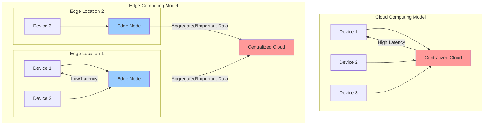

For years, the dominant trend in computing has been centralization. We moved from on-premise data centers to massive, centralized public clouds that offer economies of scale and a rich ecosystem of services. However, the explosive growth of connected devices (the Internet of Things, or IoT) and the demand for real-time applications are pushing the limits of this model. Sending vast amounts of data from billions of devices to a centralized cloud for processing introduces significant latency and bandwidth costs.

**Edge computing** is a distributed computing paradigm that flips this model on its head. It brings computation and data storage closer to the sources of data generation—the "edge" of the network. Instead of sending raw data to a centralized cloud, edge computing performs computation locally, on or near the device where the data is created.

### Cloud vs. Edge: A Complementary Relationship

It's important to understand that edge computing is not a replacement for the cloud. It is a **complementary** model that extends the power of the cloud. The cloud is still the best place for heavy-duty, large-scale computation, long-term storage, and aggregating data from multiple locations to train machine learning models.

The edge, on the other hand, is ideal for tasks that require low latency, real-time processing, and data filtering.

**Diagram: Cloud Computing vs. Edge Computing**



In the edge model, the edge nodes handle immediate processing and only send necessary, often aggregated, data to the central cloud. This reduces latency for end-users and significantly cuts down on bandwidth and data transmission costs.

### Key Use Cases for Edge Computing

Edge computing is not a universal solution, but it provides immense value in specific scenarios.

#### 1. Internet of Things (IoT)

This is the primary driver for edge computing. Imagine a smart factory with thousands of sensors monitoring equipment.

*   **Without Edge**: All sensor data is streamed to the cloud. If the cloud detects an anomaly (e.g., a machine overheating), it sends an alert back. The round-trip time could be too long to prevent a failure.
*   **With Edge**: An edge gateway on the factory floor processes sensor data in real time. It can detect the anomaly and shut down the machine in milliseconds, without ever needing to contact the cloud. It only sends summary data (e.g., hourly performance metrics) to the cloud for long-term analysis.

#### 2. Real-Time Analytics and AI

Autonomous vehicles, drones, and augmented reality applications require instantaneous decision-making. An autonomous car cannot afford to wait for a response from the cloud to decide whether to apply the brakes.

*   **Edge Solution**: The vehicle itself is a powerful edge device. Onboard computers process data from cameras, LiDAR, and other sensors to make real-time driving decisions. The car might later upload interesting or challenging road scenarios to the cloud to help train and improve the central driving model, which is then pushed out to the entire fleet.

#### 3. Content Delivery and Media Streaming

Content Delivery Networks (CDNs) are one of the earliest and most widespread forms of edge computing. A CDN caches content (images, videos, web pages) in servers located geographically close to users.

*   **Edge Solution**: When a user in London requests a video, they are served from a CDN edge server in London, not from a central server in North America. This dramatically reduces latency and improves the user experience. Modern CDNs are evolving to run code at the edge (e.g., Cloudflare Workers, AWS Lambda@Edge), allowing for dynamic content manipulation, A/B testing, and security checks right at the edge, close to the user.

**Diagram: CDN as an Edge Network**

```mermaid
graph TD
    Origin[Origin Server (e.g., in USA)]
    
    subgraph Edge Locations
        EdgeUK[Edge Server (UK)]
        EdgeJP[Edge Server (Japan)]
        EdgeAU[Edge Server (Australia)]
    end

    Origin -- "Content is cached at edges" --> EdgeUK
    Origin --> EdgeJP
    Origin --> EdgeAU

    UserUK[User in UK] -- "Low Latency Request" --> EdgeUK
    UserJP[User in Japan] -- "Low Latency Request" --> EdgeJP

    style Origin fill:#f99
    style EdgeUK fill:#9cf
    style EdgeJP fill:#9cf
    style EdgeAU fill:#9cf
```

### The "Tiers" of the Edge

The "edge" is not a single place. It can be thought of as a spectrum, from the device itself to regional data centers.

1.  **Device Edge**: The computation happens directly on the IoT device (e.g., a smart camera, an autonomous drone). This offers the lowest latency but is constrained by the device's power and compute capacity.
2.  **Local Edge / Gateway Edge**: Computation happens on a local gateway or server that aggregates data from multiple nearby devices (e.g., a gateway in a factory, a 5G cell tower).
3.  **Regional Edge / CDN Edge**: Computation happens in a regional data center that is closer to the end-user than a central cloud region. This is where CDNs and services like AWS Local Zones operate.

### Challenges in Edge Computing

1.  **Management and Deployment**: Managing and deploying software to potentially millions of distributed, heterogeneous edge devices is a massive operational challenge. Tools like Kubernetes are being adapted for the edge (e.g., K3s, MicroK8s) to help solve this.
2.  **Security**: The distributed nature of the edge increases the attack surface. Every edge device is a potential point of entry for an attacker. Strong identity, authentication, and encryption are critical.
3.  **Physical Environment**: Unlike cloud data centers, edge devices may be in unsecured or harsh physical environments, making them vulnerable to tampering or damage.
4.  **Data Synchronization**: Keeping data consistent between the edge and the cloud, and between different edge locations, is a complex problem.

### Conclusion

Edge computing is a powerful and necessary evolution of the cloud computing model. By moving computation closer to where data is generated, it addresses the critical need for low-latency processing in a world of connected devices and real-time applications. While the cloud remains the hub for large-scale data analysis and storage, the edge provides the immediate, real-time intelligence required by modern systems. For system designers, understanding when and how to leverage the edge is becoming an essential skill for building responsive, efficient, and scalable applications.