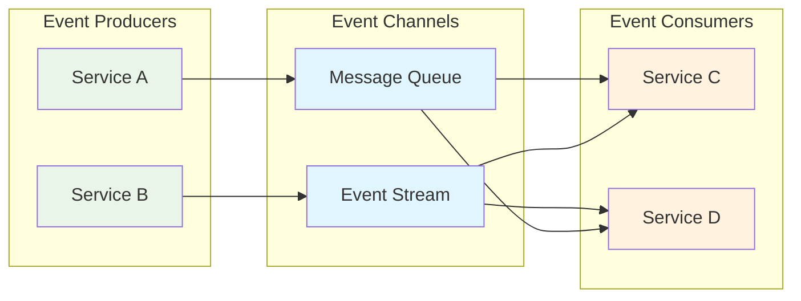
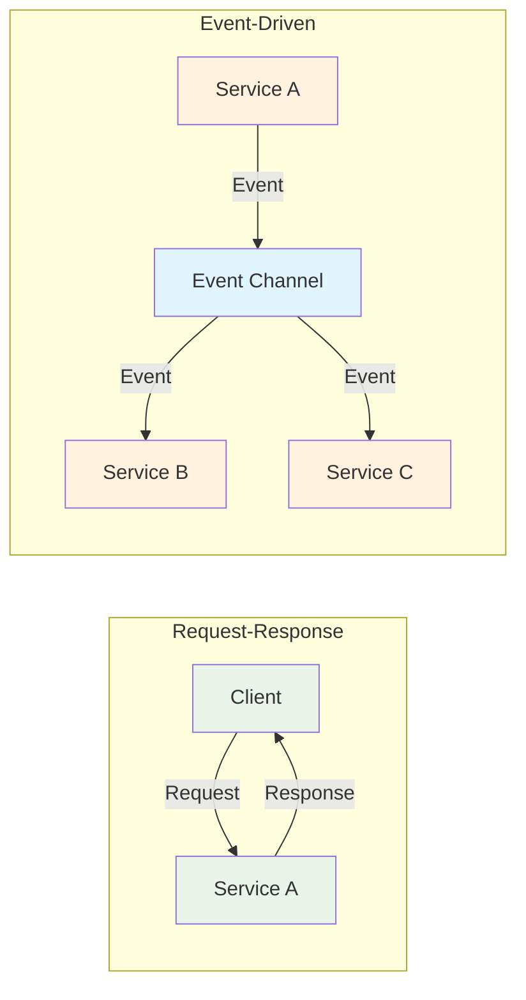
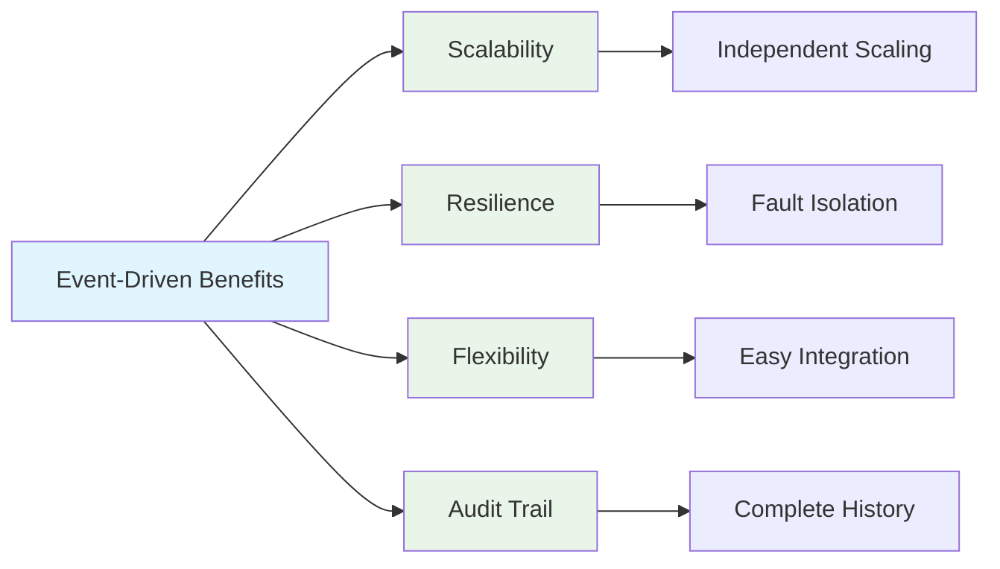

# System Design: Event-Driven Architecture Patterns

Event-Driven Architecture (EDA) is a software architecture pattern that promotes the production, detection, consumption of, and reaction to events. This architectural style enables loose coupling between components and allows systems to be more responsive, scalable, and resilient. In EDA, components communicate through events rather than direct calls, creating a flexible and decoupled system architecture.

## Understanding Event-Driven Architecture

In an event-driven architecture, events are signals that indicate something of interest has happened. Events typically represent state changes in the system. The architecture consists of three main components:

- **Event Producers**: Generate events when state changes occur
- **Event Consumers**: React to events that are of interest
- **Event Channels**: Transport events between producers and consumers



## Core Components and Patterns

### 1. Event Publisher-Subscriber Pattern

The publisher-subscriber pattern decouples message senders from receivers, allowing for flexible routing and distribution.

```go
// Event Publisher-Subscriber Implementation
package main

import (
    "context"
    "fmt"
    "sync"
    "time"
)

// Event represents a change in the system
type Event struct {
    ID        string
    Type      string
    Timestamp time.Time
    Data      map[string]interface{}
}

// EventHandler defines the function signature for event handlers
type EventHandler func(Event)

// EventBus manages event publishing and subscription
type EventBus struct {
    handlers map[string][]EventHandler
    mutex    sync.RWMutex
}

func NewEventBus() *EventBus {
    return &EventBus{
        handlers: make(map[string][]EventHandler),
    }
}

// Subscribe registers an event handler for a specific event type
func (eb *EventBus) Subscribe(eventType string, handler EventHandler) {
    eb.mutex.Lock()
    defer eb.mutex.Unlock()
    
    eb.handlers[eventType] = append(eb.handlers[eventType], handler)
}

// Publish sends an event to all registered handlers for that event type
func (eb *EventBus) Publish(event Event) {
    eb.mutex.RLock()
    handlers, exists := eb.handlers[event.Type]
    eb.mutex.RUnlock()
    
    if !exists {
        return
    }
    
    wg := sync.WaitGroup{}
    for _, handler := range handlers {
        wg.Add(1)
        go func(h EventHandler) {
            defer wg.Done()
            h(event)
        }(handler)
    }
    wg.Wait()
}

// Example usage
func main() {
    bus := NewEventBus()
    
    // Subscribe to user registration events
    bus.Subscribe("user_registered", func(event Event) {
        fmt.Printf("Email service: Sending welcome email to %s\n", event.Data["email"])
        time.Sleep(100 * time.Millisecond) // Simulate email processing
    })
    
    bus.Subscribe("user_registered", func(event Event) {
        fmt.Printf("Analytics service: Tracking new user %s\n", event.Data["user_id"])
        time.Sleep(50 * time.Millisecond) // Simulate analytics processing
    })
    
    bus.Subscribe("user_registered", func(event Event) {
        fmt.Printf("Notification service: Creating profile for %s\n", event.Data["username"])
        time.Sleep(80 * time.Millisecond) // Simulate profile creation
    })
    
    // Publish a user registration event
    event := Event{
        ID:        "event-1",
        Type:      "user_registered",
        Timestamp: time.Now(),
        Data: map[string]interface{}{
            "user_id":  "user-123",
            "email":    "john@example.com",
            "username": "johndoe",
        },
    }
    
    fmt.Println("Publishing user registration event...")
    bus.Publish(event)
    fmt.Println("Event processing completed")
}
```

### 2. Event Sourcing Pattern

Event Sourcing stores the state of an application as a sequence of events rather than just the current state.

```go
// Event Sourcing Implementation
package main

import (
    "encoding/json"
    "fmt"
    "time"
)

// EventStore stores all events for an aggregate
type EventStore struct {
    events map[string][]Event
}

type Event struct {
    AggregateID string      `json:"aggregate_id"`
    Version     int         `json:"version"`
    Type        string      `json:"type"`
    Data        interface{} `json:"data"`
    Timestamp   time.Time   `json:"timestamp"`
}

func NewEventStore() *EventStore {
    return &EventStore{
        events: make(map[string][]Event),
    }
}

func (es *EventStore) SaveEvents(aggregateID string, events []Event) error {
    for _, event := range events {
        es.events[aggregateID] = append(es.events[aggregateID], event)
    }
    return nil
}

func (es *EventStore) GetEventsForAggregate(aggregateID string) []Event {
    events, exists := es.events[aggregateID]
    if !exists {
        return []Event{}
    }
    return events
}

// Account aggregate with event sourcing
type Account struct {
    AccountID string  `json:"account_id"`
    Balance   float64 `json:"balance"`
}

func (a *Account) ApplyEvent(event Event) {
    switch event.Type {
    case "AccountCreated":
        data := event.Data.(map[string]interface{})
        a.AccountID = data["account_id"].(string)
        a.Balance = 0.0
    case "MoneyDeposited":
        data := event.Data.(map[string]interface{})
        amount := data["amount"].(float64)
        a.Balance += amount
    case "MoneyWithdrawn":
        data := event.Data.(map[string]interface{})
        amount := data["amount"].(float64)
        a.Balance -= amount
    }
}

type AccountService struct {
    store *EventStore
}

func NewAccountService(store *EventStore) *AccountService {
    return &AccountService{store: store}
}

func (as *AccountService) CreateAccount(accountID string) error {
    event := Event{
        AggregateID: accountID,
        Version:     1,
        Type:        "AccountCreated",
        Data: map[string]interface{}{
            "account_id": accountID,
        },
        Timestamp: time.Now(),
    }
    
    return as.store.SaveEvents(accountID, []Event{event})
}

func (as *AccountService) Deposit(accountID string, amount float64) error {
    events := as.store.GetEventsForAggregate(accountID)
    if len(events) == 0 {
        return fmt.Errorf("account %s not found", accountID)
    }
    
    event := Event{
        AggregateID: accountID,
        Version:     len(events) + 1,
        Type:        "MoneyDeposited",
        Data: map[string]interface{}{
            "amount": amount,
        },
        Timestamp: time.Now(),
    }
    
    return as.store.SaveEvents(accountID, []Event{event})
}

func (as *AccountService) GetAccount(accountID string) *Account {
    events := as.store.GetEventsForAggregate(accountID)
    if len(events) == 0 {
        return nil
    }
    
    account := &Account{}
    for _, event := range events {
        account.ApplyEvent(event)
    }
    
    return account
}

// Example usage
func main() {
    store := NewEventStore()
    service := NewAccountService(store)
    
    // Create an account
    service.CreateAccount("acc-123")
    
    // Deposit money
    service.Deposit("acc-123", 100.0)
    service.Deposit("acc-123", 50.0)
    
    // Create another account
    service.CreateAccount("acc-456")
    service.Deposit("acc-456", 200.0)
    
    // Retrieve and display account information
    acc1 := service.GetAccount("acc-123")
    acc2 := service.GetAccount("acc-456")
    
    fmt.Printf("Account %s Balance: $%.2f\n", acc1.AccountID, acc1.Balance)
    fmt.Printf("Account %s Balance: $%.2f\n", acc2.AccountID, acc2.Balance)
    
    // Show event history
    events := store.GetEventsForAggregate("acc-123")
    fmt.Printf("\nEvent history for %s:\n", "acc-123")
    for _, event := range events {
        eventJSON, _ := json.Marshal(event)
        fmt.Println(string(eventJSON))
    }
}
```

### 3. Command Query Responsibility Segregation (CQRS)

CQRS separates read and write operations into different models, allowing for optimized read and write paths.

```go
// CQRS Implementation
package main

import (
    "fmt"
    "sync"
    "time"
)

// Command represents an intent to change the system state
type Command struct {
    ID        string
    Type      string
    Data      interface{}
    Timestamp time.Time
}

// Event represents a change that occurred in the system
type Event struct {
    ID        string
    Type      string
    Data      interface{}
    Timestamp time.Time
}

// CommandHandler processes commands
type CommandHandler interface {
    Handle(command Command) []Event
}

// EventHandler processes events
type EventHandler interface {
    Handle(event Event)
}

// OrderCommandHandler handles order-related commands
type OrderCommandHandler struct {
    eventBus *EventBus
}

func NewOrderCommandHandler(eventBus *EventBus) *OrderCommandHandler {
    return &OrderCommandHandler{eventBus: eventBus}
}

func (och *OrderCommandHandler) Handle(command Command) []Event {
    var events []Event
    
    switch command.Type {
    case "CreateOrder":
        data := command.Data.(map[string]interface{})
        events = append(events, Event{
            ID:        fmt.Sprintf("event-%s", command.ID),
            Type:      "OrderCreated",
            Data:      data,
            Timestamp: time.Now(),
        })
    case "UpdateOrderStatus":
        data := command.Data.(map[string]interface{})
        events = append(events, Event{
            ID:        fmt.Sprintf("event-%s", command.ID),
            Type:      "OrderStatusUpdated",
            Data:      data,
            Timestamp: time.Now(),
        })
    }
    
    // Publish events to event bus
    for _, event := range events {
        och.eventBus.Publish(event)
    }
    
    return events
}

// OrderReadModel maintains the read-optimized view
type OrderReadModel struct {
    orders map[string]map[string]interface{}
    mutex  sync.RWMutex
}

func NewOrderReadModel() *OrderReadModel {
    return &OrderReadModel{
        orders: make(map[string]map[string]interface{}),
    }
}

func (orm *OrderReadModel) Handle(event Event) {
    orm.mutex.Lock()
    defer orm.mutex.Unlock()
    
    switch event.Type {
    case "OrderCreated":
        data := event.Data.(map[string]interface{})
        orderID := data["order_id"].(string)
        orm.orders[orderID] = data
    case "OrderStatusUpdated":
        data := event.Data.(map[string]interface{})
        orderID := data["order_id"].(string)
        if order, exists := orm.orders[orderID]; exists {
            order["status"] = data["status"]
            order["updated_at"] = data["updated_at"]
        }
    }
}

func (orm *OrderReadModel) GetOrder(orderID string) (map[string]interface{}, bool) {
    orm.mutex.RLock()
    defer orm.mutex.RUnlock()
    
    order, exists := orm.orders[orderID]
    return order, exists
}

// Example usage
func main() {
    eventBus := NewEventBus()
    commandHandler := NewOrderCommandHandler(eventBus)
    readModel := NewOrderReadModel()
    
    // Subscribe read model to events
    eventBus.Subscribe("OrderCreated", func(event Event) {
        readModel.Handle(event)
    })
    eventBus.Subscribe("OrderStatusUpdated", func(event Event) {
        readModel.Handle(event)
    })
    
    // Create an order (this command will be handled and produce events)
    createCommand := Command{
        ID:        "cmd-1",
        Type:      "CreateOrder",
        Data:      map[string]interface{}{"order_id": "order-123", "customer_id": "cust-456", "total": 99.99},
        Timestamp: time.Now(),
    }
    
    fmt.Println("Processing CreateOrder command...")
    commandHandler.Handle(createCommand)
    
    // Update order status
    updateCommand := Command{
        ID:        "cmd-2",
        Type:      "UpdateOrderStatus",
        Data:      map[string]interface{}{"order_id": "order-123", "status": "shipped", "updated_at": time.Now()},
        Timestamp: time.Now(),
    }
    
    fmt.Println("Processing UpdateOrderStatus command...")
    commandHandler.Handle(updateCommand)
    
    // Query the read model
    order, exists := readModel.GetOrder("order-123")
    if exists {
        fmt.Printf("Order retrieved: %+v\n", order)
    } else {
        fmt.Println("Order not found")
    }
}
```

## Event-Driven vs Request-Response



### Request-Response Architecture
- **Synchronous**: Client waits for response
- **Tight Coupling**: Direct dependency between services
- **Blocking**: Requestor is blocked until response
- **Simple**: Easy to understand and debug

### Event-Driven Architecture
- **Asynchronous**: Fire and forget
- **Loose Coupling**: Services don't know about each other
- **Non-blocking**: No waiting for responses
- **Scalable**: Easy to add new consumers

## Common Event-Driven Patterns

### 1. Fan-out Pattern
Events are published and multiple services consume them independently.

```go
// Fan-out Implementation
package main

import (
    "fmt"
    "sync"
    "time"
)

type FanOutBus struct {
    channels map[string][]chan Event
    mutex    sync.RWMutex
}

func NewFanOutBus() *FanOutBus {
    return &FanOutBus{
        channels: make(map[string][]chan Event),
    }
}

func (fob *FanOutBus) Subscribe(eventType string, handler chan Event) {
    fob.mutex.Lock()
    defer fob.mutex.Unlock()
    
    fob.channels[eventType] = append(fob.channels[eventType], handler)
}

func (fob *FanOutBus) Publish(event Event) {
    fob.mutex.RLock()
    handlers, exists := fob.channels[event.Type]
    fob.mutex.RUnlock()
    
    if !exists {
        return
    }
    
    for _, handler := range handlers {
        go func(h chan Event) {
            h <- event
        }(handler)
    }
}

// Example services that consume events
func emailService(eventChan chan Event) {
    for event := range eventChan {
        fmt.Printf("Email Service: Processing event %s for %s\n", event.Type, event.Data)
        time.Sleep(50 * time.Millisecond) // Simulate email processing
    }
}

func notificationService(eventChan chan Event) {
    for event := range eventChan {
        fmt.Printf("Notification Service: Processing event %s for %s\n", event.Type, event.Data)
        time.Sleep(30 * time.Millisecond) // Simulate notification processing
    }
}

func analyticsService(eventChan chan Event) {
    for event := range eventChan {
        fmt.Printf("Analytics Service: Processing event %s for %s\n", event.Type, event.Data)
        time.Sleep(40 * time.Millisecond) // Simulate analytics processing
    }
}

func main() {
    bus := NewFanOutBus()
    
    // Create channels for different services
    emailChan := make(chan Event, 10)
    notificationChan := make(chan Event, 10)
    analyticsChan := make(chan Event, 10)
    
    // Subscribe services
    bus.Subscribe("user_registered", emailChan)
    bus.Subscribe("user_registered", notificationChan)
    bus.Subscribe("user_registered", analyticsChan)
    
    // Start services
    go emailService(emailChan)
    go notificationService(notificationChan)
    go analyticsService(analyticsChan)
    
    // Publish event
    event := Event{
        Type: "user_registered",
        Data: map[string]interface{}{
            "user_id": "user-123",
            "email":   "john@example.com",
        },
    }
    
    fmt.Println("Publishing user registration event...")
    bus.Publish(event)
    
    // Allow time for processing
    time.Sleep(1 * time.Second)
    
    // Close channels to stop services
    close(emailChan)
    close(notificationChan)
    close(analyticsChan)
}
```

### 2. Event Sourcing + CQRS Pattern
Combining event sourcing for write model with CQRS for optimized read models.

```go
// Combined Event Sourcing + CQRS Implementation
package main

import (
    "encoding/json"
    "fmt"
    "sync"
    "time"
)

// Aggregate interface for event-sourced entities
type Aggregate interface {
    ApplyEvent(Event)
    GetID() string
    GetVersion() int
}

// Event store for maintaining aggregate events
type AggregateEventStore struct {
    events map[string][]Event
    mutex  sync.RWMutex
}

func NewAggregateEventStore() *AggregateEventStore {
    return &AggregateEventStore{
        events: make(map[string][]Event),
    }
}

func (es *AggregateEventStore) SaveEvents(aggregateID string, events []Event) error {
    es.mutex.Lock()
    defer es.mutex.Unlock()
    
    if existingEvents, exists := es.events[aggregateID]; exists {
        es.events[aggregateID] = append(existingEvents, events...)
    } else {
        es.events[aggregateID] = events
    }
    return nil
}

func (es *AggregateEventStore) GetEventsForAggregate(aggregateID string) []Event {
    es.mutex.RLock()
    defer es.mutex.RUnlock()
    
    events, exists := es.events[aggregateID]
    if !exists {
        return []Event{}
    }
    return events
}

// Product aggregate
type Product struct {
    ID          string  `json:"id"`
    Name        string  `json:"name"`
    Description string  `json:"description"`
    Price       float64 `json:"price"`
    Stock       int     `json:"stock"`
    Version     int     `json:"version"`
}

func (p *Product) ApplyEvent(event Event) {
    switch event.Type {
    case "ProductCreated":
        data := event.Data.(map[string]interface{})
        p.ID = data["id"].(string)
        p.Name = data["name"].(string)
        p.Description = data["description"].(string)
        p.Price = data["price"].(float64)
        p.Stock = int(data["stock"].(float64)) // JSON numbers are float64
    case "ProductPriceUpdated":
        data := event.Data.(map[string]interface{})
        p.Price = data["new_price"].(float64)
    case "ProductStockUpdated":
        data := event.Data.(map[string]interface{})
        p.Stock = int(data["new_stock"].(float64))
    }
}

func (p *Product) GetID() string {
    return p.ID
}

func (p *Product) GetVersion() int {
    return p.Version
}

// Product repository for event sourcing
type ProductRepository struct {
    store *AggregateEventStore
}

func NewProductRepository(store *AggregateEventStore) *ProductRepository {
    return &ProductRepository{store: store}
}

func (pr *ProductRepository) Save(product *Product) error {
    events := pr.getUncommittedEvents(product)
    if len(events) == 0 {
        return nil
    }
    
    return pr.store.SaveEvents(product.ID, events)
}

func (pr *ProductRepository) Get(id string) *Product {
    events := pr.store.GetEventsForAggregate(id)
    if len(events) == 0 {
        return nil
    }
    
    product := &Product{}
    for _, event := range events {
        product.ApplyEvent(event)
    }
    
    return product
}

func (pr *ProductRepository) getUncommittedEvents(product *Product) []Event {
    // In a real implementation, you would track uncommitted events
    // For this example, we'll simulate by returning an empty slice
    return []Event{}
}

// Read model for product search
type ProductSearchModel struct {
    products map[string]*Product
    mutex    sync.RWMutex
}

func NewProductSearchModel() *ProductSearchModel {
    return &ProductSearchModel{
        products: make(map[string]*Product),
    }
}

func (psm *ProductSearchModel) HandleEvent(event Event) {
    psm.mutex.Lock()
    defer psm.mutex.Unlock()
    
    switch event.Type {
    case "ProductCreated":
        data := event.Data.(map[string]interface{})
        product := &Product{
            ID:          data["id"].(string),
            Name:        data["name"].(string),
            Description: data["description"].(string),
            Price:       data["price"].(float64),
            Stock:       int(data["stock"].(float64)),
        }
        psm.products[product.ID] = product
    case "ProductPriceUpdated":
        data := event.Data.(map[string]interface{})
        productID := data["product_id"].(string)
        newPrice := data["new_price"].(float64)
        
        if product, exists := psm.products[productID]; exists {
            product.Price = newPrice
        }
    case "ProductStockUpdated":
        data := event.Data.(map[string]interface{})
        productID := data["product_id"].(string)
        newStock := int(data["new_stock"].(float64))
        
        if product, exists := psm.products[productID]; exists {
            product.Stock = newStock
        }
    }
}

func (psm *ProductSearchModel) SearchByName(query string) []*Product {
    psm.mutex.RLock()
    defer psm.mutex.RUnlock()
    
    var results []*Product
    for _, product := range psm.products {
        if product.Name == query {
            // Create a copy to prevent external modifications
            copiedProduct := *product
            results = append(results, &copiedProduct)
        }
    }
    return results
}

func (psm *ProductSearchModel) SearchByPriceRange(min, max float64) []*Product {
    psm.mutex.RLock()
    defer psm.mutex.RUnlock()
    
    var results []*Product
    for _, product := range psm.products {
        if product.Price >= min && product.Price <= max {
            copiedProduct := *product
            results = append(results, &copiedProduct)
        }
    }
    return results
}

// Command handlers
type ProductCommandHandler struct {
    repo *ProductRepository
    bus  *EventBus
}

func NewProductCommandHandler(repo *ProductRepository, bus *EventBus) *ProductCommandHandler {
    return &ProductCommandHandler{repo: repo, bus: bus}
}

func (pch *ProductCommandHandler) CreateProduct(data map[string]interface{}) error {
    event := Event{
        ID:        fmt.Sprintf("event-%d", time.Now().UnixNano()),
        Type:      "ProductCreated",
        Data:      data,
        Timestamp: time.Now(),
    }
    
    pch.bus.Publish(event)
    return nil
}

func (pch *ProductCommandHandler) UpdateProductPrice(productID string, newPrice float64) error {
    event := Event{
        ID:        fmt.Sprintf("event-%d", time.Now().UnixNano()),
        Type:      "ProductPriceUpdated",
        Data:      map[string]interface{}{"product_id": productID, "new_price": newPrice},
        Timestamp: time.Now(),
    }
    
    pch.bus.Publish(event)
    return nil
}

// Example usage
func main() {
    store := NewAggregateEventStore()
    repo := NewProductRepository(store)
    bus := NewEventBus()
    cmdHandler := NewProductCommandHandler(repo, bus)
    searchModel := NewProductSearchModel()
    
    // Subscribe search model to product events
    bus.Subscribe("ProductCreated", func(event Event) {
        searchModel.HandleEvent(event)
    })
    bus.Subscribe("ProductPriceUpdated", func(event Event) {
        searchModel.HandleEvent(event)
    })
    bus.Subscribe("ProductStockUpdated", func(event Event) {
        searchModel.HandleEvent(event)
    })
    
    // Create a product
    fmt.Println("Creating product...")
    cmdHandler.CreateProduct(map[string]interface{}{
        "id":          "prod-123",
        "name":        "Laptop",
        "description": "High-performance laptop",
        "price":       999.99,
        "stock":       10,
    })
    
    // Wait for event processing
    time.Sleep(100 * time.Millisecond)
    
    // Search for the product
    results := searchModel.SearchByName("Laptop")
    if len(results) > 0 {
        fmt.Printf("Found product: %s, Price: $%.2f, Stock: %d\n", 
            results[0].Name, results[0].Price, results[0].Stock)
    }
    
    // Update product price
    fmt.Println("Updating product price...")
    cmdHandler.UpdateProductPrice("prod-123", 899.99)
    
    // Wait for event processing
    time.Sleep(100 * time.Millisecond)
    
    // Search again to see updated price
    results = searchModel.SearchByName("Laptop")
    if len(results) > 0 {
        fmt.Printf("Updated product: %s, Price: $%.2f, Stock: %d\n", 
            results[0].Name, results[0].Price, results[0].Stock)
    }
    
    // Search by price range
    rangeResults := searchModel.SearchByPriceRange(800.0, 900.0)
    fmt.Printf("Products in price range $800-$900: %d\n", len(rangeResults))
    
    for _, product := range rangeResults {
        fmt.Printf("  - %s: $%.2f\n", product.Name, product.Price)
    }
}
```

## Benefits of Event-Driven Architecture

### 1. Scalability
Services can scale independently based on their specific load patterns.

### 2. Resilience
Failure in one service doesn't necessarily impact others due to decoupling.

### 3. Flexibility
Easy to add new services that react to existing events.

### 4. Audit Trail
Complete history of all state changes is preserved.



## Challenges and Considerations

### 1. Complexity
Event-driven systems can become complex to understand and debug, especially when dealing with multiple event producers and consumers.

### 2. Event Ordering
Ensuring events are processed in the correct order can be challenging in distributed systems.

### 3. Duplicate Processing
Implementing idempotency to handle duplicate events is crucial.

### 4. Event Schemas
Managing event schema evolution and backward compatibility.

```go
// Duplicate detection and idempotency implementation
package main

import (
    "fmt"
    "sync"
    "time"
)

// IdempotencyKeyStore tracks processed events to prevent duplicate processing
type IdempotencyKeyStore struct {
    processed map[string]time.Time
    mutex     sync.RWMutex
}

func NewIdempotencyKeyStore() *IdempotencyKeyStore {
    store := &IdempotencyKeyStore{
        processed: make(map[string]time.Time),
    }
    
    // Start cleanup routine
    go store.cleanupRoutine()
    return store
}

func (iks *IdempotencyKeyStore) IsProcessed(key string) bool {
    iks.mutex.RLock()
    defer iks.mutex.RUnlock()
    
    _, exists := iks.processed[key]
    return exists
}

func (iks *IdempotencyKeyStore) MarkProcessed(key string) {
    iks.mutex.Lock()
    defer iks.mutex.Unlock()
    
    iks.processed[key] = time.Now()
}

func (iks *IdempotencyKeyStore) cleanupRoutine() {
    ticker := time.NewTicker(1 * time.Hour)
    defer ticker.Stop()
    
    for range ticker.C {
        iks.cleanup()
    }
}

func (iks *IdempotencyKeyStore) cleanup() {
    iks.mutex.Lock()
    defer iks.mutex.Unlock()
    
    threshold := time.Now().Add(-24 * time.Hour) // Clean up events older than 24 hours
    for key, timestamp := range iks.processed {
        if timestamp.Before(threshold) {
            delete(iks.processed, key)
        }
    }
}

// Event processor with idempotency
type IdempotentEventProcessor struct {
    store *IdempotencyKeyStore
    bus   *EventBus
}

func NewIdempotentEventProcessor(store *IdempotencyKeyStore, bus *EventBus) *IdempotentEventProcessor {
    return &IdempotentEventProcessor{store: store, bus: bus}
}

func (iep *IdempotentEventProcessor) ProcessEvent(event Event) error {
    // Create idempotency key from event ID and type
    idempotencyKey := fmt.Sprintf("%s:%s", event.ID, event.Type)
    
    // Check if event was already processed
    if iep.store.IsProcessed(idempotencyKey) {
        fmt.Printf("Event %s already processed, skipping\n", event.ID)
        return nil
    }
    
    // Process the event
    fmt.Printf("Processing event %s with type %s\n", event.ID, event.Type)
    
    // Simulate event processing
    time.Sleep(50 * time.Millisecond)
    
    // Mark event as processed
    iep.store.MarkProcessed(idempotencyKey)
    
    // Publish any resulting events
    iep.bus.Publish(Event{
        ID:        fmt.Sprintf("response-%s", event.ID),
        Type:      fmt.Sprintf("%s_processed", event.Type),
        Data:      map[string]interface{}{"original_event_id": event.ID},
        Timestamp: time.Now(),
    })
    
    return nil
}

// Example usage
func main() {
    idempotencyStore := NewIdempotencyKeyStore()
    eventBus := NewEventBus()
    processor := NewIdempotentEventProcessor(idempotencyStore, eventBus)
    
    // Subscribe to processed events
    eventBus.Subscribe("user_registered_processed", func(event Event) {
        fmt.Printf("Received processed event: %v\n", event.Data)
    })
    
    // Create an event
    event := Event{
        ID:        "event-1",
        Type:      "user_registered",
        Data:      map[string]interface{}{"user_id": "user-123"},
        Timestamp: time.Now(),
    }
    
    // Process the event multiple times (should only be processed once)
    for i := 0; i < 3; i++ {
        fmt.Printf("Attempt %d: ", i+1)
        processor.ProcessEvent(event)
    }
    
    // Wait for any async operations
    time.Sleep(1 * time.Second)
}
```

## Best Practices

1. **Event Design**: Make events represent facts about what has happened, not commands
2. **Event Versioning**: Plan for schema evolution with backward compatibility
3. **Error Handling**: Implement dead letter queues for failed events
4. **Monitoring**: Track event processing rates, latencies, and error rates
5. **Testing**: Test event replay scenarios and schema evolution

## Conclusion

Event-Driven Architecture provides powerful patterns for building scalable, resilient, and flexible systems. By decoupling components through events, EDA enables independent scaling, fault isolation, and easier integration of new services. However, the approach comes with increased complexity around event ordering, duplicate handling, and system observability.

When implementing EDA, start with clear event definitions that represent facts about state changes in your domain. Consider using established patterns like Event Sourcing and CQRS to gain the full benefits of event-driven design. Always plan for idempotency, implement proper monitoring and error handling, and consider the long-term evolution of your event schemas.

The key to success with Event-Driven Architecture is careful planning and understanding of your domain's event patterns, combined with robust infrastructure to support event processing at scale.