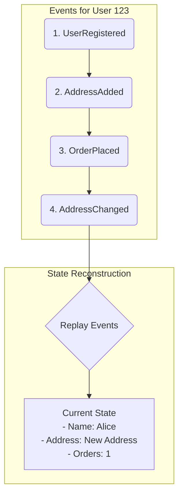

## Introduction: Beyond Simple Pub/Sub

Event streaming platforms like Apache Kafka provide the infrastructure for building powerful real-time systems. However, simply publishing and subscribing to events is just the beginning. To build truly robust, scalable, and maintainable applications, you need to apply proven architectural patterns that leverage the unique capabilities of event streams.

This article explores several fundamental patterns that are commonly used in event-driven architectures:
1.  **Event Sourcing:** Using the stream of events as the primary source of truth.
2.  **Command Query Responsibility Segregation (CQRS):** Separating the models for reading and writing data.
3.  **Event-Carried State Transfer:** Propagating state changes through the system via events.
4.  **Change Data Capture (CDC):** Turning your database into a stream of events.

## 1. Event Sourcing

In traditional applications, you store the *current state* of your data in a database. If a user changes their shipping address, you `UPDATE` the `address` column in the `users` table. The old address is gone forever.

**Event Sourcing** fundamentally flips this model. Instead of storing the current state, you store the full sequence of events that led to that state. The log of events becomes the single source of truth.

*   **Events:** `UserRegistered`, `AddressAdded`, `OrderPlaced`, `AddressChanged`
*   **Source of Truth:** An append-only log of these events.

To get the current state of an entity (e.g., a user's profile), you simply replay all the events for that entity.

### Why use it?

*   **Complete Audit Trail:** You have a perfect, immutable history of everything that ever happened in the system. This is invaluable for debugging, auditing, and business intelligence.
*   **Temporal Queries:** You can reconstruct the state of the system at *any point in time*. "What did this user's shopping cart look like last Tuesday?"
*   **Decoupling:** Services can subscribe to the event log to build their own specialized views of the data without affecting the source of truth.



## 2. Command Query Responsibility Segregation (CQRS)

CQRS is a pattern that is often used with Event Sourcing, but can also be used independently. It recognizes that the way you write data (the "command" side) is often very different from the way you read it (the "query" side).

CQRS formalizes this by creating two separate models:
*   **The Write Model (Command Side):** Handles commands (e.g., `PlaceOrder`, `UpdateAddress`) and business logic. Its only job is to validate the command and, if successful, produce an event. In an Event Sourcing system, this means appending the event to the log.
*   **The Read Model (Query Side):** Subscribes to the stream of events and builds one or more materialized views optimized for querying. These views are essentially caches that are updated in real-time.

For example, a `ProductSearchService` could listen to `ProductCreated` and `ProductUpdated` events to build a highly optimized search index (e.g., in Elasticsearch), while a `SalesDashboardService` listens to `OrderPlaced` events to update aggregated sales figures.

```mermaid
graph TD
    subgraph "Write Side"
        Cmd[Command: UpdateAddress] --> WriteModel{Write Model};
        WriteModel -- "Produces" --> Event[Event: AddressChanged];
        Event -- "Appends to" --> Log[Event Log];
    end

    subgraph "Read Side"
        Log -- "Streams to" --> ReadModel1[Read Model 1<br>(User Profile View)];
        Log -- "Streams to" --> ReadModel2[Read Model 2<br>(Search Index)];
    end

    subgraph "Queries"
        Q1[Query: GetUser] --> ReadModel1;
        Q2[Query: SearchProducts] --> ReadModel2;
    end
```

## 3. Event-Carried State Transfer

This pattern is a way for services to communicate and share state without creating tight coupling through direct API calls.

When a service makes a change, it publishes an event that contains all the relevant details of that change. Downstream services can then consume this event and update their own local state without ever having to call back to the original service.

For example, when the `User Service` updates a user's name, it publishes a `UserUpdated` event:
```json
{
  "event_type": "UserUpdated",
  "user_id": "123",
  "new_name": "Alice Smith",
  "old_name": "Alice Jones",
  "timestamp": "..."
}
```
The `Shipping Service` can listen for this event and update its local copy of the user's name, which it might need for printing shipping labels. The `Shipping Service` doesn't need to know anything about the `User Service`'s internal APIs or database schema.

## 4. Change Data Capture (CDC)

Event Sourcing is great for new ("greenfield") applications, but what about existing ("brownfield") systems with large, traditional databases? You can't just rewrite everything overnight.

**Change Data Capture (CDC)** is a pattern for turning your database into a real-time event stream. A CDC tool (like Debezium) monitors the database's transaction log (the same log used for replication). When it sees an `INSERT`, `UPDATE`, or `DELETE`, it captures that change and publishes it as an event to a streaming platform like Kafka.

This effectively creates a stream of every state change in your database, which can then be used to power other event-driven services, populate search indexes, invalidate caches, or feed data into a data warehouse.

```mermaid
graph TD
    subgraph "Monolithic Application"
        App[Legacy App] --> DB[(Database)];
    end

    subgraph "CDC Process"
        DB -- "Transaction Log" --> CDC[CDC Connector<br>(e.g., Debezium)];
        CDC -- "Publishes Events" --> Kafka[Kafka Topic];
    end

    subgraph "Downstream Consumers"
        Kafka --> Service1[Search Service];
        Kafka --> Service2[Analytics];
        Kafka --> Service3[Cache Invalidator];
    end
```

## Go Example: Conceptual Event Sourcing

This example shows the basic logic of an event-sourced entity. We define events, apply them to build state, and store them in a simple in-memory log.

```go
package main

import "fmt"

// --- Events ---
type Event interface{}

type UserRegistered struct {
	UserID string
	Name   string
}

type AddressChanged struct {
	NewAddress string
}

// --- Entity ---
type User struct {
	ID      string
	Name    string
	Address string
	// In a real system, this would be persisted
	eventLog []Event
}

// Apply changes the user's state based on an event.
func (u *User) Apply(event Event) {
	switch e := event.(type) {
	case UserRegistered:
		u.ID = e.UserID
		u.Name = e.Name
	case AddressChanged:
		u.Address = e.NewAddress
	}
}

// Record stores the event and applies it.
func (u *User) Record(event Event) {
	u.eventLog = append(u.eventLog, event)
	u.Apply(event)
}

// NewUserFromHistory creates a user by replaying their event history.
func NewUserFromHistory(events []Event) *User {
	user := &User{}
	for _, event := range events {
		user.Apply(event)
	}
	user.eventLog = events
	return user
}

func main() {
	// --- Write Side: A sequence of commands creates events ---
	userID := "user-123"
	history := []Event{
		UserRegistered{UserID: userID, Name: "John Doe"},
		AddressChanged{NewAddress: "123 Main St"},
	}

	// --- Read Side: Reconstruct the user's state from the log ---
	user := NewUserFromHistory(history)
	fmt.Printf("Reconstructed User State: %+v\n", *user)

	// --- Write Side: A new command is issued ---
	fmt.Println("\nChanging address...")
	newAddressEvent := AddressChanged{NewAddress: "456 Oak Ave"}
	user.Record(newAddressEvent) // The user records the new event

	fmt.Printf("Final User State: %+v\n", *user)
	fmt.Printf("Full Event Log: %+v\n", user.eventLog)
}
```

## Conclusion

These patterns provide a powerful toolkit for designing and building sophisticated event-driven systems.
*   **Event Sourcing** gives you a perfect audit log by making events the source of truth.
*   **CQRS** allows you to optimize your read and write paths independently for maximum performance and scalability.
*   **Event-Carried State Transfer** promotes loose coupling between services.
*   **Change Data Capture (CDC)** provides a bridge from legacy, stateful systems into the world of event streaming.

By understanding and applying these patterns, you can move beyond simple messaging and build architectures that are resilient, scalable, and adaptable to future changes.
