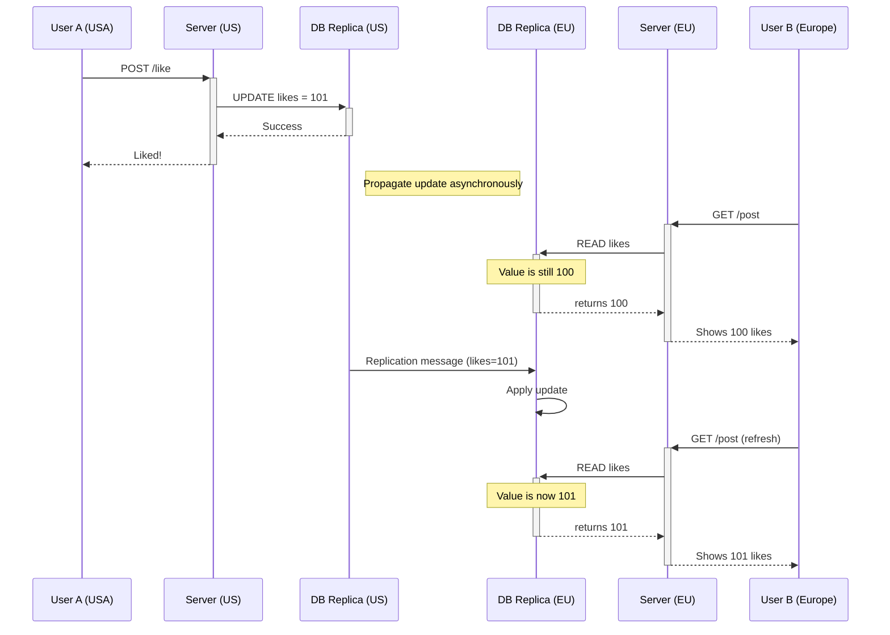

In a distributed system, **consistency** refers to the guarantee that all clients see the same data at the same time, no matter which node they connect to. While this sounds ideal, achieving perfect, instantaneous consistency (known as **strong consistency**) comes at a significant cost to performance and availability.

**Eventual consistency** is a weaker consistency model that prioritizes availability and performance. It guarantees that, if no new updates are made to a given data item, all accesses to that item will *eventually* return the last updated value. The key word is "eventually"—there is no guarantee about *when* this will happen, and in the meantime, reads might return stale (older) data.

This model is a fundamental trade-off in distributed system design, famously captured by the CAP theorem.

### The CAP Theorem and Eventual Consistency

The CAP theorem states that a distributed system can only provide two of the following three guarantees simultaneously:

1.  **Consistency (C)**: Every read receives the most recent write or an error.
2.  **Availability (A)**: Every request receives a (non-error) response, without the guarantee that it contains the most recent write.
3.  **Partition Tolerance (P)**: The system continues to operate despite an arbitrary number of messages being dropped (or delayed) by the network between nodes.

Since network partitions are a fact of life in any distributed system, you must assume they will happen. Therefore, the real choice is between Consistency and Availability.

*   A system that chooses **Consistency over Availability (CP)** will refuse to respond to a request if it cannot guarantee the data is up-to-date (e.g., it can't contact other nodes to confirm).
*   A system that chooses **Availability over Consistency (AP)** will always respond, even if it means returning stale data. This is the essence of eventual consistency.

**Diagram: CAP Theorem Trade-off**

```mermaid
graph TD
    subgraph Network Partition
        NodeA[Node A]
        NodeB[Node B]
        NodeA -.-> NodeB
    end

    ClientA[Client A] -- "Write X=10" --> NodeA
    ClientB[Client B] -- "Read X" --> NodeB

    subgraph "Choice 1: Prioritize Consistency (CP)"
        NodeB -- "Can't confirm with A, so I must..." --> ErrorResponse[Return Error]
    end

    subgraph "Choice 2: Prioritize Availability (AP)"
        NodeB -- "I'll respond with what I have..." --> StaleData[Return X=5 (Stale Data)]
    end
```

Eventual consistency is the foundation for building highly available and scalable systems. Many of the services we use every day rely on it.

### How Eventual Consistency Works: A Conceptual Example

Imagine a social media post with a "like" count. When a user clicks "like," the request might go to one of many web servers, which updates a replica of a database.

1.  **User A (in USA)** likes a post. The request hits a US-based server, which increments the like count on its local database replica from 100 to 101.
2.  **Propagation**: This update (like count = 101) is put into a queue to be replicated to other database replicas around the world.
3.  **Stale Read**: Almost simultaneously, **User B (in Europe)** views the same post. Their request hits a EU-based server whose database replica has not yet received the update. User B sees a like count of 100.
4.  **Convergence**: A few moments later, the replication message arrives at the EU replica. The like count is updated to 101.
5.  **Consistent Read**: If User B refreshes the page now, they will see the correct count of 101.

The system was temporarily inconsistent, but it remained highly available for both users. The inconsistency was brief and low-impact. For a "like" count, this is a perfectly acceptable trade-off. It would be a terrible user experience if the system refused to show the post at all just because it couldn't guarantee the like count was perfectly up-to-the-second.

**Diagram: Data Replication and Convergence**



### Where is Eventual Consistency Used?

Eventual consistency is suitable for many use cases where having slightly stale data is not critical.

*   **Social Media**: Like counts, view counts, follower counts, and timelines.
*   **E-commerce**: Product recommendations, "customers who bought this also bought," and even inventory counts in some less critical contexts. (The final checkout process, however, would use a strongly consistent transaction).
*   **DNS (Domain Name System)**: When a DNS record is updated, it can take minutes or even hours for the change to propagate across the entire global DNS system.
*   **Object Storage**: Many object storage systems, like Amazon S3, offer eventual consistency for updates and deletes (though S3 now provides strong read-after-write consistency for new objects).

### Flavors of Eventual Consistency

"Eventual consistency" is a broad term. There are stronger forms of it that provide more guarantees:

*   **Causal Consistency**: If operation A happens before operation B, then anyone who sees B must also see A. For example, you should never see a reply to a comment before you see the original comment.
*   **Read-Your-Writes Consistency**: After a user performs a write, any subsequent reads they make will return the value of that write (or a newer one). This is a very common and important guarantee for user experience.
*   **Session Consistency**: This guarantees read-your-writes consistency within a single user session.
*   **Monotonic Reads**: This guarantees that if you perform a series of reads, you will never see an older value after you've seen a newer one.

### Conclusion

Eventual consistency is not a bug or a flaw; it is a deliberate design choice. By relaxing the strict requirement that all nodes must be perfectly synchronized at all times, systems can achieve much higher levels of availability and scalability. For a huge number of modern applications, the ability to always serve requests and provide a responsive user experience is far more important than guaranteeing that every piece of data is perfectly up-to-date for every user at every moment. Understanding this trade-off is essential for designing large-scale distributed systems.