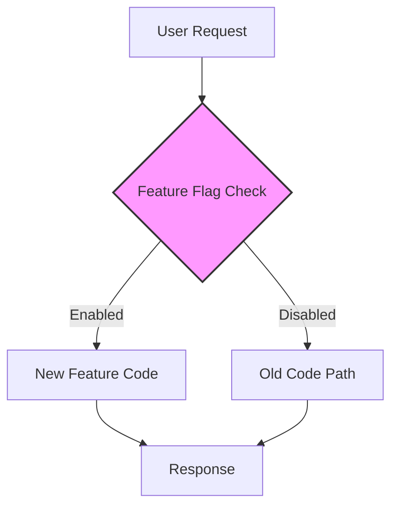

In modern software development, the pressure to deliver features quickly is immense. However, releasing new code to production is always risky. What if a new feature has a critical bug? What if it performs poorly under load? Traditionally, developers used feature branches, but these can lead to "merge hell" and delay integration. A more powerful and flexible solution is **Feature Toggles**, also known as **Feature Flags**.

A feature toggle is a mechanism that allows you to turn features of your application on or off at runtime, without deploying new code. It's like a set of remote controls for your application's features, enabling practices like Continuous Integration/Continuous Deployment (CI/CD), canary releases, and A/B testing. This post explores the power of feature toggles and how to implement them.

### What is a Feature Toggle?

At its simplest, a feature toggle is an `if` statement that wraps a new feature:

```go
if featureIsEnabled("new-shiny-feature") {
    // Execute the new feature code
} else {
    // Execute the old code path
}
```

The `featureIsEnabled()` function checks a configuration source—a file, a database, or a dedicated feature flag service—to see if the feature should be active. This simple concept has profound implications for how we build and release software.

**Diagram: The Basic Concept**



### Why Use Feature Toggles?

1.  **Decouple Deployment from Release**: You can deploy new code to production with the feature turned off. The code is "dark," meaning it's not executed by users. You can then "release" the feature by turning the flag on at a later time, without another deployment.
2.  **Risk Mitigation (Kill Switch)**: If a newly released feature causes problems, you can instantly turn it off with the toggle, acting as a "kill switch." This allows you to mitigate the impact of bugs without having to roll back a deployment.
3.  **Canary Releases and A/B Testing**: You can enable a feature for only a small subset of users (e.g., 1% of traffic, users in a specific region, or internal employees). This allows you to test new features in a production environment with minimal risk.
4.  **Trunk-Based Development**: Toggles are a cornerstone of trunk-based development. All developers commit to a single main branch (`trunk`), and new, incomplete features are wrapped in feature toggles. This avoids long-lived feature branches and the associated merge conflicts.
5.  **Operational Control**: Toggles can be used for operational purposes, such as turning off a non-critical, resource-intensive feature during a high-traffic event to conserve resources.

### Types of Feature Toggles

Not all toggles are the same. They can be categorized by their purpose and lifespan.

-   **Release Toggles**: Used to manage the release of new features. They are typically short-lived and should be removed once the feature is fully rolled out and stable.
-   **Experiment Toggles (A/B Testing)**: Used to test different versions of a feature with different user segments to see which one performs better. These are also temporary.
-   **Ops Toggles**: Used to control the operational aspects of your system. For example, a toggle to disable a feature during a performance degradation. These may be long-lived.
-   **Permission Toggles**: Used to control access to certain features for different user groups (e.g., enabling a feature only for "premium" users). These are often permanent.

### Go Example: A Simple Feature Toggle System

Let's build a basic feature toggle system in Go. For this example, we'll use a simple JSON file as our configuration source. In a real-world distributed system, you would use a service like LaunchDarkly, Optimizely, or a centralized configuration store like etcd or Consul.

First, our `features.json` file:

```json
{
  "new-search-algorithm": {
    "enabled": true,
    "users": ["user-a", "user-b"]
  },
  "beta-dashboard": {
    "enabled": false
  }
}
```

Now, let's write the Go code to read this configuration and check flags.

```go
package main

import (
	"encoding/json"
	"fmt"
	"io/ioutil"
	"sync"
)

// FeatureFlag defines the structure of a flag configuration.
type FeatureFlag struct {
	Enabled bool     `json:"enabled"`
	Users   []string `json:"users,omitempty"` // For targeted rollouts
}

// FlagManager holds the current state of all feature flags.
type FlagManager struct {
	flags map[string]FeatureFlag
	mu    sync.RWMutex
}

// NewFlagManager creates and loads flags from a file.
func NewFlagManager(configFile string) (*FlagManager, error) {
	manager := &FlagManager{
		flags: make(map[string]FeatureFlag),
	}
	
	data, err := ioutil.ReadFile(configFile)
	if err != nil {
		return nil, fmt.Errorf("failed to read config file: %w", err)
	}

	if err := json.Unmarshal(data, &manager.flags); err != nil {
		return nil, fmt.Errorf("failed to parse config file: %w", err)
	}
	
	return manager, nil
}

// IsEnabled checks if a feature is enabled.
// For simplicity, we'll add a user context for targeted checks.
func (fm *FlagManager) IsEnabled(featureName string, userID string) bool {
	fm.mu.RLock()
	defer fm.mu.RUnlock()

	flag, ok := fm.flags[featureName]
	if !ok {
		return false // Feature is not defined, so it's off
	}

	if !flag.Enabled {
		return false // Globally disabled
	}

	// If a user list is defined, check if the user is in it.
	if len(flag.Users) > 0 {
		for _, u := range flag.Users {
			if u == userID {
				return true // Enabled for this specific user
			}
		}
		return false // Not in the user list
	}

	return true // Globally enabled for everyone
}
```

Now, let's use our `FlagManager` in an application.

```go
type User struct {
	ID string
}

func main() {
	flagManager, err := NewFlagManager("features.json")
	if err != nil {
		panic(err)
	}

	user1 := User{ID: "user-a"}
	user2 := User{ID: "user-c"}

	// --- Check the "new-search-algorithm" feature ---
	// This feature is enabled, but only for specific users.
	
	// User 1 should have access.
	if flagManager.IsEnabled("new-search-algorithm", user1.ID) {
		fmt.Println("User 'user-a' is using the new search algorithm.")
	} else {
		fmt.Println("User 'user-a' is using the old search algorithm.")
	}

	// User 2 should not have access.
	if flagManager.IsEnabled("new-search-algorithm", user2.ID) {
		fmt.Println("User 'user-c' is using the new search algorithm.")
	} else {
		fmt.Println("User 'user-c' is using the old search algorithm.")
	}

	// --- Check the "beta-dashboard" feature ---
	// This feature is globally disabled.
	if flagManager.IsEnabled("beta-dashboard", user1.ID) {
		fmt.Println("User 'user-a' can see the beta dashboard.")
	} else {
		fmt.Println("User 'user-a' cannot see the beta dashboard.")
	}
}
```

### Best Practices and Pitfalls

-   **Keep Toggles Temporary**: Most feature toggles, especially release toggles, should be short-lived. Once a feature is fully released and stable, the toggle should be removed from the code to avoid technical debt.
-   **Use a Centralized Flag Management Service**: For distributed systems, a centralized service is essential. It provides a single source of truth for flags, allows for dynamic updates without deployments, and offers advanced features like audit logs and percentage-based rollouts.
-   **Avoid "Toggle Hell"**: A proliferation of long-lived toggles can make the codebase incredibly complex and hard to reason about. Have a clear policy for removing old flags.
-   **Test Both Code Paths**: Your automated tests should cover both the "on" and "off" states of a feature toggle to ensure both paths work as expected.

### Conclusion

Feature toggles are a transformative pattern in modern software development. They provide a powerful mechanism for decoupling deployment from release, mitigating risk, and enabling advanced strategies like canary releases and A/B testing. By embedding simple conditional logic in your code, you gain an enormous amount of control over your features at runtime. While they require careful management to avoid technical debt, the benefits in terms of speed, safety, and flexibility are immense, making them an essential tool for any team practicing CI/CD.
