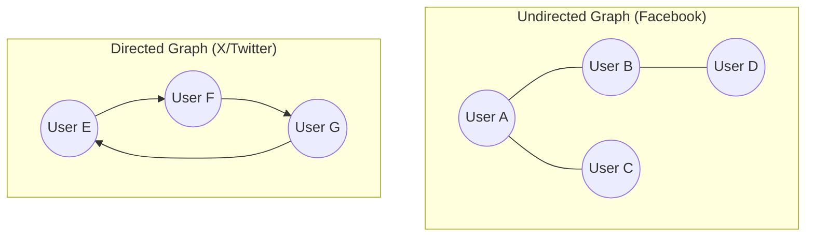

The social graph—the network of connections between users—is the foundation of any social media application. How you model, store, and query this graph has profound implications for your application's performance, scalability, and the features you can build. Answering questions like "Who are my friends?", "Who are the friends of my friends?", and "Do I have any mutual friends with this person?" needs to be incredibly fast.

This article dives into the common data models for representing a social graph, primarily **adjacency lists** and **adjacency matrices**, and discusses strategies for scaling these models to handle millions or even billions of connections.

### What is a Social Graph?

A social graph is a data structure that represents users as **nodes** (or vertices) and the relationships between them as **edges**.

*   **Nodes**: Represent users (e.g., User A, User B).
*   **Edges**: Represent the connection. An edge can be:
    *   **Undirected**: A "friend" relationship on Facebook, where both users must agree. If A is friends with B, B is friends with A.
    *   **Directed**: A "follower" relationship on X or Instagram. A can follow B without B following A.



### Data Models for Storing the Graph

How do we store this graph structure in a database?

#### 1. Adjacency List

This is the most common and generally most effective way to represent sparse graphs, which social graphs are (most people are not connected to most other people).

In this model, you store a list of a node's neighbors (the nodes it has an edge to). In a relational database, this is often implemented with a single table.

**For a directed graph (follower model):**
A simple `relationships` table is sufficient.

*   **`relationships` table**:
    *   `follower_id` (User who initiates the follow)
    *   `followed_id` (User who is being followed)
    *   `created_at` (Timestamp)

A composite primary key on `(follower_id, followed_id)` ensures a user can't follow the same person twice.

```sql
-- Example: User A follows User B and User C
INSERT INTO relationships (follower_id, followed_id) VALUES ('user_a', 'user_b');
INSERT INTO relationships (follower_id, followed_id) VALUES ('user_a', 'user_c');
```

**To find who User A follows:**
`SELECT followed_id FROM relationships WHERE follower_id = 'user_a';`

**To find who follows User A:**
`SELECT follower_id FROM relationships WHERE followed_id = 'user_a';`

**For an undirected graph (friend model):**
You can still use a single table, but you must decide whether to store one edge or two.
*   **Store two edges**: If A and B are friends, you insert `(user_a, user_b)` and `(user_b, user_a)`. This makes reads simple (finding all of A's friends is a single query), but uses more storage and requires two writes to create a friendship.
*   **Store one edge**: Insert `(user_a, user_b)` where the user IDs are ordered (e.g., alphabetically). This saves space, but finding all of A's friends requires a more complex query: `SELECT user_2 FROM friends WHERE user_1 = 'A' UNION SELECT user_1 FROM friends WHERE user_2 = 'A'`.

The two-edge approach is generally preferred for read performance.

*   **Pros of Adjacency Lists**:
    *   **Space-Efficient for Sparse Graphs**: You only store actual connections.
    *   **Fast for Finding Neighbors**: Finding a user's friends or followers is efficient, especially with proper indexing on the `follower_id` and `followed_id` columns.

*   **Cons**:
    *   **Deeper Queries are Slow**: Answering "Who are the friends of my friends?" requires multiple joins or round trips to the database, which can be slow and complex in SQL.

#### 2. Adjacency Matrix

An adjacency matrix represents the graph as a giant grid (a 2D array). If there are `N` users, you have an `N x N` matrix. `matrix[i][j] = 1` means there is an edge from user `i` to user `j`; `0` means there isn't.

*   **Pros**:
    *   **Fast Edge Lookup**: Checking if two users are connected is an O(1) operation (a simple array lookup).

*   **Cons**:
    *   **Extremely Inefficient for Sparse Graphs**: A social network with 1 million users would require a 1,000,000 x 1,000,000 matrix, which is a trillion cells. Since most of these would be 0, it's an enormous waste of space.
    *   **Difficult to Scale**: Adding a new user requires resizing the entire matrix.

For these reasons, **adjacency matrices are almost never used for large-scale social graphs.**

### Scaling the Social Graph

Using a relational database with an adjacency list works well up to a point. But with hundreds of millions of users and billions of connections, you'll hit bottlenecks.

**1. Database Sharding:**
You can partition (shard) the `relationships` table across multiple database servers. The sharding key would be the `follower_id` (or `user_id_1` in the friendship model).

*   **How it works**: All of a user's outgoing connections are stored on the same database shard. This makes the query "Who does User A follow?" very fast, as it only needs to go to one shard.
*   **The Problem**: The query "Who follows User A?" becomes an expensive "scatter-gather" operation. You have to query *every single shard* to find all the users who might be following User A and then merge the results.

**2. Graph Databases (e.g., Neo4j, Amazon Neptune)**

This is the modern solution for large-scale graph problems. Graph databases are purpose-built to store and navigate relationships. They use a model called the **Property Graph**, where nodes and edges are first-class citizens that can have properties.

*   **Nodes**: Can have labels (e.g., `:User`) and properties (`{name: 'Alice', age: 30}`).
*   **Edges**: Can have types (e.g., `:FOLLOWS`, `:FRIENDS_WITH`) and properties (`{since: '2023-01-15'}`).

**Querying with a Graph Database:**
Graph databases use specialized query languages like Cypher (for Neo4j) or Gremlin that are designed for traversing graphs.

*   **Find User A's followers:**
    ```cypher
    MATCH (follower:User)-[:FOLLOWS]->(target:User {id: 'user_a'})
    RETURN follower
    ```
*   **Find friends of User A's friends (2nd-degree connections):**
    ```cypher
    MATCH (a:User {id: 'user_a'})-[:FRIENDS_WITH]->(friend)-[:FRIENDS_WITH]->(friend_of_friend)
    WHERE NOT (a)-[:FRIENDS_WITH]->(friend_of_friend) AND a <> friend_of_friend
    RETURN friend_of_friend
    ```
This kind of query is extremely fast in a graph database but very slow and complex in a relational database. This is because graph databases use "index-free adjacency," meaning each node stores direct pointers to its adjacent nodes, allowing for extremely fast traversals without needing to do expensive index lookups or joins.

### Go Example: Adjacency List Implementation

This example shows a simple in-memory implementation of a directed social graph (follower model) using an adjacency list.

```go
package main

import (
	"fmt"
	"sync"
)

// SocialGraph represents the network of user relationships.
type SocialGraph struct {
	// Using a map to represent the adjacency list for a directed graph.
	// key: userID, value: a set of userIDs they follow.
	following map[string]map[string]bool
	mu        sync.RWMutex
}

// NewSocialGraph creates a new social graph.
func NewSocialGraph() *SocialGraph {
	return &SocialGraph{
		following: make(map[string]map[string]bool),
	}
}

// Follow establishes a directed edge from followerID to followedID.
func (g *SocialGraph) Follow(followerID, followedID string) {
	g.mu.Lock()
	defer g.mu.Unlock()

	if _, ok := g.following[followerID]; !ok {
		g.following[followerID] = make(map[string]bool)
	}
	g.following[followerID][followedID] = true
	fmt.Printf("%s now follows %s\n", followerID, followedID)
}

// GetFollowing returns the list of users a given user follows.
func (g *SocialGraph) GetFollowing(userID string) []string {
	g.mu.RLock()
	defer g.mu.RUnlock()

	followingSet, ok := g.following[userID]
	if !ok {
		return []string{}
	}

	followingList := make([]string, 0, len(followingSet))
	for id := range followingSet {
		followingList = append(followingList, id)
	}
	return followingList
}

// GetFollowers returns the list of users who follow a given user.
// This is less efficient as it requires iterating through the whole graph.
// In a real DB, this would be solved with a second index.
func (g *SocialGraph) GetFollowers(userID string) []string {
	g.mu.RLock()
	defer g.mu.RUnlock()

	var followers []string
	for follower, followingSet := range g.following {
		if _, ok := followingSet[userID]; ok {
			followers = append(followers, follower)
		}
	}
	return followers
}

// GetMutualFollows finds users that both A and B follow.
func (g *SocialGraph) GetMutualFollows(userA, userB string) []string {
	g.mu.RLock()
	defer g.mu.RUnlock()

	followingA := g.following[userA]
	followingB := g.following[userB]

	if len(followingA) == 0 || len(followingB) == 0 {
		return []string{}
	}

	var mutuals []string
	// Iterate over the smaller set for efficiency
	if len(followingA) < len(followingB) {
		for id := range followingA {
			if followingB[id] {
				mutuals = append(mutuals, id)
			}
		}
	} else {
		for id := range followingB {
			if followingA[id] {
				mutuals = append(mutuals, id)
			}
		}
	}
	return mutuals
}

func main() {
	graph := NewSocialGraph()

	graph.Follow("Alice", "Bob")
	graph.Follow("Alice", "Charlie")
	graph.Follow("Bob", "Charlie")
	graph.Follow("David", "Charlie")
	graph.Follow("Alice", "David")

	fmt.Println("\n--- Following Lists ---")
	fmt.Printf("Alice follows: %v\n", graph.GetFollowing("Alice"))
	fmt.Printf("Bob follows: %v\n", graph.GetFollowing("Bob"))

	fmt.Println("\n--- Follower Lists ---")
	fmt.Printf("Charlie is followed by: %v\n", graph.GetFollowers("Charlie"))

	fmt.Println("\n--- Mutual Follows ---")
	fmt.Printf("Alice and Bob both follow: %v\n", graph.GetMutualFollows("Alice", "Bob"))
}
```

### Conclusion

Modeling a social graph is a foundational task in social media system design. While an adjacency matrix is conceptually simple, the **adjacency list** is the practical choice for the sparse nature of social networks. For small to medium-sized applications, a relational database with proper indexing can serve this model well. However, as the scale and complexity of queries grow (e.g., finding 2nd or 3rd-degree connections), the performance of relational databases degrades rapidly. At that point, migrating to a specialized **graph database** becomes the optimal strategy, as they are purpose-built for efficiently storing and traversing complex relationships at massive scale.