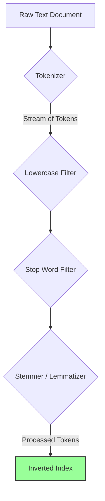

## Introduction: The Limits of `LIKE`

Imagine you're building a blog platform and you want to add a search feature. The simplest approach is to use the SQL `LIKE` operator:
```sql
SELECT * FROM articles WHERE content LIKE '%database%';
```
This works, but it's deeply flawed:
*   **It's slow:** It requires a full table scan, reading the content of every article.
*   **It's inflexible:** It won't find "databases". It won't find "database" if it's followed by a comma. It doesn't understand synonyms or context.
*   **It can't rank results:** All matches are treated equally. An article that mentions "database" once is ranked the same as an article all about databases.

To provide a truly useful search experience, you need **Full-Text Search (FTS)**. FTS is a set of techniques for searching and ranking text documents based on their content, not just simple string matching. It's the technology that powers everything from Google Search to the search bar in your favorite e-commerce app.

## The Text Analysis Pipeline

The magic of FTS happens during the **indexing** process. Before any documents can be searched, they are passed through an analysis pipeline that breaks down the text into a searchable format. This process typically involves several key steps.



Let's walk through the pipeline with an example sentence: **"The quick brown foxes are jumping over the lazy dogs."**

### 1. Tokenization
The first step is to break the raw text into individual words or terms, called **tokens**.
*   **Input:** `"The quick brown foxes are jumping over the lazy dogs."`
*   **Output Tokens:** `[The, quick, brown, foxes, are, jumping, over, the, lazy, dogs]`

### 2. Lowercase Filter
To make the search case-insensitive, all tokens are converted to lowercase.
*   **Input:** `[The, quick, brown, foxes, are, jumping, over, the, lazy, dogs]`
*   **Output:** `[the, quick, brown, foxes, are, jumping, over, the, lazy, dogs]`

### 3. Stop Word Filtering
**Stop words** are common words that add little semantic value to a search (e.g., "the", "a", "is", "in"). These are removed to save space and improve performance.
*   **Input:** `[the, quick, brown, foxes, are, jumping, over, the, lazy, dogs]`
*   **Output:** `[quick, brown, foxes, jumping, over, lazy, dogs]`

### 4. Stemming and Lemmatization
This is the most critical step for understanding language. Its goal is to reduce words to their root form.
*   **Stemming:** A crude, rule-based process of chopping off the end of words. For example, "jumping", "jumped", and "jumps" might all be stemmed to "jump". It's fast but can be inaccurate.
*   **Lemmatization:** A more advanced, dictionary-based process that considers the word's part of speech to determine its root form (lemma). For example, it knows that "are" is a form of the verb "to be". It's more accurate but slower.

Let's apply stemming to our tokens:
*   **Input:** `[quick, brown, foxes, jumping, over, lazy, dogs]`
*   **Output (Stems):** `[quick, brown, fox, jump, over, lazi, dog]`

These final, processed tokens are what get stored in the search index. When a user performs a search, their query goes through the exact same analysis pipeline. A search for "jumping foxes" becomes a search for the stems `[jump, fox]`, which will match our processed document.

## The Result: The Inverted Index

The output of this entire process is used to build an **Inverted Index**. This is the core data structure of a full-text search engine. It's a map where the keys are the processed terms (stems/lemmas) and the values are a list of documents that contain that term (and often the position of the term within the document).

We'll cover the Inverted Index in detail in the next article in this series.

## Go Example: A Simple Text Analyzer

Let's build a basic text analyzer in Go that demonstrates these concepts. We'll use a simple map for stop words and a basic stemming library.

```go
package main

import (
	"fmt"
	"log"
	"regexp"
	"strings"

	"github.com/kljensen/snowball" // A popular stemming library
)

// A simple set of English stop words.
var stopWords = map[string]struct{}{
	"a": {}, "and": {}, "be": {}, "have": {}, "i": {},
	"in": {}, "of": {}, "that": {}, "the": {}, "to": {},
	"is": {}, "are": {}, "over": {},
}

// A regular expression to find word-like tokens.
var wordRegex = regexp.MustCompile(`\w+`)

// Analyze processes a raw text string and returns a slice of processed tokens.
func Analyze(text string) ([]string, error) {
	// 1. Tokenize
	tokens := wordRegex.FindAllString(text, -1)
	if tokens == nil {
		return nil, fmt.Errorf("no tokens found in text")
	}

	processedTokens := make([]string, 0, len(tokens))

	for _, token := range tokens {
		// 2. Lowercase
		lowerToken := strings.ToLower(token)

		// 3. Stop Word Filtering
		if _, isStopWord := stopWords[lowerToken]; isStopWord {
			continue
		}

		// 4. Stemming
		stem, err := snowball.Stem(lowerToken, "english", false)
		if err != nil {
			// This can happen if the language is not supported.
			return nil, err
		}
		processedTokens = append(processedTokens, stem)
	}

	return processedTokens, nil
}

func main() {
	document := "The quick brown foxes are jumping over the lazy dogs."
	
	log.Printf("Analyzing document: \"%s\"\n", document)
	
	tokens, err := Analyze(document)
	if err != nil {
		log.Fatal(err)
	}

	fmt.Printf("Processed Tokens: %v\n", tokens)

	// Now, let's analyze a search query
	query := "a jumping fox"
	log.Printf("\nAnalyzing query: \"%s\"\n", query)
	
	queryTokens, err := Analyze(query)
	if err != nil {
		log.Fatal(err)
	}
	
	fmt.Printf("Processed Query Tokens: %v\n", queryTokens)
	fmt.Println("\nNotice how the processed tokens from the document and query now match!")
}
```
*To run this, you'll need to install the snowball library: `go get github.com/kljensen/snowball`*

## Conclusion

Full-text search is a fundamental technology for any application that deals with unstructured text. By transforming raw text into a structured set of processed tokens, FTS allows for fast, flexible, and linguistically aware searching that goes far beyond simple string matching. The text analysis pipeline—tokenization, filtering, and stemming/lemmatization—is the first and most critical step in building a powerful search experience. In the next article, we'll explore the inverted index, the data structure that uses these tokens to make searching instantaneous.
