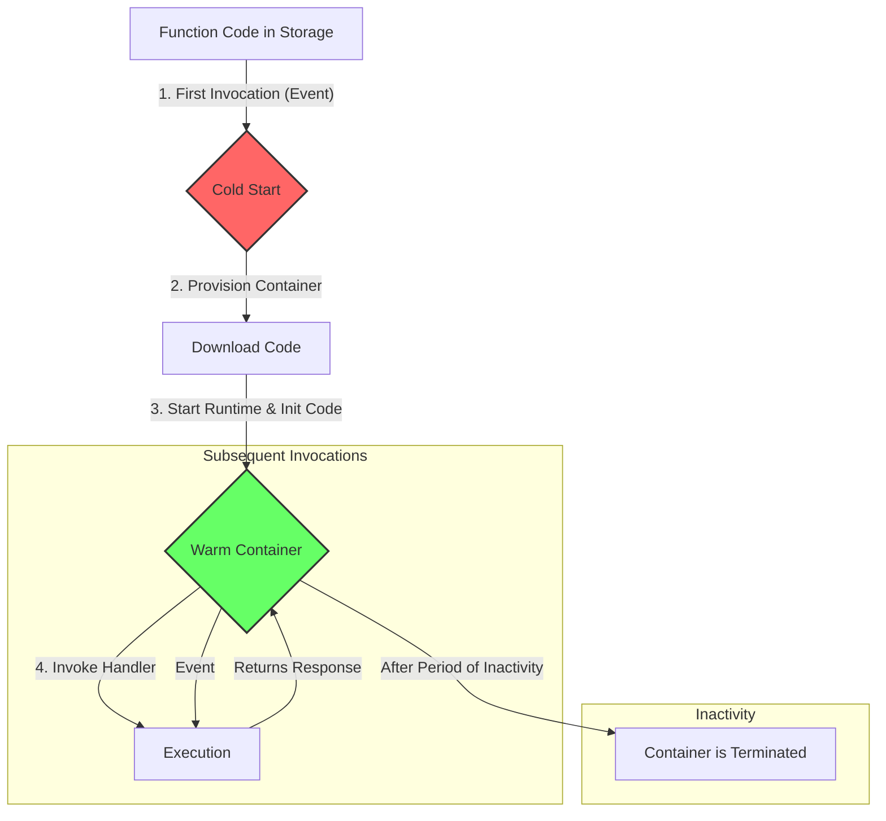

While "serverless" describes a broad architectural paradigm, **Function-as-a-Service (FaaS)** is the core compute model that makes it possible. FaaS is a type of cloud computing service that allows you to execute code in response to events without the complex infrastructure traditionally associated with building and launching microservices applications.

With FaaS, you upload your code—a "function"—to the cloud provider. The provider then handles everything required to run and scale that function with high availability. You don't manage application servers, and you don't pay for idle resources. This model fundamentally changes the operational responsibilities of a developer.

This article dives deep into the FaaS execution model, its lifecycle, the infamous "cold start" problem, and how major providers like AWS, Google, and Microsoft implement it.

### The FaaS Execution Model and Lifecycle

Understanding the FaaS lifecycle is key to using it effectively. When you deploy a function, it doesn't just sit on a server waiting to be called. Instead, it exists as a package in storage. The magic happens at invocation time.

**Diagram: The FaaS Function Lifecycle**

1.  **Invocation Trigger**: An event occurs that triggers the function. This could be an HTTP request from an API Gateway, a new message in a queue, a file upload to object storage, or a scheduled timer.
2.  **Cold Start**: If there is no active container ready to serve the request, the FaaS platform must perform a "cold start." This involves:
    *   Allocating a lightweight compute container (e.g., a Firecracker microVM in AWS).
    *   Downloading your function code package.
    *   Starting the language runtime (e.g., Node.js, Python, Go).
    *   Running your function's initialization code (the code outside the main handler).
3.  **Execution**: Once the environment is ready, the platform invokes your function's handler with the event payload.
4.  **Warm State**: After execution, the container is kept "warm" for a period of time in anticipation of another request. If another invocation occurs while the container is warm, the platform skips the cold start steps and goes straight to execution, resulting in much lower latency. This is a "warm start."
5.  **Termination**: If the function is not invoked again within a certain timeframe, the provider will terminate the container to free up resources.

### The Cold Start Problem

The latency introduced by a cold start is the most discussed drawback of FaaS. It can range from a few hundred milliseconds to several seconds, depending on:

*   **Language Choice**: Interpreted languages like Python and Node.js generally have faster cold start times than compiled languages like Java or .NET that require a JVM/CLR to initialize. Go is an exception, as it compiles to a small, self-contained binary with very fast startup.
*   **Package Size**: The larger your deployment package (including dependencies), the longer it takes to download and initialize.
*   **VPC Configuration**: In some clouds, functions that need to access resources within a Virtual Private Cloud (VPC) can experience longer cold starts due to the time it takes to attach a network interface.

**Strategies to Mitigate Cold Starts:**

*   **Provisioned Concurrency (AWS Lambda)**: You can pay to keep a specified number of function instances initialized and ready to respond in double-digit milliseconds. This effectively eliminates cold starts for a predictable number of concurrent requests but comes at a higher cost.
*   **Optimize Package Size**: Use tools like webpack (for Node.js) or build flags to create smaller deployment artifacts. Only include the dependencies you absolutely need.
*   **Choose a Fast Language**: For latency-sensitive applications, Go and Python are often excellent choices for FaaS.
*   **"Pinging" Functions**: A simple but less elegant solution is to have a scheduled task that invokes your function every few minutes to keep it warm.

### State Management in a Stateless World

FaaS functions are fundamentally **stateless**. Each invocation runs in a clean, isolated environment. You cannot rely on in-memory state being preserved between invocations. While a warm container *may* retain some state in global variables, it's not a guarantee and is considered an anti-pattern.

All persistent state must be externalized to a database, cache, or object store.

*   **Databases**: Serverless databases like Amazon DynamoDB or managed SQL services are the standard for persisting core application data.
*   **Caches**: Services like Redis or Memcached (e.g., Amazon ElastiCache) are crucial for storing session data or caching frequently accessed information to reduce database load and improve latency.
*   **Temporary Storage**: Most FaaS platforms provide a small amount of temporary disk space (`/tmp` directory) that is available for the life of the container. It can be used for transient data processing but will be wiped when the container is terminated.

### A Comparison of Major FaaS Providers

| Feature                 | AWS Lambda                               | Google Cloud Functions                  | Azure Functions                          |
| ----------------------- | ---------------------------------------- | --------------------------------------- | ---------------------------------------- |
| **Primary Trigger**     | API Gateway, S3, SQS, DynamoDB, etc.     | HTTP, Cloud Storage, Pub/Sub, etc.      | HTTP, Blob Storage, Queue Storage, etc.  |
| **Max Timeout**         | 15 minutes                               | 9 minutes (HTTP), 60 minutes (background) | Unlimited (on dedicated plan)            |
| **Concurrency Model**   | Concurrent requests get separate instances | Concurrent requests get separate instances | Can process multiple requests per instance |
| **Cold Start Solution** | Provisioned Concurrency                  | Minimum Instances                       | Premium Plan (pre-warmed instances)      |
| **Unique Feature**      | Lambda Layers (shared dependencies)      | Integrates with Google's ML services    | Durable Functions (stateful workflows)   |

*   **AWS Lambda** is the most mature and widely adopted FaaS platform with the broadest set of integrations.
*   **Google Cloud Functions** is simple to use and tightly integrated with the Google Cloud ecosystem.
*   **Azure Functions** offers a unique feature called "Durable Functions," an extension that allows you to write stateful, long-running orchestration logic in a serverless model, which is a powerful way to implement patterns like sagas.

### Conclusion

Function-as-a-Service is the engine of the serverless revolution. It offers an incredibly efficient, scalable, and cost-effective way to run event-driven code in the cloud. While developers must adapt to a stateless execution model and be mindful of challenges like cold starts, the operational simplicity is a massive advantage. By offloading infrastructure management to the cloud provider, FaaS empowers teams to focus on what truly matters: building and delivering value to their users. Understanding the FaaS lifecycle and its trade-offs is crucial for any system designer looking to leverage the power of serverless architecture.