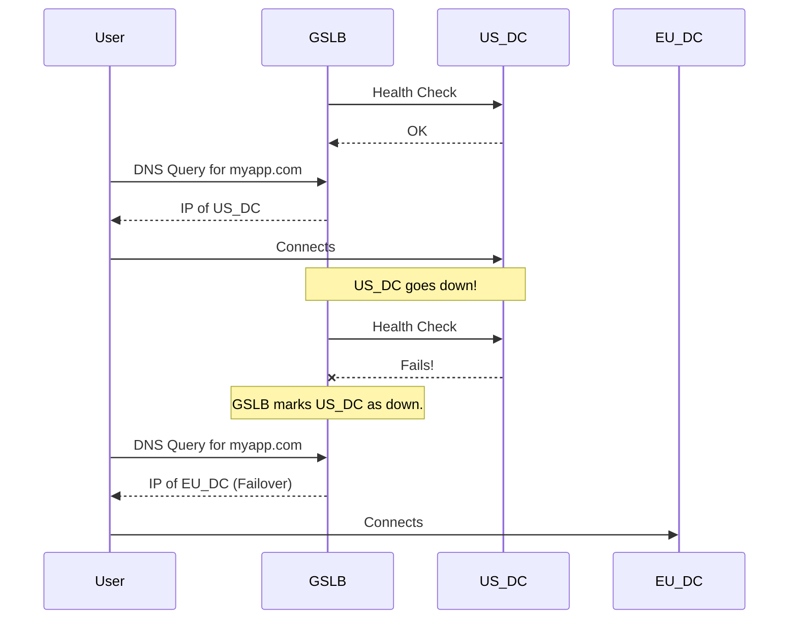

## System Design: Global Server Load Balancing (GSLB)

In our previous post on [DNS Load Balancing](/blog/system-design/system-design-dns-load-balancing), we saw how DNS can distribute traffic across multiple servers. But what happens when your servers are spread across the globe in different data centers? How do you ensure that a user in Europe connects to your European data center, and a user in Asia connects to your Asian data center?

This is the domain of **Global Server Load Balancing (GSLB)**. GSLB is an intelligent traffic distribution method that extends DNS to direct users to the optimal data center based on various factors like geographic location, server health, and network latency.

### What is GSLB?

At its core, GSLB is a sophisticated form of DNS. While basic DNS load balancing might just rotate through a list of IPs, a GSLB system acts like a smart DNS server that makes an intelligent decision for each DNS query it receives. Its goal is to provide a single, unified domain name (e.g., `www.myapp.com`) that routes users to the best endpoint, no matter where they are in the world.

The "best" endpoint can be defined by several criteria:
-   **Proximity:** The closest data center to the user.
-   **Performance:** The data center with the lowest latency for the user.
-   **Load:** The data center with the most available capacity.
-   **Availability:** A data center that is currently online and healthy.

```mermaid
graph TD
    User_EU[User in Europe] --> GSLB
    User_US[User in USA] --> GSLB
    User_AS[User in Asia] --> GSLB

    subgraph GSLB DNS Provider
        GSLB{GSLB Logic}
    end

    GSLB -- "DNS Query for myapp.com" --> GSLB
    GSLB -- "Responds with 1.1.1.1" --> User_EU
    GSLB -- "Responds with 2.2.2.2" --> User_US
    GSLB -- "Responds with 3.3.3.3" --> User_AS

    User_EU --> DC_EU[Europe DC (1.1.1.1)]
    User_US --> DC_US[USA DC (2.2.2.2)]
    User_AS --> DC_AS[Asia DC (3.3.3.3)]
```

### GSLB Routing Methods

GSLB providers use several methods to make routing decisions.

#### 1. Geolocation-Based Routing (Geo-DNS)

This is the most common GSLB method. The GSLB provider maintains a database that maps the IP address of the user's DNS resolver to a geographic location (country, continent, etc.). When a query comes in, the GSLB system looks up the resolver's location and returns the IP address of the data center configured to serve that region.

**Example:**
-   You configure your European data center to handle traffic from Europe.
-   You configure your US data center to handle traffic from North America.
-   A user in Germany makes a DNS query. Their ISP's resolver has a German IP.
-   The GSLB sees the query is from Germany and returns the IP of the European data center.

#### 2. Latency-Based Routing

This method aims to provide the best performance by directing users to the data center with the lowest network latency. The GSLB provider collects latency data from various points on the internet to each of your data centers. When a user's query arrives, the system determines which data center would offer the fastest response time for that user's network and returns its IP.

This is more precise than Geo-DNS, as the geographically closest data center isn't always the fastest due to network peering and routing complexities.

#### 3. Weighted Round Robin

This method allows you to assign "weights" to your data centers. You can then distribute traffic proportionally.

**Example:**
-   Your US data center is twice as powerful as your European one.
-   You can assign a weight of `200` to the US DC and `100` to the EU DC.
-   The GSLB will send approximately two-thirds of the traffic to the US and one-third to Europe.

This is useful for balancing load across data centers of different sizes or for gradually shifting traffic to a new data center.

#### 4. Failover Routing

GSLB is a critical tool for disaster recovery. The GSLB system constantly runs health checks on your data centers. If a primary data center becomes unavailable, the GSLB can automatically redirect all its traffic to a secondary, healthy data center.

**Example:**
-   Your primary data center is in the US. Your backup is in Europe.
-   The GSLB is configured to send all traffic to the US DC as long as it's healthy.
-   If the health checks for the US DC fail, the GSLB immediately stops returning its IP and starts sending all users to the European DC's IP instead.



### Benefits of GSLB

1.  **Improved Performance:** By directing users to the nearest or lowest-latency server, GSLB significantly reduces page load times and improves user experience.
2.  **High Availability and Disaster Recovery:** Automatic failover ensures that your application remains online even if an entire data center goes down.
3.  **Scalability:** GSLB allows you to scale your application globally, adding new data centers as your user base grows in different regions.
4.  **Efficient Use of Resources:** You can balance traffic based on data center capacity, preventing overload and making the most of your infrastructure investment.

### Challenges and Considerations

-   **Dependency on DNS:** GSLB is still subject to the limitations of DNS, particularly **DNS caching**. If you have a failover event, it can take time for the change to propagate across the internet, depending on the TTL settings. Low TTLs are crucial for effective GSLB.
-   **Health Check Configuration:** The accuracy and frequency of health checks are critical. Poorly configured health checks can lead to false positives (taking a healthy server offline) or false negatives (leaving a dead server in rotation).
-   **Cost:** GSLB is an advanced service offered by specialized DNS providers (like AWS Route 53, Cloudflare DNS, Akamai GTM) and is more expensive than standard DNS.
-   **Data Sovereignty:** For applications that must store user data in specific geographic regions (e.g., due to GDPR), GSLB must be configured carefully to work alongside your data storage logic to ensure compliance.

### Conclusion

Global Server Load Balancing is the cornerstone of any application that serves a global audience. It transforms DNS from a simple name-to-address lookup into an intelligent, resilient, and performance-enhancing traffic management system. By dynamically routing users to the optimal data center, GSLB ensures high availability, low latency, and a seamless experience for users, no matter where they are in the world. It is the first and most critical step in building a truly global, scalable, and resilient system architecture.
---
