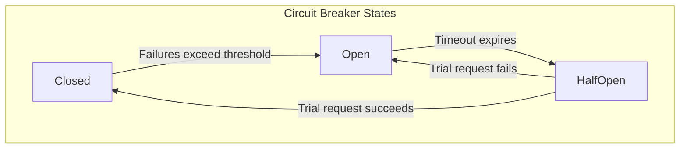
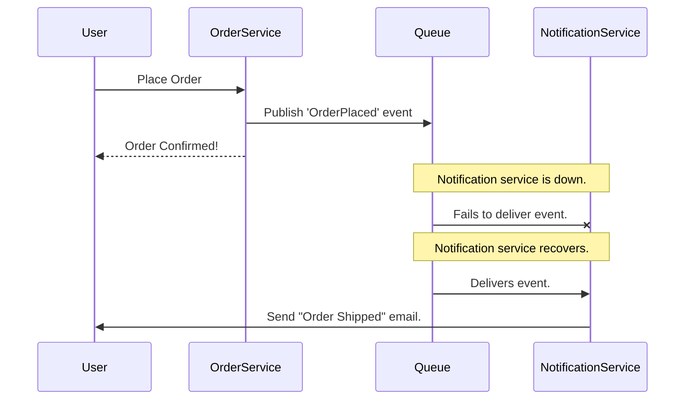

## System Design: The Art of Graceful Degradation

In a complex distributed system, failures are inevitable. A database might become slow, a third-party API could go down, or a caching layer might fail. When these dependencies fail, one of two things can happen:
1.  **Catastrophic Failure:** The entire application crashes or becomes unresponsive. A failure in a non-critical component (like a recommendation engine) brings down the whole e-commerce site.
2.  **Graceful Degradation:** The application recognizes the failure and continues to operate in a limited capacity, providing a reduced but still functional user experience.

**Graceful degradation** is the art of designing a system that can handle the failure of its components without completely failing itself. It's about maintaining the core functionality of your application even when its secondary features are unavailable.

### Why is Graceful Degradation Important?

-   **Improved User Experience:** A partially working site is almost always better than a site that is completely down. A user on an e-commerce site would rather be able to search for and buy products, even if personalized recommendations aren't working, than see a "500 Internal Server Error" page.
-   **Increased Resilience:** It prevents **cascading failures**, where the failure of one small component triggers a chain reaction that brings down the entire system.
-   **Business Continuity:** For many businesses, uptime is directly tied to revenue. Graceful degradation keeps the most critical, revenue-generating parts of the application online.

### Key Patterns for Graceful Degradation

Implementing graceful degradation requires you to identify your system's critical path and find ways to bypass or provide alternatives for non-critical dependencies when they fail.

#### 1. The Circuit Breaker Pattern

This is one of the most fundamental patterns for graceful degradation. A [Circuit Breaker](/blog/system-design/system-design-circuit-breaker) acts as a proxy for operations that are prone to failure, like network calls to a remote service. It operates like an electrical circuit breaker, with three states:

-   **Closed:** The default state. Requests are passed through to the remote service. The breaker monitors for failures.
-   **Open:** If the number of failures exceeds a threshold, the breaker "trips" and moves to the Open state. In this state, all subsequent requests fail immediately without even attempting to contact the remote service. This prevents the application from wasting resources on an unavailable service and gives the failing service time to recover.
-   **Half-Open:** After a timeout period, the breaker moves to the Half-Open state. It allows a single "trial" request to pass through. If that request succeeds, the breaker moves back to Closed. If it fails, it returns to the Open state.



When the circuit is open, instead of just returning an error, you can serve fallback data.

#### 2. Fallbacks and Default Values

When a service is unavailable, don't just show an error. Provide a sensible default or a cached version of the data.

-   **E-commerce Site:** If the recommendation service is down, instead of showing an empty space, show a list of generic best-sellers or a simple "New Arrivals" list.
-   **Weather App:** If the live weather API fails, show the last successfully fetched weather data with a timestamp indicating it's stale.
-   **User Profile:** If the service that fetches a user's profile picture is down, display a default avatar instead of a broken image icon.

#### 3. Timeouts and Retries

Slow services can be more dangerous than failed services. A slow dependency can tie up all your application's threads or connections, leading to a complete system freeze.

-   **Aggressive Timeouts:** Always configure aggressive timeouts for any network call. It's better to fail fast and serve a fallback than to wait indefinitely for a slow service.
-   **Smart Retries:** When a request fails, it might be due to a transient issue. Retrying can help. However, implement retries with an **exponential backoff** strategy (wait 1s, then 2s, then 4s, etc.). This prevents a "retry storm" where thousands of clients are hammering a struggling service, making its recovery impossible.

#### 4. Asynchronous Communication

Decouple components using message queues or event streams. This way, if a downstream consumer service fails, the upstream producer can continue to operate and publish messages to the queue. The consumer can process the messages when it comes back online.

**Example:** On an e-commerce site, when an order is placed:
-   **Synchronous:** The order service calls the payment service, then the shipping service, then the notification service. If the notification service is down, the entire order placement fails.
-   **Asynchronous:** The order service just places an "OrderPlaced" event onto a message queue. The payment, shipping, and notification services are independent consumers of this event. If the notification service is down, the other services are unaffected, and the user's order is still successfully placed.



### Go Example: Graceful Degradation with a Fallback

This example shows a simple HTTP handler that tries to fetch data from a primary service. If the service fails (or the circuit breaker is open), it serves data from a fallback function instead.

```go
package main

import (
	"fmt"
	"log"
	"net/http"
	"time"

	"github.com/sony/gobreaker"
)

var cb *gobreaker.CircuitBreaker

func init() {
	var st gobreaker.Settings
	st.Name = "PrimaryService"
	st.MaxRequests = 1
	st.Timeout = 5 * time.Second
	st.ReadyToTrip = func(counts gobreaker.Counts) bool {
		// Trip the circuit after 3 consecutive failures.
		return counts.ConsecutiveFailures > 3
	}
	st.OnStateChange = func(name string, from gobreaker.State, to gobreaker.State) {
		log.Printf("CircuitBreaker '%s' changed from %s to %s\n", name, from, to)
	}

	cb = gobreaker.NewCircuitBreaker(st)
}

// primaryService simulates a service that can fail.
func primaryService() (string, error) {
	// Simulate a flaky service.
	if time.Now().Second()%20 < 10 {
		return "", fmt.Errorf("primary service is currently unavailable")
	}
	return "Live data from the primary service!", nil
}

// fallbackService provides a default response.
func fallbackService() string {
	return "Cached/default data as a fallback."
}

func dataHandler(w http.ResponseWriter, r *http.Request) {
	// Execute the primary service call through the circuit breaker.
	body, err := cb.Execute(func() (interface{}, error) {
		return primaryService()
	})

	if err != nil {
		log.Printf("Primary service failed: %v. Serving fallback.", err)
		// If the circuit breaker is open or the service failed, use the fallback.
		fallbackBody := fallbackService()
		fmt.Fprint(w, fallbackBody)
		return
	}

	fmt.Fprint(w, body.(string))
}

func main() {
	http.HandleFunc("/data", dataHandler)
	log.Println("Server starting on :8080")
	log.Println("Access http://localhost:8080/data. The primary service will be flaky.")
	log.Fatal(http.ListenAndServe(":8080", nil))
}
```
**To run this:**
1.  Install the circuit breaker library: `go get github.com/sony/gobreaker`
2.  Run the server. When you access `/data`, you'll sometimes get live data and sometimes get the fallback data when the primary service "fails." If you refresh quickly enough during a failure period, you'll see the circuit breaker trip to the "open" state.

### Conclusion

Graceful degradation is a mindset. It requires you to anticipate failures and design your system with the understanding that its dependencies are not always reliable. By identifying your critical path and implementing patterns like circuit breakers, fallbacks, and asynchronous communication, you can build applications that are not just robust, but are also resilient. They can weather the storm of partial outages, providing the best possible experience to your users instead of leaving them with a broken page.
---
