## Introduction: When Relationships Are the Data

Relational, document, and key-value databases are great at storing entities. But what if the most important part of your data isn't the entities themselves, but the complex web of **relationships** between them?
*   Who is **friends with** whom?
*   Which customers **also bought** this product?
*   Does this transaction **originate from** a known fraudulent device?

Answering these questions with traditional databases often requires expensive, recursive `JOIN` operations that slow to a crawl as the data grows. **Graph databases** are purpose-built to solve this problem. They treat relationships not as a secondary concept to be computed at query time, but as a first-class citizen of the data model.

## The Property Graph Model: Nodes, Edges, and Properties

Most modern graph databases (like Neo4j) use the property graph model, which consists of three simple building blocks:

1.  **Nodes:** These represent the entities in your data. A node could be a `Person`, a `Product`, a `Company`, or a `Transaction`.
2.  **Edges (or Relationships):** These connect the nodes and give the connection context. An edge always has a direction, a type, a start node, and an end node. For example, a `Person` node might have a `KNOWS` relationship to another `Person` node.
3.  **Properties:** These are key-value pairs that store data on both nodes and edges. A `Person` node could have a `name` property, and a `KNOWS` edge could have a `since` property indicating how long two people have known each other.

```mermaid
flowchart LR
    subgraph PG["Property Graph"]
        Alice(("👤 Alice\nPerson\nname: Alice, age:30"))
        Bob(("👨 Bob\nPerson\nname: Bob, age:25"))
        Post(("📝 Graph DBs\nBlogPost\n2023-01-15"))
        Alice -- "KNOWS (since 2021)" --> Bob
        Bob -- "WROTE" --> Post
        Alice -- "LIKED" --> Post
    end

    classDef person fill:#e3f2fd,stroke:#1976d2;
    classDef post fill:#f3e5f5,stroke:#7b1fa2;
    class Alice,Bob person;
    class Post post;
```



This model is incredibly intuitive and powerful. It allows you to represent complex, real-world systems naturally without forcing them into rigid tables.

## The Superpower: Index-Free Adjacency

The magic of a graph database is how it stores this data. Each node maintains a direct reference (like a pointer) to its adjacent nodes. This is called **Index-Free Adjacency**.

When you want to find "Alice's friends," the database starts at the `Alice` node and directly follows the `KNOWS` edges to the connected nodes. It doesn't need to perform a global index lookup like a relational database would. This means that the time it takes to traverse a relationship is constant, regardless of the total number of nodes in the graph.

Finding "friends of friends of friends" is just three hops. In a relational database, this would be three expensive `JOIN` operations. In a graph database, it's just a fast traversal.

## Common Use Cases

Graph databases are the perfect fit for problems where you need to analyze connections.

### 1. Social Networks
This is the classic use case. Answering questions like "Who are the friends of my friends who live in New York?" is trivial.
*   **Nodes:** `User`, `City`
*   **Edges:** `FRIENDS_WITH`, `LIVES_IN`

### 2. Recommendation Engines
Graph databases excel at providing real-time recommendations.
*   **"Customers who bought X also bought Y":** `(Customer) -[:PURCHASED]-> (Product X)`, `(Customer) -[:PURCHASED]-> (Product Y)`
*   **Collaborative Filtering:** Find users with similar purchase histories and recommend products they haven't bought yet.
    `(User A) -[:PURCHASED]-> (Product) <-[:PURCHASED]- (User B)`

### 3. Fraud Detection
Fraud often involves complex rings of seemingly unrelated accounts, credit cards, and devices. Graph databases can uncover these patterns in real-time.
*   **Query:** "Find all users who have used the same credit card OR the same device as a known fraudulent user."
*   **Nodes:** `User`, `CreditCard`, `Device`
*   **Edges:** `USED`, `HAS_EMAIL`

### 4. Knowledge Graphs
These are used to model complex, interconnected domains of information, like the relationship between drugs, diseases, and proteins in medical research, or to power a more intelligent search engine.

## Go Example: Finding Friends of Friends with Neo4j

Let's use Go and the official Neo4j driver to build a tiny social network and find a "friend of a friend." We'll use Cypher, the most popular graph query language.

```go
package main

import (
	"context"
	"fmt"
	"log"

	"github.com/neo4j/neo4j-go-driver/v4/neo4j"
)

var ctx = context.Background()

func main() {
	// --- Connect to Neo4j ---
	// Replace with your AuraDB URI or local Neo4j instance
	uri := "neo4j://localhost:7687"
	user := "neo4j"
	password := "password"
	
	driver, err := neo4j.NewDriver(uri, neo4j.BasicAuth(user, password, ""))
	if err != nil {
		log.Fatalf("Failed to create Neo4j driver: %v", err)
	}
	defer driver.Close()

	session := driver.NewSession(neo4j.SessionConfig{})
	defer session.Close()

	// --- 1. Clean up previous data and create the graph ---
	_, err = session.WriteTransaction(func(tx neo4j.Transaction) (interface{}, error) {
		// Cypher query to delete old data and create new nodes and relationships
		query := `
			MATCH (n) DETACH DELETE n;
			CREATE (alice:Person {name: 'Alice'}),
			       (bob:Person {name: 'Bob'}),
			       (charlie:Person {name: 'Charlie'}),
			       (david:Person {name: 'David'});
			CREATE (alice)-[:KNOWS]->(bob),
			       (bob)-[:KNOWS]->(charlie),
				   (alice)-[:KNOWS]->(david);
		`
		return tx.Run(query, nil)
	})
	if err != nil {
		log.Fatalf("Failed to create graph: %v", err)
	}
	log.Println("Successfully created social graph.")

	// --- 2. Query for "Friends of a Friend" ---
	// We want to find who Alice's friends know, excluding Alice herself and her direct friends.
	log.Println("\nFinding friends of Alice's friends...")
	
	result, err := session.ReadTransaction(func(tx neo4j.Transaction) (interface{}, error) {
		query := `
			MATCH (p:Person {name: $name})-[:KNOWS]->(friend:Person)-[:KNOWS]->(fof:Person)
			WHERE NOT (p)-[:KNOWS]->(fof) AND p <> fof
			RETURN DISTINCT fof.name AS name
		`
		params := map[string]interface{}{"name": "Alice"}
		
		res, err := tx.Run(query, params)
		if err != nil {
			return nil, err
		}

		// Collect the results
		var recommendations []string
		for res.Next() {
			record := res.Record()
			name, _ := record.Get("name")
			recommendations = append(recommendations, name.(string))
		}
		return recommendations, nil
	})
	if err != nil {
		log.Fatalf("Failed to run query: %v", err)
	}

	fmt.Printf("Friend recommendations for Alice: %v\n", result)
}
```
**Query Explanation:**
*   `MATCH (p:Person {name: $name})-[:KNOWS]->(friend:Person)-[:KNOWS]->(fof:Person)`: This pattern finds a path of length two: from our starting person (`p`), through their friend (`friend`), to a "friend of a friend" (`fof`).
*   `WHERE NOT (p)-[:KNOWS]->(fof) AND p <> fof`: This ensures we don't recommend people Alice already knows or Alice herself.
*   `RETURN DISTINCT fof.name AS name`: Returns the unique names of the recommended people.

## Conclusion

Graph databases are not a replacement for other database types; they are a highly specialized tool for a specific class of problems. When your data is defined by its relationships, a graph database can provide performance and modeling capabilities that are simply unattainable with other systems. By treating connections as first-class citizens, they unlock powerful new ways to understand and leverage complex, interconnected data.
