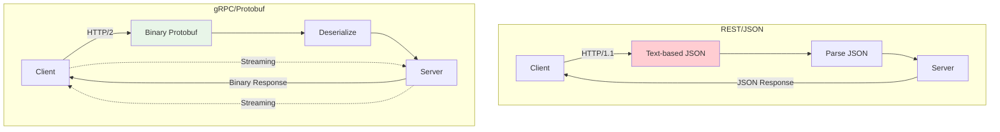

# System Design Fundamentals: gRPC & Protocol Buffers

gRPC is a high-performance RPC framework using Protocol Buffers for serialization. It supports multiple streaming patterns, strong typing, and efficient binary communication, making it ideal for microservices.

## gRPC vs REST



## Protocol Buffer Message

```go
package main

import (
    "fmt"
    "time"
)

// Protocol Buffer equivalent (for reference):
// message User {
//   string id = 1;
//   string name = 2;
//   string email = 3;
//   int32 age = 4;
//   repeated string roles = 5;
//   google.protobuf.Timestamp created_at = 6;
// }

// User represents a user (simulating protobuf-generated struct)
type User struct {
    Id        string
    Name      string
    Email     string
    Age       int32
    Roles     []string
    CreatedAt time.Time
}

// Product message
type Product struct {
    Id          string
    Name        string
    Description string
    Price       float64
    Stock       int32
    CategoryId  string
}

// Order message
type Order struct {
    Id         string
    UserId     string
    Items      []*OrderItem
    TotalPrice float64
    Status     string
    CreatedAt  time.Time
}

type OrderItem struct {
    ProductId string
    Quantity  int32
    Price     float64
}
```

## gRPC Server Implementation

```go
// UserService defines the service interface
type UserService struct {
    users map[string]*User
}

func NewUserService() *UserService {
    return &UserService{
        users: make(map[string]*User),
    }
}

// Unary RPC: GetUser
func (s *UserService) GetUser(req *GetUserRequest) (*GetUserResponse, error) {
    fmt.Printf("📥 GetUser called: id=%s\n", req.UserId)
    
    user, exists := s.users[req.UserId]
    if !exists {
        return nil, fmt.Errorf("user not found: %s", req.UserId)
    }
    
    return &GetUserResponse{
        User: user,
    }, nil
}

// Unary RPC: CreateUser
func (s *UserService) CreateUser(req *CreateUserRequest) (*CreateUserResponse, error) {
    fmt.Printf("📥 CreateUser called: name=%s\n", req.Name)
    
    user := &User{
        Id:        fmt.Sprintf("user-%d", time.Now().UnixNano()),
        Name:      req.Name,
        Email:     req.Email,
        Age:       req.Age,
        Roles:     req.Roles,
        CreatedAt: time.Now(),
    }
    
    s.users[user.Id] = user
    
    fmt.Printf("✅ User created: %s\n", user.Id)
    
    return &CreateUserResponse{
        User: user,
    }, nil
}

// Server Streaming RPC: ListUsers
func (s *UserService) ListUsers(req *ListUsersRequest, stream UserStreamSender) error {
    fmt.Printf("📥 ListUsers called (streaming)\n")
    
    count := 0
    for _, user := range s.users {
        if err := stream.Send(&ListUsersResponse{User: user}); err != nil {
            return err
        }
        count++
        time.Sleep(100 * time.Millisecond) // Simulate processing
    }
    
    fmt.Printf("✅ Streamed %d users\n", count)
    
    return nil
}

// Client Streaming RPC: BatchCreateUsers
func (s *UserService) BatchCreateUsers(stream UserStreamReceiver) (*BatchCreateUsersResponse, error) {
    fmt.Printf("📥 BatchCreateUsers called (client streaming)\n")
    
    created := make([]*User, 0)
    
    for {
        req, err := stream.Recv()
        if err != nil {
            break // Stream ended
        }
        
        user := &User{
            Id:        fmt.Sprintf("user-%d", time.Now().UnixNano()),
            Name:      req.Name,
            Email:     req.Email,
            Age:       req.Age,
            Roles:     req.Roles,
            CreatedAt: time.Now(),
        }
        
        s.users[user.Id] = user
        created = append(created, user)
        
        fmt.Printf("  Created user: %s\n", user.Name)
        time.Sleep(50 * time.Millisecond)
    }
    
    fmt.Printf("✅ Batch created %d users\n", len(created))
    
    return &BatchCreateUsersResponse{
        Users: created,
        Count: int32(len(created)),
    }, nil
}

// Bidirectional Streaming RPC: Chat
func (s *UserService) Chat(stream ChatStream) error {
    fmt.Printf("📥 Chat called (bidirectional streaming)\n")
    
    // Simulate chat handling
    msgCount := 0
    
    for {
        msg, err := stream.Recv()
        if err != nil {
            break
        }
        
        msgCount++
        fmt.Printf("  Received: %s from %s\n", msg.Text, msg.UserId)
        
        // Echo back with processing
        response := &ChatMessage{
            UserId:    "server",
            Text:      fmt.Sprintf("Echo: %s", msg.Text),
            Timestamp: time.Now().Unix(),
        }
        
        if err := stream.Send(response); err != nil {
            return err
        }
        
        time.Sleep(100 * time.Millisecond)
    }
    
    fmt.Printf("✅ Chat completed: %d messages\n", msgCount)
    
    return nil
}

// Request/Response types

type GetUserRequest struct {
    UserId string
}

type GetUserResponse struct {
    User *User
}

type CreateUserRequest struct {
    Name  string
    Email string
    Age   int32
    Roles []string
}

type CreateUserResponse struct {
    User *User
}

type ListUsersRequest struct {
    PageSize int32
}

type ListUsersResponse struct {
    User *User
}

type BatchCreateUsersResponse struct {
    Users []*User
    Count int32
}

type ChatMessage struct {
    UserId    string
    Text      string
    Timestamp int64
}

// Stream interfaces (simulating gRPC streams)

type UserStreamSender interface {
    Send(*ListUsersResponse) error
}

type UserStreamReceiver interface {
    Recv() (*CreateUserRequest, error)
}

type ChatStream interface {
    Send(*ChatMessage) error
    Recv() (*ChatMessage, error)
}
```

## gRPC Client Implementation

```go
// UserServiceClient wraps gRPC client
type UserServiceClient struct {
    service *UserService // In production: actual gRPC connection
}

func NewUserServiceClient(service *UserService) *UserServiceClient {
    return &UserServiceClient{
        service: service,
    }
}

// Unary call
func (c *UserServiceClient) GetUser(userId string) (*User, error) {
    req := &GetUserRequest{UserId: userId}
    
    resp, err := c.service.GetUser(req)
    if err != nil {
        return nil, err
    }
    
    return resp.User, nil
}

// Unary call
func (c *UserServiceClient) CreateUser(name, email string, age int32, roles []string) (*User, error) {
    req := &CreateUserRequest{
        Name:  name,
        Email: email,
        Age:   age,
        Roles: roles,
    }
    
    resp, err := c.service.CreateUser(req)
    if err != nil {
        return nil, err
    }
    
    return resp.User, nil
}

// Server streaming
func (c *UserServiceClient) ListUsers(pageSize int32) ([]*User, error) {
    req := &ListUsersRequest{PageSize: pageSize}
    
    stream := &MockStreamSender{responses: make([]*ListUsersResponse, 0)}
    
    if err := c.service.ListUsers(req, stream); err != nil {
        return nil, err
    }
    
    users := make([]*User, len(stream.responses))
    for i, resp := range stream.responses {
        users[i] = resp.User
    }
    
    return users, nil
}

// Mock stream implementations

type MockStreamSender struct {
    responses []*ListUsersResponse
}

func (m *MockStreamSender) Send(resp *ListUsersResponse) error {
    m.responses = append(m.responses, resp)
    return nil
}

type MockStreamReceiver struct {
    requests []*CreateUserRequest
    index    int
}

func (m *MockStreamReceiver) Recv() (*CreateUserRequest, error) {
    if m.index >= len(m.requests) {
        return nil, fmt.Errorf("EOF")
    }
    
    req := m.requests[m.index]
    m.index++
    
    return req, nil
}

type MockChatStream struct {
    incoming []*ChatMessage
    outgoing []*ChatMessage
    recvIdx  int
}

func (m *MockChatStream) Send(msg *ChatMessage) error {
    m.outgoing = append(m.outgoing, msg)
    return nil
}

func (m *MockChatStream) Recv() (*ChatMessage, error) {
    if m.recvIdx >= len(m.incoming) {
        return nil, fmt.Errorf("EOF")
    }
    
    msg := m.incoming[m.recvIdx]
    m.recvIdx++
    
    return msg, nil
}
```

## Interceptor (Middleware)

```go
// UnaryInterceptor intercepts unary RPC calls
type UnaryInterceptor func(req interface{}, handler UnaryHandler) (interface{}, error)

type UnaryHandler func(req interface{}) (interface{}, error)

// LoggingInterceptor logs RPC calls
func LoggingInterceptor(req interface{}, handler UnaryHandler) (interface{}, error) {
    start := time.Now()
    
    fmt.Printf("🔍 [Interceptor] Request: %T\n", req)
    
    resp, err := handler(req)
    
    duration := time.Since(start)
    
    if err != nil {
        fmt.Printf("❌ [Interceptor] Error: %v (took %v)\n", err, duration)
    } else {
        fmt.Printf("✅ [Interceptor] Success: %T (took %v)\n", resp, duration)
    }
    
    return resp, err
}

// AuthInterceptor validates authentication
func AuthInterceptor(req interface{}, handler UnaryHandler) (interface{}, error) {
    // Simulate auth check
    // In production: extract metadata, validate token
    
    fmt.Printf("🔐 [Auth] Validating request\n")
    
    // Simulate auth validation
    authenticated := true
    
    if !authenticated {
        return nil, fmt.Errorf("authentication failed")
    }
    
    return handler(req)
}

// MetricsInterceptor tracks metrics
type MetricsInterceptor struct {
    requestCount  int64
    errorCount    int64
    totalDuration time.Duration
}

func NewMetricsInterceptor() *MetricsInterceptor {
    return &MetricsInterceptor{}
}

func (m *MetricsInterceptor) Intercept(req interface{}, handler UnaryHandler) (interface{}, error) {
    start := time.Now()
    m.requestCount++
    
    resp, err := handler(req)
    
    duration := time.Since(start)
    m.totalDuration += duration
    
    if err != nil {
        m.errorCount++
    }
    
    return resp, err
}

func (m *MetricsInterceptor) GetMetrics() map[string]interface{} {
    avgDuration := time.Duration(0)
    if m.requestCount > 0 {
        avgDuration = m.totalDuration / time.Duration(m.requestCount)
    }
    
    return map[string]interface{}{
        "request_count":    m.requestCount,
        "error_count":      m.errorCount,
        "avg_duration_ms":  avgDuration.Milliseconds(),
        "error_rate":       float64(m.errorCount) / float64(m.requestCount) * 100,
    }
}

// ChainInterceptors chains multiple interceptors
func ChainInterceptors(interceptors ...UnaryInterceptor) UnaryInterceptor {
    return func(req interface{}, handler UnaryHandler) (interface{}, error) {
        // Build chain from right to left
        chainedHandler := handler
        
        for i := len(interceptors) - 1; i >= 0; i-- {
            interceptor := interceptors[i]
            currentHandler := chainedHandler
            
            chainedHandler = func(r interface{}) (interface{}, error) {
                return interceptor(r, currentHandler)
            }
        }
        
        return chainedHandler(req)
    }
}
```

## Load Balancer

```go
// LoadBalancer distributes requests across multiple servers
type LoadBalancer struct {
    servers   []*ServerConnection
    algorithm string
    rrIndex   int
    mutex     sync.Mutex
}

type ServerConnection struct {
    Address       string
    ActiveRequests int64
    TotalRequests int64
    Healthy       bool
}

func NewLoadBalancer(servers []string, algorithm string) *LoadBalancer {
    connections := make([]*ServerConnection, len(servers))
    for i, addr := range servers {
        connections[i] = &ServerConnection{
            Address: addr,
            Healthy: true,
        }
    }
    
    return &LoadBalancer{
        servers:   connections,
        algorithm: algorithm,
    }
}

// GetConnection returns a server connection using load balancing algorithm
func (lb *LoadBalancer) GetConnection() (*ServerConnection, error) {
    lb.mutex.Lock()
    defer lb.mutex.Unlock()
    
    healthyServers := make([]*ServerConnection, 0)
    for _, server := range lb.servers {
        if server.Healthy {
            healthyServers = append(healthyServers, server)
        }
    }
    
    if len(healthyServers) == 0 {
        return nil, fmt.Errorf("no healthy servers available")
    }
    
    switch lb.algorithm {
    case "round-robin":
        return lb.roundRobin(healthyServers), nil
    case "least-connections":
        return lb.leastConnections(healthyServers), nil
    case "random":
        return lb.random(healthyServers), nil
    default:
        return lb.roundRobin(healthyServers), nil
    }
}

func (lb *LoadBalancer) roundRobin(servers []*ServerConnection) *ServerConnection {
    server := servers[lb.rrIndex%len(servers)]
    lb.rrIndex++
    return server
}

func (lb *LoadBalancer) leastConnections(servers []*ServerConnection) *ServerConnection {
    var selected *ServerConnection
    minActive := int64(^uint64(0) >> 1) // Max int64
    
    for _, server := range servers {
        if server.ActiveRequests < minActive {
            minActive = server.ActiveRequests
            selected = server
        }
    }
    
    return selected
}

func (lb *LoadBalancer) random(servers []*ServerConnection) *ServerConnection {
    idx := time.Now().UnixNano() % int64(len(servers))
    return servers[idx]
}

// MarkUnhealthy marks a server as unhealthy
func (lb *LoadBalancer) MarkUnhealthy(address string) {
    lb.mutex.Lock()
    defer lb.mutex.Unlock()
    
    for _, server := range lb.servers {
        if server.Address == address {
            server.Healthy = false
            fmt.Printf("⚠️  Server marked unhealthy: %s\n", address)
            break
        }
    }
}

// MarkHealthy marks a server as healthy
func (lb *LoadBalancer) MarkHealthy(address string) {
    lb.mutex.Lock()
    defer lb.mutex.Unlock()
    
    for _, server := range lb.servers {
        if server.Address == address {
            server.Healthy = true
            fmt.Printf("✅ Server marked healthy: %s\n", address)
            break
        }
    }
}
```

## Connection Pool

```go
// ConnectionPool manages a pool of gRPC connections
type ConnectionPool struct {
    address     string
    minSize     int
    maxSize     int
    connections chan *PooledConnection
    activeCount int
    mutex       sync.Mutex
}

type PooledConnection struct {
    Address   string
    CreatedAt time.Time
    UsedCount int64
    InUse     bool
}

func NewConnectionPool(address string, minSize, maxSize int) *ConnectionPool {
    pool := &ConnectionPool{
        address:     address,
        minSize:     minSize,
        maxSize:     maxSize,
        connections: make(chan *PooledConnection, maxSize),
    }
    
    // Create minimum connections
    for i := 0; i < minSize; i++ {
        conn := &PooledConnection{
            Address:   address,
            CreatedAt: time.Now(),
        }
        pool.connections <- conn
    }
    
    pool.activeCount = minSize
    
    fmt.Printf("🔌 Connection pool created: %s (%d connections)\n", address, minSize)
    
    return pool
}

// Get retrieves a connection from the pool
func (cp *ConnectionPool) Get() (*PooledConnection, error) {
    select {
    case conn := <-cp.connections:
        conn.InUse = true
        conn.UsedCount++
        return conn, nil
        
    default:
        // Pool empty, try to create new connection
        cp.mutex.Lock()
        defer cp.mutex.Unlock()
        
        if cp.activeCount < cp.maxSize {
            conn := &PooledConnection{
                Address:   cp.address,
                CreatedAt: time.Now(),
                InUse:     true,
            }
            cp.activeCount++
            
            fmt.Printf("➕ Created new connection: %s (total: %d)\n", cp.address, cp.activeCount)
            
            return conn, nil
        }
        
        return nil, fmt.Errorf("connection pool exhausted")
    }
}

// Put returns a connection to the pool
func (cp *ConnectionPool) Put(conn *PooledConnection) {
    conn.InUse = false
    
    select {
    case cp.connections <- conn:
        // Successfully returned to pool
    default:
        // Pool full, close excess connection
        cp.mutex.Lock()
        cp.activeCount--
        cp.mutex.Unlock()
        
        fmt.Printf("➖ Closed excess connection: %s (total: %d)\n", cp.address, cp.activeCount)
    }
}

// GetStats returns pool statistics
func (cp *ConnectionPool) GetStats() map[string]interface{} {
    cp.mutex.Lock()
    defer cp.mutex.Unlock()
    
    return map[string]interface{}{
        "address":       cp.address,
        "active_count":  cp.activeCount,
        "available":     len(cp.connections),
        "in_use":        cp.activeCount - len(cp.connections),
        "min_size":      cp.minSize,
        "max_size":      cp.maxSize,
    }
}
```

## Retry Policy

```go
// RetryPolicy handles automatic retries with backoff
type RetryPolicy struct {
    MaxAttempts  int
    InitialDelay time.Duration
    MaxDelay     time.Duration
    Multiplier   float64
}

func NewRetryPolicy() *RetryPolicy {
    return &RetryPolicy{
        MaxAttempts:  3,
        InitialDelay: 100 * time.Millisecond,
        MaxDelay:     5 * time.Second,
        Multiplier:   2.0,
    }
}

// ExecuteWithRetry executes a function with retry logic
func (rp *RetryPolicy) ExecuteWithRetry(fn func() error) error {
    var lastErr error
    delay := rp.InitialDelay
    
    for attempt := 1; attempt <= rp.MaxAttempts; attempt++ {
        err := fn()
        
        if err == nil {
            if attempt > 1 {
                fmt.Printf("✅ Retry succeeded on attempt %d\n", attempt)
            }
            return nil
        }
        
        lastErr = err
        
        if attempt < rp.MaxAttempts {
            fmt.Printf("⚠️  Attempt %d failed: %v (retrying in %v)\n", attempt, err, delay)
            time.Sleep(delay)
            
            // Exponential backoff
            delay = time.Duration(float64(delay) * rp.Multiplier)
            if delay > rp.MaxDelay {
                delay = rp.MaxDelay
            }
        }
    }
    
    fmt.Printf("❌ All retry attempts failed: %v\n", lastErr)
    return fmt.Errorf("max retry attempts reached: %w", lastErr)
}
```

## Complete Demo

```go
func main() {
    fmt.Println("🚀 Starting gRPC & Protocol Buffers Demo\n")
    
    // Initialize service
    userService := NewUserService()
    client := NewUserServiceClient(userService)
    
    fmt.Println("=== Unary RPC Calls ===\n")
    
    // Create users
    user1, _ := client.CreateUser("Alice", "alice@example.com", 25, []string{"user", "admin"})
    fmt.Printf("Created: %s (%s)\n", user1.Name, user1.Id)
    
    user2, _ := client.CreateUser("Bob", "bob@example.com", 30, []string{"user"})
    fmt.Printf("Created: %s (%s)\n", user2.Name, user2.Id)
    
    user3, _ := client.CreateUser("Charlie", "charlie@example.com", 35, []string{"user", "moderator"})
    fmt.Printf("Created: %s (%s)\n\n", user3.Name, user3.Id)
    
    // Get user
    fetchedUser, _ := client.GetUser(user1.Id)
    fmt.Printf("Fetched: %s (age: %d, roles: %v)\n\n", fetchedUser.Name, fetchedUser.Age, fetchedUser.Roles)
    
    fmt.Println("=== Server Streaming RPC ===\n")
    
    // List users (server streaming)
    users, _ := client.ListUsers(10)
    fmt.Printf("Listed %d users via streaming\n\n", len(users))
    
    fmt.Println("=== Client Streaming RPC ===\n")
    
    // Batch create (client streaming)
    batchStream := &MockStreamReceiver{
        requests: []*CreateUserRequest{
            {Name: "Dave", Email: "dave@example.com", Age: 28, Roles: []string{"user"}},
            {Name: "Eve", Email: "eve@example.com", Age: 32, Roles: []string{"user"}},
        },
    }
    
    batchResp, _ := userService.BatchCreateUsers(batchStream)
    fmt.Printf("Batch created %d users\n\n", batchResp.Count)
    
    fmt.Println("=== Bidirectional Streaming RPC ===\n")
    
    // Chat (bidirectional streaming)
    chatStream := &MockChatStream{
        incoming: []*ChatMessage{
            {UserId: "alice", Text: "Hello!", Timestamp: time.Now().Unix()},
            {UserId: "bob", Text: "How are you?", Timestamp: time.Now().Unix()},
            {UserId: "alice", Text: "I'm good!", Timestamp: time.Now().Unix()},
        },
    }
    
    userService.Chat(chatStream)
    fmt.Printf("Chat completed with %d messages\n\n", len(chatStream.outgoing))
    
    fmt.Println("=== Interceptors ===\n")
    
    // Create interceptor chain
    metricsInterceptor := NewMetricsInterceptor()
    
    chain := ChainInterceptors(
        LoggingInterceptor,
        AuthInterceptor,
        metricsInterceptor.Intercept,
    )
    
    // Wrap handler with interceptors
    handler := func(req interface{}) (interface{}, error) {
        return userService.GetUser(req.(*GetUserRequest))
    }
    
    // Execute with interceptors
    req := &GetUserRequest{UserId: user1.Id}
    chain(req, handler)
    
    // Show metrics
    fmt.Println("\nMetrics:")
    for key, value := range metricsInterceptor.GetMetrics() {
        fmt.Printf("  %s: %v\n", key, value)
    }
    
    fmt.Println("\n=== Load Balancing ===\n")
    
    // Create load balancer
    lb := NewLoadBalancer(
        []string{"server1:50051", "server2:50051", "server3:50051"},
        "least-connections",
    )
    
    // Distribute requests
    for i := 0; i < 10; i++ {
        conn, _ := lb.GetConnection()
        conn.ActiveRequests++
        conn.TotalRequests++
        
        fmt.Printf("Request %d -> %s (active: %d)\n", i+1, conn.Address, conn.ActiveRequests)
        
        // Simulate request completion
        time.Sleep(50 * time.Millisecond)
        conn.ActiveRequests--
    }
    
    fmt.Println("\n=== Connection Pool ===\n")
    
    // Create connection pool
    pool := NewConnectionPool("localhost:50051", 2, 5)
    
    // Get connections
    conn1, _ := pool.Get()
    fmt.Printf("Got connection: %s (used %d times)\n", conn1.Address, conn1.UsedCount)
    
    conn2, _ := pool.Get()
    fmt.Printf("Got connection: %s (used %d times)\n", conn2.Address, conn2.UsedCount)
    
    // Return connections
    pool.Put(conn1)
    pool.Put(conn2)
    
    // Show stats
    fmt.Println("\nPool stats:")
    for key, value := range pool.GetStats() {
        fmt.Printf("  %s: %v\n", key, value)
    }
    
    fmt.Println("\n=== Retry Policy ===\n")
    
    // Create retry policy
    retryPolicy := NewRetryPolicy()
    
    // Simulate failing request
    attemptCount := 0
    err := retryPolicy.ExecuteWithRetry(func() error {
        attemptCount++
        if attemptCount < 3 {
            return fmt.Errorf("temporary failure")
        }
        return nil
    })
    
    if err == nil {
        fmt.Println("Request succeeded after retries")
    }
    
    fmt.Println("\n✅ gRPC Demo completed!")
}
```

## gRPC vs REST Comparison

| Feature | gRPC | REST |
|---------|------|------|
| **Protocol** | HTTP/2 | HTTP/1.1 |
| **Serialization** | Protocol Buffers (binary) | JSON (text) |
| **Performance** | Faster, smaller payloads | Slower, larger payloads |
| **Streaming** | Bidirectional streaming | Limited (chunked) |
| **Browser Support** | Limited (needs proxy) | Native |
| **Type Safety** | Strong typing | Loose typing |
| **Contract** | .proto files | OpenAPI/Swagger |

## Best Practices

### 1. Use Streaming Appropriately
```go
// Server streaming: Large result sets
rpc ListOrders(ListOrdersRequest) returns (stream Order);

// Client streaming: Batch uploads
rpc BatchCreateProducts(stream Product) returns (BatchResponse);

// Bidirectional: Real-time chat, gaming
rpc Chat(stream ChatMessage) returns (stream ChatMessage);
```

### 2. Implement Timeouts
```go
// Set deadline for request
ctx, cancel := context.WithTimeout(context.Background(), 5*time.Second)
defer cancel()

resp, err := client.GetUser(ctx, req)
```

### 3. Use Interceptors for Cross-Cutting Concerns
```go
// Chain interceptors for logging, auth, metrics
server := grpc.NewServer(
    grpc.ChainUnaryInterceptor(
        LoggingInterceptor,
        AuthInterceptor,
        MetricsInterceptor,
    ),
)
```

### 4. Handle Errors Properly
```go
// Return gRPC status codes
if user == nil {
    return nil, status.Errorf(codes.NotFound, "user not found: %s", userId)
}
```

## When to Use gRPC

### Good Use Cases
- **Microservices**: Internal service-to-service communication
- **Real-time**: Streaming data, live updates
- **Polyglot environments**: Multiple languages
- **High performance**: Low latency requirements
- **Mobile**: Efficient binary protocol

### Not Recommended For
- Browser-based applications (limited support)
- Simple CRUD APIs (REST is simpler)
- Public APIs (REST more accessible)
- When human-readable format needed

## Conclusion

gRPC with Protocol Buffers provides:

- **High Performance**: Binary serialization, HTTP/2 multiplexing
- **Type Safety**: Strong contracts with .proto files
- **Streaming**: Multiple streaming patterns
- **Language Support**: Generated code for many languages
- **Modern Features**: Deadlines, cancellation, load balancing

Ideal for microservices communication, real-time applications, and high-performance systems. Use interceptors for middleware, connection pooling for efficiency, and retry policies for resilience.
