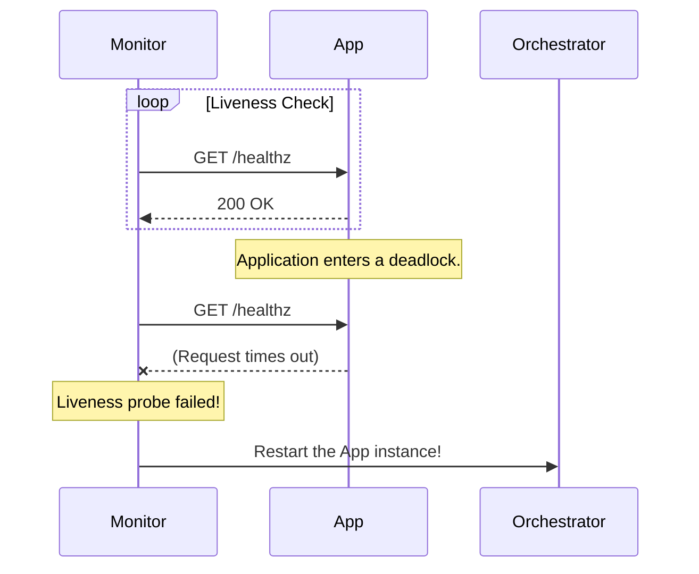
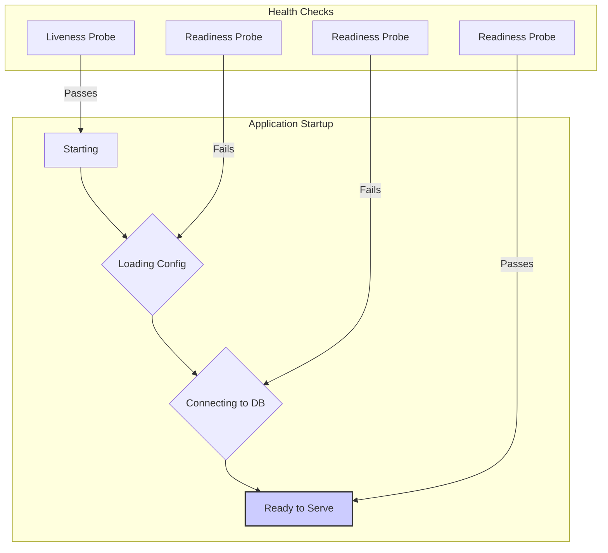

## System Design: A Guide to Health Check Patterns

How does a load balancer know not to send traffic to a dead server? How does an orchestrator like Kubernetes know to restart a crashed container? How does an [automatic failover](/blog/system-design/system-design-automatic-failover-strategies) system know when to trigger? The answer to all of these is the **Health Check**.

A health check is a routine test performed by a monitoring system to determine if a service or component is running and able to handle requests. It is the fundamental building block of any reliable, self-healing system. Without accurate health checks, you cannot have effective load balancing, auto-scaling, or automatic failover.

This post explores the common patterns for implementing health checks, from the simplest pings to deep, application-aware monitoring.

### Why Health Checks Are Critical

1.  **Reliable Load Balancing:** A load balancer uses health checks to maintain a pool of healthy servers. If a server fails its health check, the load balancer removes it from the pool and stops sending it traffic, preventing users from seeing errors.
2.  **Automatic Recovery:** Container orchestrators (like Kubernetes) and other process managers use health checks to detect failed application instances. If an instance fails, the orchestrator can automatically restart it or replace it with a new one.
3.  **Triggering Failover:** In a high-availability cluster, health checks are used to detect the failure of a primary node, which is the signal to initiate a failover to a standby node.

### Pattern 1: The Liveness Probe

A liveness probe answers the most basic question: **"Is the application running?"** It checks if the process has crashed, frozen, or entered a deadlocked state from which it cannot recover.

If a liveness probe fails, the monitoring system assumes the application instance is irrecoverable and should be terminated and replaced. In Kubernetes, this would cause the kubelet to restart the container.

**Common Implementations:**
-   **HTTP Endpoint:** Expose a simple HTTP endpoint (e.g., `/healthz` or `/livez`) that returns a `200 OK` status. If the server responds with a `200`, it's alive. If it times out or returns a `5xx` error, it's considered dead.
-   **TCP Check:** The monitor attempts to open a TCP socket on a specific port. If the connection is successful, the application is considered alive. This is useful for non-HTTP services like databases.
-   **Process Check:** A script on the machine itself checks if the application process is running.



### Pattern 2: The Readiness Probe

A readiness probe answers a more subtle question: **"Is the application ready to serve traffic?"** An application can be alive but not ready. For example:
-   It might be starting up and still loading configuration or warming up a cache.
-   It might be temporarily overloaded and unable to accept new requests.
-   It might have lost its connection to a downstream dependency, like a database.

If a readiness probe fails, the monitoring system does **not** kill the instance. Instead, it temporarily removes it from the load balancing pool. Once the readiness probe starts passing again, the instance is added back to the pool.

**Common Implementations:**
-   **HTTP Endpoint:** Similar to a liveness probe, but the endpoint (e.g., `/readyz`) should perform deeper checks. It should verify its own internal state and its connections to critical dependencies. For example, it might run a `SELECT 1` query against its database to ensure the connection is valid.


In this flow, the liveness probe passes as soon as the process starts. However, the readiness probe only passes once the application is fully initialized and ready to do real work. A load balancer should only send traffic to the instance after the readiness probe succeeds.

### Liveness vs. Readiness: A Critical Distinction

Confusing these two probes is a common and dangerous mistake.
-   **Liveness Probe Failure -> Kill the instance.** This should only be used for unrecoverable errors. If you make your liveness probe too sensitive (e.g., it fails if a downstream service is slow), you can create a "death spiral" where your instances are constantly being restarted, making the problem worse.
-   **Readiness Probe Failure -> Stop sending traffic.** This is for temporary conditions. The application is given time to recover.

**Rule of thumb:** A liveness probe should not check dependencies. It should only confirm that the process itself is running and responsive. A readiness probe *should* check dependencies.

### Pattern 3: Deep Application Health Checks

For complex applications, a simple `200 OK` is not enough. A deep health check provides more detailed information about the state of the application and its components.

Instead of just a status code, the health check endpoint can return a JSON body detailing the status of various internal and external components.

**Example JSON Response from `/health`:**
```json
{
  "status": "Degraded",
  "timestamp": "2024-07-26T10:00:00Z",
  "components": {
    "apiServer": {
      "status": "Healthy"
    },
    "database": {
      "status": "Unhealthy",
      "error": "Connection timeout after 3s"
    },
    "cache": {
      "status": "Healthy",
      "details": "95% memory usage"
    }
  }
}
```
This approach provides several benefits:
-   **Granular Monitoring:** You can set up specific alerts for different components (e.g., alert the DBAs if the database connection fails).
-   **Faster Debugging:** When an issue occurs, the health check endpoint is the first place to look to quickly diagnose the problem.
-   **Informing Graceful Degradation:** The application can use this internal status to make decisions about [graceful degradation](/blog/system-design/system-design-graceful-degradation), such as disabling non-essential features if a dependency is unhealthy.

### Go Example: A Comprehensive Health Check Endpoint

This example shows how to build a detailed HTTP health check endpoint in Go.

```go
package main

import (
	"encoding/json"
	"log"
	"net/http"
	"time"
)

// ComponentStatus represents the health of a single component.
type ComponentStatus struct {
	Status  string `json:"status"`
	Details string `json:"details,omitempty"`
}

// HealthReport is the overall health report for the application.
type HealthReport struct {
	Status     string                     `json:"status"`
	Timestamp  string                     `json:"timestamp"`
	Components map[string]ComponentStatus `json:"components"`
}

// checkDatabase simulates checking the database connection.
func checkDatabase() ComponentStatus {
	// In a real app, you would ping the database or run a simple query.
	// Here, we'll just simulate a potential failure.
	if time.Now().Second()%20 < 5 { // Fail for 5 seconds every 20 seconds
		return ComponentStatus{Status: "Unhealthy", Details: "Failed to connect to database."}
	}
	return ComponentStatus{Status: "Healthy"}
}

// checkCache simulates checking the cache (e.g., Redis).
func checkCache() ComponentStatus {
	return ComponentStatus{Status: "Healthy"}
}

func healthCheckHandler(w http.ResponseWriter, r *http.Request) {
	dbStatus := checkDatabase()
	cacheStatus := checkCache()

	overallStatus := "Healthy"
	if dbStatus.Status == "Unhealthy" || cacheStatus.Status == "Unhealthy" {
		overallStatus = "Degraded"
	}

	report := HealthReport{
		Status:    overallStatus,
		Timestamp: time.Now().UTC().Format(time.RFC3339),
		Components: map[string]ComponentStatus{
			"database": dbStatus,
			"cache":    cacheStatus,
		},
	}

	w.Header().Set("Content-Type", "application/json")
	// If the system is not healthy, return a 503 Service Unavailable status.
	// This is important for readiness probes.
	if overallStatus != "Healthy" {
		w.WriteHeader(http.StatusServiceUnavailable)
	}

	json.NewEncoder(w).Encode(report)
}

func main() {
	http.HandleFunc("/health", healthCheckHandler)
	log.Println("Server starting on :8080")
	log.Println("Health check available at http://localhost:8080/health")
	log.Fatal(http.ListenAndServe(":8080", nil))
}
```

### Conclusion

Health checks are not just a feature; they are the sensory system of a resilient architecture. They provide the critical signals needed to automate recovery and maintain high availability. By implementing a thoughtful combination of liveness, readiness, and deep application probes, you can build systems that can not only withstand failures but can also detect and recover from them automatically, ensuring a smooth and reliable experience for your users.
---
