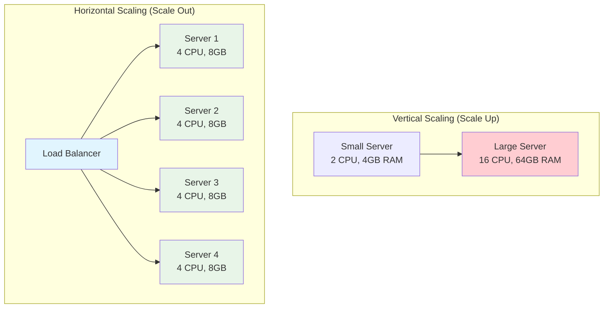

# System Design Fundamentals: Horizontal Scaling & Auto-scaling

Horizontal scaling (scale-out) adds more instances of services to handle increased load, while auto-scaling automatically adjusts capacity based on demand. This is essential for building elastic, cost-effective systems.

## Horizontal vs Vertical Scaling



## Service Instance Manager

```go
package main

import (
    "fmt"
    "sync"
    "time"
)

// ServiceInstance represents a running service instance
type ServiceInstance struct {
    ID            string
    Address       string
    Port          int
    Status        string // "starting", "healthy", "unhealthy", "stopping"
    StartTime     time.Time
    RequestCount  int64
    ErrorCount    int64
    CPUUsage      float64
    MemoryUsage   float64
    LastHeartbeat time.Time
}

// InstanceManager manages service instances
type InstanceManager struct {
    instances       map[string]*ServiceInstance
    mutex           sync.RWMutex
    minInstances    int
    maxInstances    int
    healthCheckFunc HealthCheckFunc
}

type HealthCheckFunc func(instance *ServiceInstance) bool

func NewInstanceManager(minInstances, maxInstances int) *InstanceManager {
    return &InstanceManager{
        instances:    make(map[string]*ServiceInstance),
        minInstances: minInstances,
        maxInstances: maxInstances,
    }
}

// RegisterInstance adds a new instance
func (im *InstanceManager) RegisterInstance(instance *ServiceInstance) error {
    im.mutex.Lock()
    defer im.mutex.Unlock()
    
    if len(im.instances) >= im.maxInstances {
        return fmt.Errorf("maximum instances reached: %d", im.maxInstances)
    }
    
    instance.Status = "starting"
    instance.StartTime = time.Now()
    instance.LastHeartbeat = time.Now()
    
    im.instances[instance.ID] = instance
    
    fmt.Printf("✅ Registered instance: %s at %s:%d\n", instance.ID, instance.Address, instance.Port)
    
    return nil
}

// DeregisterInstance removes an instance
func (im *InstanceManager) DeregisterInstance(instanceID string) error {
    im.mutex.Lock()
    defer im.mutex.Unlock()
    
    instance, exists := im.instances[instanceID]
    if !exists {
        return fmt.Errorf("instance not found: %s", instanceID)
    }
    
    instance.Status = "stopping"
    delete(im.instances, instanceID)
    
    fmt.Printf("🗑️  Deregistered instance: %s\n", instanceID)
    
    return nil
}

// GetHealthyInstances returns instances ready to serve traffic
func (im *InstanceManager) GetHealthyInstances() []*ServiceInstance {
    im.mutex.RLock()
    defer im.mutex.RUnlock()
    
    healthy := make([]*ServiceInstance, 0)
    
    for _, instance := range im.instances {
        if instance.Status == "healthy" {
            healthy = append(healthy, instance)
        }
    }
    
    return healthy
}

// GetAllInstances returns all instances
func (im *InstanceManager) GetAllInstances() []*ServiceInstance {
    im.mutex.RLock()
    defer im.mutex.RUnlock()
    
    instances := make([]*ServiceInstance, 0, len(im.instances))
    for _, instance := range im.instances {
        instances = append(instances, instance)
    }
    
    return instances
}

// UpdateInstanceMetrics updates instance metrics
func (im *InstanceManager) UpdateInstanceMetrics(instanceID string, cpu, memory float64, requests, errors int64) {
    im.mutex.Lock()
    defer im.mutex.Unlock()
    
    instance, exists := im.instances[instanceID]
    if !exists {
        return
    }
    
    instance.CPUUsage = cpu
    instance.MemoryUsage = memory
    instance.RequestCount = requests
    instance.ErrorCount = errors
    instance.LastHeartbeat = time.Now()
}

// MarkHealthy marks an instance as healthy
func (im *InstanceManager) MarkHealthy(instanceID string) {
    im.mutex.Lock()
    defer im.mutex.Unlock()
    
    if instance, exists := im.instances[instanceID]; exists {
        instance.Status = "healthy"
        instance.LastHeartbeat = time.Now()
    }
}

// MarkUnhealthy marks an instance as unhealthy
func (im *InstanceManager) MarkUnhealthy(instanceID string) {
    im.mutex.Lock()
    defer im.mutex.Unlock()
    
    if instance, exists := im.instances[instanceID]; exists {
        instance.Status = "unhealthy"
        fmt.Printf("⚠️  Instance marked unhealthy: %s\n", instanceID)
    }
}

// GetInstanceCount returns current instance count
func (im *InstanceManager) GetInstanceCount() int {
    im.mutex.RLock()
    defer im.mutex.RUnlock()
    
    return len(im.instances)
}
```

## Auto-Scaler

```go
// AutoScaler automatically scales instances based on metrics
type AutoScaler struct {
    instanceManager *InstanceManager
    metrics         *ScalingMetrics
    config          *ScalingConfig
    mutex           sync.Mutex
    lastScaleUp     time.Time
    lastScaleDown   time.Time
}

type ScalingConfig struct {
    MinInstances       int
    MaxInstances       int
    TargetCPU          float64
    TargetMemory       float64
    TargetRequestRate  float64
    ScaleUpThreshold   float64 // e.g., 0.8 = 80%
    ScaleDownThreshold float64 // e.g., 0.3 = 30%
    CooldownPeriod     time.Duration
    ScaleUpIncrement   int
    ScaleDownDecrement int
}

type ScalingMetrics struct {
    avgCPU         float64
    avgMemory      float64
    totalRequests  int64
    totalErrors    int64
    requestRate    float64
    errorRate      float64
    mutex          sync.RWMutex
}

func NewAutoScaler(instanceManager *InstanceManager, config *ScalingConfig) *AutoScaler {
    return &AutoScaler{
        instanceManager: instanceManager,
        metrics:         &ScalingMetrics{},
        config:          config,
        lastScaleUp:     time.Now(),
        lastScaleDown:   time.Now(),
    }
}

// Start begins the auto-scaling loop
func (as *AutoScaler) Start() {
    fmt.Println("🔄 Auto-scaler started")
    
    ticker := time.NewTicker(10 * time.Second)
    go func() {
        for range ticker.C {
            as.evaluate()
        }
    }()
}

// evaluate checks metrics and scales if needed
func (as *AutoScaler) evaluate() {
    as.mutex.Lock()
    defer as.mutex.Unlock()
    
    // Update metrics
    as.updateMetrics()
    
    // Get current instance count
    currentCount := as.instanceManager.GetInstanceCount()
    
    // Check if we should scale
    decision := as.makeScalingDecision(currentCount)
    
    switch decision {
    case "scale-up":
        as.scaleUp()
    case "scale-down":
        as.scaleDown()
    case "none":
        // No action needed
    }
}

// updateMetrics calculates current metrics
func (as *AutoScaler) updateMetrics() {
    instances := as.instanceManager.GetAllInstances()
    
    if len(instances) == 0 {
        return
    }
    
    var totalCPU, totalMemory float64
    var totalRequests, totalErrors int64
    
    for _, instance := range instances {
        totalCPU += instance.CPUUsage
        totalMemory += instance.MemoryUsage
        totalRequests += instance.RequestCount
        totalErrors += instance.ErrorCount
    }
    
    as.metrics.mutex.Lock()
    as.metrics.avgCPU = totalCPU / float64(len(instances))
    as.metrics.avgMemory = totalMemory / float64(len(instances))
    as.metrics.totalRequests = totalRequests
    as.metrics.totalErrors = totalErrors
    
    if totalRequests > 0 {
        as.metrics.errorRate = float64(totalErrors) / float64(totalRequests)
    }
    as.metrics.mutex.Unlock()
}

// makeScalingDecision decides whether to scale up, down, or do nothing
func (as *AutoScaler) makeScalingDecision(currentCount int) string {
    as.metrics.mutex.RLock()
    defer as.metrics.mutex.RUnlock()
    
    // Check if we're at limits
    if currentCount >= as.config.MaxInstances {
        return "none"
    }
    
    if currentCount <= as.config.MinInstances {
        return "none"
    }
    
    // Check cooldown period
    now := time.Now()
    if now.Sub(as.lastScaleUp) < as.config.CooldownPeriod &&
       now.Sub(as.lastScaleDown) < as.config.CooldownPeriod {
        return "none"
    }
    
    // Calculate utilization ratios
    cpuRatio := as.metrics.avgCPU / as.config.TargetCPU
    memoryRatio := as.metrics.avgMemory / as.config.TargetMemory
    
    // Scale up if any metric exceeds threshold
    if cpuRatio > as.config.ScaleUpThreshold || memoryRatio > as.config.ScaleUpThreshold {
        if now.Sub(as.lastScaleUp) >= as.config.CooldownPeriod {
            return "scale-up"
        }
    }
    
    // Scale down if all metrics are below threshold
    if cpuRatio < as.config.ScaleDownThreshold && memoryRatio < as.config.ScaleDownThreshold {
        if now.Sub(as.lastScaleDown) >= as.config.CooldownPeriod {
            return "scale-down"
        }
    }
    
    return "none"
}

// scaleUp adds new instances
func (as *AutoScaler) scaleUp() {
    currentCount := as.instanceManager.GetInstanceCount()
    
    if currentCount >= as.config.MaxInstances {
        return
    }
    
    // Calculate how many instances to add
    toAdd := as.config.ScaleUpIncrement
    if currentCount+toAdd > as.config.MaxInstances {
        toAdd = as.config.MaxInstances - currentCount
    }
    
    fmt.Printf("📈 Scaling UP: Adding %d instance(s) (current: %d, target: %d)\n",
        toAdd, currentCount, currentCount+toAdd)
    
    // Add instances
    for i := 0; i < toAdd; i++ {
        instanceID := fmt.Sprintf("instance-%d", time.Now().UnixNano())
        instance := &ServiceInstance{
            ID:      instanceID,
            Address: "10.0.0." + fmt.Sprint(currentCount+i+1),
            Port:    8080,
        }
        
        as.instanceManager.RegisterInstance(instance)
        
        // Simulate startup time
        go func(inst *ServiceInstance) {
            time.Sleep(2 * time.Second)
            as.instanceManager.MarkHealthy(inst.ID)
            fmt.Printf("✅ Instance %s is now healthy\n", inst.ID)
        }(instance)
    }
    
    as.lastScaleUp = time.Now()
}

// scaleDown removes instances
func (as *AutoScaler) scaleDown() {
    currentCount := as.instanceManager.GetInstanceCount()
    
    if currentCount <= as.config.MinInstances {
        return
    }
    
    // Calculate how many instances to remove
    toRemove := as.config.ScaleDownDecrement
    if currentCount-toRemove < as.config.MinInstances {
        toRemove = currentCount - as.config.MinInstances
    }
    
    fmt.Printf("📉 Scaling DOWN: Removing %d instance(s) (current: %d, target: %d)\n",
        toRemove, currentCount, currentCount-toRemove)
    
    // Remove instances (pick least loaded ones)
    instances := as.instanceManager.GetAllInstances()
    
    // Sort by request count (least loaded first)
    for i := 0; i < len(instances)-1; i++ {
        for j := i + 1; j < len(instances); j++ {
            if instances[i].RequestCount > instances[j].RequestCount {
                instances[i], instances[j] = instances[j], instances[i]
            }
        }
    }
    
    // Remove least loaded instances
    for i := 0; i < toRemove && i < len(instances); i++ {
        as.instanceManager.DeregisterInstance(instances[i].ID)
    }
    
    as.lastScaleDown = time.Now()
}

// GetMetrics returns current metrics
func (as *AutoScaler) GetMetrics() ScalingMetrics {
    as.metrics.mutex.RLock()
    defer as.metrics.mutex.RUnlock()
    
    return *as.metrics
}
```

## Health Monitor

```go
// HealthMonitor performs health checks on instances
type HealthMonitor struct {
    instanceManager *InstanceManager
    checkInterval   time.Duration
    timeout         time.Duration
    unhealthyThreshold int
    failures        map[string]int
    mutex           sync.Mutex
}

func NewHealthMonitor(instanceManager *InstanceManager, checkInterval, timeout time.Duration) *HealthMonitor {
    return &HealthMonitor{
        instanceManager:    instanceManager,
        checkInterval:      checkInterval,
        timeout:            timeout,
        unhealthyThreshold: 3,
        failures:           make(map[string]int),
    }
}

// Start begins health monitoring
func (hm *HealthMonitor) Start() {
    fmt.Println("🏥 Health monitor started")
    
    ticker := time.NewTicker(hm.checkInterval)
    go func() {
        for range ticker.C {
            hm.checkAllInstances()
        }
    }()
}

// checkAllInstances performs health checks on all instances
func (hm *HealthMonitor) checkAllInstances() {
    instances := hm.instanceManager.GetAllInstances()
    
    for _, instance := range instances {
        go hm.checkInstance(instance)
    }
}

// checkInstance checks a single instance
func (hm *HealthMonitor) checkInstance(instance *ServiceInstance) {
    // Simulate health check (in production: HTTP GET to /health endpoint)
    healthy := hm.performHealthCheck(instance)
    
    hm.mutex.Lock()
    defer hm.mutex.Unlock()
    
    if healthy {
        // Reset failure count
        hm.failures[instance.ID] = 0
        hm.instanceManager.MarkHealthy(instance.ID)
    } else {
        // Increment failure count
        hm.failures[instance.ID]++
        
        if hm.failures[instance.ID] >= hm.unhealthyThreshold {
            hm.instanceManager.MarkUnhealthy(instance.ID)
        }
    }
}

// performHealthCheck simulates a health check
func (hm *HealthMonitor) performHealthCheck(instance *ServiceInstance) bool {
    // Check heartbeat timeout
    if time.Since(instance.LastHeartbeat) > 30*time.Second {
        return false
    }
    
    // Check error rate
    if instance.RequestCount > 0 {
        errorRate := float64(instance.ErrorCount) / float64(instance.RequestCount)
        if errorRate > 0.5 { // 50% error rate
            return false
        }
    }
    
    // Check resource usage
    if instance.CPUUsage > 95 || instance.MemoryUsage > 95 {
        return false
    }
    
    return true
}
```

## Load Distributor

```go
// LoadDistributor distributes load across healthy instances
type LoadDistributor struct {
    instanceManager *InstanceManager
    algorithm       string
    roundRobinIndex int
    mutex           sync.Mutex
}

func NewLoadDistributor(instanceManager *InstanceManager, algorithm string) *LoadDistributor {
    return &LoadDistributor{
        instanceManager: instanceManager,
        algorithm:       algorithm,
    }
}

// GetNextInstance returns the next instance to handle a request
func (ld *LoadDistributor) GetNextInstance() (*ServiceInstance, error) {
    healthy := ld.instanceManager.GetHealthyInstances()
    
    if len(healthy) == 0 {
        return nil, fmt.Errorf("no healthy instances available")
    }
    
    switch ld.algorithm {
    case "round-robin":
        return ld.roundRobin(healthy), nil
    case "least-loaded":
        return ld.leastLoaded(healthy), nil
    case "least-response-time":
        return ld.leastResponseTime(healthy), nil
    default:
        return ld.roundRobin(healthy), nil
    }
}

// roundRobin distributes requests in round-robin fashion
func (ld *LoadDistributor) roundRobin(instances []*ServiceInstance) *ServiceInstance {
    ld.mutex.Lock()
    defer ld.mutex.Unlock()
    
    instance := instances[ld.roundRobinIndex%len(instances)]
    ld.roundRobinIndex++
    
    return instance
}

// leastLoaded picks instance with fewest active requests
func (ld *LoadDistributor) leastLoaded(instances []*ServiceInstance) *ServiceInstance {
    var selected *ServiceInstance
    minRequests := int64(^uint64(0) >> 1) // Max int64
    
    for _, instance := range instances {
        if instance.RequestCount < minRequests {
            minRequests = instance.RequestCount
            selected = instance
        }
    }
    
    return selected
}

// leastResponseTime picks instance with lowest CPU (proxy for response time)
func (ld *LoadDistributor) leastResponseTime(instances []*ServiceInstance) *ServiceInstance {
    var selected *ServiceInstance
    minCPU := 100.0
    
    for _, instance := range instances {
        if instance.CPUUsage < minCPU {
            minCPU = instance.CPUUsage
            selected = instance
        }
    }
    
    return selected
}
```

## Graceful Shutdown Manager

```go
// ShutdownManager handles graceful shutdown of instances
type ShutdownManager struct {
    instanceManager *InstanceManager
    drainTimeout    time.Duration
}

func NewShutdownManager(instanceManager *InstanceManager, drainTimeout time.Duration) *ShutdownManager {
    return &ShutdownManager{
        instanceManager: instanceManager,
        drainTimeout:    drainTimeout,
    }
}

// GracefulShutdown gracefully shuts down an instance
func (sm *ShutdownManager) GracefulShutdown(instanceID string) error {
    fmt.Printf("🛑 Starting graceful shutdown for %s\n", instanceID)
    
    // Step 1: Mark instance as unhealthy (stop receiving new requests)
    sm.instanceManager.MarkUnhealthy(instanceID)
    fmt.Printf("  ✓ Instance marked unhealthy (no new requests)\n")
    
    // Step 2: Wait for drain timeout (allow in-flight requests to complete)
    fmt.Printf("  ⏳ Draining connections (timeout: %v)...\n", sm.drainTimeout)
    
    drainStartTime := time.Now()
    ticker := time.NewTicker(1 * time.Second)
    defer ticker.Stop()
    
    for {
        select {
        case <-ticker.C:
            // Check if instance has drained (no active requests)
            instances := sm.instanceManager.GetAllInstances()
            var targetInstance *ServiceInstance
            
            for _, inst := range instances {
                if inst.ID == instanceID {
                    targetInstance = inst
                    break
                }
            }
            
            if targetInstance == nil {
                return fmt.Errorf("instance not found: %s", instanceID)
            }
            
            // Simulate checking active connections (would check actual connection count)
            if targetInstance.RequestCount == 0 || time.Since(drainStartTime) > sm.drainTimeout {
                fmt.Printf("  ✓ Instance drained\n")
                goto deregister
            }
            
        case <-time.After(sm.drainTimeout):
            fmt.Printf("  ⚠️  Drain timeout reached, forcing shutdown\n")
            goto deregister
        }
    }
    
deregister:
    // Step 3: Deregister instance
    if err := sm.instanceManager.DeregisterInstance(instanceID); err != nil {
        return err
    }
    
    fmt.Printf("✅ Graceful shutdown completed for %s\n", instanceID)
    
    return nil
}
```

## Predictive Auto-Scaler

```go
// PredictiveScaler uses historical data to predict scaling needs
type PredictiveScaler struct {
    autoScaler      *AutoScaler
    history         []MetricSnapshot
    historyWindow   int
    predictionAhead time.Duration
    mutex           sync.Mutex
}

type MetricSnapshot struct {
    Timestamp    time.Time
    InstanceCount int
    AvgCPU       float64
    AvgMemory    float64
    RequestRate  float64
}

func NewPredictiveScaler(autoScaler *AutoScaler, historyWindow int, predictionAhead time.Duration) *PredictiveScaler {
    return &PredictiveScaler{
        autoScaler:      autoScaler,
        history:         make([]MetricSnapshot, 0),
        historyWindow:   historyWindow,
        predictionAhead: predictionAhead,
    }
}

// RecordMetrics records current metrics
func (ps *PredictiveScaler) RecordMetrics() {
    ps.mutex.Lock()
    defer ps.mutex.Unlock()
    
    metrics := ps.autoScaler.GetMetrics()
    instanceCount := ps.autoScaler.instanceManager.GetInstanceCount()
    
    snapshot := MetricSnapshot{
        Timestamp:    time.Now(),
        InstanceCount: instanceCount,
        AvgCPU:       metrics.avgCPU,
        AvgMemory:    metrics.avgMemory,
        RequestRate:  metrics.requestRate,
    }
    
    ps.history = append(ps.history, snapshot)
    
    // Keep only recent history
    if len(ps.history) > ps.historyWindow {
        ps.history = ps.history[1:]
    }
}

// PredictLoad predicts future load and scales proactively
func (ps *PredictiveScaler) PredictLoad() {
    ps.mutex.Lock()
    defer ps.mutex.Unlock()
    
    if len(ps.history) < 10 {
        return // Not enough data
    }
    
    // Simple prediction: calculate trend
    recentMetrics := ps.history[len(ps.history)-10:]
    
    var cpuTrend, memoryTrend float64
    for i := 1; i < len(recentMetrics); i++ {
        cpuTrend += recentMetrics[i].AvgCPU - recentMetrics[i-1].AvgCPU
        memoryTrend += recentMetrics[i].AvgMemory - recentMetrics[i-1].AvgMemory
    }
    
    cpuTrend /= float64(len(recentMetrics) - 1)
    memoryTrend /= float64(len(recentMetrics) - 1)
    
    // Predict future load
    currentCPU := recentMetrics[len(recentMetrics)-1].AvgCPU
    currentMemory := recentMetrics[len(recentMetrics)-1].AvgMemory
    
    predictedCPU := currentCPU + (cpuTrend * 5) // 5 intervals ahead
    predictedMemory := currentMemory + (memoryTrend * 5)
    
    fmt.Printf("📊 Prediction: CPU %.1f%% -> %.1f%%, Memory %.1f%% -> %.1f%%\n",
        currentCPU, predictedCPU, currentMemory, predictedMemory)
    
    // Proactive scaling based on prediction
    config := ps.autoScaler.config
    if predictedCPU > config.TargetCPU*config.ScaleUpThreshold ||
       predictedMemory > config.TargetMemory*config.ScaleUpThreshold {
        fmt.Println("🔮 Proactive scale-up triggered by prediction")
        // Trigger scale up before hitting threshold
    }
}
```

## Complete Demo

```go
func main() {
    fmt.Println("🚀 Starting Horizontal Scaling & Auto-scaling Demo\n")
    
    // Initialize components
    instanceManager := NewInstanceManager(2, 10)
    
    scalingConfig := &ScalingConfig{
        MinInstances:       2,
        MaxInstances:       10,
        TargetCPU:          70.0,
        TargetMemory:       80.0,
        ScaleUpThreshold:   0.8,  // 80%
        ScaleDownThreshold: 0.3,  // 30%
        CooldownPeriod:     30 * time.Second,
        ScaleUpIncrement:   2,
        ScaleDownDecrement: 1,
    }
    
    autoScaler := NewAutoScaler(instanceManager, scalingConfig)
    healthMonitor := NewHealthMonitor(instanceManager, 5*time.Second, 2*time.Second)
    loadDistributor := NewLoadDistributor(instanceManager, "least-loaded")
    shutdownManager := NewShutdownManager(instanceManager, 10*time.Second)
    
    fmt.Println("=== Initializing Cluster ===\n")
    
    // Start with minimum instances
    for i := 0; i < scalingConfig.MinInstances; i++ {
        instance := &ServiceInstance{
            ID:      fmt.Sprintf("instance-%d", i+1),
            Address: fmt.Sprintf("10.0.0.%d", i+1),
            Port:    8080,
        }
        instanceManager.RegisterInstance(instance)
        instanceManager.MarkHealthy(instance.ID)
    }
    
    fmt.Printf("Initial cluster: %d instances\n\n", instanceManager.GetInstanceCount())
    
    // Start monitoring and auto-scaling
    healthMonitor.Start()
    autoScaler.Start()
    
    fmt.Println("=== Simulating Load Scenarios ===\n")
    
    // Scenario 1: Increasing load
    fmt.Println("📈 Scenario 1: Increasing Load")
    for i := 0; i < 5; i++ {
        time.Sleep(2 * time.Second)
        
        // Simulate increasing CPU usage
        instances := instanceManager.GetAllInstances()
        for _, inst := range instances {
            cpu := 60.0 + float64(i*10)
            if cpu > 95 {
                cpu = 95
            }
            instanceManager.UpdateInstanceMetrics(inst.ID, cpu, 50, int64(i*100), 0)
        }
        
        fmt.Printf("  Load increased: avg CPU ~%.0f%%\n", 60.0+float64(i*10))
    }
    
    time.Sleep(5 * time.Second)
    fmt.Printf("Current instances: %d\n\n", instanceManager.GetInstanceCount())
    
    // Scenario 2: Load distribution
    fmt.Println("🔄 Scenario 2: Load Distribution")
    for i := 0; i < 10; i++ {
        instance, err := loadDistributor.GetNextInstance()
        if err != nil {
            fmt.Printf("Error: %v\n", err)
            continue
        }
        
        fmt.Printf("  Request %d -> %s\n", i+1, instance.ID)
        
        // Update request count
        instanceManager.UpdateInstanceMetrics(
            instance.ID,
            60+float64(i%20),
            50,
            instance.RequestCount+1,
            0,
        )
    }
    
    fmt.Println()
    
    // Scenario 3: Decreasing load
    fmt.Println("📉 Scenario 3: Decreasing Load")
    for i := 5; i >= 0; i-- {
        time.Sleep(2 * time.Second)
        
        // Simulate decreasing CPU usage
        instances := instanceManager.GetAllInstances()
        for _, inst := range instances {
            cpu := 20.0 + float64(i*5)
            instanceManager.UpdateInstanceMetrics(inst.ID, cpu, 30, int64(i*50), 0)
        }
        
        fmt.Printf("  Load decreased: avg CPU ~%.0f%%\n", 20.0+float64(i*5))
    }
    
    time.Sleep(5 * time.Second)
    fmt.Printf("Current instances: %d\n\n", instanceManager.GetInstanceCount())
    
    // Scenario 4: Instance failure
    fmt.Println("💥 Scenario 4: Instance Failure")
    instances := instanceManager.GetHealthyInstances()
    if len(instances) > 0 {
        failedInstance := instances[0]
        
        // Simulate failure (stop sending heartbeats)
        fmt.Printf("  Simulating failure of %s\n", failedInstance.ID)
        failedInstance.LastHeartbeat = time.Now().Add(-60 * time.Second)
        
        time.Sleep(10 * time.Second)
        
        fmt.Printf("  Health monitor detected failure\n")
        fmt.Printf("  Healthy instances: %d\n\n", len(instanceManager.GetHealthyInstances()))
    }
    
    // Scenario 5: Graceful shutdown
    fmt.Println("🛑 Scenario 5: Graceful Shutdown")
    instances = instanceManager.GetHealthyInstances()
    if len(instances) > 0 {
        targetInstance := instances[0]
        shutdownManager.GracefulShutdown(targetInstance.ID)
    }
    
    fmt.Printf("\nFinal cluster: %d instances\n", instanceManager.GetInstanceCount())
    
    // Show final statistics
    fmt.Println("\n=== Final Statistics ===")
    allInstances := instanceManager.GetAllInstances()
    for _, inst := range allInstances {
        fmt.Printf("Instance %s:\n", inst.ID)
        fmt.Printf("  Status: %s\n", inst.Status)
        fmt.Printf("  CPU: %.1f%%, Memory: %.1f%%\n", inst.CPUUsage, inst.MemoryUsage)
        fmt.Printf("  Requests: %d, Errors: %d\n", inst.RequestCount, inst.ErrorCount)
        fmt.Printf("  Uptime: %v\n", time.Since(inst.StartTime).Round(time.Second))
        fmt.Println()
    }
    
    fmt.Println("✅ Horizontal Scaling Demo completed!")
}
```

## Scaling Strategies Comparison

| Strategy | Trigger | Speed | Use Case |
|----------|---------|-------|----------|
| **Reactive** | Metrics exceed threshold | Fast | Standard workloads |
| **Scheduled** | Time-based rules | Instant | Predictable patterns |
| **Predictive** | ML-based forecasts | Proactive | Complex patterns |
| **Manual** | Human intervention | Slow | Special events |

## Best Practices

### 1. Set Appropriate Thresholds
```go
// Good: Multiple metrics, reasonable thresholds
config := &ScalingConfig{
    TargetCPU:          70.0,
    TargetMemory:       80.0,
    ScaleUpThreshold:   0.8,  // Scale at 80% of target
    ScaleDownThreshold: 0.3,  // Scale down at 30% of target
}

// Bad: Single metric, aggressive thresholds
config := &ScalingConfig{
    TargetCPU:          90.0,  // Too high, impacts performance
    ScaleUpThreshold:   0.95,  // Too aggressive
    ScaleDownThreshold: 0.8,   // Too high, wastes resources
}
```

### 2. Implement Cooldown Periods
```go
// Prevent flapping
if time.Since(lastScaleAction) < cooldownPeriod {
    return // Don't scale yet
}
```

### 3. Gradual Scaling
```go
// Good: Scale incrementally
ScaleUpIncrement: 2,  // Add 2 instances at a time

// Bad: Scale aggressively
ScaleUpIncrement: 10, // Could overshoot
```

### 4. Health Checks
```go
// Comprehensive health check
func healthCheck(instance *ServiceInstance) bool {
    return checkHeartbeat(instance) &&
           checkErrorRate(instance) &&
           checkResourceUsage(instance) &&
           checkResponseTime(instance)
}
```

## Challenges and Solutions

### 1. State Management
**Challenge**: Maintaining state across instances

**Solutions**:
- Use external session storage (Redis, database)
- Sticky sessions with consistent hashing
- Design stateless services

### 2. Configuration Management
**Challenge**: Keeping configuration in sync

**Solutions**:
- Centralized configuration service
- Environment variables
- Configuration management tools

### 3. Data Consistency
**Challenge**: Eventual consistency across instances

**Solutions**:
- Event sourcing
- Distributed transactions
- CQRS pattern

## Conclusion

Horizontal scaling and auto-scaling enable:

- **Elasticity**: Automatically adjust to load
- **Cost Optimization**: Pay only for what you use
- **High Availability**: Redundancy across instances
- **Performance**: Handle traffic spikes gracefully
- **Resilience**: Survive instance failures

Key principles: monitor metrics, set appropriate thresholds, implement graceful shutdown, and design stateless services. Combine with load balancing and health monitoring for robust, scalable systems.
