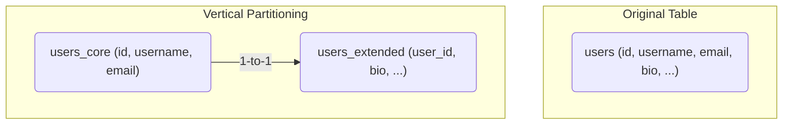
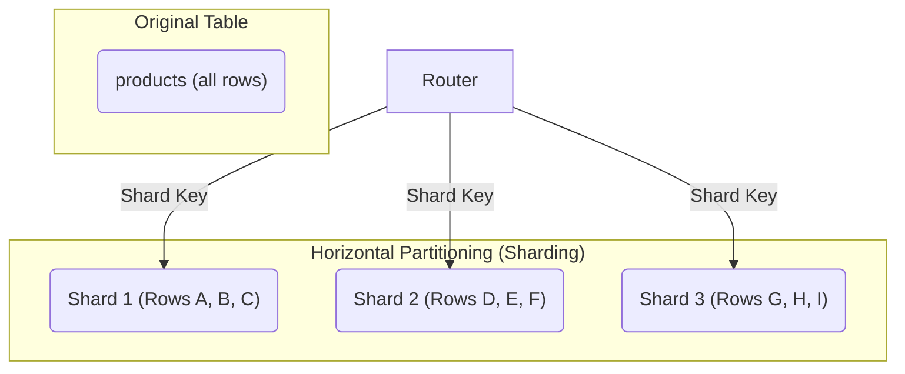

## Introduction: The Limits of a Single Server

As an application grows, its database inevitably becomes a bottleneck. A single server can only handle so much traffic, store so much data, and process so many queries. When you hit these limits, you have two primary options for scaling: scale up (buy a bigger, more powerful server) or scale out (distribute your data across multiple servers).

Scaling out is often the more flexible and cost-effective long-term solution, and it's achieved through **partitioning**. Partitioning is the process of splitting a large database into smaller, more manageable pieces.

There are two main ways to split your data: **horizontal partitioning** and **vertical partitioning**.

## Vertical Partitioning: Splitting by Columns

Vertical partitioning involves dividing a table into multiple smaller tables based on its columns. You group frequently used columns into one table and less frequently used or large-data columns (like `TEXT` or `BLOB` fields) into another.

Imagine a `users` table with many columns:

**Original `users` Table:**
| id | username | email | password_hash | bio | profile_picture | last_login |
|----|----------|-------|---------------|-----|-----------------|------------|

Many queries might only need `id`, `username`, and `email`. The `bio` and `profile_picture` columns might be large and accessed less often.

With vertical partitioning, you could split this into two tables:

**`users_core` Table:**
| id | username | email | password_hash |
|----|----------|-------|---------------|

**`users_extended` Table:**
| user_id | bio | profile_picture | last_login |
|---------|-----|-----------------|------------|

Both tables can be linked by the user's `id`.



### Benefits of Vertical Partitioning

*   **Improved Query Performance:** Queries that only need core data will be faster because they are scanning a much narrower table with more rows per data page.
*   **Efficient Caching:** The smaller, more frequently accessed `users_core` table is more likely to fit in memory.

### Drawbacks of Vertical Partitioning

*   **Increased Complexity:** You now have to manage multiple tables and may need to perform `JOIN`s to retrieve a user's full profile, which can add complexity to your application logic.
*   **Doesn't Solve Write Scalability:** All writes still go to the same database server. It helps with I/O performance but doesn't distribute the write load across multiple machines.

## Horizontal Partitioning (Sharding): Splitting by Rows

Horizontal partitioning, more commonly known as **sharding**, involves dividing a table into multiple smaller tables (shards) based on its rows. Each shard has the same schema as the original table but contains only a subset of the data.

The key to sharding is the **shard key**. This is a column (or set of columns) in the table that determines which shard a particular row belongs to.

Imagine a `products` table with millions of rows.

**Original `products` Table:**
| product_id | name | price | category_id |
|------------|------|-------|-------------|

Using `category_id` as the shard key, you could have:

**Shard 1 (Electronics):**
| product_id | name | price | category_id |
|------------|------|-------|-------------|
| 101 | Laptop | 1200 | 1 |
| 102 | Phone | 800 | 1 |

**Shard 2 (Books):**
| product_id | name | price | category_id |
|------------|------|-------|-------------|
| 201 | The Hobbit | 15 | 2 |
| 202 | Dune | 20 | 2 |

These shards can be placed on separate database servers, distributing the data and the load.



### Benefits of Horizontal Partitioning

*   **True Scalability:** It distributes data, read load, and write load across multiple servers, allowing for near-linear scalability.
*   **Improved Performance:** Queries are faster because they are operating on much smaller datasets.
*   **Increased Availability:** An outage on one shard may not affect other shards.

### Drawbacks of Horizontal Partitioning

*   **Massive Complexity:** Sharding is notoriously difficult to implement correctly. You need a routing layer to direct queries to the correct shard.
*   **Cross-Shard Joins:** Performing `JOIN`s across different shards is very expensive and often not feasible. This requires careful schema design to co-locate data that needs to be joined.
*   **Uneven Load (Hotspots):** If you choose a poor shard key, some shards might get much more traffic than others, creating "hotspots."

## Comparison: Which One to Choose?

| Feature | Vertical Partitioning | Horizontal Partitioning (Sharding) |
| :--- | :--- | :--- |
| **How it splits** | By columns (features) | By rows (data subsets) |
| **Primary Goal** | Improve I/O performance for wide tables | Distribute data and load across servers |
| **Scalability** | Limited (single server) | High (multiple servers) |
| **Complexity** | Medium | Very High |
| **Use Case** | A table with many columns, some of which are large or rarely accessed. | A table with a very large number of rows that needs to be scaled beyond a single server. |

## Go Example: A Shard Router

Let's write a simple Go function that acts as a router for a sharded system, deciding which shard to send a query to based on a shard key.

```go
package main

import (
    "fmt"
    "hash/fnv"
)

type Shard struct {
    ID   int
    Name string
    // In a real app, this would be a database connection
}

func getShard(userID int, shards []*Shard) *Shard {
    // A simple hash-based routing strategy
    h := fnv.New32a()
    h.Write([]byte(fmt.Sprintf("%d", userID)))
    shardIndex := h.Sum32() % uint32(len(shards))

    return shards[shardIndex]
}

func main() {
    // Initialize our shards (database servers)
    shards := []*Shard{
        {ID: 0, Name: "Shard A"},
        {ID: 1, Name: "Shard B"},
        {ID: 2, Name: "Shard C"},
        {ID: 3, Name: "Shard D"},
    }

    userID1 := 123
    shard1 := getShard(userID1, shards)
    fmt.Printf("User %d data is on: %s (ID: %d)\n", userID1, shard1.Name, shard1.ID)

    userID2 := 456
    shard2 := getShard(userID2, shards)
    fmt.Printf("User %d data is on: %s (ID: %d)\n", userID2, shard2.Name, shard2.ID)

    userID3 := 124 // Close to userID1
    shard3 := getShard(userID3, shards)
    fmt.Printf("User %d data is on: %s (ID: %d)\n", userID3, shard3.Name, shard3.ID)
}
```

This example demonstrates the core logic of a sharding router: take a key (`userID`), apply a function (hashing), and map the result to a specific shard.

## Conclusion

Vertical and horizontal partitioning are two different tools for two different jobs.

*   **Vertical partitioning** is a good first step to optimize performance on a single server when you have "wide" tables.
*   **Horizontal partitioning (sharding)** is the solution for when you need to scale beyond the limits of a single server.

Sharding is a powerful but complex technique. Before embarking on a custom sharding implementation, it's worth exploring modern distributed databases (like Vitess, CockroachDB, or Citus) that have sharding built-in, as they can save you from reinventing a very complex wheel.
