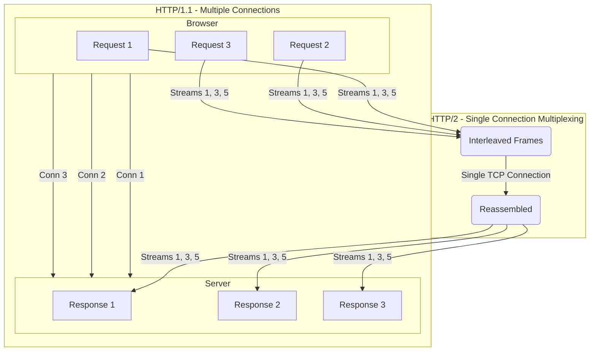
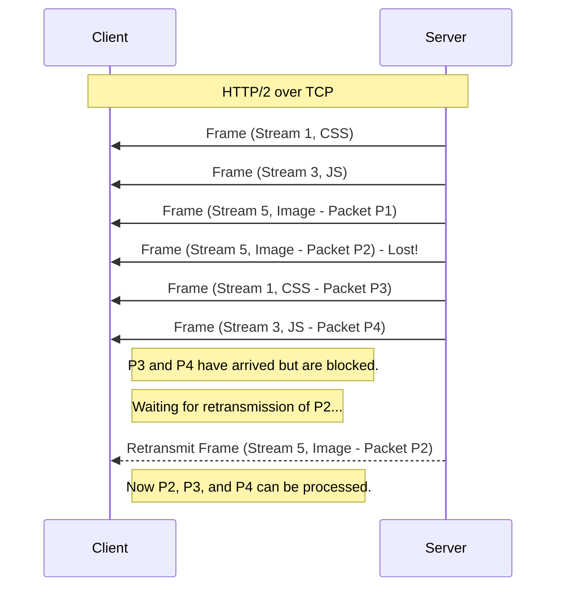
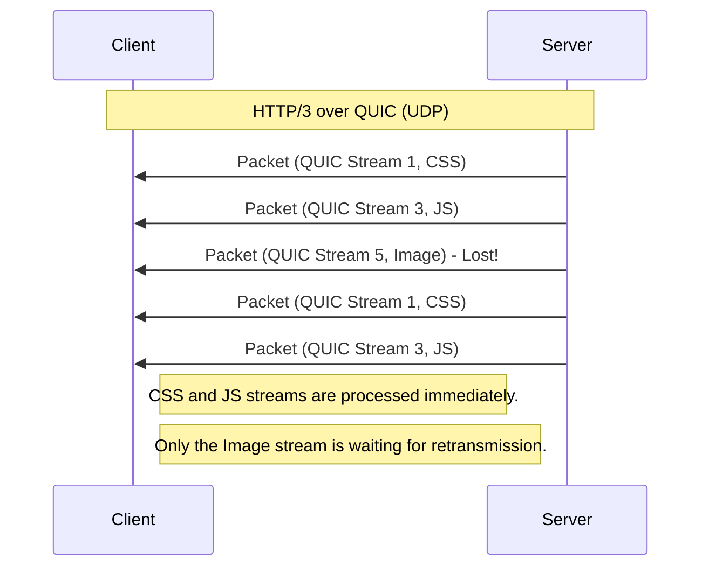

## System Design: A Deep Dive into HTTP/2 vs. HTTP/3

The Hypertext Transfer Protocol (HTTP) is the foundation of the World Wide Web. For decades, HTTP/1.1 served us well, but as web pages grew more complex, its limitations became a major bottleneck. This led to the creation of HTTP/2, which introduced significant performance improvements. However, even HTTP/2 had a fundamental constraint: TCP.

Enter HTTP/3, the latest evolution, which abandons TCP in favor of a new transport protocol called QUIC. This post explores the journey from HTTP/2 to HTTP/3, why the change was necessary, and what it means for the future of web performance.

### A Quick Recap: The Problem with HTTP/1.1

HTTP/1.1 suffered from two main issues:
1.  **Head-of-Line (HOL) Blocking:** A single slow request could block all subsequent requests on the same TCP connection.
2.  **Inefficient Connection Use:** Browsers opened multiple TCP connections (usually 6-8 per domain) to download assets in parallel, adding significant overhead.

### HTTP/2: Multiplexing Over a Single TCP Connection

HTTP/2, standardized in 2015, addressed these issues by introducing **multiplexing**. It allows multiple requests and responses to be sent concurrently over a single TCP connection.

-   **Streams:** Each request/response pair is assigned to its own "stream."
-   **Frames:** Streams are broken down into smaller binary chunks called "frames."
-   **Interleaving:** Frames from different streams are interleaved and sent over the same connection. The receiver then reassembles them.

This solved the HTTP-level HOL blocking. A large image download would no longer block a small CSS file.



### The New Bottleneck: TCP Head-of-Line Blocking

While HTTP/2 solved HOL blocking at the *application layer*, it exposed a deeper problem: **HOL blocking at the transport layer (TCP)**.

TCP guarantees reliable, in-order delivery. If a single TCP packet is lost, all subsequent packets—even if they have arrived successfully and belong to different HTTP/2 streams—must wait in the receiver's buffer until the lost packet is retransmitted and received.

Imagine you are downloading three files (a CSS file, a JS file, and an image) over HTTP/2.
-   The CSS file is in stream 1.
-   The JS file is in stream 3.
-   The image is in stream 5.

A single packet from the image stream gets lost. Now, even though all the packets for the CSS and JS files have arrived, the browser can't process them. The entire TCP connection is stalled, waiting for that one lost packet.



### HTTP/3: Moving to QUIC

HTTP/3's primary innovation is replacing TCP with **QUIC** (Quick UDP Internet Connections), a new transport protocol built on top of UDP.

UDP is a "fire-and-forget" protocol. It doesn't guarantee ordering or delivery, which makes it seem like a strange choice. However, QUIC re-implements the features of TCP (reliability, flow control, congestion control) on top of UDP, but with a crucial difference: **streams are a first-class citizen at the transport layer.**

With QUIC, each stream is handled independently. If a packet from one stream is lost, it only blocks that specific stream. Other streams can continue to deliver their data.



### Key Benefits of HTTP/3 and QUIC

1.  **Eliminates HOL Blocking:** As shown above, packet loss in one stream doesn't affect others. This is a huge win for performance, especially on unreliable networks (like mobile).

2.  **Faster Connection Establishment:**
    -   TCP requires a 3-way handshake (`SYN`, `SYN-ACK`, `ACK`).
    -   To secure it with TLS (for HTTPS), another handshake is needed (TLS 1.2 requires 2 round trips, TLS 1.3 requires 1).
    -   This means 2-3 round trips before the first request can be sent.
    -   QUIC combines the transport and cryptographic handshakes. For a new connection, it takes just **1 round trip**. For a subsequent connection, it can even achieve **0-RTT** (Zero Round-Trip Time) by caching security parameters.

3.  **Connection Migration:** If you switch networks (e.g., from Wi-Fi to cellular), your TCP connection breaks because your IP address changes. You have to re-establish a new connection. QUIC uses a **Connection ID** to identify a connection, independent of the IP address. Your device can switch networks, keep the same Connection ID, and resume the session seamlessly without interruption.

### Go Example: Running an HTTP/3 Server

Go has excellent, built-in support for HTTP/2 and a robust ecosystem for HTTP/3. We'll use the `quic-go` library.

```go
package main

import (
	"fmt"
	"net/http"

	"github.com/quic-go/quic-go/http3"
)

func main() {
	// Define a simple handler
	http.HandleFunc("/", func(w http.ResponseWriter, r *http.Request) {
		fmt.Fprintf(w, "Hello, you've connected using %s!", r.Proto)
	})

	// To run an HTTP/3 server, you need a TLS certificate.
	// For local testing, you can generate a self-signed one:
	// openssl req -newkey rsa:2048 -nodes -keyout server.key -x509 -days 365 -out server.crt

	certFile := "server.crt"
	keyFile := "server.key"

	addr := "localhost:4433"

	fmt.Printf("Starting HTTP/3 server on %s\n", addr)
	fmt.Println("Try connecting with a compatible browser or curl.")
	fmt.Println("Example curl command: curl --http3-only https://localhost:4433 -k")

	// The ListenAndServeTLS function from http3 handles the QUIC server setup.
	err := http3.ListenAndServeTLS(addr, certFile, keyFile, nil)
	if err != nil {
		panic(err)
	}
}
```

**To run this:**
1.  Install the library: `go get github.com/quic-go/quic-go/http3`
2.  Generate a self-signed certificate as described in the code comments.
3.  Run the Go program: `go run .`
4.  Use a modern browser or a recent version of `curl` to test the connection. `curl` needs to be built with HTTP/3 support.

### Summary: HTTP/2 vs. HTTP/3

| Feature                  | HTTP/2                               | HTTP/3                                       |
| ------------------------ | ------------------------------------ | -------------------------------------------- |
| **Transport Protocol**   | TCP                                  | QUIC (over UDP)                              |
| **HOL Blocking**         | Solved at application layer, but **exists at TCP layer**. | **Eliminated** at both application and transport layers. |
| **Connection Handshake** | 2-3 RTTs (TCP + TLS handshake).      | **1 RTT** for new connections, **0-RTT** for resumed. |
| **Connection Migration** | Not supported. Connection breaks on IP change. | **Supported** via Connection ID. Seamless network changes. |
| **Security**             | TLS is optional (but required by browsers). | **TLS 1.3+ is integrated** into QUIC and is mandatory. |

### Conclusion

HTTP/3 is not just an incremental update; it's a fundamental change to the transport layer of the web. By moving from TCP to QUIC, it directly addresses the last major performance bottleneck of HTTP/2, making web communication faster and more resilient, especially in the face of packet loss and network changes. While HTTP/2 brought significant improvements and is still widely used, HTTP/3 represents the clear path forward for a faster, more reliable internet.
---
