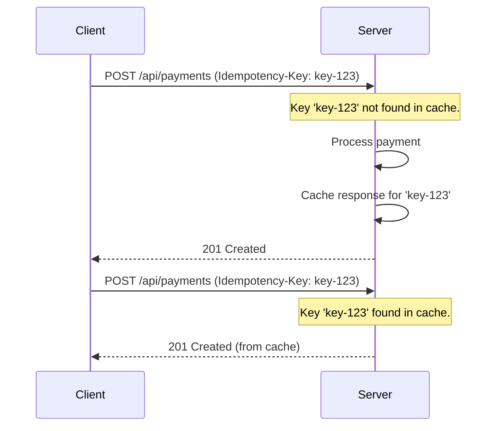

In the world of distributed systems, network failures, timeouts, and client-side retries are not exceptions—they are the norm. When a client sends a request but doesn't receive a timely response, it's forced to ask: "Did my request go through? Should I send it again?" This uncertainty can lead to disastrous consequences, like charging a customer twice or creating duplicate orders. The solution to this problem is **idempotency**.

An idempotent API ensures that making the same request multiple times has the same effect as making it just once. This property is a cornerstone of building robust, predictable, and fault-tolerant systems. In this post, we'll explore what idempotency means, why it's essential, and how to design idempotent APIs with practical Go examples.

### What is Idempotency?

In the context of APIs, an operation is idempotent if it can be called multiple times without changing the result beyond the initial execution. Let's break this down with standard HTTP methods:

- **`GET`, `HEAD`, `OPTIONS`, `TRACE`**: These methods are inherently idempotent because they are defined as read-only. Fetching the same resource 100 times doesn't change the resource itself.
- **`PUT`**: This method is idempotent. If you `PUT` a resource at `/api/users/123` with the same payload multiple times, the end state of the resource will be the same. The first request creates or updates it, and subsequent requests will just overwrite it with the same data.
- **`DELETE`**: This method is also idempotent. The first `DELETE` request to `/api/users/123` will delete the user. Subsequent requests will result in a `404 Not Found`, but the state of the system (the user is gone) remains unchanged.
- **`POST`**: This method is **not** idempotent by default. Sending a `POST` request to `/api/orders` twice will typically create two separate orders.
- **`PATCH`**: This method is generally **not** idempotent. A request like `PATCH /api/accounts/123` with a body of `{"action": "deposit", "amount": 100}` would add 100 to the balance with each call.

The real challenge lies in making non-idempotent operations like `POST` and `PATCH` behave idempotently.

### Why is Idempotency Crucial?

1.  **Fault Tolerance**: Clients can safely retry requests upon network errors or timeouts without causing unintended side effects.
2.  **Data Consistency**: It prevents the creation of duplicate records or inconsistent state, which is critical for financial transactions, order processing, and other sensitive operations.
3.  **Simplified Client Logic**: Clients don't need complex logic to handle failures. The rule is simple: if you don't get a success response, just retry.
4.  **Predictable System Behavior**: It makes your system more predictable and easier to reason about, especially in complex, asynchronous workflows.

### Implementing Idempotency: The Idempotency-Key

The most common and robust pattern for achieving idempotency is using an **Idempotency-Key**. The client generates a unique key (e.g., a UUID) for each operation and sends it in the request header, typically `Idempotency-Key`.

The server then uses this key to ensure that the operation is performed only once.

Here’s the typical workflow:

1.  **Client Generates Key**: The client generates a unique `Idempotency-Key` before sending the first request.
2.  **Server Checks Key**: Upon receiving a request, the server checks if it has already processed a request with this key.
    *   **New Key**: If the key is new, the server stores the key, processes the request, and caches the resulting HTTP response (status code and body).
    *   **Existing Key**: If the key has been seen before, the server immediately returns the cached response without re-processing the request.

This ensures that even if the client retries the request, the operation is executed only once.

#### Visualizing the Flow

Here is a Mermaid diagram illustrating the idempotent request flow.



### Practical Implementation in Go

Let's build a simple Go application using an in-memory store to demonstrate this pattern. In a real-world application, you would use a persistent, distributed cache like Redis or a database table.

First, let's define a simple request cache.

```go
package main

import (
	"bytes"
	"encoding/json"
	"fmt"
	"net/http"
	"sync"
	"time"

	"github.com/google/uuid"
)

// CachedResponse stores the response body and status code.
type CachedResponse struct {
	StatusCode int
	Body       []byte
}

// IdempotencyStore holds the cached responses.
type IdempotencyStore struct {
	requests map[string]CachedResponse
	mu       sync.Mutex
}

func NewIdempotencyStore() *IdempotencyStore {
	return &IdempotencyStore{
		requests: make(map[string]CachedResponse),
	}
}

// Get checks if a key exists and returns the cached response.
func (s *IdempotencyStore) Get(key string) (CachedResponse, bool) {
	s.mu.Lock()
	defer s.mu.Unlock()
	resp, found := s.requests[key]
	return resp, found
}

// Set stores a response for a given key.
func (s *IdempotencyStore) Set(key string, resp CachedResponse) {
	s.mu.Lock()
	defer s.mu.Unlock()
	s.requests[key] = resp
}
```

Now, let's create an HTTP middleware to handle the idempotency logic.

```go
// IdempotencyMiddleware checks for the Idempotency-Key and handles request processing.
func IdempotencyMiddleware(store *IdempotencyStore) func(http.Handler) http.Handler {
	return func(next http.Handler) http.Handler {
		return http.HandlerFunc(func(w http.ResponseWriter, r *http.Request) {
			idempotencyKey := r.Header.Get("Idempotency-Key")
			if idempotencyKey == "" {
				// No key, process as normal
				next.ServeHTTP(w, r)
				return
			}

			// Check if we've seen this key before
			if cachedResp, found := store.Get(idempotencyKey); found {
				// Return the cached response
				for key, values := range w.Header() {
					for _, value := range values {
						w.Header().Add(key, value)
					}
				}
				w.WriteHeader(cachedResp.StatusCode)
				w.Write(cachedResp.Body)
				fmt.Println("Returning cached response for key:", idempotencyKey)
				return
			}

			// Record the response
			recorder := &responseRecorder{ResponseWriter: w, body: &bytes.Buffer{}}
			next.ServeHTTP(recorder, r)

			// Cache the response
			responseToCache := CachedResponse{
				StatusCode: recorder.statusCode,
				Body:       recorder.body.Bytes(),
			}
			store.Set(idempotencyKey, responseToCache)
			fmt.Println("Cached new response for key:", idempotencyKey)
		})
	}
}

// responseRecorder helps capture the status code and body.
type responseRecorder struct {
	http.ResponseWriter
	statusCode int
	body       *bytes.Buffer
}

func (rec *responseRecorder) WriteHeader(statusCode int) {
	rec.statusCode = statusCode
	rec.ResponseWriter.WriteHeader(statusCode)
}

func (rec *responseRecorder) Write(b []byte) (int, error) {
	rec.body.Write(b)
	return rec.ResponseWriter.Write(b)
}
```

Finally, let's tie it all together in our `main` function.

```go
type PaymentRequest struct {
	Amount  float64 `json:"amount"`
	OrderID string  `json:"order_id"`
}

func paymentHandler(w http.ResponseWriter, r *http.Request) {
	var req PaymentRequest
	if err := json.NewDecoder(r.Body).Decode(&req); err != nil {
		http.Error(w, "Invalid request body", http.StatusBadRequest)
		return
	}

	// Simulate processing the payment
	fmt.Printf("Processing payment of %.2f for order %s\n", req.Amount, req.OrderID)
	time.Sleep(1 * time.Second) // Simulate work

	response := map[string]string{"status": "success", "transaction_id": uuid.New().String()}
	w.Header().Set("Content-Type", "application/json")
	w.WriteHeader(http.StatusCreated)
	json.NewEncoder(w).Encode(response)
}

func main() {
	store := NewIdempotencyStore()
	mux := http.NewServeMux()
	
	finalHandler := http.HandlerFunc(paymentHandler)
	mux.Handle("/api/payments", IdempotencyMiddleware(store)(finalHandler))

	fmt.Println("Server starting on port 8080...")
	if err := http.ListenAndServe(":8080", mux); err != nil {
		fmt.Println("Server failed to start:", err)
	}
}
```

To run this, you can use `curl`:

1.  **First Request**:
    ```bash
    curl -X POST http://localhost:8080/api/payments \
    -H "Content-Type: application/json" \
    -H "Idempotency-Key: $(uuidgen)" \
    -d '{"amount": 100.50, "order_id": "order-abc-123"}'
    ```
    The server will print "Processing payment..." and "Cached new response...".

2.  **Retry Request (with the same key)**:
    ```bash
    # Make sure to use the SAME UUID from the first request
    curl -X POST http://localhost:8080/api/payments \
    -H "Content-Type: application/json" \
    -H "Idempotency-Key: <PASTE-THE-SAME-UUID-HERE>" \
    -d '{"amount": 100.50, "order_id": "order-abc-123"}'
    ```
    The server will immediately return the cached response without printing "Processing payment...".

### Best Practices and Considerations

-   **Key Generation**: The client is responsible for generating a sufficiently unique key. UUIDs are a great choice.
-   **Key Expiration**: Idempotency keys should not be stored forever. A TTL (Time-To-Live) of 24 hours is a common practice to purge old keys.
-   **Storage Layer**: For production systems, use a distributed and persistent storage layer like Redis or a database. This ensures that the key is available across all server instances.
-   **Request Fingerprinting**: If you cannot trust the client to generate a key, you can create a "fingerprint" of the request on the server by hashing the request body and other relevant parameters. However, this is less reliable as minor variations in the request (like whitespace) can change the hash.

### Conclusion

Idempotency is not just a theoretical concept; it's a practical necessity for building resilient distributed systems. By implementing patterns like the `Idempotency-Key` header, you can provide strong guarantees that protect your system from the unavoidable failures of a networked environment. This allows clients to retry operations safely, preventing duplicate data and ensuring a consistent state, which ultimately leads to a more reliable and robust application.
