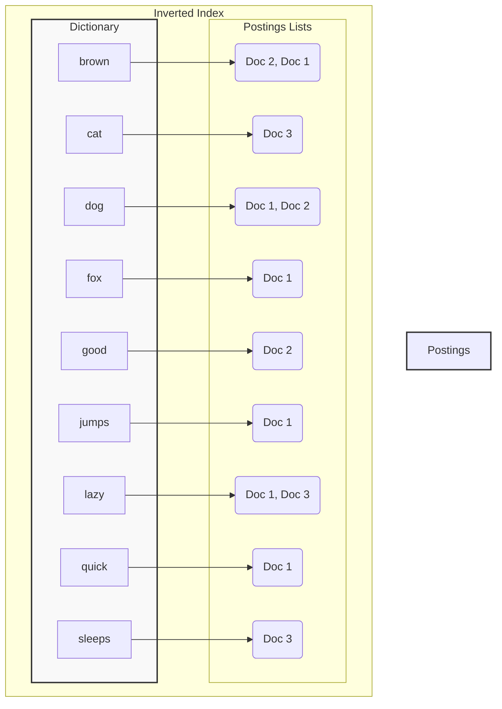

## System Design: Inverted Index Design for High-Performance Search

In our previous post, we explored the fundamentals of [Full-Text Search Implementation](/blog/system-design/system-design-full-text-search-implementation). We learned that to efficiently search through large volumes of text, we need more than simple string matching. The cornerstone of any high-performance full-text search engine is a data structure called the **Inverted Index**.

This post will take a deep dive into what an inverted index is, how it's built, and why it's so incredibly efficient for text search. We'll illustrate the concept with diagrams and a practical Go implementation.

### What is an Inverted Index?

An inverted index is a data structure that maps content, such as words or numbers, to its locations in a document or a set of documents. Instead of listing documents and the words they contain (a forward index), it lists words and the documents they appear in.

Think of the index at the back of a book. If you want to find where the term "database" is mentioned, you don't scan every page. Instead, you look up "database" in the index, which gives you a list of page numbers (e.g., 23, 45, 112). An inverted index does the same thing for documents.

It consists of two main parts:
1.  **Dictionary (or Vocabulary):** A unique, sorted list of all terms (words) in the document collection.
2.  **Postings List:** For each term in the dictionary, there is a list of documents that contain the term. This list often includes additional information, like the position of the term within the document or its frequency.

### How an Inverted Index Works

Let's visualize this with a simple example. Suppose we have the following three documents:

*   **Doc 1:** "The quick brown fox jumps over the lazy dog."
*   **Doc 2:** "A brown dog is a good dog."
*   **Doc 3:** "The lazy cat sleeps."

After text analysis (tokenization, lowercasing, stop-word removal), we get the following terms:

*   **Doc 1:** `[quick, brown, fox, jumps, lazy, dog]`
*   **Doc 2:** `[brown, dog, good, dog]`
*   **Doc 3:** `[lazy, cat, sleeps]`

Now, let's build the inverted index.



**How Search Works with the Index:**

When a user searches for a query like `"brown dog"`, the search engine performs these steps:
1.  **Analyze the Query:** The query is processed using the same text analysis pipeline, resulting in the tokens `[brown, dog]`.
2.  **Look Up Terms:** It looks up `brown` and `dog` in the dictionary.
3.  **Retrieve Postings Lists:**
    *   `brown` -> `[Doc 1, Doc 2]`
    *   `dog` -> `[Doc 1, Doc 2]`
4.  **Intersect the Lists:** It finds the common documents in both lists. The intersection of `[Doc 1, Doc 2]` and `[Doc 1, Doc 2]` is `[Doc 1, Doc 2]`.
5.  **Return Results:** The engine returns Doc 1 and Doc 2 as the results.

This process is lightning-fast because it avoids scanning documents that don't contain the search terms. The primary operations are dictionary lookups (which are fast on sorted data) and set intersections on postings lists.

### Building an Inverted Index in Go

Let's implement a simple inverted index in Go. We'll create a structure that holds our dictionary and postings lists. For simplicity, our text analysis will just be lowercasing and splitting by spaces.

```go
package main

import (
	"fmt"
	"regexp"
	"strings"
)

// Document represents a text document with a unique ID.
type Document struct {
	ID   int
	Text string
}

// InvertedIndex holds the mapping from terms to document IDs.
type InvertedIndex struct {
	index map[string][]int
}

// NewInvertedIndex creates a new, empty inverted index.
func NewInvertedIndex() *InvertedIndex {
	return &InvertedIndex{
		index: make(map[string][]int),
	}
}

// wordRegex is used to split text into words.
var wordRegex = regexp.MustCompile(`\w+`)

// Add indexes a single document.
func (idx *InvertedIndex) Add(doc Document) {
	tokens := wordRegex.FindAllString(strings.ToLower(doc.Text), -1)
	
	// Use a map to ensure each doc ID is added only once per term.
	termDocIDs := make(map[string]bool)

	for _, token := range tokens {
		termDocIDs[token] = true
	}

	for term := range termDocIDs {
		idx.index[term] = append(idx.index[term], doc.ID)
	}
}

// Search finds documents that contain all the terms in the query.
func (idx *InvertedIndex) Search(query string) []int {
	tokens := wordRegex.FindAllString(strings.ToLower(query), -1)
	if len(tokens) == 0 {
		return []int{}
	}

	// Start with the postings list of the first term.
	result := idx.index[tokens[0]]
	if result == nil {
		return []int{}
	}

	// Intersect with the remaining terms' postings lists.
	for i := 1; i < len(tokens); i++ {
		postings := idx.index[tokens[i]]
		if postings == nil {
			return []int{} // A term is not in any document.
		}
		result = intersect(result, postings)
	}

	return result
}

// intersect finds the common integers in two sorted slices.
func intersect(a, b []int) []int {
	var result []int
	i, j := 0, 0
	for i < len(a) && j < len(b) {
		if a[i] < b[j] {
			i++
		} else if b[j] < a[i] {
			j++
		} else {
			result = append(result, a[i])
			i++
			j++
		}
	}
	return result
}

func main() {
	// 1. Define our document collection.
	docs := []Document{
		{ID: 1, Text: "The quick brown fox jumps over the lazy dog."},
		{ID: 2, Text: "A brown dog is a good dog."},
		{ID: 3, Text: "The lazy cat sleeps."},
	}

	// 2. Create and build the inverted index.
	idx := NewInvertedIndex()
	for _, doc := range docs {
		idx.Add(doc)
	}

	// 3. Print the index to see its structure.
	fmt.Println("--- Inverted Index ---")
	for term, postings := range idx.index {
		fmt.Printf("%-10s -> %v\n", term, postings)
	}
	fmt.Println("----------------------")

	// 4. Perform a search.
	query := "brown dog"
	results := idx.Search(query)
	fmt.Printf("\nSearch results for '%s': %v\n", query, results) // Expected: [1 2] or [2 1]

	query2 := "lazy cat"
	results2 := idx.Search(query2)
	fmt.Printf("Search results for '%s': %v\n", query2, results2) // Expected: [3]
	
	query3 := "quick cat"
	results3 := idx.Search(query3)
	fmt.Printf("Search results for '%s': %v\n", query3, results3) // Expected: []
}
```

### Key Design Considerations

1.  **Updating the Index:** Our example builds a static index. In real-world systems, documents are constantly added, updated, or deleted. Search engines use techniques like index segmentation (creating smaller, new indexes and merging them later) to handle updates efficiently without locking the entire index.

2.  **Postings List Compression:** Postings lists can become very large for common terms. To save space and improve I/O, these lists are often compressed using techniques like delta encoding (storing the difference between consecutive document IDs) and variable-byte encoding.

3.  **Distributed Indexing:** For web-scale collections, a single machine cannot hold the entire index. The index is partitioned (or sharded) across multiple machines. A common strategy is to shard by term, where different ranges of the dictionary reside on different nodes.

    ```mermaid
    graph TD
        subgraph User
            U[User Query: "quick brown"]
        end

        subgraph Coordinator Node
            C["Coordinator"]
            C -- "quick" --> ShardA
            C -- "brown" --> ShardB
        end

        subgraph Shard A (Terms a-m)
            ShardA["Node A"]
            IndexA["Index (a-m)"]
            ShardA --> IndexA
            IndexA -- "quick -> [1, 5, 19]" --> C
        end

        subgraph Shard B (Terms n-z)
            ShardB["Node B"]
            IndexB["Index (n-z)"]
            ShardB --> IndexB
            IndexB -- "brown -> [1, 8, 22]" --> C
        end
        
        C -- "Intersect [1,5,19] & [1,8,22]" --> FinalResult("[Doc 1]")

        U --> C
    ```

4.  **Positional Information:** For phrase queries (e.g., `"lazy dog"`), knowing that the terms appear in the documents is not enough; we need to know if they appear next to each other. A **positional index** extends the postings list to store the position(s) of each term within the document.
    *   `lazy` -> `[Doc 1: (pos 7), Doc 3: (pos 2)]`
    *   `dog` -> `[Doc 1: (pos 8), Doc 2: (pos 3, 6)]`
    To match `"lazy dog"`, the engine would find documents where `dog` appears at a position immediately following `lazy`.

### Conclusion

The inverted index is a simple yet powerful concept that forms the backbone of modern search. By mapping terms to documents, it transforms an expensive scanning problem into a series of fast lookups and set operations. While our Go example is basic, it demonstrates the core logic. Real-world search systems like Elasticsearch and Lucene build upon this foundation with advanced features for distribution, compression, relevance scoring, and real-time updates.

In our next post, we will explore **Search Relevance Scoring**, looking at how search engines rank the documents they find to ensure the most relevant ones appear first.
---
