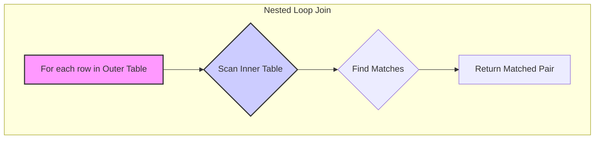
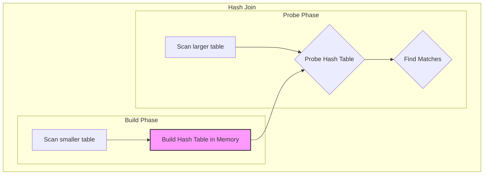
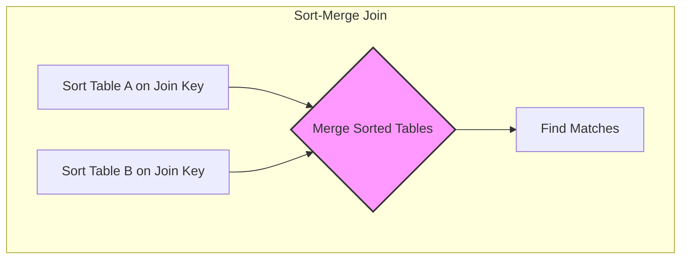

## Introduction: The Heart of Relational Databases

The `JOIN` clause is arguably the most powerful feature of SQL. It's what allows us to combine data from multiple related tables, forming the backbone of relational data modeling. But this power comes at a cost. A poorly optimized `JOIN` can be one of the most expensive operations a database performs, capable of bringing a system to its knees.

Understanding how databases execute joins is crucial for any developer who wants to write high-performance queries. The database query optimizer works behind the scenes to choose the most efficient method, but its choices are guided by the query's structure, available indexes, and table statistics.

This article explores the three fundamental join algorithms: the Nested Loop Join, the Hash Join, and the Sort-Merge Join.

## 1. The Nested Loop Join (NLJ)

This is the simplest and most basic join algorithm. It works just like nested `for` loops in a programming language.

1.  It iterates through every row in the first (outer) table.
2.  For each row from the outer table, it scans the entire second (inner) table to find matching rows.



**When it's good:**
The Nested Loop Join is efficient when the outer table is very small and there is a fast way to look up rows in the inner table—specifically, **when the inner table has an index on the join key**. In this "Indexed Nested Loop Join" variant, instead of scanning the whole inner table, the database does a quick index lookup, which is dramatically faster.

**When it's bad:**
Without an index, the performance is terrible. The total cost is `O(OuterRows * InnerRows)`. For two tables with 10,000 rows each, this is 100 million operations.

## 2. The Hash Join

The Hash Join is a much more sophisticated and often more efficient algorithm for joining large tables, especially when no suitable indexes exist. It works in two phases:

1.  **Build Phase:** The optimizer chooses the smaller of the two tables and builds an in-memory **hash table** from it, using the join key as the hash key.
2.  **Probe Phase:** It then scans the larger (second) table. For each row, it hashes the join key and looks it up in the hash table created in the build phase. If it finds a match, it returns the joined row.



**When it's good:**
Hash Joins are excellent for joining large tables on equality conditions (`tableA.id = tableB.id`) when there are no indexes on the join keys. They are highly efficient as long as the hash table for the smaller table fits into memory.

**When it's bad:**
*   It only works for **equi-joins** (using the `=` operator). It can't be used for range joins (`>`,`<`).
*   If the hash table is too large to fit in memory, the database has to spill it to disk, which significantly degrades performance.

## 3. The Sort-Merge Join (or Merge Join)

The Merge Join is another efficient algorithm for large tables, but it has a prerequisite: both tables must be sorted on the join key.

1.  **Sort Phase:** If the tables are not already sorted (e.g., by reading from an index), the database sorts them both on the join key.
2.  **Merge Phase:** The database then iterates through both sorted tables simultaneously, much like merging two sorted lists. It compares the keys at the current position in each table.
    *   If the keys match, it returns the joined row and advances the pointer in one of the tables.
    *   If the keys don't match, it advances the pointer in the table with the smaller key.



**When it's good:**
*   When one or both tables are already sorted on the join key (perhaps by reading from a B-Tree index).
*   It's very effective for range joins or other non-equi-joins.
*   It's more memory-efficient than a Hash Join if the tables are very large.

**When it's bad:**
The initial sort phase can be very expensive if the tables are large and not already sorted.

## Go Example: Simulating an Optimizer's Choice

A real query optimizer uses complex statistics about table sizes, data distribution (histograms), and available memory to choose a join strategy. We can simulate a simplified version of this logic.

```go
package main

import "fmt"

// TableStats holds simplified statistics for a database table.
type TableStats struct {
	Name          string
	RowCount      int
	HasIndexOnKey bool
}

// JoinStrategy represents a chosen join algorithm.
type JoinStrategy string

const (
	NestedLoopJoin JoinStrategy = "Indexed Nested Loop Join"
	HashJoin       JoinStrategy = "Hash Join"
	MergeJoin      JoinStrategy = "Sort-Merge Join"
)

// QueryOptimizer simulates choosing a join strategy.
type QueryOptimizer struct{}

// ChooseJoinStrategy selects the best join algorithm based on simple heuristics.
func (o *QueryOptimizer) ChooseJoinStrategy(tableA, tableB TableStats) JoinStrategy {
	// Heuristic 1: If one table is small and the other has an index, use Indexed NLJ.
	// (Assuming the indexed table is the 'inner' table).
	if tableA.RowCount < 1000 && tableB.HasIndexOnKey {
		fmt.Println("Reason: Outer table is small and inner table has an index.")
		return NestedLoopJoin
	}
	if tableB.RowCount < 1000 && tableA.HasIndexOnKey {
		fmt.Println("Reason: Outer table is small and inner table has an index.")
		return NestedLoopJoin
	}

	// Heuristic 2: If tables are large and no good indexes, Hash Join is usually best.
	// This assumes the smaller table fits in memory.
	if tableA.RowCount > 10000 && tableB.RowCount > 10000 {
		fmt.Println("Reason: Both tables are large, Hash Join is efficient for equi-joins.")
		return HashJoin
	}

	// Heuristic 3: Default to Merge Join if data is already sorted or for non-equi-joins.
	// We'll make it a fallback here.
	fmt.Println("Reason: Fallback or pre-sorted data. Using Sort-Merge.")
	return MergeJoin
}

func main() {
	optimizer := &QueryOptimizer{}

	// Scenario 1: Small 'orders' table, large 'users' table with an index.
	fmt.Println("--- Scenario 1: Small outer table, indexed inner table ---")
	orders := TableStats{Name: "orders", RowCount: 500, HasIndexOnKey: false}
	users := TableStats{Name: "users", RowCount: 1000000, HasIndexOnKey: true}
	strategy1 := optimizer.ChooseJoinStrategy(orders, users)
	fmt.Printf("Chosen Strategy: %s\n\n", strategy1)

	// Scenario 2: Two large tables, no indexes.
	fmt.Println("--- Scenario 2: Two large tables, no indexes ---")
	events := TableStats{Name: "events", RowCount: 5000000, HasIndexOnKey: false}
	logs := TableStats{Name: "logs", RowCount: 10000000, HasIndexOnKey: false}
	strategy2 := optimizer.ChooseJoinStrategy(events, logs)
	fmt.Printf("Chosen Strategy: %s\n\n", strategy2)
	
	// Scenario 3: A different case, maybe medium tables.
	fmt.Println("--- Scenario 3: Medium tables ---")
	products := TableStats{Name: "products", RowCount: 5000, HasIndexOnKey: false}
	reviews := TableStats{Name: "reviews", RowCount: 20000, HasIndexOnKey: false}
	strategy3 := optimizer.ChooseJoinStrategy(products, reviews)
	fmt.Printf("Chosen Strategy: %s\n\n", strategy3)
}
```

## Join Order Optimization

When you join three or more tables (`A JOIN B JOIN C`), the optimizer also has to decide the **order** in which to join them. Should it join `A` to `B` first, and then join the result to `C`? Or should it join `B` to `C` first, and then join `A` to the result?

The number of possible join orders grows factorially, so for complex queries, the optimizer uses heuristics to find a "good enough" plan quickly. A key strategy is to **join small to large**. If a join between two tables produces a very small result set, it's usually best to do that join first.

## Conclusion

While you don't control the join algorithm directly, you can heavily influence it:

*   **Create Indexes:** The single most effective way to get the optimizer to choose a fast Indexed Nested Loop Join is to create an index on your join keys (especially foreign keys).
*   **Keep Statistics Updated:** Ensure your database has up-to-date statistics on your tables (`ANALYZE` or `UPDATE STATISTICS`). The optimizer is blind without this data.
*   **Use `EXPLAIN`:** Use the `EXPLAIN` command to see which join algorithm the optimizer chose and why. If you see a slow Nested Loop Join on a large table without an index, you've found your problem.

By understanding these fundamental algorithms, you can write queries that work *with* the optimizer, not against it, leading to faster, more scalable applications.
