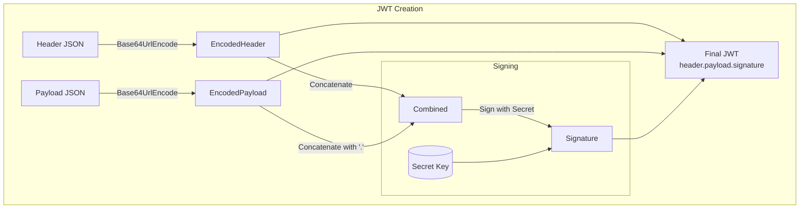

## System Design: Secure JWT Token Management

In our last post on [OAuth 2.0](/blog/system-design/system-design-oauth-2-flow-deep-dive), we saw how a client obtains an access token to make authorized API requests. But what exactly *is* this token? In many modern systems, it's a **JSON Web Token (JWT)**.

A JWT is a compact, URL-safe means of representing claims to be transferred between two parties. It's a self-contained token that can be used for authentication and information exchange. Because it can be digitally signed, the information within it can be verified and trusted. This post dives deep into the structure of JWTs, how to manage them securely, and best practices for their use.

### The Structure of a JWT

A JWT consists of three parts separated by dots (`.`):
`xxxxx.yyyyy.zzzzz`

1.  **Header:** The type of token and the signing algorithm used.
2.  **Payload:** The claims or data being transferred.
3.  **Signature:** A cryptographic signature to verify the token's integrity.

Let's break each part down.

#### 1. Header

The header is a JSON object that typically consists of two parts:
-   `typ`: The type of the token, which is `JWT`.
-   `alg`: The signing algorithm being used, such as `HS256` (HMAC with SHA-256) or `RS256` (RSA with SHA-256).

**Example Header:**
```json
{
  "alg": "HS256",
  "typ": "JWT"
}
```
This JSON is then Base64Url encoded to form the first part of the JWT.

#### 2. Payload

The payload contains the **claims**. Claims are statements about an entity (typically, the user) and additional data. There are three types of claims:

-   **Registered Claims:** A set of predefined claims which are not mandatory but recommended. These include:
    -   `iss` (Issuer): Who issued the token.
    -   `sub` (Subject): Who the token is about (e.g., the user's ID).
    -   `aud` (Audience): Who the token is intended for.
    -   `exp` (Expiration Time): The timestamp after which the token is invalid. **This is critical for security.**
    -   `nbf` (Not Before): The timestamp before which the token must not be accepted.
    -   `iat` (Issued At): The timestamp when the token was issued.
    -   `jti` (JWT ID): A unique identifier for the token, used to prevent replays.

-   **Public Claims:** These can be defined at will by those using JWTs. To avoid collisions, they should be defined in the IANA JSON Web Token Registry or be specified as a URI.

-   **Private Claims:** Custom claims created to share information between parties that agree on using them.

**Example Payload:**
```json
{
  "sub": "1234567890",
  "name": "John Doe",
  "admin": true,
  "iat": 1516239022,
  "exp": 1516242622
}
```
Like the header, the payload JSON is Base64Url encoded to form the second part of the JWT.

**Important:** The header and payload are just encoded, not encrypted. Anyone can decode them and see their contents. Therefore, **you must never put sensitive information in the payload of a JWT.**

#### 3. Signature

The signature is used to verify that the sender of the JWT is who it says it is and to ensure that the message wasn't changed along the way.

To create the signature, you take:
1.  The encoded header
2.  The encoded payload
3.  A secret key
4.  The algorithm specified in the header

And sign them. For example, if you are using `HS256`, the signature is created like this:
`HMACSHA256(base64UrlEncode(header) + "." + base64UrlEncode(payload), secret)`

This signature forms the third part of the JWT.



### The JWT Authentication Flow

1.  **Login:** The user sends their credentials (e.g., username/password) to the authentication server.
2.  **Token Generation:** The server verifies the credentials, creates a JWT containing user claims (like user ID and roles), and signs it with a secret key.
3.  **Token Storage:** The server sends the JWT back to the client. The client stores it locally (e.g., in memory, `localStorage`, or a cookie).
4.  **Authenticated Requests:** For every subsequent request to a protected API endpoint, the client includes the JWT in the `Authorization` header using the `Bearer` schema: `Authorization: Bearer <token>`.
5.  **Token Validation:** The API server receives the request, extracts the token, and validates the signature using its secret key. It also checks the claims (e.g., that the token has not expired). If the token is valid, the server processes the request.

### Security Best Practices for JWTs

#### 1. Always Use a Strong Secret and Algorithm
-   Don't use weak, guessable secrets. Use a long, randomly generated string.
-   **HS256 (Symmetric):** Uses one secret key for both signing and verifying. It's faster but means any service that can verify a token can also create one.
-   **RS256 (Asymmetric):** Uses a private key to sign and a public key to verify. This is more secure. The authentication server holds the private key, while resource servers only need the public key to validate tokens. This prevents other services from being able to issue new tokens.

#### 2. Set a Short Expiration Time (`exp`)
Access tokens should be short-lived (e.g., 15 minutes). This minimizes the damage if a token is stolen, as it will quickly become invalid.

#### 3. Use Refresh Tokens
Since access tokens expire quickly, we need a way to get a new one without forcing the user to log in again. This is the job of a **refresh token**.

-   **Refresh Token:** A long-lived token that is stored securely by the client.
-   **Flow:**
    1.  When the access token expires, the client sends its refresh token to a special `/refresh` endpoint on the auth server.
    2.  The auth server validates the refresh token (checking it against a database to ensure it hasn't been revoked).
    3.  If valid, it issues a new, short-lived access token.

This pattern keeps the user session alive while maintaining the security of short-lived access tokens.

#### 4. Don't Store Tokens in `localStorage`
Storing JWTs in `localStorage` or `sessionStorage` makes them vulnerable to Cross-Site Scripting (XSS) attacks. If an attacker can inject JavaScript onto your page, they can steal the token. A more secure approach is to store the token in an `HttpOnly` cookie, which cannot be accessed by JavaScript.

### Go Example: Creating and Validating JWTs

Let's use the popular `github.com/golang-jwt/jwt/v4` package to manage JWTs in Go.

```go
package main

import (
	"fmt"
	"net/http"
	"time"

	"github.com/golang-jwt/jwt/v4"
)

// Use a strong, randomly generated secret in a real application.
var jwtKey = []byte("my_super_secret_key")

type Claims struct {
	UserID string `json:"userId"`
	jwt.RegisteredClaims
}

// --- Token Creation ---
func createTokenHandler(w http.ResponseWriter, r *http.Request) {
	// For simplicity, we'll assume the user is authenticated.
	userID := "user123"

	// Set expiration time (e.g., 15 minutes).
	expirationTime := time.Now().Add(15 * time.Minute)

	claims := &Claims{
		UserID: userID,
		RegisteredClaims: jwt.RegisteredClaims{
			ExpiresAt: jwt.NewNumericDate(expirationTime),
			Issuer:    "my-auth-server",
		},
	}

	token := jwt.NewWithClaims(jwt.SigningMethodHS256, claims)
	tokenString, err := token.SignedString(jwtKey)
	if err != nil {
		w.WriteHeader(http.StatusInternalServerError)
		return
	}

	fmt.Fprint(w, tokenString)
}

// --- Token Validation (as middleware) ---
func authMiddleware(next http.Handler) http.Handler {
	return http.HandlerFunc(func(w http.ResponseWriter, r *http.Request) {
		authHeader := r.Header.Get("Authorization")
		if authHeader == "" {
			http.Error(w, "Authorization header required", http.StatusUnauthorized)
			return
		}

		tokenString := authHeader[len("Bearer "):]
		claims := &Claims{}

		token, err := jwt.ParseWithClaims(tokenString, claims, func(token *jwt.Token) (interface{}, error) {
			return jwtKey, nil
		})

		if err != nil {
			if err == jwt.ErrSignatureInvalid {
				http.Error(w, "Invalid signature", http.StatusUnauthorized)
				return
			}
			http.Error(w, "Bad token", http.StatusBadRequest)
			return
		}

		if !token.Valid {
			http.Error(w, "Invalid token", http.StatusUnauthorized)
			return
		}

		// Token is valid. We can add the user ID to the request context if needed.
		// ctx := context.WithValue(r.Context(), "userID", claims.UserID)
		// next.ServeHTTP(w, r.WithContext(ctx))
		
		fmt.Fprintf(w, "Welcome, user %s!", claims.UserID)
	})
}

func protectedHandler(w http.ResponseWriter, r *http.Request) {
    // This handler is now protected by the middleware.
}

func main() {
	http.HandleFunc("/login", createTokenHandler)
	http.Handle("/protected", authMiddleware(http.HandlerFunc(protectedHandler)))

	fmt.Println("Server starting on port 8080...")
	http.ListenAndServe(":8080", nil)
}
```

### Conclusion

JWTs are a powerful tool for creating stateless, scalable authentication and authorization systems. Their self-contained nature means a resource server can validate a token without needing to call back to an authorization server, which is great for performance in a microservices architecture. However, this power comes with responsibility. Securely managing JWTs requires a solid understanding of their structure and adherence to best practices, including using strong secrets, short token lifetimes, refresh tokens, and secure storage.

Next, we'll explore **API Key Management**, another common mechanism for securing access to APIs, often used for machine-to-machine communication.
---
