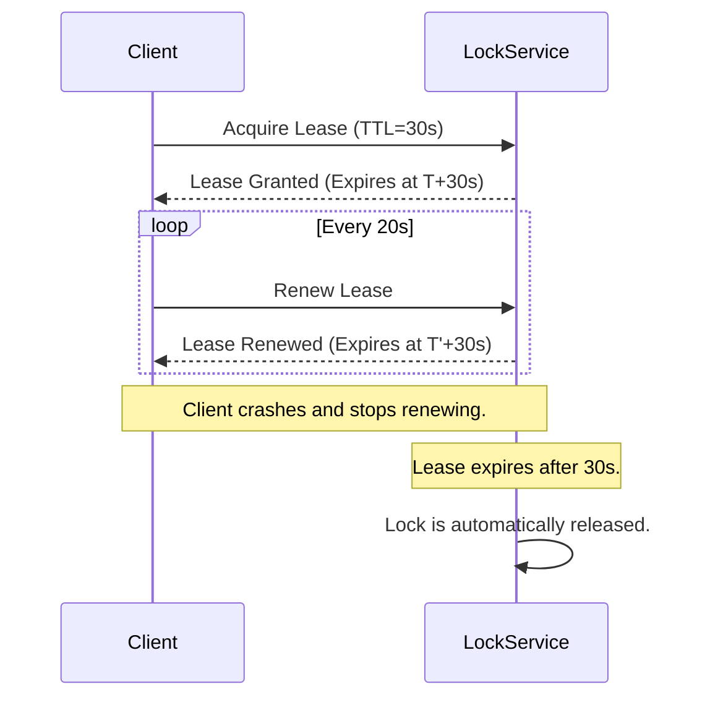
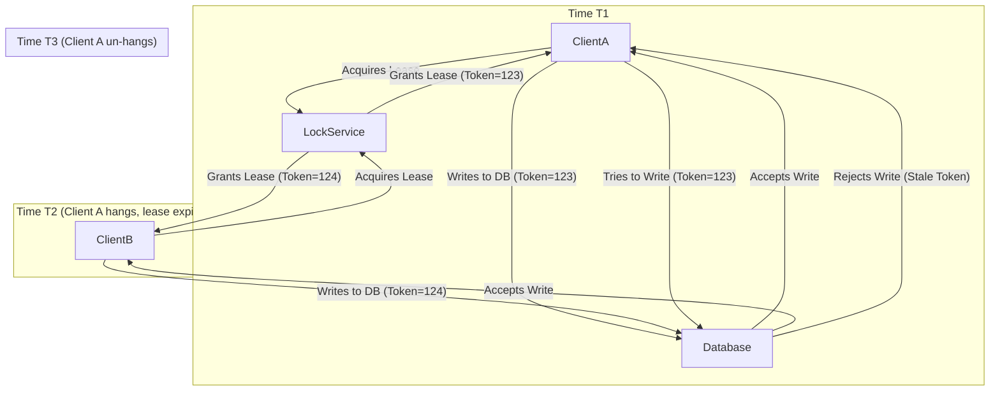

## Introduction: The Problem with Infinite Locks

In traditional locking, a client acquires a lock and holds it until it's explicitly released. But what happens if the client crashes while holding the lock? The lock is never released, and the resource becomes permanently unavailable. This is a classic **deadlock** scenario, and in a distributed system, it's a recipe for disaster.

The solution is to stop thinking of locks as indefinite and start thinking of them as temporary. This is the core idea behind a **lease**: a lock that is only valid for a specific period.

### What is a Lease?

A lease is a time-bound lock. When a client acquires a lease, it's granted exclusive access to a resource for a fixed duration (the "lease period").

*   The client is responsible for renewing the lease before it expires if it needs to continue holding the lock.
*   If the client fails to renew the lease (e.g., because it has crashed), the lease expires, and the lock is automatically released, becoming available for other clients.

This mechanism is a cornerstone of fault-tolerant systems, providing a robust way to handle client failures without manual intervention.



## How Lease-Based Locking Works

A lease-based locking system is typically managed by a central service (like Google's Chubby or etcd).

1.  **Acquisition:** A client requests a lease from the lock service. If the resource is not already leased, the service grants a lease with a specific expiration time.
2.  **Renewal (Heartbeating):** The client must periodically send a "heartbeat" message to the lock service to renew the lease. This proves to the service that the client is still alive and active.
3.  **Expiration:** If the lock service doesn't receive a heartbeat from the leaseholder within the lease period, it assumes the client has failed. The service invalidates the lease and makes the lock available to other clients.
4.  **Release:** A well-behaved client will explicitly release the lease when it's done with the resource, making it available sooner.

## The Critical Role of Time

Lease-based systems are fundamentally dependent on time. This introduces a significant challenge in distributed systems: **clock drift**. The clocks on different machines are never perfectly synchronized.

What happens if the lock service's clock is running faster than the client's clock? The service might expire a lease that the client thinks is still valid. If the service then grants the lease to a new client, you could have two clients believing they hold the lock simultaneously, breaking the safety guarantee.

### Fencing Tokens

To solve this problem, the lock service can issue a **fencing token** every time it grants a lease. This token is typically a number that is guaranteed to monotonically increase.

*   When a client acquires a lease, it receives a fencing token (e.g., `token=123`).
*   The client must then present this token with every write request to the resource it is protecting.
*   The resource storage system (e.g., a database or file service) is responsible for checking the token. It will reject any write request with a token that is older (i.e., smaller) than the last one it has seen.

This ensures that even if a client with an expired lease tries to write to the resource, its outdated fencing token will cause the write to be rejected.



## Go Example: A Simple Lease Manager

Let's simulate a basic lease manager and a client that uses it.

```go
package main

import (
    "fmt"
    "sync"
    "time"
)

type Lease struct {
    OwnerID   string
    ExpiresAt time.Time
}

type LeaseManager struct {
    mu    sync.Mutex
    lease *Lease
}

func (lm *LeaseManager) Acquire(ownerID string, ttl time.Duration) bool {
    lm.mu.Lock()
    defer lm.mu.Unlock()

    if lm.lease == nil || time.Now().After(lm.lease.ExpiresAt) {
        lm.lease = &Lease{
            OwnerID:   ownerID,
            ExpiresAt: time.Now().Add(ttl),
        }
        fmt.Printf("[%s] Acquired lease.\n", ownerID)
        return true
    }
    return false
}

func (lm *LeaseManager) Renew(ownerID string, ttl time.Duration) bool {
    lm.mu.Lock()
    defer lm.mu.Unlock()

    if lm.lease != nil && lm.lease.OwnerID == ownerID {
        lm.lease.ExpiresAt = time.Now().Add(ttl)
        return true
    }
    return false
}

func client(id string, lm *LeaseManager) {
    ttl := 2 * time.Second

    // Try to acquire the lease
    if !lm.Acquire(id, ttl) {
        fmt.Printf("[%s] Failed to acquire lease.\n", id)
        return
    }

    // Start a renewal goroutine
    done := make(chan bool)
    go func() {
        for {
            select {
            case <-done:
                return
            case <-time.After(ttl / 2):
                if !lm.Renew(id, ttl) {
                    fmt.Printf("[%s] Failed to renew lease! Lost leadership.\n", id)
                    return
                }
                fmt.Printf("[%s] Renewed lease.\n", id)
            }
        }
    }()

    // Simulate doing work as the lease holder
    fmt.Printf("[%s] Doing work with the lease...\n", id)
    time.Sleep(5 * time.Second)

    // Stop renewing and release the lease
    close(done)
    fmt.Printf("[%s] Finished work.\n", id)
}

func main() {
    lm := &LeaseManager{}

    go client("Client-1", lm)
    time.Sleep(1 * time.Second)
    go client("Client-2", lm)

    time.Sleep(10 * time.Second)
}
```

This example shows how a client acquires a lease and then uses a background goroutine to periodically renew it. `Client-2` fails to acquire the lease because `Client-1` already holds it.

## Conclusion

Lease-based locking is a powerful and essential pattern for building fault-tolerant distributed systems. By putting a time limit on locks, it elegantly solves the problem of client failures and prevents system-wide deadlocks.

While the concept is simple, a correct implementation requires careful consideration of clock drift and the use of mechanisms like fencing tokens to ensure absolute safety. Modern coordination services like etcd and ZooKeeper have made implementing leases much easier, but understanding the principles behind them is crucial for any distributed systems engineer.
