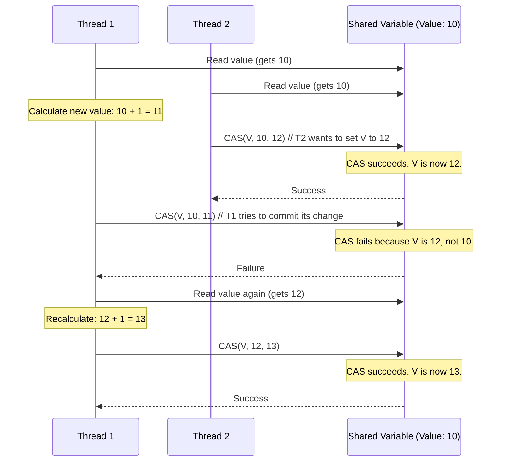

## System Design: Lock-Free Data Structures

In concurrent programming, the most common way to protect shared data is by using locks (like a mutex). When a thread needs to access the data, it acquires the lock, performs its operation, and then releases the lock. This ensures that only one thread can modify the data at a time, preventing race conditions.

However, locks have significant downsides:
-   **Contention:** If many threads try to acquire the same lock, most of them will be blocked, waiting for their turn. This serialization can eliminate the benefits of parallelism.
-   **Deadlock:** A situation where two or more threads are blocked forever, each waiting for a lock held by the other.
-   **Priority Inversion:** A high-priority thread can be blocked waiting for a low-priority thread to release a lock.

**Lock-Free Data Structures** offer an alternative approach. They are designed to be accessed by multiple threads concurrently *without* using traditional locks. Instead, they rely on low-level **atomic operations** provided by the hardware.

### The Core Idea: Atomic Operations

An atomic operation is a sequence of instructions that is guaranteed to execute as a single, indivisible unit. While it's running, no other thread can observe it in a half-finished state.

The most important atomic operation for lock-free programming is **Compare-And-Swap (CAS)**.

#### Compare-And-Swap (CAS)

A CAS operation is a single instruction that does the following:
`CAS(memory_location, expected_value, new_value)`
1.  It reads the value at `memory_location`.
2.  It **compares** this value to `expected_value`.
3.  **If they are the same**, it means no other thread has changed the data since we last read it. It then **swaps** the value at `memory_location` with `new_value` and returns `true`.
4.  **If they are different**, it means another thread has modified the data. The swap does not happen, and the operation returns `false`.

This all happens atomically.

Lock-free algorithms use CAS in a loop. A thread optimistically performs its work on a copy of the data and then tries to commit the result using CAS. If the CAS fails, it means another thread "won" the race. The current thread then re-reads the modified data, re-does its work, and tries the CAS again.



### Go Example: A Lock-Free Counter

Go's `sync/atomic` package provides a suite of functions for performing atomic operations on primitive types. Let's compare a counter implemented with a mutex to one implemented with atomics.

```go
package main

import (
	"fmt"
	"sync"
	"sync/atomic"
	"time"
)

// --- Version 1: Using a Mutex ---
type MutexCounter struct {
	mu    sync.Mutex
	value int64
}

func (c *MutexCounter) Increment() {
	c.mu.Lock()
	defer c.mu.Unlock()
	c.value++
}

func (c *MutexCounter) Value() int64 {
	c.mu.Lock()
	defer c.mu.Unlock()
	return c.value
}

// --- Version 2: Lock-Free using Atomics ---
type AtomicCounter struct {
	value int64
}

func (c *AtomicCounter) Increment() {
	// Atomically adds 1 to the value. This is a single, hardware-level instruction.
	atomic.AddInt64(&c.value, 1)
}

func (c *AtomicCounter) Value() int64 {
	// Atomically reads the value.
	return atomic.LoadInt64(&c.value)
}

func main() {
	const numGoroutines = 1000
	const numIncrements = 1000

	// --- Test Mutex Counter ---
	mCounter := &MutexCounter{}
	var wgMutex sync.WaitGroup
	wgMutex.Add(numGoroutines)

	startMutex := time.Now()
	for i := 0; i < numGoroutines; i++ {
		go func() {
			defer wgMutex.Done()
			for j := 0; j < numIncrements; j++ {
				mCounter.Increment()
			}
		}()
	}
	wgMutex.Wait()
	durationMutex := time.Since(startMutex)

	fmt.Printf("Mutex Counter Final Value: %d\n", mCounter.Value())
	fmt.Printf("Mutex Counter Time:        %v\n", durationMutex)

	// --- Test Atomic Counter ---
	aCounter := &AtomicCounter{}
	var wgAtomic sync.WaitGroup
	wgAtomic.Add(numGoroutines)

	startAtomic := time.Now()
	for i := 0; i < numGoroutines; i++ {
		go func() {
			defer wgAtomic.Done()
			for j := 0; j < numIncrements; j++ {
				aCounter.Increment()
			}
		}()
	}
	wgAtomic.Wait()
	durationAtomic := time.Since(startAtomic)

	fmt.Printf("\nAtomic Counter Final Value: %d\n", aCounter.Value())
	fmt.Printf("Atomic Counter Time:       %v\n", durationAtomic)
}
```
When you run this, you will likely see that the atomic counter is significantly faster, especially as you increase the number of goroutines. This is because the goroutines don't have to wait for each other to acquire a lock; the hardware handles the concurrent increments.

### Pros and Cons of Lock-Free Programming

**Pros:**
-   **Higher Performance:** In highly contended scenarios, lock-free structures can offer much better performance and scalability by avoiding the overhead of lock management and context switching.
-   **No Deadlocks:** Since there are no locks, there is no possibility of deadlock.
-   **No Priority Inversion:** The progress of one thread doesn't depend on another thread releasing a lock.

**Cons:**
-   **Extreme Complexity:** Writing correct lock-free algorithms is notoriously difficult. It requires a deep understanding of memory models, compiler reordering, and the specific guarantees of atomic operations on your target hardware. A small mistake can lead to subtle and catastrophic bugs.
-   **Livelock and Starvation:** While there's no deadlock, a thread can be "livelocked" if it repeatedly loses the CAS race and has to retry its work indefinitely. This can lead to starvation where some threads make no progress.
-   **Limited to Primitives:** Most atomic operations work on simple types like integers and pointers. Building complex data structures like a lock-free hash map is a significant undertaking reserved for experts.
-   **The ABA Problem:** A famous problem where a location is read (value A), changed to B by another thread, and then changed back to A. The first thread performs its CAS and sees the expected value A, wrongly assuming nothing has changed. This is often solved with version counters or special pointers.

### When to Use Lock-Free Structures

For most application-level programming, **using mutexes is the correct, safe, and recommended approach.** The complexity and subtlety of lock-free programming often outweigh the performance benefits.

You should only consider lock-free techniques when:
1.  You have profiled your application and identified a specific lock as a major point of contention and a performance bottleneck.
2.  You are building low-level, performance-critical infrastructure, such as a custom message queue, a scheduler, or parts of a database engine.
3.  You can use a well-tested, pre-built lock-free data structure from a standard library or a reputable third-party library (like Go's `sync.Map` or `atomic.Value`).

### Conclusion

Lock-free data structures represent a powerful but advanced technique in concurrent programming. They leverage atomic hardware instructions to enable non-blocking concurrency, offering significant performance gains in highly contended scenarios. However, their complexity makes them a double-edged sword. For the vast majority of use cases, the simplicity and safety of traditional locks are preferable. Reserve lock-free programming for those rare, proven performance bottlenecks where the benefits justify the immense difficulty of getting it right.
---
