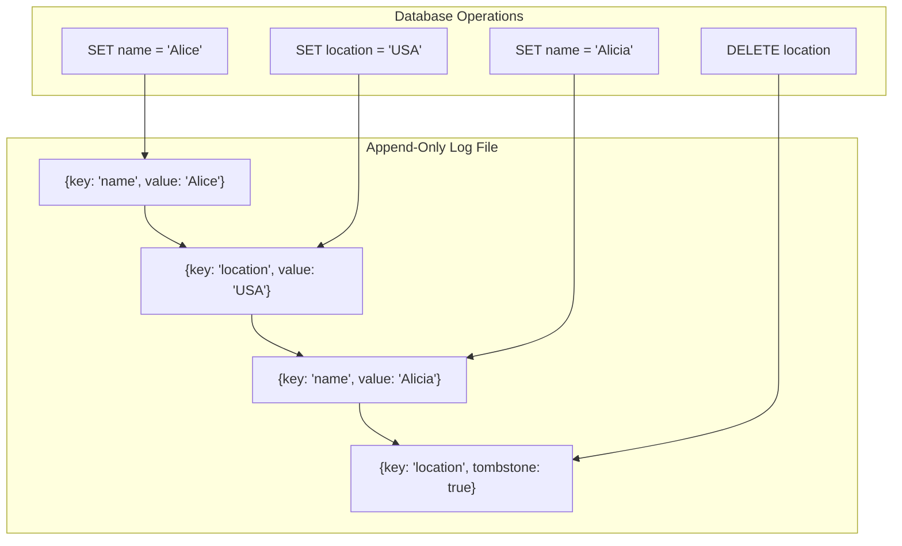
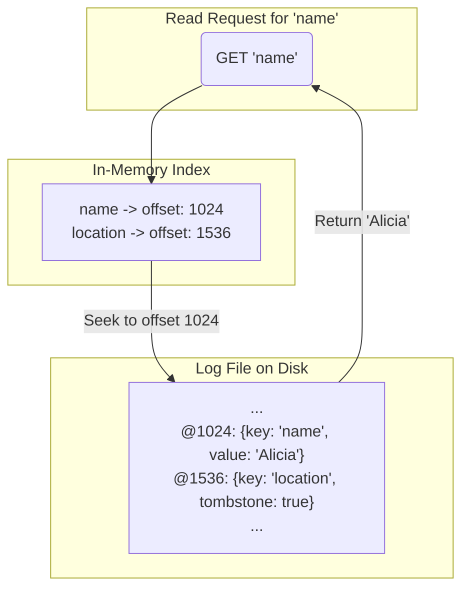

## Introduction: The Problem with Random Writes

Traditional databases, often based on B-Trees, perform in-place updates. When you change a record, the database finds the block on disk where that record lives and overwrites it. This process involves **random I/O**, which is one of the slowest operations a computer can perform. A spinning hard drive has to physically move its read/write head to the correct location (a "seek"), and even on modern SSDs, random writes are significantly less efficient than sequential writes.

As write-heavy workloads became more common, engineers sought a different approach. What if we could avoid random writes altogether? This question led to the development of **log-structured storage**, a design philosophy where all data modifications are treated as an append-only log.

## What is Log-Structured Storage?

The core idea is simple and powerful: **never modify data in place**. Instead, every `INSERT`, `UPDATE`, and `DELETE` is treated as a new record that is appended to the end of a log file.

*   An `INSERT` appends a new key-value pair.
*   An `UPDATE` appends a new version of the key-value pair. The old version is now obsolete but remains in the log.
*   A `DELETE` appends a special "tombstone" record, marking the key as deleted.

The log becomes the source of truth. It's an immutable, chronologically ordered history of all changes to the database.



## The Benefits of an Append-Only Approach

1.  **Extremely Fast Writes:** All writes are sequential appends to the end of a file. This is the fastest possible way to write to disk, maximizing throughput and minimizing hardware bottlenecks.
2.  **Durability and Concurrency:** Appending to a file is a simple, atomic operation. It simplifies concurrency control, as multiple writers don't have to compete to modify the same data block. It also provides a clear path to recovery after a crash: the log itself is the recovery mechanism.
3.  **Built-in Versioning:** Since old versions of data are never overwritten, you get a complete history of all changes for free. This is a form of Event Sourcing and is incredibly useful for auditing, debugging, and recovering from errors.

## The Challenge: Efficient Reads and Compaction

This design makes writes incredibly fast, but it introduces a new problem: **how do you read the current value of a key?**

To find the latest value for a key, you might have to scan the entire log backwards from the end until you find the most recent entry for that key. This is obviously inefficient for read-heavy workloads.

To solve this, log-structured systems introduce two key components:

### 1. In-Memory Index

To speed up reads, the system maintains an in-memory index (often a hash map or a balanced tree) that maps each key to the byte offset of its *most recent* version in the log file on disk.

When a read request comes in:
1.  Check the in-memory index for the key.
2.  If found, seek directly to that offset in the log file on disk.
3.  Read the value and return it.

This turns a slow, full-log scan into a fast, single-disk seek.



### 2. Compaction and Merging

Over time, the log file will grow indefinitely and accumulate a lot of obsolete data (old versions of updated keys and deleted keys). This wastes disk space and slows down recovery.

Log-structured systems periodically perform a **compaction** process in the background:
1.  The system reads through one or more log segments.
2.  It identifies the latest version of each key and discards all previous, obsolete versions.
3.  It writes a new, clean log segment containing only the "live" data.
4.  Once the new segment is written, the system can safely delete the old, compacted segments.

This process is essential for reclaiming disk space and keeping the database efficient over time.

## Log-Structured Merge-Trees (LSM-Trees)

This combination of an append-only log, an in-memory index, and a compaction process is the foundation of the **Log-Structured Merge-Tree (LSM-Tree)**, a data structure that powers many modern NoSQL databases like Cassandra, RocksDB, and LevelDB.

LSM-Trees take this a step further by introducing a hierarchy of sorted log files (SSTables) on disk, which are periodically merged together. This design provides a tunable trade-off between write performance, read performance, and compaction overhead.

## Go Example: A Simple Log-Structured Key-Value Store

This example implements a basic append-only log with an in-memory index. It demonstrates the core principles of writing, reading, and the need for compaction.

```go
package main

import (
	"encoding/json"
	"fmt"
	"io"
	"os"
	"sync"
)

// Entry is a single record in our log.
type Entry struct {
	Key   string
	Value string
	Op    string // "SET" or "DELETE"
}

// LogStructuredStore is a simple key-value store.
type LogStructuredStore struct {
	logFile *os.File
	index   map[string]int64 // Maps key to file offset
	mu      sync.RWMutex
}

func NewStore(path string) (*LogStructuredStore, error) {
	file, err := os.OpenFile(path, os.O_APPEND|os.O_CREATE|os.O_RDWR, 0644)
	if err != nil {
		return nil, err
	}

	store := &LogStructuredStore{
		logFile: file,
		index:   make(map[string]int64),
	}

	// Build the index from the existing log file on startup
	store.buildIndex()

	return store, nil
}

// buildIndex reads the log from disk to populate the in-memory index.
func (s *LogStructuredStore) buildIndex() {
	s.mu.Lock()
	defer s.mu.Unlock()

	s.logFile.Seek(0, 0) // Start from the beginning
	decoder := json.NewDecoder(s.logFile)
	offset, _ := s.logFile.Seek(0, os.SEEK_CUR)

	for {
		var entry Entry
		if err := decoder.Decode(&entry); err == io.EOF {
			break
		} else if err != nil {
			continue // Handle potential corruption
		}

		if entry.Op == "DELETE" {
			delete(s.index, entry.Key)
		} else {
			s.index[entry.Key] = offset
		}
		offset, _ = s.logFile.Seek(0, os.SEEK_CUR)
	}
}

// Set appends a new key-value pair to the log.
func (s *LogStructuredStore) Set(key, value string) error {
	s.mu.Lock()
	defer s.mu.Unlock()

	offset, _ := s.logFile.Seek(0, io.SeekEnd)
	entry := Entry{Key: key, Value: value, Op: "SET"}

	encoder := json.NewEncoder(s.logFile)
	if err := encoder.Encode(entry); err != nil {
		return err
	}

	s.index[key] = offset
	return nil
}

// Get reads the value for a key using the index.
func (s *LogStructuredStore) Get(key string) (string, bool) {
	s.mu.RLock()
	defer s.mu.RUnlock()

	offset, ok := s.index[key]
	if !ok {
		return "", false
	}

	s.logFile.Seek(offset, 0)
	decoder := json.NewDecoder(s.logFile)
	var entry Entry
	decoder.Decode(&entry)

	return entry.Value, true
}

func main() {
	store, _ := NewStore("my.db.log")

	store.Set("name", "Alice")
	store.Set("city", "New York")
	store.Set("name", "Alicia") // Update name

	val, _ := store.Get("name")
	fmt.Printf("The current name is: %s\n", val)

	// The log file "my.db.log" now contains all three entries,
	// but the index correctly points to the latest one for "name".
}
```

## Conclusion

Log-structured storage is a fundamental design pattern in modern data systems. By transforming all database modifications into sequential, append-only writes, it provides exceptional write throughput. While this introduces complexity on the read side, this is managed effectively through in-memory indexes and background compaction processes. This trade-off—optimizing for writes at the cost of more complex reads—is at the heart of LSM-Trees and many of the high-performance NoSQL databases that power today's largest applications.
