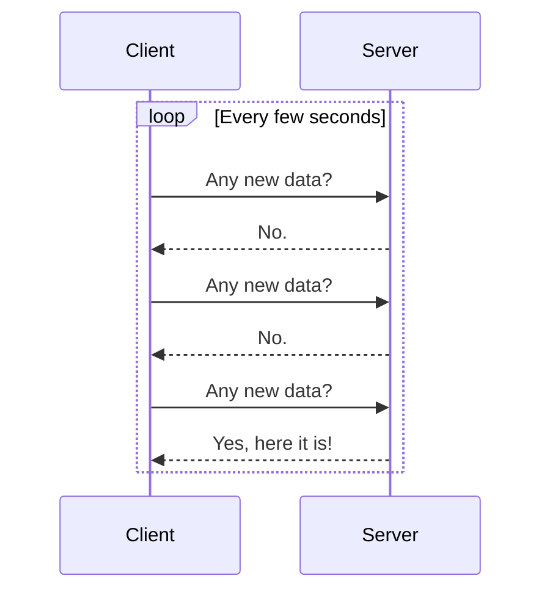
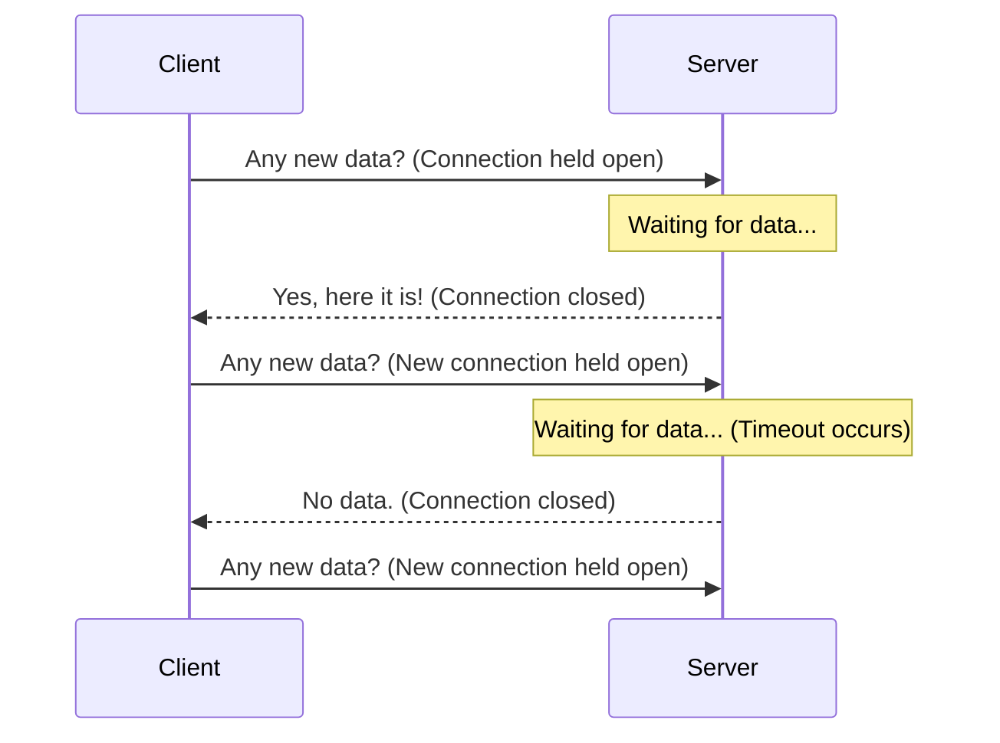

## System Design: Long Polling vs. Streaming for Real-Time Data

In the quest to build responsive, real-time web applications, developers have devised numerous techniques to overcome the limitations of the classic HTTP request-response model. Before modern protocols like WebSockets and Server-Sent Events (SSE) became widespread, **Long Polling** was the go-to solution for simulating server-to-client communication.

This post compares Long Polling with modern streaming technologies to help you understand the trade-offs and choose the right approach for your application.

### The Baseline: Short Polling (The Inefficient Way)

To understand Long Polling, we must first look at its predecessor: **Short Polling**. This is the simplest, but most inefficient, method.

1.  The client sends a request to the server.
2.  The server immediately responds, either with new data or with an empty response if there's no new data.
3.  The client, upon receiving the response, immediately sends another request.
4.  This repeats indefinitely.

**Problems with Short Polling:**
-   **High Overhead:** Generates a huge number of requests, consuming server resources (CPU, memory) and network bandwidth, even when there are no updates.
-   **High Latency:** Data is only delivered when the client happens to poll *after* the data has become available. There's always a delay.

### Long Polling: A Smarter Hack

**Long Polling** is a more intelligent version of polling that reduces latency and eliminates empty responses.

1.  The client sends a request to the server.
2.  The server does **not** respond immediately. Instead, it holds the connection open.
3.  If new data becomes available while the connection is open, the server sends the data in the response and closes the connection.
4.  If no data becomes available after a long timeout period (e.g., 30-60 seconds), the server responds with an empty response and closes the connection.
5.  The client, upon receiving a response (either with data or a timeout), immediately opens a new connection.

**Advantages of Long Polling:**
-   **Lower Latency:** Data is sent as soon as it's available on the server, without waiting for the next client poll.
-   **More Efficient:** Eliminates the constant stream of empty responses, reducing overhead compared to short polling.

**Disadvantages of Long Polling:**
-   **Resource Intensive on the Server:** Holding many connections open can still consume significant server resources, especially with a large number of clients.
-   **Doesn't Guarantee Order:** If multiple messages arrive while the client is disconnected, their delivery order isn't guaranteed.
-   **Still Has Overhead:** Each message requires a new HTTP connection setup (handshake, headers), which is less efficient than a single, persistent connection.

### True Streaming: WebSockets and SSE

Modern **streaming technologies** were designed to solve these problems natively. They establish a single, persistent connection for communication, which is far more efficient.

1.  **[WebSockets](/blog/system-design/system-design-websocket-protocol-deep-dive):**
    -   **How it works:** A single TCP connection provides a **full-duplex** (two-way) message-based channel. Both client and server can send messages at any time.
    -   **Efficiency:** Extremely efficient after the initial handshake. Message frames have very low overhead compared to full HTTP requests.
    -   **Use Case:** Perfect for applications requiring true bidirectional communication, like chat apps, multiplayer games, and collaborative editing.

2.  **[Server-Sent Events (SSE)](/blog/system-design/system-design-server-sent-events-sse):**
    -   **How it works:** A single HTTP connection provides a **unidirectional** (one-way) stream from server to client.
    -   **Efficiency:** Very efficient. It's just a long-lived HTTP response.
    -   **Use Case:** Ideal for server-to-client push notifications, like news feeds, stock tickers, and status updates. It also has the benefit of automatic reconnection built into the browser's `EventSource` API.

### Comparison Table: Long Polling vs. Streaming

| Feature                | Long Polling                                     | WebSockets                                       | Server-Sent Events (SSE)                         |
| ---------------------- | ------------------------------------------------ | ------------------------------------------------ | ------------------------------------------------ |
| **Communication**      | Simulated server-to-client (via held requests)   | **Full-Duplex** (Bidirectional)                  | Unidirectional (Server-to-Client)                |
| **Connection**         | A new HTTP connection per message/timeout        | **Single, persistent TCP connection**            | **Single, persistent HTTP connection**           |
| **Overhead**           | High (full HTTP headers for every message)       | **Very Low** (small frame headers)               | **Low** (standard HTTP, but only one handshake)  |
| **Latency**            | Low, but with a gap between messages             | **Very Low**                                     | **Very Low**                                     |
| **Complexity**         | Moderately complex to implement reliably         | More complex protocol, but libraries simplify it | **Very Simple** to implement                     |
| **Browser Support**    | Works everywhere (it's just HTTP)                | Excellent in modern browsers                     | Excellent in modern browsers (except IE)         |
| **Automatic Reconnection** | Must be implemented manually                     | Must be implemented manually                     | **Built-in** via the `EventSource` API           |

### When Should You Use Long Polling Today?

With the widespread availability of WebSockets and SSE, the use cases for Long Polling have become very niche. However, there are still a few scenarios where it might be considered:

1.  **Legacy Browser Support:** If you need to support very old browsers that do not have WebSocket or SSE capabilities (e.g., Internet Explorer).
2.  **Hostile Network Environments:** In some corporate networks with restrictive firewalls, only standard HTTP requests on port 80/443 are allowed. WebSockets, with their `Upgrade` header, can sometimes be blocked. Long Polling, being just plain HTTP, is more likely to get through.

Many modern libraries (like Socket.IO) use WebSockets as their primary transport but will automatically fall back to Long Polling if the WebSocket connection fails. This provides the best of both worlds: high performance when possible, and reliable connectivity when not.

### Conclusion

Long Polling was a crucial stepping stone in the evolution of real-time web applications. It offered a significant improvement over short polling by reducing latency and waste. However, for modern applications, it has been largely superseded by superior, standardized streaming technologies.

-   For **bidirectional communication**, **WebSockets** are the clear winner, offering the highest performance and lowest latency.
-   For **unidirectional server-to-client push**, **Server-Sent Events (SSE)** are a simpler, elegant, and highly effective alternative.

While Long Polling still has a place as a fallback mechanism for ensuring maximum compatibility, your primary development should focus on leveraging the power and efficiency of true streaming protocols.
---
