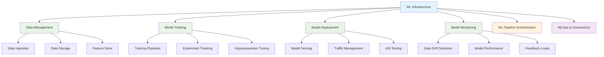

# System Design: Machine Learning Infrastructure

Machine Learning (ML) infrastructure encompasses the systems, tools, and processes required to develop, train, deploy, and manage machine learning models at scale. As organizations increasingly adopt ML for business-critical applications, building robust ML infrastructure has become essential for delivering models from experimentation to production efficiently and reliably. This infrastructure must handle data management, model training, deployment, monitoring, and governance challenges unique to ML workloads.

## Understanding ML Infrastructure

Traditional software systems follow relatively predictable deployment and operational patterns. ML systems, however, introduce additional complexity due to the nature of model training, data dependencies, and the need for continuous monitoring and retraining. ML infrastructure must support the entire lifecycle of ML models from data preparation through model serving.



### ML Infrastructure vs Traditional Software Infrastructure

| Aspect | Traditional Software | ML Infrastructure |
|--------|---------------------|-------------------|
| Deployment | Code and binaries | Models + code + dependencies |
| Testing | Unit, integration tests | Model validation, data validation |
| Monitoring | System metrics | Model performance, data drift |
| Scaling | Request-based | Compute-intensive training jobs |
| Versioning | Code versions | Model/data/experiment versions |
| Rollbacks | Quick code rollbacks | Complex model rollbacks |

## ML Pipeline Components

### 1. Data Management Infrastructure

ML models are fundamentally dependent on data, making data management a critical component of ML infrastructure. This includes data ingestion, processing, storage, and feature engineering.

```go
// Data management infrastructure
package main

import (
    "context"
    "database/sql"
    "fmt"
    "time"

    _ "github.com/lib/pq" // PostgreSQL driver
)

// DataIngestionService handles data ingestion from various sources
type DataIngestionService struct {
    db *sql.DB
}

type DataSource struct {
    ID          string
    Name        string
    Type        string // "database", "api", "file", "stream"
    Connection  string
    Schema      string
    LastUpdated time.Time
}

type DataRecord struct {
    ID         string
    SourceID   string
    Data       map[string]interface{}
    CreatedAt  time.Time
    Processed  bool
    Error      string
}

func NewDataIngestionService(db *sql.DB) *DataIngestionService {
    return &DataIngestionService{db: db}
}

// RegisterDataSource registers a new data source
func (dis *DataIngestionService) RegisterDataSource(ctx context.Context, source DataSource) error {
    query := `
        INSERT INTO data_sources (id, name, type, connection, schema, last_updated)
        VALUES ($1, $2, $3, $4, $5, $6)
        ON CONFLICT (id) DO UPDATE SET
            name = $2, type = $3, connection = $4, schema = $5, last_updated = $6
    `
    
    _, err := dis.db.ExecContext(ctx, query, source.ID, source.Name, source.Type, 
                                source.Connection, source.Schema, source.LastUpdated)
    return err
}

// IngestFromSource ingests data from a registered source
func (dis *DataIngestionService) IngestFromSource(ctx context.Context, sourceID string) error {
    // Fetch source configuration
    var source DataSource
    err := dis.db.QueryRowContext(ctx, 
        "SELECT id, name, type, connection, schema FROM data_sources WHERE id = $1", 
        sourceID).Scan(&source.ID, &source.Name, &source.Type, &source.Connection, &source.Schema)
    if err != nil {
        return err
    }
    
    // Simulate data ingestion based on source type
    switch source.Type {
    case "database":
        return dis.ingestFromDatabase(ctx, source)
    case "api":
        return dis.ingestFromAPI(ctx, source)
    case "file":
        return dis.ingestFromFile(ctx, source)
    case "stream":
        return dis.ingestFromStream(ctx, source)
    default:
        return fmt.Errorf("unsupported source type: %s", source.Type)
    }
}

// ingestFromDatabase simulates database ingestion
func (dis *DataIngestionService) ingestFromDatabase(ctx context.Context, source DataSource) error {
    // In a real implementation, this would connect to the database and extract data
    fmt.Printf("Ingesting data from database: %s\n", source.Connection)
    
    // Simulate extracting records
    records := []DataRecord{
        {ID: "rec1", SourceID: source.ID, Data: map[string]interface{}{"user_id": 123, "value": 42}, CreatedAt: time.Now()},
        {ID: "rec2", SourceID: source.ID, Data: map[string]interface{}{"user_id": 456, "value": 56}, CreatedAt: time.Now()},
        {ID: "rec3", SourceID: source.ID, Data: map[string]interface{}{"user_id": 789, "value": 78}, CreatedAt: time.Now()},
    }
    
    // Store records
    for _, record := range records {
        err := dis.storeRecord(ctx, record)
        if err != nil {
            return err
        }
    }
    
    return nil
}

// ingestFromAPI simulates API ingestion
func (dis *DataIngestionService) ingestFromAPI(ctx context.Context, source DataSource) error {
    fmt.Printf("Ingesting data from API: %s\n", source.Connection)
    // Implementation would make API calls and process responses
    return nil
}

// ingestFromFile simulates file ingestion
func (dis *DataIngestionService) ingestFromFile(ctx context.Context, source DataSource) error {
    fmt.Printf("Ingesting data from file: %s\n", source.Connection)
    // Implementation would process files
    return nil
}

// ingestFromStream simulates stream ingestion
func (dis *DataIngestionService) ingestFromStream(ctx context.Context, source DataSource) error {
    fmt.Printf("Ingesting data from stream: %s\n", source.Connection)
    // Implementation would connect to streaming platform
    return nil
}

// storeRecord stores an ingested record
func (dis *DataIngestionService) storeRecord(ctx context.Context, record DataRecord) error {
    query := `
        INSERT INTO raw_data (id, source_id, data, created_at, processed, error)
        VALUES ($1, $2, $3, $4, $5, $6)
    `
    
    _, err := dis.db.ExecContext(ctx, query, record.ID, record.SourceID, record.Data, 
                                record.CreatedAt, record.Processed, record.Error)
    return err
}

// Example data processing pipeline
type DataPipeline struct {
    ingestionService *DataIngestionService
}

func NewDataPipeline(ingestionService *DataIngestionService) *DataPipeline {
    return &DataPipeline{ingestionService: ingestionService}
}

// ProcessDataPipeline executes the entire data processing pipeline
func (dp *DataPipeline) ProcessDataPipeline(ctx context.Context, sourceID string) error {
    fmt.Printf("Starting data pipeline for source: %s\n", sourceID)
    
    // 1. Ingest data
    err := dp.ingestionService.IngestFromSource(ctx, sourceID)
    if err != nil {
        return fmt.Errorf("failed to ingest data: %w", err)
    }
    
    // 2. Transform and clean data (would be implemented separately)
    fmt.Println("Data ingestion completed, proceeding with transformation...")
    
    // 3. Validate data quality
    fmt.Println("Data validation completed")
    
    // 4. Store processed features
    fmt.Println("Features stored and ready for training")
    
    return nil
}

// Example usage
func main() {
    // In a real scenario, we would connect to a real database
    fmt.Println("Data Management Infrastructure initialized")
    
    // Example data pipeline execution
    // For this example, we'll just show the structure
    fmt.Println("Data pipeline would:")
    fmt.Println("1. Register data sources")
    fmt.Println("2. Ingest data from various sources")
    fmt.Println("3. Transform and validate data")
    fmt.Println("4. Store features for ML training")
}
```

### 2. Feature Store Implementation

A feature store is a centralized repository for machine learning features that enables consistent feature engineering and serving across training and inference.

```go
// Feature store implementation
package main

import (
    "context"
    "database/sql"
    "encoding/json"
    "fmt"
    "time"

    _ "github.com/lib/pq" // PostgreSQL driver
)

// Feature represents a ML feature with metadata
type Feature struct {
    ID          string                 `json:"id"`
    Name        string                 `json:"name"`
    Description string                 `json:"description"`
    DataType    string                 `json:"data_type"` // "numeric", "categorical", "text"
    DefaultValue interface{}          `json:"default_value"`
    CreatedAt   time.Time              `json:"created_at"`
    UpdatedAt   time.Time              `json:"updated_at"`
    Tags        []string               `json:"tags"`
    Version     string                 `json:"version"`
}

// FeatureValue represents a feature value for a specific entity at a point in time
type FeatureValue struct {
    FeatureID string      `json:"feature_id"`
    EntityID  string      `json:"entity_id"` // e.g., user_id, item_id
    Value     interface{} `json:"value"`
    Timestamp time.Time   `json:"timestamp"`
}

// FeatureSet represents a collection of related features
type FeatureSet struct {
    ID          string    `json:"id"`
    Name        string    `json:"name"`
    Description string    `json:"description"`
    Features    []string  `json:"feature_ids"`
    Version     string    `json:"version"`
    CreatedAt   time.Time `json:"created_at"`
}

// FeatureStore manages features and their values
type FeatureStore struct {
    db *sql.DB
}

func NewFeatureStore(db *sql.DB) *FeatureStore {
    return &FeatureStore{db: db}
}

// RegisterFeature registers a new feature in the store
func (fs *FeatureStore) RegisterFeature(ctx context.Context, feature Feature) error {
    // Convert tags to JSON
    tagsJSON, err := json.Marshal(feature.Tags)
    if err != nil {
        return err
    }
    
    query := `
        INSERT INTO features (id, name, description, data_type, default_value, tags, version, created_at, updated_at)
        VALUES ($1, $2, $3, $4, $5, $6, $7, $8, $9)
        ON CONFLICT (id) DO UPDATE SET
            description = $3, data_type = $4, default_value = $5, tags = $6, 
            version = $7, updated_at = $9
    `
    
    _, err = fs.db.ExecContext(ctx, query, feature.ID, feature.Name, feature.Description,
                              feature.DataType, feature.DefaultValue, tagsJSON, feature.Version,
                              feature.CreatedAt, feature.UpdatedAt)
    return err
}

// RegisterFeatureSet registers a new feature set
func (fs *FeatureStore) RegisterFeatureSet(ctx context.Context, featureSet FeatureSet) error {
    featuresJSON, err := json.Marshal(featureSet.Features)
    if err != nil {
        return err
    }
    
    query := `
        INSERT INTO feature_sets (id, name, description, features, version, created_at)
        VALUES ($1, $2, $3, $4, $5, $6)
        ON CONFLICT (id) DO UPDATE SET
            description = $3, features = $4, version = $5, created_at = $6
    `
    _, err = fs.db.ExecContext(ctx, query, featureSet.ID, featureSet.Name, featureSet.Description,
                              featuresJSON, featureSet.Version, featureSet.CreatedAt)
    return err
}

// PutFeatureValues stores feature values for entities
func (fs *FeatureStore) PutFeatureValues(ctx context.Context, values []FeatureValue) error {
    query := `
        INSERT INTO feature_values (feature_id, entity_id, value, timestamp)
        VALUES ($1, $2, $3, $4)
        ON CONFLICT (feature_id, entity_id, timestamp) 
        DO UPDATE SET value = $3, timestamp = $4
    `
    
    for _, value := range values {
        _, err := fs.db.ExecContext(ctx, query, value.FeatureID, value.EntityID, 
                                   value.Value, value.Timestamp)
        if err != nil {
            return err
        }
    }
    return nil
}

// GetFeatureValuesForEntity retrieves feature values for a specific entity
func (fs *FeatureStore) GetFeatureValuesForEntity(ctx context.Context, entityID string, 
                                                 featureIDs []string, timestamp time.Time) ([]FeatureValue, error) {
    if len(featureIDs) == 0 {
        return nil, fmt.Errorf("no feature IDs specified")
    }
    
    // Build query with placeholders for feature IDs
    query := `SELECT feature_id, entity_id, value, timestamp FROM feature_values 
              WHERE entity_id = $1 AND feature_id = ANY($2) AND timestamp <= $3 
              ORDER BY timestamp DESC LIMIT $4`
    
    // For this example, we'll use a simplified approach
    // In production, use prepared statements with arrays
    
    var values []FeatureValue
    for _, featureID := range featureIDs {
        var value FeatureValue
        var storedValue []byte
        
        err := fs.db.QueryRowContext(ctx, 
            "SELECT feature_id, entity_id, value, timestamp FROM feature_values WHERE entity_id = $1 AND feature_id = $2 ORDER BY timestamp DESC LIMIT 1",
            entityID, featureID).Scan(&value.FeatureID, &value.EntityID, &storedValue, &value.Timestamp)
        
        if err != nil && err != sql.ErrNoRows {
            return nil, err
        }
        
        if err == nil {
            // Deserialize the value - in practice, this would depend on the data type
            value.Value = string(storedValue)
            values = append(values, value)
        }
    }
    
    return values, nil
}

// GetFeatureSet retrieves features for a specific feature set
func (fs *FeatureStore) GetFeatureSet(ctx context.Context, featureSetID string) (*FeatureSet, error) {
    var featureSet FeatureSet
    var featuresJSON []byte
    
    err := fs.db.QueryRowContext(ctx,
        "SELECT id, name, description, features, version, created_at FROM feature_sets WHERE id = $1",
        featureSetID).Scan(&featureSet.ID, &featureSet.Name, &featureSet.Description,
                          &featuresJSON, &featureSet.Version, &featureSet.CreatedAt)
    if err != nil {
        return nil, err
    }
    
    err = json.Unmarshal(featuresJSON, &featureSet.Features)
    if err != nil {
        return nil, err
    }
    
    return &featureSet, nil
}

// Example: Feature engineering pipeline
type FeatureEngineeringPipeline struct {
    featureStore *FeatureStore
}

func NewFeatureEngineeringPipeline(store *FeatureStore) *FeatureEngineeringPipeline {
    return &FeatureEngineeringPipeline{featureStore: store}
}

// ComputeFeaturesFromRawData processes raw data to compute features
func (fep *FeatureEngineeringPipeline) ComputeFeaturesFromRawData(ctx context.Context, 
                                                                 rawData []map[string]interface{}) error {
    for _, record := range rawData {
        entityID := fmt.Sprintf("%v", record["entity_id"])
        
        // Example feature computations
        featureValues := []FeatureValue{
            {
                FeatureID: "user_avg_session_time",
                EntityID:  entityID,
                Value:     computeAvgSessionTime(record),
                Timestamp: time.Now(),
            },
            {
                FeatureID: "user_click_count",
                EntityID:  entityID,
                Value:     computeClickCount(record),
                Timestamp: time.Now(),
            },
            {
                FeatureID: "user_last_login_days_ago",
                EntityID:  entityID,
                Value:     computeDaysSinceLastLogin(record),
                Timestamp: time.Now(),
            },
        }
        
        // Store computed features
        err := fep.featureStore.PutFeatureValues(ctx, featureValues)
        if err != nil {
            return fmt.Errorf("failed to store features for entity %s: %w", entityID, err)
        }
    }
    
    return nil
}

// Example feature computation functions
func computeAvgSessionTime(record map[string]interface{}) float64 {
    // In practice, this would compute average session time from session data
    // For this example, we'll return a computed value
    return 15.5 // Example average session time in minutes
}

func computeClickCount(record map[string]interface{}) int {
    // In practice, this would count user clicks
    return 42 // Example click count
}

func computeDaysSinceLastLogin(record map[string]interface{}) int {
    // In practice, this would calculate days since last login
    return 5 // Example days since last login
}

// Example usage
func main() {
    fmt.Println("Feature Store System initialized")
    
    // Example feature definitions
    ageFeature := Feature{
        ID:          "user_age",
        Name:        "User Age",
        Description: "Age of the user in years",
        DataType:    "numeric",
        DefaultValue: 0,
        CreatedAt:   time.Now(),
        UpdatedAt:   time.Now(),
        Tags:        []string{"demographic", "user"},
        Version:     "1.0.0",
    }
    
    incomeFeature := Feature{
        ID:          "user_income",
        Name:        "User Income",
        Description: "Annual income of the user",
        DataType:    "numeric",
        DefaultValue: 0,
        CreatedAt:   time.Now(),
        UpdatedAt:   time.Now(),
        Tags:        []string{"demographic", "user", "financial"},
        Version:     "1.0.0",
    }
    
    fmt.Printf("Registered features: %+v, %+v\n", ageFeature.Name, incomeFeature.Name)
    
    // Example feature set
    userDemographicsSet := FeatureSet{
        ID:          "user_demographics",
        Name:        "User Demographics",
        Description: "Demographic features for users",
        Features:    []string{ageFeature.ID, incomeFeature.ID},
        Version:     "1.0.0",
        CreatedAt:   time.Now(),
    }
    
    fmt.Printf("Feature set: %s with features %v\n", userDemographicsSet.Name, userDemographicsSet.Features)
}
```

### 3. Model Training Infrastructure

Model training infrastructure must handle distributed training, experiment tracking, and hyperparameter optimization.

```go
// Model training infrastructure
package main

import (
    "context"
    "database/sql"
    "encoding/json"
    "fmt"
    "math/rand"
    "sync"
    "time"

    _ "github.com/lib/pq" // PostgreSQL driver
)

// TrainingJob represents a machine learning training job
type TrainingJob struct {
    ID           string                 `json:"id"`
    ModelName    string                 `json:"model_name"`
    JobType      string                 `json:"job_type"` // "training", "validation", "hyperparameter_tuning"
    DataSource   string                 `json:"data_source"`
    Parameters   map[string]interface{} `json:"parameters"`
    Status       string                 `json:"status"` // "pending", "running", "completed", "failed"
    CreatedAt    time.Time              `json:"created_at"`
    StartedAt    *time.Time             `json:"started_at"`
    CompletedAt  *time.Time             `json:"completed_at"`
    Results      map[string]interface{} `json:"results"`
    Error        string                 `json:"error"`
    Resources    ResourceRequirements   `json:"resources"`
    Version      string                 `json:"version"`
}

type ResourceRequirements struct {
    CPU          string `json:"cpu"`
    Memory       string `json:"memory"`
    GPU          string `json:"gpu"`
    NodeCount    int    `json:"node_count"`
}

// Experiment represents a machine learning experiment
type Experiment struct {
    ID          string                 `json:"id"`
    Name        string                 `json:"name"`
    Description string                 `json:"description"`
    Tags        []string               `json:"tags"`
    Owner       string                 `json:"owner"`
    CreatedAt   time.Time              `json:"created_at"`
    Parameters  map[string]interface{} `json:"parameters"`
    Metrics     map[string]interface{} `json:"metrics"`
    Artifacts   []string               `json:"artifacts"` // Paths to model files, logs, etc.
}

// ModelTrainingService manages model training jobs
type ModelTrainingService struct {
    db *sql.DB
    jobQueue *TrainingJobQueue
    mutex sync.RWMutex
}

func NewModelTrainingService(db *sql.DB) *ModelTrainingService {
    return &ModelTrainingService{
        db: db,
        jobQueue: NewTrainingJobQueue(),
    }
}

// SubmitTrainingJob submits a new training job
func (mts *ModelTrainingService) SubmitTrainingJob(ctx context.Context, job TrainingJob) error {
    job.ID = fmt.Sprintf("train_%d", time.Now().UnixNano())
    job.Status = "pending"
    job.CreatedAt = time.Now()
    
    // Store the job in the database
    jobJSON, err := json.Marshal(job.Parameters)
    if err != nil {
        return err
    }
    
    resultsJSON, err := json.Marshal(job.Results)
    if err != nil {
        return err
    }
    
    query := `
        INSERT INTO training_jobs (id, model_name, job_type, data_source, parameters, status, created_at, results)
        VALUES ($1, $2, $3, $4, $5, $6, $7, $8)
    `
    
    _, err = mts.db.ExecContext(ctx, query, job.ID, job.ModelName, job.JobType, 
                               job.DataSource, jobJSON, job.Status, job.CreatedAt, resultsJSON)
    if err != nil {
        return err
    }
    
    // Add to job queue for processing
    mts.jobQueue.AddJob(job)
    
    fmt.Printf("Training job submitted: %s\n", job.ID)
    return nil
}

// GetTrainingJob returns information about a specific training job
func (mts *ModelTrainingService) GetTrainingJob(ctx context.Context, jobID string) (*TrainingJob, error) {
    var job TrainingJob
    var parametersJSON, resultsJSON []byte
    
    err := mts.db.QueryRowContext(ctx,
        "SELECT id, model_name, job_type, data_source, parameters, status, created_at, started_at, completed_at, error, results, version FROM training_jobs WHERE id = $1",
        jobID).Scan(&job.ID, &job.ModelName, &job.JobType, &job.DataSource,
                   &parametersJSON, &job.Status, &job.CreatedAt, &job.StartedAt, 
                   &job.CompletedAt, &job.Error, &resultsJSON, &job.Version)
    if err != nil {
        return nil, err
    }
    
    err = json.Unmarshal(parametersJSON, &job.Parameters)
    if err != nil {
        return nil, err
    }
    
    err = json.Unmarshal(resultsJSON, &job.Results)
    if err != nil {
        return nil, err
    }
    
    return &job, nil
}

// RunTrainingJob executes a training job
func (mts *ModelTrainingService) RunTrainingJob(ctx context.Context, jobID string) error {
    // Get the job
    job, err := mts.GetTrainingJob(ctx, jobID)
    if err != nil {
        return err
    }
    
    // Update status to running
    startTime := time.Now()
    _, err = mts.db.ExecContext(ctx, 
        "UPDATE training_jobs SET status = 'running', started_at = $2 WHERE id = $1",
        jobID, startTime)
    if err != nil {
        return err
    }
    
    // Simulate training process
    fmt.Printf("Starting training job %s for model %s\n", jobID, job.ModelName)
    
    // In a real implementation, this would:
    // 1. Set up training environment
    // 2. Load data
    // 3. Train model
    // 4. Evaluate results
    // 5. Save model artifacts
    
    // Simulate training time
    time.Sleep(5 * time.Second)
    
    // Calculate training results (simulated)
    results := map[string]interface{}{
        "accuracy":       0.92,
        "precision":      0.89,
        "recall":         0.91,
        "f1_score":       0.90,
        "training_time":  45.2, // seconds
        "model_size":     "15.7MB",
        "epochs":         100,
        "final_loss":     0.023,
    }
    
    // Update job status to completed
    endTime := time.Now()
    resultsJSON, err := json.Marshal(results)
    if err != nil {
        return err
    }
    
    _, err = mts.db.ExecContext(ctx,
        "UPDATE training_jobs SET status = 'completed', completed_at = $2, results = $3 WHERE id = $1",
        jobID, endTime, resultsJSON)
    if err != nil {
        return err
    }
    
    fmt.Printf("Training job %s completed successfully\n", jobID)
    return nil
}

// TrainingJobQueue manages training job scheduling and execution
type TrainingJobQueue struct {
    jobs    []TrainingJob
    running map[string]bool
    mutex   sync.RWMutex
}

func NewTrainingJobQueue() *TrainingJobQueue {
    return &TrainingJobQueue{
        jobs:    make([]TrainingJob, 0),
        running: make(map[string]bool),
    }
}

func (q *TrainingJobQueue) AddJob(job TrainingJob) {
    q.mutex.Lock()
    defer q.mutex.Unlock()
    
    q.jobs = append(q.jobs, job)
}

func (q *TrainingJobQueue) GetNextJob() *TrainingJob {
    q.mutex.Lock()
    defer q.mutex.Unlock()
    
    for i, job := range q.jobs {
        if job.Status == "pending" && !q.running[job.ID] {
            q.running[job.ID] = true
            return &q.jobs[i]
        }
    }
    return nil
}

// HyperparameterTuningService manages hyperparameter tuning jobs
type HyperparameterTuningService struct {
    trainingService *ModelTrainingService
}

func NewHyperparameterTuningService(trainingService *ModelTrainingService) *HyperparameterTuningService {
    return &HyperparameterTuningService{trainingService: trainingService}
}

// RunGridSearch performs grid search hyperparameter tuning
func (hts *HyperparameterTuningService) RunGridSearch(ctx context.Context, baseJob TrainingJob, 
                                                     hyperparameters map[string][]interface{}) error {
    fmt.Printf("Starting grid search for model %s\n", baseJob.ModelName)
    
    // Generate all combinations
    combinations := generateParameterCombinations(hyperparameters)
    fmt.Printf("Generated %d parameter combinations\n", len(combinations))
    
    var bestJobID string
    var bestScore float64
    
    // Submit jobs for each combination
    for i, params := range combinations {
        job := baseJob
        job.Parameters = make(map[string]interface{})
        for k, v := range baseJob.Parameters {
            job.Parameters[k] = v
        }
        for k, v := range params {
            job.Parameters[k] = v
        }
        
        job.ID = fmt.Sprintf("%s_grid_%d", baseJob.ID, i)
        job.JobType = "hyperparameter_tuning"
        
        err := hts.trainingService.SubmitTrainingJob(ctx, job)
        if err != nil {
            return fmt.Errorf("failed to submit job for combination %d: %w", i, err)
        }
        
        // Run the training job
        err = hts.trainingService.RunTrainingJob(ctx, job.ID)
        if err != nil {
            fmt.Printf("Job %s failed: %v\n", job.ID, err)
            continue
        }
        
        // Get the results
        completedJob, err := hts.trainingService.GetTrainingJob(ctx, job.ID)
        if err != nil {
            continue
        }
        
        // Extract accuracy score
        if accuracy, ok := completedJob.Results["accuracy"].(float64); ok {
            if accuracy > bestScore {
                bestScore = accuracy
                bestJobID = job.ID
            }
        }
    }
    
    fmt.Printf("Grid search completed. Best job: %s with score: %.4f\n", bestJobID, bestScore)
    return nil
}

// generateParameterCombinations creates all possible parameter combinations
func generateParameterCombinations(params map[string][]interface{}) []map[string]interface{} {
    if len(params) == 0 {
        return []map[string]interface{}{{}}
    }
    
    // Get first key and its values
    var firstKey string
    var firstValues []interface{}
    for k, v := range params {
        firstKey = k
        firstValues = v
        break
    }
    
    // Remove first key from params
    remainingParams := make(map[string][]interface{})
    for k, v := range params {
        if k != firstKey {
            remainingParams[k] = v
        }
    }
    
    // Get combinations for remaining parameters
    remainingCombinations := generateParameterCombinations(remainingParams)
    
    // Combine first parameter values with remaining combinations
    var results []map[string]interface{}
    for _, value := range firstValues {
        for _, combination := range remainingCombinations {
            result := make(map[string]interface{})
            result[firstKey] = value
            for k, v := range combination {
                result[k] = v
            }
            results = append(results, result)
        }
    }
    
    return results
}

// Example usage
func main() {
    fmt.Println("Model Training Infrastructure initialized")
    
    // Example training job
    trainingParams := map[string]interface{}{
        "learning_rate": 0.001,
        "batch_size":    32,
        "epochs":        100,
        "model_architecture": "deep_neural_network",
    }
    
    job := TrainingJob{
        ModelName:  "user_recommendation_model",
        JobType:    "training",
        DataSource: "user_interactions",
        Parameters: trainingParams,
        Resources: ResourceRequirements{
            CPU:       "4",
            Memory:    "8Gi",
            GPU:       "1",
            NodeCount: 1,
        },
    }
    
    fmt.Printf("Training job example: %+v\n", job)
    
    // Example hyperparameter tuning
    hyperparams := map[string][]interface{}{
        "learning_rate": {0.001, 0.01, 0.1},
        "batch_size":    {16, 32, 64},
        "dropout_rate":  {0.2, 0.5, 0.8},
    }
    
    fmt.Printf("Hyperparameter tuning example with: %+v\n", hyperparams)
    fmt.Printf("This would generate %d training jobs for grid search\n", 
               len(generateParameterCombinations(hyperparams)))
}
```

### 4. Model Serving Infrastructure

Model serving infrastructure provides low-latency, high-throughput model inference at scale.

```go
// Model serving infrastructure
package main

import (
    "context"
    "encoding/json"
    "fmt"
    "math/rand"
    "net/http"
    "sync"
    "time"
)

// Model represents a trained ML model
type Model struct {
    ID          string    `json:"id"`
    Name        string    `json:"name"`
    Version     string    `json:"version"`
    Path        string    `json:"path"` // Path to model file
    Framework   string    `json:"framework"` // "tensorflow", "pytorch", "sklearn"
    InputSpec   []string  `json:"input_spec"` // Input feature names
    OutputSpec  []string  `json:"output_spec"` // Output names
    CreatedAt   time.Time `json:"created_at"`
    Performance PerformanceMetrics `json:"performance"`
}

// PerformanceMetrics tracks model performance metrics
type PerformanceMetrics struct {
    LatencyP50 float64 `json:"latency_p50"`
    LatencyP95 float64 `json:"latency_p95"`
    LatencyP99 float64 `json:"latency_p99"`
    Throughput float64 `json:"throughput"`
    ErrorRate  float64 `json:"error_rate"`
    LastUpdated time.Time `json:"last_updated"`
}

// InferenceRequest represents a model inference request
type InferenceRequest struct {
    ModelID string                 `json:"model_id"`
    Input   map[string]interface{} `json:"input"`
    Timeout time.Duration          `json:"-"` // Not serialized
}

// InferenceResponse represents a model inference response
type InferenceResponse struct {
    ModelID string                 `json:"model_id"`
    Output  map[string]interface{} `json:"output"`
    Latency time.Duration          `json:"latency"`
    Error   string                 `json:"error,omitempty"`
}

// ModelServingService manages model serving
type ModelServingService struct {
    models       map[string]*Model
    modelCache   map[string]interface{} // In practice, this would contain loaded model objects
    mutex        sync.RWMutex
    metrics      map[string]*PerformanceMetrics
    requestQueue chan *InferenceRequest
    responseQueue chan *InferenceResponse
}

func NewModelServingService() *ModelServingService {
    service := &ModelServingService{
        models:        make(map[string]*Model),
        modelCache:    make(map[string]interface{}),
        metrics:       make(map[string]*PerformanceMetrics),
        requestQueue:  make(chan *InferenceRequest, 1000),
        responseQueue: make(chan *InferenceResponse, 1000),
    }
    
    // Start the inference workers
    for i := 0; i < 5; i++ { // 5 concurrent inference workers
        go service.inferenceWorker()
    }
    
    return service
}

// RegisterModel registers a model for serving
func (mss *ModelServingService) RegisterModel(model Model) error {
    mss.mutex.Lock()
    defer mss.mutex.Unlock()
    
    mss.models[model.ID] = &model
    mss.metrics[model.ID] = &model.Performance
    
    fmt.Printf("Model registered: %s (version %s)\n", model.Name, model.Version)
    return nil
}

// ServeInference handles a synchronous inference request
func (mss *ModelServingService) ServeInference(ctx context.Context, request InferenceRequest) (*InferenceResponse, error) {
    start := time.Now()
    
    // Validate model exists
    mss.mutex.RLock()
    model, exists := mss.models[request.ModelID]
    mss.mutex.RUnlock()
    
    if !exists {
        return &InferenceResponse{
            ModelID: request.ModelID,
            Error:   "model not found",
            Latency: time.Since(start),
        }, nil
    }
    
    // Simulate model inference
    output, err := mss.performInference(model, request.Input)
    if err != nil {
        return &InferenceResponse{
            ModelID: request.ModelID,
            Error:   err.Error(),
            Latency: time.Since(start),
        }, nil
    }
    
    latency := time.Since(start)
    
    // Update performance metrics
    mss.updatePerformanceMetrics(model.ID, latency)
    
    return &InferenceResponse{
        ModelID: request.ModelID,
        Output:  output,
        Latency: latency,
    }, nil
}

// performInference simulates model inference
func (mss *ModelServingService) performInference(model *Model, input map[string]interface{}) (map[string]interface{}, error) {
    // Simulate inference delay
    delay := time.Duration(10+rand.Intn(90)) * time.Millisecond
    time.Sleep(delay)
    
    // In a real implementation, this would:
    // 1. Validate input format
    // 2. Preprocess input
    // 3. Run model inference
    // 4. Postprocess output
    
    // For this example, we'll simulate output based on input
    var prediction float64
    
    if age, ok := input["age"].(float64); ok {
        prediction = age * 0.1 // Simple example
    } else if features, ok := input["features"].([]interface{}); ok {
        // Calculate a simple prediction based on features
        for _, feature := range features {
            if f, ok := feature.(float64); ok {
                prediction += f
            }
        }
        prediction = prediction / float64(len(features))
    } else {
        prediction = rand.Float64() // Random prediction as fallback
    }
    
    // Add some noise to make it more realistic
    prediction += (rand.Float64() - 0.5) * 0.1
    
    // Ensure prediction is in reasonable range
    if prediction < 0 {
        prediction = 0
    } else if prediction > 1 {
        prediction = 1
    }
    
    output := map[string]interface{}{
        "prediction":    prediction,
        "confidence":    0.85 + (rand.Float64()*0.15), // 85-100% confidence
        "model_version": model.Version,
        "timestamp":     time.Now().Unix(),
    }
    
    return output, nil
}

// updatePerformanceMetrics updates model performance metrics
func (mss *ModelServingService) updatePerformanceMetrics(modelID string, latency time.Duration) {
    mss.mutex.Lock()
    defer mss.mutex.Unlock()
    
    metrics, exists := mss.metrics[modelID]
    if !exists {
        return
    }
    
    // Convert to milliseconds for easier handling
    latencyMs := float64(latency.Nanoseconds()) / 1000000.0
    
    // Simple exponential moving average for latency metrics
    metrics.LatencyP50 = 0.9*metrics.LatencyP50 + 0.1*latencyMs
    metrics.LatencyP95 = 0.9*metrics.LatencyP95 + 0.1*latencyMs
    metrics.LatencyP99 = 0.9*metrics.LatencyP99 + 0.1*latencyMs
    metrics.LastUpdated = time.Now()
}

// inferenceWorker processes inference requests from the queue
func (mss *ModelServingService) inferenceWorker() {
    for request := range mss.requestQueue {
        response, err := mss.ServeInference(context.Background(), *request)
        if err != nil {
            // Handle error appropriately
            continue
        }
        mss.responseQueue <- response
    }
}

// GetModelMetrics returns performance metrics for a model
func (mss *ModelServingService) GetModelMetrics(modelID string) (*PerformanceMetrics, error) {
    mss.mutex.RLock()
    metrics, exists := mss.metrics[modelID]
    mss.mutex.RUnlock()
    
    if !exists {
        return nil, fmt.Errorf("model %s not found", modelID)
    }
    
    return metrics, nil
}

// BatchInference performs batch inference on multiple inputs
func (mss *ModelServingService) BatchInference(ctx context.Context, modelID string, inputs []map[string]interface{}) ([]InferenceResponse, error) {
    var responses []InferenceResponse
    
    for _, input := range inputs {
        request := InferenceRequest{
            ModelID: modelID,
            Input:   input,
        }
        
        response, err := mss.ServeInference(ctx, request)
        if err != nil {
            responses = append(responses, InferenceResponse{
                ModelID: modelID,
                Error:   err.Error(),
            })
        } else {
            responses = append(responses, *response)
        }
    }
    
    return responses, nil
}

// ModelRouter manages routing requests to different model versions
type ModelRouter struct {
    models map[string][]*Model // model name -> versions
    mutex  sync.RWMutex
}

func NewModelRouter() *ModelRouter {
    return &ModelRouter{
        models: make(map[string][]*Model),
    }
}

// AddModelVersion adds a model version for serving
func (mr *ModelRouter) AddModelVersion(model Model) error {
    mr.mutex.Lock()
    defer mr.mutex.Unlock()
    
    mr.models[model.Name] = append(mr.models[model.Name], &model)
    return nil
}

// RouteRequest routes an inference request to the appropriate model version
func (mr *ModelRouter) RouteRequest(ctx context.Context, request InferenceRequest, 
                                   modelServingService *ModelServingService) (*InferenceResponse, error) {
    mr.mutex.RLock()
    modelList, exists := mr.models[modelServingService.models[request.ModelID].Name]
    mr.mutex.RUnlock()
    
    if !exists || len(modelList) == 0 {
        return nil, fmt.Errorf("no models found for name")
    }
    
    // For this example, always use the latest model (last in list)
    // In practice, this could implement A/B testing, canary deployments, etc.
    latestModel := modelList[len(modelList)-1]
    request.ModelID = latestModel.ID
    
    return modelServingService.ServeInference(ctx, request)
}

// Example: REST API for model serving
func (mss *ModelServingService) StartHTTPServer(port string) error {
    http.HandleFunc("/v1/models", mss.handleModels)
    http.HandleFunc("/v1/models/", mss.handleModelInference)
    
    fmt.Printf("Model serving API starting on port %s\n", port)
    return http.ListenAndServe(":"+port, nil)
}

func (mss *ModelServingService) handleModels(w http.ResponseWriter, r *http.Request) {
    mss.mutex.RLock()
    models := make([]Model, 0, len(mss.models))
    for _, model := range mss.models {
        models = append(models, *model)
    }
    mss.mutex.RUnlock()
    
    w.Header().Set("Content-Type", "application/json")
    json.NewEncoder(w).Encode(models)
}

func (mss *ModelServingService) handleModelInference(w http.ResponseWriter, r *http.Request) {
    modelID := r.URL.Path[len("/v1/models/"):]
    if modelID == "" {
        http.Error(w, "model ID required", http.StatusBadRequest)
        return
    }
    
    var req InferenceRequest
    if err := json.NewDecoder(r.Body).Decode(&req); err != nil {
        http.Error(w, "invalid request body", http.StatusBadRequest)
        return
    }
    
    req.ModelID = modelID
    
    start := time.Now()
    response, err := mss.ServeInference(r.Context(), req)
    if err != nil {
        http.Error(w, err.Error(), http.StatusInternalServerError)
        return
    }
    
    response.Latency = time.Since(start)
    
    w.Header().Set("Content-Type", "application/json")
    json.NewEncoder(w).Encode(response)
}

// Example usage
func main() {
    service := NewModelServingService()
    router := NewModelRouter()
    
    // Example model registration
    model := Model{
        ID:        "model_1",
        Name:      "recommendation_model",
        Version:   "1.0.0",
        Framework: "tensorflow",
        InputSpec: []string{"user_features", "item_features"},
        OutputSpec: []string{"score"},
        CreatedAt: time.Now(),
        Performance: PerformanceMetrics{
            LatencyP50: 50.0,
            LatencyP95: 120.0,
            LatencyP99: 200.0,
            Throughput: 1000.0,
            ErrorRate:  0.001,
            LastUpdated: time.Now(),
        },
    }
    
    service.RegisterModel(model)
    router.AddModelVersion(model)
    
    fmt.Printf("Model serving service ready with model: %s\n", model.Name)
    
    // Example inference request
    request := InferenceRequest{
        ModelID: "model_1",
        Input: map[string]interface{}{
            "user_id": 123,
            "age":     30.0,
            "features": []interface{}{1.0, 2.0, 3.0},
        },
    }
    
    response, err := service.ServeInference(context.Background(), request)
    if err != nil {
        fmt.Printf("Inference failed: %v\n", err)
        return
    }
    
    fmt.Printf("Inference completed in %v with output: %+v\n", response.Latency, response.Output)
}
```

### 5. ML Pipeline Orchestration

ML pipeline orchestration coordinates the complex dependencies and workflows required for ML model training and deployment.

```go
// ML pipeline orchestration
package main

import (
    "context"
    "fmt"
    "sync"
    "time"
)

// PipelineStep represents a step in an ML pipeline
type PipelineStep struct {
    ID          string                 `json:"id"`
    Name        string                 `json:"name"`
    Type        string                 `json:"type"` // "data_extraction", "feature_engineering", "training", "validation", "deployment"
    Dependencies []string             `json:"dependencies"`
    Parameters  map[string]interface{} `json:"parameters"`
    Status      string                 `json:"status"` // "pending", "running", "completed", "failed"
    StartTime   *time.Time             `json:"start_time"`
    EndTime     *time.Time             `json:"end_time"`
    Error       string                 `json:"error"`
    Task        func(context.Context) error `json:"-"` // The actual task to execute
}

// MLOpsPipeline represents an end-to-end ML pipeline
type MLOpsPipeline struct {
    ID          string         `json:"id"`
    Name        string         `json:"name"`
    Description string         `json:"description"`
    Steps       []PipelineStep `json:"steps"`
    Status      string         `json:"status"`
    CreatedAt   time.Time      `json:"created_at"`
    StartedAt   *time.Time     `json:"started_at"`
    CompletedAt *time.Time     `json:"completed_at"`
    mutex       sync.RWMutex
}

// PipelineOrchestrator manages the execution of ML pipelines
type PipelineOrchestrator struct {
    pipelines map[string]*MLOpsPipeline
    mutex     sync.RWMutex
    maxConcurrent int
}

func NewPipelineOrchestrator(maxConcurrent int) *PipelineOrchestrator {
    return &PipelineOrchestrator{
        pipelines:     make(map[string]*MLOpsPipeline),
        maxConcurrent: maxConcurrent,
    }
}

// CreatePipeline creates a new ML pipeline
func (po *PipelineOrchestrator) CreatePipeline(pipeline MLOpsPipeline) error {
    po.mutex.Lock()
    defer po.mutex.Unlock()
    
    pipeline.ID = fmt.Sprintf("pipeline_%d", time.Now().UnixNano())
    pipeline.Status = "created"
    pipeline.CreatedAt = time.Now()
    
    po.pipelines[pipeline.ID] = &pipeline
    
    fmt.Printf("Pipeline created: %s (%s)\n", pipeline.Name, pipeline.ID)
    return nil
}

// ExecutePipeline runs an ML pipeline
func (po *PipelineOrchestrator) ExecutePipeline(ctx context.Context, pipelineID string) error {
    po.mutex.Lock()
    pipeline, exists := po.pipelines[pipelineID]
    if !exists {
        po.mutex.Unlock()
        return fmt.Errorf("pipeline %s not found", pipelineID)
    }
    
    if pipeline.Status == "running" {
        po.mutex.Unlock()
        return fmt.Errorf("pipeline %s is already running", pipelineID)
    }
    
    pipeline.Status = "running"
    startTime := time.Now()
    pipeline.StartedAt = &startTime
    po.mutex.Unlock()
    
    fmt.Printf("Starting pipeline execution: %s\n", pipeline.Name)
    
    // Build dependency graph
    dependencyGraph := po.buildDependencyGraph(pipeline)
    
    // Execute steps in topological order
    executed := make(map[string]bool)
    for len(executed) < len(pipeline.Steps) {
        readySteps := po.getReadySteps(pipeline, executed, dependencyGraph)
        
        if len(readySteps) == 0 {
            return fmt.Errorf("circular dependency detected in pipeline %s", pipelineID)
        }
        
        // Execute ready steps concurrently (up to maxConcurrent)
        var wg sync.WaitGroup
        semaphore := make(chan struct{}, po.maxConcurrent)
        
        for _, stepID := range readySteps {
            wg.Add(1)
            go func(stepID string) {
                defer wg.Done()
                semaphore <- struct{}{} // Acquire
                defer func() { <-semaphore }() // Release
                
                if err := po.executeStep(ctx, pipeline, stepID); err != nil {
                    fmt.Printf("Step %s failed: %v\n", stepID, err)
                }
                executed[stepID] = true
            }(stepID)
        }
        
        wg.Wait()
    }
    
    // Update pipeline status
    po.mutex.Lock()
    pipeline.Status = "completed"
    endTime := time.Now()
    pipeline.CompletedAt = &endTime
    po.mutex.Unlock()
    
    fmt.Printf("Pipeline completed: %s\n", pipeline.Name)
    return nil
}

// buildDependencyGraph creates a map of step ID to its dependencies
func (po *PipelineOrchestrator) buildDependencyGraph(pipeline *MLOpsPipeline) map[string][]string {
    graph := make(map[string][]string)
    for _, step := range pipeline.Steps {
        graph[step.ID] = step.Dependencies
    }
    return graph
}

// getReadySteps returns step IDs that are ready to execute (dependencies completed)
func (po *PipelineOrchestrator) getReadySteps(pipeline *MLOpsPipeline, executed map[string]bool, 
                                            dependencyGraph map[string][]string) []string {
    var readySteps []string
    
    for _, step := range pipeline.Steps {
        if executed[step.ID] {
            continue // Already executed
        }
        
        allDependenciesMet := true
        for _, dependency := range step.Dependencies {
            if !executed[dependency] {
                allDependenciesMet = false
                break
            }
        }
        
        if allDependenciesMet {
            readySteps = append(readySteps, step.ID)
        }
    }
    
    return readySteps
}

// executeStep executes a single pipeline step
func (po *PipelineOrchestrator) executeStep(ctx context.Context, pipeline *MLOpsPipeline, stepID string) error {
    var step *PipelineStep
    
    // Find the step
    for i := range pipeline.Steps {
        if pipeline.Steps[i].ID == stepID {
            step = &pipeline.Steps[i]
            break
        }
    }
    
    if step == nil {
        return fmt.Errorf("step %s not found in pipeline", stepID)
    }
    
    // Update step status
    startTime := time.Now()
    step.StartTime = &startTime
    step.Status = "running"
    
    fmt.Printf("Executing step: %s (%s)\n", step.Name, step.Type)
    
    // Execute the step's task
    var err error
    if step.Task != nil {
        err = step.Task(ctx)
    } else {
        // Simulate step execution based on type
        err = po.simulateStepExecution(step)
    }
    
    // Update step status
    endTime := time.Now()
    step.EndTime = &endTime
    
    if err != nil {
        step.Status = "failed"
        step.Error = err.Error()
        pipeline.Status = "failed"
        return err
    } else {
        step.Status = "completed"
    }
    
    fmt.Printf("Step completed: %s in %v\n", step.Name, endTime.Sub(startTime))
    return nil
}

// simulateStepExecution simulates different types of pipeline steps
func (po *PipelineOrchestrator) simulateStepExecution(step *PipelineStep) error {
    switch step.Type {
    case "data_extraction":
        fmt.Printf("  Extracting data for step: %s\n", step.Name)
        time.Sleep(2 * time.Second) // Simulate processing time
    case "feature_engineering":
        fmt.Printf("  Engineering features for step: %s\n", step.Name)
        time.Sleep(3 * time.Second)
    case "training":
        fmt.Printf("  Training model for step: %s\n", step.Name)
        time.Sleep(5 * time.Second)
    case "validation":
        fmt.Printf("  Validating model for step: %s\n", step.Name)
        time.Sleep(2 * time.Second)
    case "deployment":
        fmt.Printf("  Deploying model for step: %s\n", step.Name)
        time.Sleep(1 * time.Second)
    default:
        fmt.Printf("  Executing unknown step type: %s\n", step.Type)
        time.Sleep(1 * time.Second)
    }
    
    return nil
}

// CreateMLPipeline creates an example ML pipeline
func CreateMLPipeline(name string) MLOpsPipeline {
    return MLOpsPipeline{
        Name:        name,
        Description: "End-to-end machine learning pipeline for recommendation system",
        Steps: []PipelineStep{
            {
                ID:   "step1",
                Name: "Data Extraction",
                Type: "data_extraction",
                Parameters: map[string]interface{}{
                    "source": "user_events",
                    "date_range": "last_30_days",
                },
                Task: func(ctx context.Context) error {
                    fmt.Println("Extracting user event data...")
                    // Simulate data extraction
                    time.Sleep(2 * time.Second)
                    return nil
                },
            },
            {
                ID:   "step2",
                Name: "Feature Engineering",
                Type: "feature_engineering",
                Dependencies: []string{"step1"},
                Parameters: map[string]interface{}{
                    "feature_types": []string{"user_features", "item_features", "interaction_features"},
                },
                Task: func(ctx context.Context) error {
                    fmt.Println("Engineering user and item features...")
                    // Simulate feature engineering
                    time.Sleep(3 * time.Second)
                    return nil
                },
            },
            {
                ID:   "step3",
                Name: "Model Training",
                Type: "training",
                Dependencies: []string{"step2"},
                Parameters: map[string]interface{}{
                    "algorithm": "gradient_boosting",
                    "epochs":    100,
                    "learning_rate": 0.01,
                },
                Task: func(ctx context.Context) error {
                    fmt.Println("Training recommendation model...")
                    // Simulate model training
                    time.Sleep(10 * time.Second)
                    return nil
                },
            },
            {
                ID:   "step4",
                Name: "Model Validation",
                Type: "validation",
                Dependencies: []string{"step3"},
                Parameters: map[string]interface{}{
                    "validation_metric": "precision_at_k",
                    "k": 10,
                },
                Task: func(ctx context.Context) error {
                    fmt.Println("Validating model performance...")
                    // Simulate model validation
                    time.Sleep(3 * time.Second)
                    return nil
                },
            },
            {
                ID:   "step5",
                Name: "Model Deployment",
                Type: "deployment",
                Dependencies: []string{"step4"},
                Parameters: map[string]interface{}{
                    "target_environment": "production",
                    "traffic_percentage": 10,
                },
                Task: func(ctx context.Context) error {
                    fmt.Println("Deploying model to production...")
                    // Simulate model deployment
                    time.Sleep(2 * time.Second)
                    return nil
                },
            },
        },
    }
}

// Example usage
func main() {
    orchestrator := NewPipelineOrchestrator(3) // Allow up to 3 concurrent steps
    
    // Create an example pipeline
    pipeline := CreateMLPipeline("Recommendation System Training")
    err := orchestrator.CreatePipeline(pipeline)
    if err != nil {
        fmt.Printf("Failed to create pipeline: %v\n", err)
        return
    }
    
    // Execute the pipeline
    fmt.Println("Pipeline structure:")
    for _, step := range pipeline.Steps {
        fmt.Printf("  %s (%s) -> %v\n", step.Name, step.Type, step.Dependencies)
    }
    
    // Execute pipeline in a separate goroutine to demonstrate
    ctx := context.Background()
    go func() {
        time.Sleep(1 * time.Second) // Wait a bit before starting
        err := orchestrator.ExecutePipeline(ctx, pipeline.ID)
        if err != nil {
            fmt.Printf("Pipeline execution failed: %v\n", err)
        }
    }()
    
    fmt.Printf("Pipeline created successfully: %s\n", pipeline.Name)
}
```

## Monitoring and Observability

ML systems require specialized monitoring to track model performance, data quality, and prediction drift.

```go
// ML monitoring and observability
package main

import (
    "context"
    "fmt"
    "math"
    "math/rand"
    "sync"
    "time"
)

// Prediction represents a model prediction
type Prediction struct {
    ID          string                 `json:"id"`
    ModelID     string                 `json:"model_id"`
    Input       map[string]interface{} `json:"input"`
    Output      map[string]interface{} `json:"output"`
    Timestamp   time.Time              `json:"timestamp"`
    RequestID   string                 `json:"request_id"`
    UserID      string                 `json:"user_id"`
    TrueLabel   *interface{}           `json:"true_label,omitempty"` // Only available when known
}

// ModelPerformanceMetric tracks model performance
type ModelPerformanceMetric struct {
    ModelID     string    `json:"model_id"`
    MetricName  string    `json:"metric_name"` // "accuracy", "precision", "recall", "f1_score", "latency"
    Value       float64   `json:"value"`
    Timestamp   time.Time `json:"timestamp"`
    WindowStart time.Time `json:"window_start"`
    WindowEnd   time.Time `json:"window_end"`
}

// DataDriftMetric tracks data drift
type DataDriftMetric struct {
    ModelID     string    `json:"model_id"`
    FeatureName string    `json:"feature_name"`
    DriftScore  float64   `json:"drift_score"` // 0-1, higher means more drift
    Timestamp   time.Time `json:"timestamp"`
    Threshold   float64   `json:"threshold"`
    Alarm       bool      `json:"alarm"`
}

// ModelDriftDetector detects concept drift in models
type ModelDriftDetector struct {
    predictions map[string][]Prediction
    mutex       sync.RWMutex
}

func NewModelDriftDetector() *ModelDriftDetector {
    return &ModelDriftDetector{
        predictions: make(map[string][]Prediction),
    }
}

// RecordPrediction records a model prediction for drift detection
func (mdd *ModelDriftDetector) RecordPrediction(prediction Prediction) {
    mdd.mutex.Lock()
    defer mdd.mutex.Unlock()
    
    mdd.predictions[prediction.ModelID] = append(mdd.predictions[prediction.ModelID], prediction)
    
    // Keep only recent predictions to limit memory usage
    if len(mdd.predictions[prediction.ModelID]) > 10000 {
        mdd.predictions[prediction.ModelID] = mdd.predictions[prediction.ModelID][1000:] // Keep last 9000
    }
}

// DetectDataDrift detects drift in feature distributions
func (mdd *ModelDriftDetector) DetectDataDrift(modelID string, featureName string, 
                                              referenceValues []float64, currentValues []float64) *DataDriftMetric {
    if len(referenceValues) == 0 || len(currentValues) == 0 {
        return nil
    }
    
    // Calculate drift using statistical tests (simplified approach)
    driftScore := calculateDriftScore(referenceValues, currentValues)
    
    metric := &DataDriftMetric{
        ModelID:     modelID,
        FeatureName: featureName,
        DriftScore:  driftScore,
        Timestamp:   time.Now(),
        Threshold:   0.1, // Example threshold
        Alarm:       driftScore > 0.1,
    }
    
    return metric
}

// calculateDriftScore calculates a simple drift score using statistical difference
func calculateDriftScore(refValues, curValues []float64) float64 {
    refMean := calculateMean(refValues)
    curMean := calculateMean(curValues)
    
    refStd := calculateStdDev(refValues, refMean)
    curStd := calculateStdDev(curValues, curMean)
    
    // Calculate Z-score like difference
    diffMean := math.Abs(refMean - curMean)
    avgStd := (refStd + curStd) / 2.0
    
    if avgStd == 0 {
        if diffMean == 0 {
            return 0
        }
        return 1.0 // Maximum drift if standard deviation is 0 but means differ
    }
    
    zScore := diffMean / avgStd
    return math.Min(1.0, zScore/3.0) // Clamp between 0 and 1, normalized by 3 std deviations
}

func calculateMean(values []float64) float64 {
    sum := 0.0
    for _, v := range values {
        sum += v
    }
    return sum / float64(len(values))
}

func calculateStdDev(values []float64, mean float64) float64 {
    sumSquares := 0.0
    for _, v := range values {
        diff := v - mean
        sumSquares += diff * diff
    }
    variance := sumSquares / float64(len(values))
    return math.Sqrt(variance)
}

// ModelMonitor provides comprehensive ML monitoring
type ModelMonitor struct {
    driftDetector *ModelDriftDetector
    metrics       []ModelPerformanceMetric
    alerts        []string
    mutex         sync.RWMutex
}

func NewModelMonitor() *ModelMonitor {
    monitor := &ModelMonitor{
        driftDetector: NewModelDriftDetector(),
    }
    
    // Start monitoring routine
    go monitor.monitoringRoutine()
    
    return monitor
}

// RecordPrediction records a prediction for monitoring
func (mm *ModelMonitor) RecordPrediction(prediction Prediction) {
    mm.driftDetector.RecordPrediction(prediction)
}

// CalculatePerformanceMetrics calculates performance metrics for a model
func (mm *ModelMonitor) CalculatePerformanceMetrics(modelID string, predictions []Prediction) []ModelPerformanceMetric {
    if len(predictions) == 0 {
        return []ModelPerformanceMetric{}
    }
    
    var accuracyMetrics []ModelPerformanceMetric
    var latencyMetrics []ModelPerformanceMetric
    
    correctPredictions := 0
    totalLatency := 0.0
    
    for _, pred := range predictions {
        // Calculate accuracy if true label is available
        if pred.TrueLabel != nil {
            if pred.Output["prediction"] == *pred.TrueLabel {
                correctPredictions++
            }
        }
        
        // Extract latency if available in output
        if latency, ok := pred.Output["latency"].(float64); ok {
            totalLatency += latency
        }
    }
    
    if len(predictions) > 0 {
        accuracy := 0.0
        if len(predictions) > 0 && correctPredictions > 0 {
            accuracy = float64(correctPredictions) / float64(len(predictions))
        }
        
        avgLatency := 0.0
        if totalLatency > 0 {
            avgLatency = totalLatency / float64(len(predictions))
        }
        
        timestamp := time.Now()
        
        accuracyMetrics = append(accuracyMetrics, ModelPerformanceMetric{
            ModelID:     modelID,
            MetricName:  "accuracy",
            Value:       accuracy,
            Timestamp:   timestamp,
            WindowStart: timestamp.Add(-5 * time.Minute), // Last 5 minutes
            WindowEnd:   timestamp,
        })
        
        latencyMetrics = append(latencyMetrics, ModelPerformanceMetric{
            ModelID:     modelID,
            MetricName:  "avg_latency_ms",
            Value:       avgLatency,
            Timestamp:   timestamp,
            WindowStart: timestamp.Add(-5 * time.Minute),
            WindowEnd:   timestamp,
        })
    }
    
    return append(accuracyMetrics, latencyMetrics...)
}

// monitoringRoutine runs periodic monitoring tasks
func (mm *ModelMonitor) monitoringRoutine() {
    ticker := time.NewTicker(30 * time.Second) // Check every 30 seconds
    defer ticker.Stop()
    
    for range ticker.C {
        mm.checkDataDrift()
        mm.checkPerformanceDegrade()
    }
}

// checkDataDrift checks for data drift in registered models
func (mm *ModelMonitor) checkDataDrift() {
    mm.mutex.Lock()
    defer mm.mutex.Unlock()
    
    // In a real system, this would:
    // 1. Get recent data for each model
    // 2. Compare with reference data
    // 3. Calculate drift scores
    // 4. Generate alerts if drift exceeds thresholds
    
    fmt.Println("Checking for data drift...")
    
    // Example drift detection
    referenceData := []float64{1.0, 1.2, 0.9, 1.1, 1.3, 0.8, 1.0, 1.2}
    currentData := []float64{1.1, 1.3, 1.0, 1.2, 1.4, 0.9, 1.1, 1.3} // Slightly shifted
    
    drift := mm.driftDetector.DetectDataDrift("model_1", "user_age", referenceData, currentData)
    if drift != nil && drift.Alarm {
        alert := fmt.Sprintf("Data drift detected for model %s, feature %s: %f", 
                           drift.ModelID, drift.FeatureName, drift.DriftScore)
        mm.alerts = append(mm.alerts, alert)
        fmt.Printf("ALERT: %s\n", alert)
    }
}

// checkPerformanceDegrade checks for performance degradation
func (mm *ModelMonitor) checkPerformanceDegrade() {
    mm.mutex.Lock()
    defer mm.mutex.Unlock()
    
    // In a real system, this would:
    // 1. Calculate recent performance metrics
    // 2. Compare with baseline performance
    // 3. Generate alerts for significant drops
    
    fmt.Println("Checking for performance degradation...")
    
    // Example: check if accuracy has dropped significantly
    recentMetrics := mm.getRecentMetrics("model_1", "accuracy", 5*time.Minute)
    if len(recentMetrics) > 0 {
        currentAccuracy := recentMetrics[0].Value
        
        // Compare with baseline (would normally be stored)
        baselineAccuracy := 0.90
        
        if currentAccuracy < baselineAccuracy-0.05 { // More than 5% drop
            alert := fmt.Sprintf("Performance degradation detected: accuracy dropped from %.2f to %.2f", 
                               baselineAccuracy, currentAccuracy)
            mm.alerts = append(mm.alerts, alert)
            fmt.Printf("ALERT: %s\n", alert)
        }
    }
}

// getRecentMetrics gets metrics for a model within a time window
func (mm *ModelMonitor) getRecentMetrics(modelID, metricName string, duration time.Duration) []ModelPerformanceMetric {
    cutoff := time.Now().Add(-duration)
    var result []ModelPerformanceMetric
    
    for _, metric := range mm.metrics {
        if metric.ModelID == modelID && 
           metric.MetricName == metricName && 
           metric.Timestamp.After(cutoff) {
            result = append(result, metric)
        }
    }
    
    return result
}

// GetAlerts returns current monitoring alerts
func (mm *ModelMonitor) GetAlerts() []string {
    mm.mutex.RLock()
    defer mm.mutex.RUnlock()
    
    alerts := make([]string, len(mm.alerts))
    copy(alerts, mm.alerts)
    return alerts
}

// Example usage
func main() {
    monitor := NewModelMonitor()
    
    // Simulate recording predictions
    for i := 0; i < 10; i++ {
        prediction := Prediction{
            ID:        fmt.Sprintf("pred_%d", i),
            ModelID:   "model_1",
            Input:     map[string]interface{}{"feature_1": rand.Float64(), "feature_2": rand.Float64()},
            Output:    map[string]interface{}{"prediction": rand.Float64(), "confidence": 0.8 + rand.Float64()*0.2},
            Timestamp: time.Now(),
            RequestID: fmt.Sprintf("request_%d", i),
            UserID:    fmt.Sprintf("user_%d", rand.Intn(100)),
            TrueLabel: func() *interface{} {
                label := rand.Float64() > 0.5
                return &label
            }(),
        }
        
        monitor.RecordPrediction(prediction)
    }
    
    fmt.Println("ML Monitoring System initialized")
    fmt.Println("Recording predictions and monitoring for drift and performance...")
    fmt.Println("Monitoring will run every 30 seconds in the background")
}
```

## Conclusion

Building scalable machine learning infrastructure requires careful consideration of several key components:

1. **Data Management**: Robust systems for ingesting, processing, and storing training data
2. **Feature Store**: Centralized repository for feature engineering and serving
3. **Model Training**: Infrastructure for distributed training and hyperparameter tuning
4. **Model Serving**: Low-latency, high-throughput model inference at scale
5. **Pipeline Orchestration**: Coordination of complex ML workflows
6. **Monitoring**: Specialized systems for tracking model performance and data drift

Successful ML infrastructure enables organizations to build, deploy, and maintain production ML systems effectively. The key is to design these systems with scalability, reliability, and observability in mind, ensuring that models can be developed iteratively and deployed confidently.

The infrastructure should also support MLOps best practices, enabling teams to operationalize machine learning in a way that's repeatable, reliable, and maintainable.