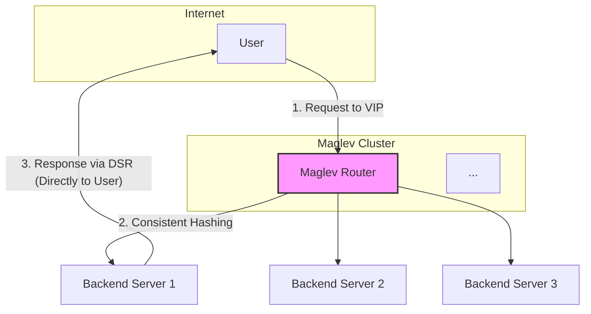

When operating at the scale of a company like Google, traditional load balancers become a bottleneck. To solve this, Google developed **Maglev**, a large, distributed software-based network load balancer. Unlike conventional hardware load balancers, Maglev runs on commodity Linux servers and is designed for ultra-high performance and resilience.

The key innovation behind Maglev is its approach to **consistent hashing**. It ensures that traffic is spread evenly across backend servers while minimizing disruptions when the set of backends changes. This article explores the architecture of Maglev, its unique hashing algorithm, and why it's so effective for large-scale systems.

### The Problem with Traditional Load Balancing

Traditional load balancers often use a simple hash-based approach to distribute traffic. For example, they might compute `hash(packet_info) % N`, where `N` is the number of backend servers. This works well until `N` changes.

*   **If a backend server is added or removed**, `N` changes, and the result of the modulo operation changes for almost every packet. This causes a massive reshuffling of traffic. For example, a user who was consistently connected to Server A might suddenly be sent to Server B, invalidating their session or causing cache misses. This is not "consistent."

**Consistent hashing** was developed to solve this problem, but standard consistent hashing algorithms can lead to uneven load distribution, especially in a dynamic environment. Maglev introduces a new variant of consistent hashing designed for superior load balancing and stability.

### Maglev's Architecture

Maglev is not a single machine but a cluster of "Maglev routers" that act as a single, highly available load balancer.

1.  **Packet Forwarding**: Each Maglev router uses BGP (Border Gateway Protocol) to announce to the upstream routers that it is the destination for the service's Virtual IP (VIP). This means any of the Maglev routers can receive packets for the service.
2.  **Consistent Hashing**: When a Maglev router receives a packet, it doesn't look at the current load on the backends. Instead, it uses a consistent hashing algorithm to deterministically select a backend server based on the packet's 5-tuple (source IP, source port, destination IP, destination port, protocol). This ensures that all packets from the same connection (e.g., a TCP session) are always sent to the same backend server.
3.  **Direct Server Return (DSR)**: To avoid becoming a bottleneck for response traffic, Maglev uses DSR. The Maglev router encapsulates the incoming packet and forwards it to the chosen backend. The backend server processes the request and sends the response directly back to the user, bypassing the Maglev router.



### The Maglev Hashing Algorithm

This is the core of Maglev's innovation. It provides better load distribution and stability than traditional consistent hashing.

**The Goal**: To assign each backend server a set of "preferences" for which packets it wants to receive. The algorithm then ensures that each backend gets its preferred share of traffic.

**The Process:**

1.  **Generate Permutations**: For each backend server, Maglev generates a "permutation" list. This is a list of numbers from 0 to `M-1` (where `M` is a large prime number, the "lookup table size"), shuffled in a unique but deterministic way for each backend. This is done by using two different hash functions for each backend to create a sequence.
    *   `offset = hash1(backend_name) % M`
    *   `skip = hash2(backend_name) % (M-1) + 1`
    *   The permutation is generated by `(offset + i * skip) % M` for `i` from 0 to `M-1`.

2.  **Populate the Lookup Table**: Maglev creates a lookup table of size `M`. It then iterates through this table, filling each entry with the name of a backend server. It does this by going through the permutation lists of all backends, one preference at a time, until the table is full.

    *   For each entry `j` from 0 to `M-1`:
        *   Look at the `j`-th preference of every backend.
        *   Find a backend whose `j`-th preference has not yet been used to claim an entry in the lookup table.
        *   Assign that backend to the current entry `j`.
        *   Mark that preference as "taken" for that backend.
        *   Repeat until the lookup table is full.

3.  **Packet Forwarding**: When a packet arrives, the Maglev router calculates `hash(packet_5_tuple) % M`. This gives an index into the lookup table. The router forwards the packet to the backend server stored at that index.

**Why this works so well:**

*   **Even Load Distribution**: Because the permutations are random and the population process is fair, each backend server will be assigned a number of slots in the lookup table that is almost perfectly proportional to its weight (all servers are weighted equally in the base case).
*   **Minimal Disruption (Consistency)**: If a backend server is removed, only its entries in the lookup table are repopulated by the remaining backends. The entries for the healthy backends do not change. This means that connections to healthy servers are not disrupted.

### Go Example: Simplified Maglev Hashing

This example demonstrates the core logic of generating permutations and populating the lookup table.

```go
package main

import (
	"fmt"
	"hash/fnv"
)

// MaglevHasher holds the state for the hashing algorithm.
type MaglevHasher struct {
	backends     []string
	lookupTable  []int // Stores the index of the backend
	lookupSize   int
	permutations [][]int
}

// NewMaglevHasher creates a new Maglev hasher.
func NewMaglevHasher(backends []string, lookupSize int) *MaglevHasher {
	m := &MaglevHasher{
		backends:    backends,
		lookupSize:  lookupSize,
		lookupTable: make([]int, lookupSize),
	}
	m.generatePermutations()
	m.populateLookupTable()
	return m
}

func (m *MaglevHasher) generatePermutations() {
	m.permutations = make([][]int, len(m.backends))
	for i, backend := range m.backends {
		// Use two different hash functions to generate offset and skip
		h1 := fnv.New32a()
		h1.Write([]byte(backend + "_offset"))
		offset := int(h1.Sum32()) % m.lookupSize

		h2 := fnv.New32a()
		h2.Write([]byte(backend + "_skip"))
		skip := int(h2.Sum32())%(m.lookupSize-1) + 1

		m.permutations[i] = make([]int, m.lookupSize)
		for j := 0; j < m.lookupSize; j++ {
			m.permutations[i][j] = (offset + j*skip) % m.lookupSize
		}
	}
}

func (m *MaglevHasher) populateLookupTable() {
	next := make([]int, len(m.backends)) // Tracks the next preference for each backend
	for i := range m.lookupTable {
		m.lookupTable[i] = -1 // Initialize with -1
	}

	filledCount := 0
	for filledCount < m.lookupSize {
		for i := 0; i < len(m.backends); i++ {
			// Get the current preference for this backend
			c := m.permutations[i][next[i]]
			
			// If this slot in the lookup table is still empty, claim it
			for m.lookupTable[c] != -1 {
				next[i]++
				c = m.permutations[i][next[i]]
			}

			m.lookupTable[c] = i
			next[i]++
			filledCount++
			if filledCount == m.lookupSize {
				return
			}
		}
	}
}

// Get returns the backend for a given key (e.g., packet hash).
func (m *MaglevHasher) Get(key string) string {
	h := fnv.New32a()
	h.Write([]byte(key))
	index := int(h.Sum32()) % m.lookupSize
	backendIndex := m.lookupTable[index]
	return m.backends[backendIndex]
}

func main() {
	backends := []string{"BackendA", "BackendB", "BackendC"}
	lookupSize := 13 // A small prime number for demonstration

	maglev := NewMaglevHasher(backends, lookupSize)

	fmt.Println("Lookup Table:", maglev.lookupTable)

	// Count how many slots each backend got
	counts := make(map[string]int)
	for _, backendIndex := range maglev.lookupTable {
		counts[backends[backendIndex]]++
	}
	fmt.Println("Slot counts:", counts)

	// Simulate some traffic
	fmt.Printf("Packet 'conn123' -> %s\n", maglev.Get("conn123"))
	fmt.Printf("Packet 'conn456' -> %s\n", maglev.Get("conn456"))
}
```

### Conclusion

Maglev is a powerful example of how to solve large-scale infrastructure problems with clever software design. By creating a specialized consistent hashing algorithm, it achieves two critical goals for a network load balancer: **even load distribution** and **high resilience**. The permutation-based approach ensures that every backend gets its fair share of traffic, and the consistent nature of the lookup table minimizes disruption when the backend pool changes. This combination of performance and stability is what makes Maglev a foundational piece of Google's network infrastructure and a key pattern in modern system design.