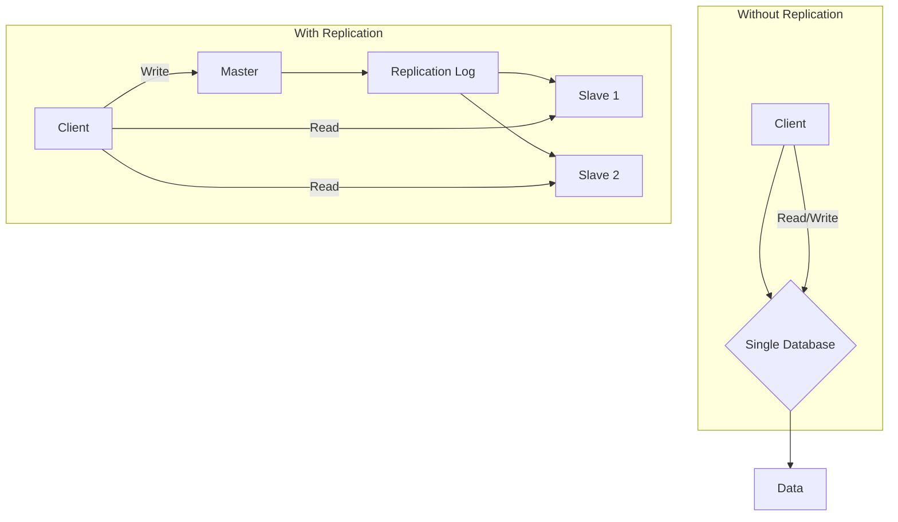
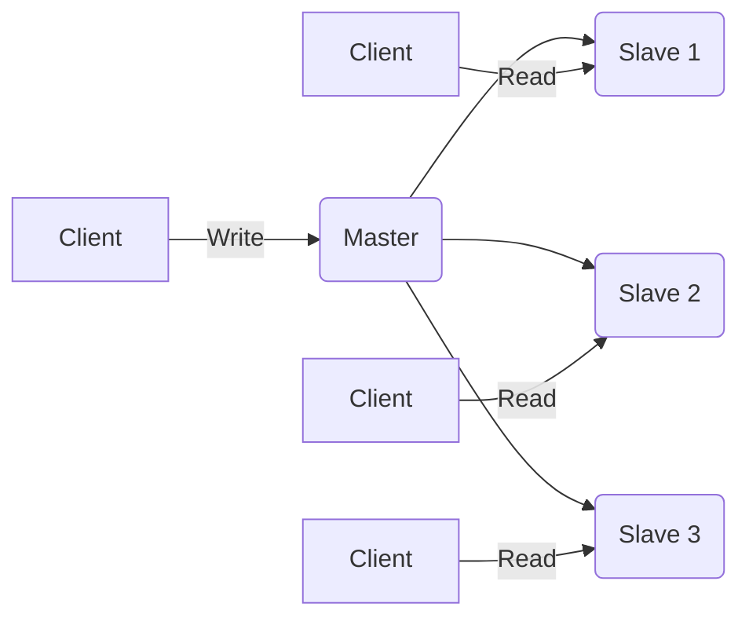
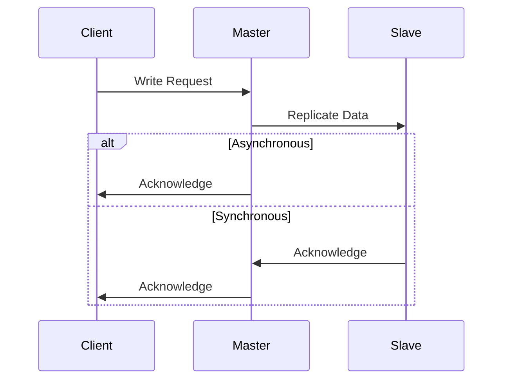

## Introduction to Data Replication

Data replication is the process of storing the same data on multiple servers. This is a fundamental concept in distributed systems, and it's the secret sauce behind many of the highly available and scalable applications we use every day.

### What is Data Replication?

At its core, replication is about creating and maintaining multiple copies of your data. Instead of having a single database that handles all requests, you have a primary database and several replicas.

### Why is it Important?

Replication serves several critical purposes:

*   **High Availability:** If one server fails, another can take its place, ensuring the system remains operational.
*   **Scalability:** By distributing read requests across multiple replicas, you can handle a much higher volume of traffic.
*   **Disaster Recovery:** Replicas can be located in different geographical regions, protecting your data from regional outages.



## Core Concepts of Master-Slave Replication

In a master-slave setup, one server acts as the **master** (or primary), and one or more servers act as **slaves** (or replicas).

*   **The Master:** The master is the single source of truth. It handles all write operations (e.g., `INSERT`, `UPDATE`, `DELETE`).
*   **The Slaves:** Slaves are read-only replicas of the master. They receive data updates from the master and apply them to their own data set.
*   **Replication Log:** The master records all data changes in a special log called the replication log (or binlog in MySQL). Slaves read this log to stay in sync.

## Benefits of Master-Slave Replication

### Read Scalability

As your application grows, you'll likely have far more read requests than write requests. With master-slave replication, you can offload all read queries to the slaves, freeing up the master to handle writes.



### High Availability

If the master server goes down, you can promote one of the slaves to be the new master. This process, known as **failover**, ensures that your application remains available.

## Types of Replication

There are three main types of master-slave replication, each with its own trade-offs between performance and consistency.

### Asynchronous Replication

In asynchronous replication, the master sends data to the slaves and doesn't wait for a confirmation. This is the most common type of replication because it has the lowest impact on performance.

*   **Pros:** High performance, low latency for writes.
*   **Cons:** Potential for data loss if the master fails before the data has been replicated to the slaves.

### Synchronous Replication

In synchronous replication, the master waits for at least one slave to confirm that it has received and applied the data before acknowledging the write to the client.

*   **Pros:** Guarantees data consistency between the master and the slave.
*   **Cons:** Higher latency for writes, as the master has to wait for the slave.

### Semi-Synchronous Replication

Semi-synchronous replication is a hybrid approach. The master waits for at least one slave to acknowledge receipt of the data, but it doesn't wait for the slave to apply it.

*   **Pros:** Better data durability than asynchronous replication, with less of a performance hit than synchronous replication.
*   **Cons:** Still has some performance overhead compared to asynchronous replication.



## Implementation in Go

Let's build a simple key-value store in Go that uses master-slave replication.

### The Master Server

The master will handle `SET` commands and write them to a replication log.

```go
package main

import (
    "bufio"
    "fmt"
    "net"
    "strings"
    "sync"
)

var (
    data = make(map[string]string)
    mut  = &sync.RWMutex{}
)

func handleConnection(conn net.Conn) {
    defer conn.Close()
    scanner := bufio.NewScanner(conn)
    for scanner.Scan() {
        line := scanner.Text()
        parts := strings.Fields(line)
        if len(parts) == 0 {
            continue
        }

        command := parts[0]
        switch command {
        case "SET":
            if len(parts) != 3 {
                conn.Write([]byte("ERR wrong number of arguments for 'set' command\n"))
                continue
            }
            key, value := parts[1], parts[2]
            mut.Lock()
            data[key] = value
            mut.Unlock()
            conn.Write([]byte("OK\n"))
        case "GET":
            if len(parts) != 2 {
                conn.Write([]byte("ERR wrong number of arguments for 'get' command\n"))
                continue
            }
            key := parts[1]
            mut.RLock()
            value, ok := data[key]
            mut.RUnlock()
            if !ok {
                conn.Write([]byte("(nil)\n"))
            } else {
                conn.Write([]byte(fmt.Sprintf("%s\n", value)))
            }
        default:
            conn.Write([]byte(fmt.Sprintf("ERR unknown command '%s'\n", command)))
        }
    }
}

func main() {
    listener, err := net.Listen("tcp", ":6379")
    if err != nil {
        fmt.Println("Error starting server:", err)
        return
    }
    defer listener.Close()

    fmt.Println("Master server started on :6379")

    for {
        conn, err := listener.Accept()
        if err != nil {
            fmt.Println("Error accepting connection:", err)
            continue
        }
        go handleConnection(conn)
    }
}
```

This is a simplified example, but it demonstrates the basic principles of a master server. A real-world implementation would need to handle replication, failover, and many other complexities.

## Conclusion

Master-slave replication is a powerful technique for building scalable and reliable systems. By understanding the trade-offs between different replication strategies, you can choose the right approach for your application.
