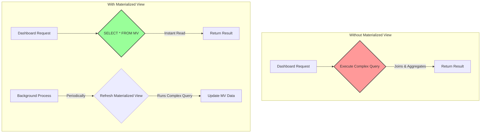

## Introduction: Pre-computation for Speed

In the world of database optimization, we spend a lot of time fine-tuning queries, adding indexes, and restructuring data. But what if you could just pre-compute the result of a complex, expensive query and store it for later? What if you could trade a little bit of storage and data freshness for a massive gain in read speed?

That's the core idea behind a **Materialized View**.

Unlike a regular view, which is just a stored query that runs every time you access it, a materialized view is a physical object that stores the full result set of its defining query. When you query a materialized view, you are not re-running the complex query; you are simply reading from a pre-computed table. It's the database equivalent of caching.

## How Do Materialized Views Work?

Let's say you run a popular e-commerce site and you have a dashboard that shows the total sales per product category for the last month. This requires joining your `sales`, `products`, and `categories` tables and performing an aggregation. This can be a slow query, especially if you have millions of sales records.

**The Expensive Query:**
```sql
SELECT
    c.category_name,
    SUM(s.sale_amount) AS total_sales,
    COUNT(s.id) AS number_of_sales
FROM sales s
JOIN products p ON s.product_id = p.id
JOIN categories c ON p.category_id = c.id
WHERE s.sale_date >= NOW() - INTERVAL '1 month'
GROUP BY c.category_name
ORDER BY total_sales DESC;
```

Running this query every time the dashboard is loaded is inefficient. Instead, we can create a materialized view.

**Creating the Materialized View:**
```sql
CREATE MATERIALIZED VIEW monthly_category_sales AS
SELECT
    c.category_name,
    SUM(s.sale_amount) AS total_sales,
    COUNT(s.id) AS number_of_sales
FROM sales s
-- ... same query as above ...
GROUP BY c.category_name;
```

Now, the database executes this complex query *once* and stores the results in a new, table-like object called `monthly_category_sales`.

To get the data for our dashboard, we now run a simple, lightning-fast query:
```sql
SELECT * FROM monthly_category_sales ORDER BY total_sales DESC;
```
This is just a `SELECT` from a small, pre-aggregated table. The performance difference can be orders of magnitude.



## The Catch: Keeping the Data Fresh

The biggest challenge with materialized views is **staleness**. The data in the view is a snapshot from the last time it was refreshed. It does not automatically update when the underlying base tables (`sales`, `products`) change.

You are responsible for deciding how and when to update it. This is called **refreshing** the view.

There are two main strategies for refreshing:

### 1. Manual Refresh (`REFRESH MATERIALIZED VIEW`)

This is the most common method. You explicitly tell the database to re-run the view's query and replace its contents.

```sql
REFRESH MATERIALIZED VIEW monthly_category_sales;
```

This command completely recalculates the view. It can be slow and resource-intensive, so you typically run it on a schedule (e.g., every hour or once a night) using a cron job or a database scheduler.

**Pros:** Simple to manage.
**Cons:** Data can be significantly stale, depending on the refresh interval. The refresh process can lock the view, making it unavailable.

### 2. Incremental / On-Trigger Refresh

Some database systems (like Oracle or using triggers in PostgreSQL) support more advanced refresh mechanisms. For example, you can set up triggers on the base tables (`sales`, `products`) so that every time a row is inserted, updated, or deleted, a function is called to update the corresponding aggregate in the materialized view.

**Pros:** Data is always (or nearly always) up-to-date.
**Cons:** Much more complex to implement. It adds overhead to every write operation on the base tables, which can slow down your application's write performance.

## Go Example: Managing a Refresh Cycle

Let's simulate a simple background service in Go that periodically refreshes a materialized view.

```go
package main

import (
	"database/sql"
	"fmt"
	"log"
	"time"

	_ "github.com/lib/pq" // PostgreSQL driver
)

// connectDB establishes a connection to the database.
func connectDB() *sql.DB {
	// Replace with your actual connection string
	connStr := "user=postgres password=secret dbname=mydatabase sslmode=disable"
	db, err := sql.Open("postgres", connStr)
	if err != nil {
		log.Fatal(err)
	}
	return db
}

// refreshMaterializedView executes the refresh command.
func refreshMaterializedView(db *sql.DB, viewName string) {
	log.Printf("Starting refresh for materialized view: %s", viewName)
	
	startTime := time.Now()
	
	// The CONCURRENTLY option in PostgreSQL allows reads on the view while it's refreshing.
	// It requires the view to have a UNIQUE index.
	// For simplicity, we'll use the standard refresh here.
	query := fmt.Sprintf("REFRESH MATERIALIZED VIEW %s;", viewName)
	
	_, err := db.Exec(query)
	if err != nil {
		log.Printf("ERROR: Failed to refresh view %s: %v", viewName, err)
		return
	}
	
	duration := time.Since(startTime)
	log.Printf("Successfully refreshed view %s in %s", viewName, duration)
}

func main() {
	db := connectDB()
	defer db.Close()

	// The name of our materialized view
	viewName := "monthly_category_sales"

	// Create a ticker that fires every hour
	ticker := time.NewTicker(1 * time.Hour)
	defer ticker.Stop()

	// Run the refresh once immediately at startup
	go refreshMaterializedView(db, viewName)

	// Start a loop to run the refresh on each tick
	for range ticker.C {
		go refreshMaterializedView(db, viewName)
	}

	// Keep the main goroutine alive
	log.Println("Materialized view refresh scheduler started. Waiting for ticks...")
	select {}
}
```
*This example uses a simple ticker. In a production system, you might use a more robust job scheduling library like `gocron` or an external tool like `pg_cron`.*

## When Should You Use a Materialized View?

Materialized views are a powerful tool, but they are not a silver bullet. Use them when:

1.  **You have a complex, slow, and frequently executed read query.** This is the primary use case. The query involves large joins, aggregations, or both.
2.  **The results of the query do not need to be 100% real-time.** Your application can tolerate some data staleness (e.g., a dashboard that's updated hourly is perfectly acceptable).
3.  **The underlying data does not change too frequently.** If the base tables are written to thousands of times per second, the cost of refreshing the view might outweigh the benefits.
4.  **You are building a data warehouse or a reporting database.** These are classic use cases where complex aggregations are the norm.

## Conclusion

Materialized views are a fantastic optimization technique that embodies the classic space-time tradeoff. You use more disk space (to store the pre-computed results) and accept a degree of data staleness in exchange for dramatically faster read queries.

When used appropriately for reporting, dashboards, and summarizing large datasets, they can provide a significant performance boost that would be difficult to achieve with indexing alone. The key is to carefully manage the refresh strategy to balance the need for performance with the tolerance for stale data.
