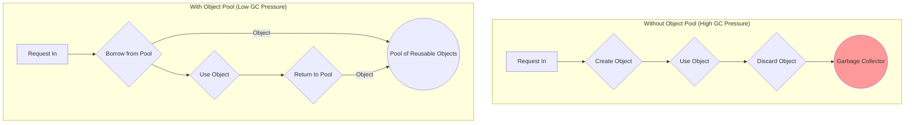

## System Design: Memory Management with Object Pools

In high-performance, high-throughput applications, memory allocation and deallocation can become a significant performance bottleneck. In garbage-collected languages like Go, creating and discarding large numbers of short-lived objects puts pressure on the garbage collector (GC). When the GC runs, it can cause brief "stop-the-world" pauses, leading to increased latency and unpredictable performance.

The **Object Pool Pattern** is a memory management technique designed to mitigate this problem. Instead of creating new objects on demand and letting the GC clean them up later, you pre-allocate a "pool" of objects. When you need an object, you borrow one from the pool. When you're done with it, you return it to the pool for later reuse, rather than discarding it.

This pattern is all about recycling. By reusing objects, you dramatically reduce the number of allocations and, consequently, the amount of work the garbage collector has to do.

### When Should You Use an Object Pool?

Object pooling is a powerful but specialized tool. It's not something you should apply everywhere. It's most effective when:

1.  **Objects are expensive to create:** The cost of creating an object is high. This could be due to complex calculations, network calls, or significant memory allocation.
2.  **Objects are created frequently and have a short lifespan:** You have a "hot path" in your code that allocates and discards many objects in a tight loop.
3.  **The number of objects in use at any time is manageable:** The total number of objects needed concurrently is predictable and doesn't grow indefinitely.
4.  **You are demonstrably suffering from GC pressure:** You have used profiling tools (like Go's `pprof`) and have confirmed that a significant amount of time is being spent in garbage collection, and that this is causing performance problems.

A classic example is a worker pool processing incoming network requests. Each request might require a temporary buffer or a context object. Creating and destroying these for every single request can be very inefficient.



### The `sync.Pool` in Go

Go's standard library provides a built-in, concurrency-safe implementation of an object pool: `sync.Pool`. It's designed specifically for managing temporary objects that can be shared and reused across different goroutines.

Key characteristics of `sync.Pool`:
-   **Concurrency-Safe:** You can safely `Get()` and `Put()` objects from multiple goroutines simultaneously.
-   **Not a Permanent Cache:** `sync.Pool` is designed for temporary objects. The GC may decide to clear all the objects from a pool at any time, especially between major GC cycles. This means you cannot use it as a durable cache.
-   **`New` Function:** You can provide a `New` function that the pool will use to create a new object if it's empty when you call `Get()`.

### Go Example: Using `sync.Pool` for a Buffer

Let's imagine a service that processes incoming data chunks. Each chunk needs a temporary buffer to be processed. We can use `sync.Pool` to reuse these buffers.

```go
package main

import (
	"bytes"
	"log"
	"sync"
	"time"
)

// We create a pool of bytes.Buffer objects.
// A bytes.Buffer is a good candidate because it's a common need for I/O,
// and creating them involves some initial memory allocation.
var bufferPool = sync.Pool{
	// New is called when Get() is called and the pool is empty.
	New: func() interface{} {
		log.Println("Allocating a new buffer")
		return new(bytes.Buffer)
	},
}

// processData simulates processing a chunk of data using a buffer.
func processData(data []byte) {
	// 1. Get a buffer from the pool.
	// This will either reuse an old one or create a new one via the `New` func.
	buffer := bufferPool.Get().(*bytes.Buffer)
	
	// 2. IMPORTANT: Reset the buffer before using it.
	// The buffer you get from the pool is in whatever state it was left in.
	buffer.Reset()

	// 3. Use the buffer for some work.
	buffer.Write(data)
	log.Printf("Processing data: %s", buffer.String())

	// 4. Return the buffer to the pool when done.
	// This makes it available for the next call.
	defer bufferPool.Put(buffer)
}

func main() {
	log.Println("--- First Round of Processing ---")
	// The first 3 calls will likely trigger the `New` function
	// as the pool is empty.
	processData([]byte("data1"))
	processData([]byte("data2"))
	processData([]byte("data3"))

	// Give the GC a chance to run. In a real app, this is not guaranteed,
	// but it helps demonstrate that the pool is not a permanent cache.
	// runtime.GC()

	log.Println("\n--- Second Round of Processing ---")
	// These calls should now reuse the buffers that were returned to the pool.
	// You should not see "Allocating a new buffer" printed this time.
	processData([]byte("data4"))
	processData([]byte("data5"))
	processData([]byte("data6"))
}
```
When you run this code, you'll notice that "Allocating a new buffer" is printed for the first few calls, but not for the later ones. The later calls are efficiently reusing the buffers that were returned to the pool.

### Pitfalls and Best Practices

1.  **Don't Pool Everything:** Overusing object pools can make code more complex and harder to read for negligible performance gain. Profile your application first! Only optimize what is proven to be a bottleneck.
2.  **Reset Pooled Objects:** The object you get from a pool is not "new." It contains the data from its last use. Always reset an object's state before using it. Forgetting this is a common source of bugs.
3.  **Don't Pool Connections:** Do not use `sync.Pool` for objects that have a persistent state or need explicit closing, like database connections or network sockets. These require their own dedicated connection pools that manage their lifecycle correctly. `sync.Pool` is for stateless, temporary objects.
4.  **Beware of Memory Leaks:** If you `Get()` an object but forget to `Put()` it back, the pool will eventually empty, and you'll lose the benefit of pooling. The object will still be garbage collected eventually, but the goal of reuse is defeated.

### Conclusion

The Object Pool pattern, and Go's `sync.Pool` in particular, is a powerful tool for optimizing high-performance applications. By recycling temporary objects, you can significantly reduce memory allocation churn and ease the pressure on the garbage collector, leading to lower latency and more predictable performance. However, it's a specialized pattern that should be used judiciously. Always profile your application to identify true memory bottlenecks before reaching for an object pool, and when you do, be sure to follow best practices like resetting object state to avoid subtle bugs.
---
