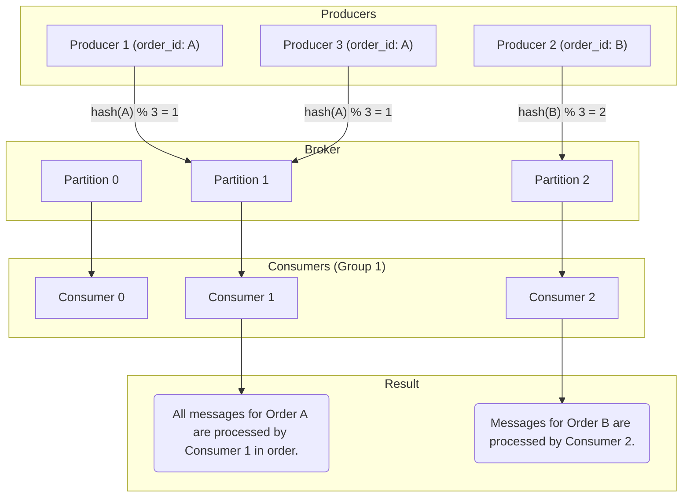

## Introduction: The "Out-of-Order" Problem

When building systems that rely on a sequence of events, the order in which those events are processed is often critical. Consider an e-commerce system:

1.  `OrderCreated`
2.  `PaymentProcessed`
3.  `OrderShipped`

If these messages are processed out of order (e.g., `OrderShipped` before `PaymentProcessed`), the system's logic breaks down, leading to incorrect state and bugs.

While a single, simple queue might seem to guarantee First-In, First-Out (FIFO) ordering, the reality of modern, distributed messaging systems is far more complex. By default, **most high-throughput message queues do not guarantee strict FIFO ordering across the board.** This article explains why and explores patterns to enforce ordering when you need it.

## Why is Ordering So Hard?

Achieving strict, global FIFO ordering is difficult because it conflicts directly with scalability and high availability. Several factors conspire to jumble the sequence of messages:

1.  **Producer Parallelism:** If you have multiple instances of a service producing messages (e.g., multiple web servers handling user requests), there's no way to guarantee the order in which their messages arrive at the broker. Network latency is unpredictable. A message sent first might arrive second.
2.  **Consumer Parallelism:** To achieve high throughput, you typically have multiple consumers reading from the same queue. The broker distributes messages among them. One consumer might get message #1 and take a long time to process it, while another consumer quickly processes messages #2, #3, and #4.
3.  **Retries and Failures:** As we've discussed, when a consumer fails to process a message, it's often re-queued. This re-queued message is now at the "back of the line" and will be processed long after later messages have already been completed.
4.  **Broker Sharding/Partitioning:** High-performance brokers like Kafka and RabbitMQ achieve scalability by partitioning a single logical topic into multiple smaller, independent queues (partitions). There are no ordering guarantees *between* partitions.

Global ordering creates a single point of contention, a bottleneck that limits the entire system's throughput to what a single consumer can handle.

## Strategy 1: Partitioning with a Key

This is the most common and powerful pattern for achieving ordering, famously used by Apache Kafka. Instead of trying to order all messages globally, you only enforce ordering for messages that *need* to be ordered relative to each other.

You achieve this by defining a **Partition Key**. The broker guarantees that all messages with the same partition key will always be sent to the same partition, and therefore consumed by the same consumer (at any given time).

### How it Works

1.  **Identify the Key:** For each message, you provide a key that represents the "thing" you want to order by. In our e-commerce example, the `order_id` is the perfect partition key.
2.  **Producer Hashes the Key:** The producer doesn't choose a partition randomly. It calculates `hash(partition_key) % number_of_partitions` to deterministically select a partition.
3.  **Broker Guarantees:** The broker ensures that all messages for a given partition are stored in strict FIFO order within that partition. It will only allow one consumer from a consumer group to read from that partition at a time.

This gives you a powerful guarantee: **All messages for the same `order_id` will be processed sequentially.** However, there is no ordering guarantee between different `order_id`s, which is perfectly fine and allows for massive parallel processing.



## Strategy 2: Single Consumer

The simplest, but least scalable, way to guarantee ordering is to have only **one consumer instance** processing messages from a queue. If there's only one worker, there's no parallelism, and messages will be processed in the order they are delivered.

This is often used for low-volume, critical tasks where scalability is not the primary concern. However, it creates a single point of failure and a performance bottleneck. If that consumer fails, processing stops entirely.

## Strategy 3: Reordering on the Consumer Side

In some cases, you can shift the responsibility for ordering to the consumer. This is more complex but can be useful if you can't control the partitioning scheme.

The producer stamps each message with a **sequence number**.

*   `{ "order_id": "A", "event": "OrderCreated", "sequence": 1 }`
*   `{ "order_id": "A", "event": "PaymentProcessed", "sequence": 2 }`
*   `{ "order_id": "A", "event": "OrderShipped", "sequence": 3 }`

The consumer's job is now more complex. It must:
1.  Maintain the state of the last processed sequence number for each `order_id`.
2.  If it receives a message with the *next* expected sequence number, it processes it.
3.  If it receives a message with a future sequence number, it must **buffer** it (e.g., in a local database or cache) and wait for the missing message(s) to arrive.
4.  This requires a mechanism to handle timeouts and missing messages.

This approach is difficult to implement correctly and adds significant complexity to the consumer. It's generally better to use the partition key strategy if the message broker supports it.

## Go Example: Producing with a Partition Key

This conceptual example shows how a producer might use a partition key. We'll simulate the hashing logic that a real Kafka client would perform.

```go
package main

import (
	"fmt"
	"hash/fnv"
)

// Message represents a message to be sent.
type Message struct {
	PartitionKey string
	Payload      string
}

// Broker simulates a partitioned message broker.
type Broker struct {
	PartitionCount int
	Partitions     map[int][]Message
}

func NewBroker(partitionCount int) *Broker {
	b := &Broker{
		PartitionCount: partitionCount,
		Partitions:     make(map[int][]Message),
	}
	for i := 0; i < partitionCount; i++ {
		b.Partitions[i] = []Message{}
	}
	return b
}

// getPartition deterministically finds the partition for a key.
func (b *Broker) getPartition(key string) int {
	h := fnv.New32a()
	h.Write([]byte(key))
	hashValue := h.Sum32()
	return int(hashValue % uint32(b.PartitionCount))
}

// Produce sends a message to the correct partition.
func (b *Broker) Produce(msg Message) {
	partitionIndex := b.getPartition(msg.PartitionKey)
	b.Partitions[partitionIndex] = append(b.Partitions[partitionIndex], msg)
	fmt.Printf("Sent message for key '%s' to partition %d\n", msg.PartitionKey, partitionIndex)
}

func main() {
	broker := NewBroker(4) // 4 partitions

	messages := []Message{
		{PartitionKey: "order-123", Payload: "Event: OrderCreated"},
		{PartitionKey: "order-456", Payload: "Event: OrderCreated"},
		{PartitionKey: "order-123", Payload: "Event: PaymentProcessed"},
		{PartitionKey: "order-789", Payload: "Event: OrderCreated"},
		{PartitionKey: "order-123", Payload: "Event: OrderShipped"},
	}

	for _, msg := range messages {
		broker.Produce(msg)
	}

	fmt.Println("\n--- Broker State ---")
	for i := 0; i < broker.PartitionCount; i++ {
		fmt.Printf("Partition %d:\n", i)
		for _, msg := range broker.Partitions[i] {
			fmt.Printf("  - Key: %s, Payload: %s\n", msg.PartitionKey, msg.Payload)
		}
	}
}
```

Running this code will show that all messages for `order-123` landed in the same partition, preserving their relative order, while messages for other orders were sent to different partitions.

## Conclusion

Message ordering is a classic trade-off between correctness and performance. While global ordering is a scalability killer, the **partition key pattern** provides a powerful and scalable compromise. It allows you to achieve strict ordering where it matters—for a specific entity—while still allowing the system as a whole to process a massive volume of messages in parallel. When designing an event-driven system, always ask: "Does the order of these messages matter?" If so, a partition key is likely your answer.
