# System Design Fundamentals: Message Queues and Async Communication

Message queues are a fundamental component of distributed systems that enable asynchronous communication between services. They decouple producers and consumers, allowing systems to handle varying loads and improve reliability.

## Why Message Queues?

```mermaid
graph LR
    subgraph Without Message Queue
        A1[Service A] -->|Direct Call| B1[Service B]
        B1 -->|Must be available| C1[❌ Tight Coupling]
    end
    
    subgraph With Message Queue
        A2[Service A] -->|Publish| MQ[Message Queue]
        MQ -->|Subscribe| B2[Service B]
        MQ -->|Buffering| D2[✅ Decoupled]
    end
    
    style MQ fill:#e1f5fe
    style D2 fill:#e8f5e8
    style C1 fill:#ffebee
```



## Core Message Queue Implementation

```go
// Production-Ready Message Queue Implementation
package main

import (
    "context"
    "fmt"
    "sync"
    "time"
)

type Message struct {
    ID          string
    Topic       string
    Payload     []byte
    Headers     map[string]string
    Timestamp   time.Time
    Attempts    int
    MaxRetries  int
    Priority    int
    ExpiresAt   *time.Time
}

type MessageQueue struct {
    queues          map[string]*Queue
    dlq             *DeadLetterQueue
    metrics         *QueueMetrics
    mutex           sync.RWMutex
    shutdown        chan struct{}
}

type Queue struct {
    name            string
    messages        chan *Message
    subscribers     []*Subscriber
    config          QueueConfig
    mutex           sync.RWMutex
}

type QueueConfig struct {
    MaxSize         int
    MaxRetries      int
    VisibilityTimeout time.Duration
    MessageTTL      time.Duration
}

type Subscriber struct {
    ID              string
    Queue           string
    Handler         MessageHandler
    Concurrency     int
    Active          bool
    ProcessedCount  int64
    ErrorCount      int64
    mutex           sync.Mutex
}

type MessageHandler func(context.Context, *Message) error

type QueueMetrics struct {
    published       map[string]int64
    consumed        map[string]int64
    failed          map[string]int64
    inFlight        map[string]int64
    mutex           sync.RWMutex
}

type DeadLetterQueue struct {
    messages        []*Message
    maxSize         int
    mutex           sync.RWMutex
}

func NewMessageQueue() *MessageQueue {
    mq := &MessageQueue{
        queues:   make(map[string]*Queue),
        dlq:      NewDeadLetterQueue(10000),
        metrics:  NewQueueMetrics(),
        shutdown: make(chan struct{}),
    }
    
    // Start monitoring goroutine
    go mq.monitor()
    
    return mq
}

func NewQueueMetrics() *QueueMetrics {
    return &QueueMetrics{
        published: make(map[string]int64),
        consumed:  make(map[string]int64),
        failed:    make(map[string]int64),
        inFlight:  make(map[string]int64),
    }
}

func NewDeadLetterQueue(maxSize int) *DeadLetterQueue {
    return &DeadLetterQueue{
        messages: make([]*Message, 0),
        maxSize:  maxSize,
    }
}

func (mq *MessageQueue) CreateQueue(name string, config QueueConfig) error {
    mq.mutex.Lock()
    defer mq.mutex.Unlock()
    
    if _, exists := mq.queues[name]; exists {
        return fmt.Errorf("queue %s already exists", name)
    }
    
    queue := &Queue{
        name:        name,
        messages:    make(chan *Message, config.MaxSize),
        subscribers: make([]*Subscriber, 0),
        config:      config,
    }
    
    mq.queues[name] = queue
    
    fmt.Printf("✅ Created queue: %s (size: %d, retries: %d)\n", 
        name, config.MaxSize, config.MaxRetries)
    
    return nil
}

func (mq *MessageQueue) Publish(queueName string, msg *Message) error {
    mq.mutex.RLock()
    queue, exists := mq.queues[queueName]
    mq.mutex.RUnlock()
    
    if !exists {
        return fmt.Errorf("queue %s does not exist", queueName)
    }
    
    // Set message defaults
    if msg.ID == "" {
        msg.ID = fmt.Sprintf("msg-%d", time.Now().UnixNano())
    }
    if msg.Timestamp.IsZero() {
        msg.Timestamp = time.Now()
    }
    msg.Topic = queueName
    msg.MaxRetries = queue.config.MaxRetries
    
    // Set expiration
    if queue.config.MessageTTL > 0 {
        expires := time.Now().Add(queue.config.MessageTTL)
        msg.ExpiresAt = &expires
    }
    
    // Try to enqueue
    select {
    case queue.messages <- msg:
        mq.metrics.incrementPublished(queueName)
        fmt.Printf("📤 Published message %s to queue %s\n", msg.ID, queueName)
        return nil
    default:
        return fmt.Errorf("queue %s is full", queueName)
    }
}

func (mq *MessageQueue) Subscribe(queueName, subscriberID string, handler MessageHandler, concurrency int) error {
    mq.mutex.Lock()
    queue, exists := mq.queues[queueName]
    if !exists {
        mq.mutex.Unlock()
        return fmt.Errorf("queue %s does not exist", queueName)
    }
    
    subscriber := &Subscriber{
        ID:          subscriberID,
        Queue:       queueName,
        Handler:     handler,
        Concurrency: concurrency,
        Active:      true,
    }
    
    queue.mutex.Lock()
    queue.subscribers = append(queue.subscribers, subscriber)
    queue.mutex.Unlock()
    mq.mutex.Unlock()
    
    fmt.Printf("👂 Subscriber %s subscribed to queue %s (concurrency: %d)\n", 
        subscriberID, queueName, concurrency)
    
    // Start consumer workers
    for i := 0; i < concurrency; i++ {
        go mq.consumeMessages(queue, subscriber, i)
    }
    
    return nil
}

func (mq *MessageQueue) consumeMessages(queue *Queue, subscriber *Subscriber, workerID int) {
    for {
        select {
        case <-mq.shutdown:
            return
        case msg := <-queue.messages:
            if !subscriber.Active {
                // Put message back if subscriber inactive
                select {
                case queue.messages <- msg:
                default:
                }
                continue
            }
            
            mq.processMessage(queue, subscriber, msg, workerID)
        }
    }
}

func (mq *MessageQueue) processMessage(queue *Queue, subscriber *Subscriber, msg *Message, workerID int) {
    // Check if message expired
    if msg.ExpiresAt != nil && time.Now().After(*msg.ExpiresAt) {
        fmt.Printf("⏰ Message %s expired, moving to DLQ\n", msg.ID)
        mq.dlq.Add(msg)
        return
    }
    
    mq.metrics.incrementInFlight(queue.name)
    defer mq.metrics.decrementInFlight(queue.name)
    
    fmt.Printf("🔄 Worker %d processing message %s (attempt %d/%d)\n", 
        workerID, msg.ID, msg.Attempts+1, msg.MaxRetries)
    
    msg.Attempts++
    
    // Create context with timeout
    ctx, cancel := context.WithTimeout(context.Background(), queue.config.VisibilityTimeout)
    defer cancel()
    
    // Process message
    err := subscriber.Handler(ctx, msg)
    
    if err != nil {
        subscriber.mutex.Lock()
        subscriber.ErrorCount++
        subscriber.mutex.Unlock()
        
        mq.metrics.incrementFailed(queue.name)
        
        fmt.Printf("❌ Failed to process message %s: %v\n", msg.ID, err)
        
        // Retry logic
        if msg.Attempts < msg.MaxRetries {
            // Exponential backoff
            backoff := time.Duration(1<<uint(msg.Attempts)) * 100 * time.Millisecond
            fmt.Printf("🔄 Retrying message %s after %v\n", msg.ID, backoff)
            
            time.Sleep(backoff)
            
            // Re-enqueue message
            select {
            case queue.messages <- msg:
                fmt.Printf("↩️  Message %s re-queued\n", msg.ID)
            default:
                fmt.Printf("⚠️  Queue full, message %s moved to DLQ\n", msg.ID)
                mq.dlq.Add(msg)
            }
        } else {
            fmt.Printf("💀 Message %s exceeded max retries, moving to DLQ\n", msg.ID)
            mq.dlq.Add(msg)
        }
        
        return
    }
    
    // Success
    subscriber.mutex.Lock()
    subscriber.ProcessedCount++
    subscriber.mutex.Unlock()
    
    mq.metrics.incrementConsumed(queue.name)
    
    fmt.Printf("✅ Successfully processed message %s by worker %d\n", msg.ID, workerID)
}

func (dlq *DeadLetterQueue) Add(msg *Message) {
    dlq.mutex.Lock()
    defer dlq.mutex.Unlock()
    
    if len(dlq.messages) >= dlq.maxSize {
        // Remove oldest message
        dlq.messages = dlq.messages[1:]
    }
    
    dlq.messages = append(dlq.messages, msg)
}

func (dlq *DeadLetterQueue) GetMessages() []*Message {
    dlq.mutex.RLock()
    defer dlq.mutex.RUnlock()
    
    return append([]*Message{}, dlq.messages...)
}

func (qm *QueueMetrics) incrementPublished(queue string) {
    qm.mutex.Lock()
    defer qm.mutex.Unlock()
    qm.published[queue]++
}

func (qm *QueueMetrics) incrementConsumed(queue string) {
    qm.mutex.Lock()
    defer qm.mutex.Unlock()
    qm.consumed[queue]++
}

func (qm *QueueMetrics) incrementFailed(queue string) {
    qm.mutex.Lock()
    defer qm.mutex.Unlock()
    qm.failed[queue]++
}

func (qm *QueueMetrics) incrementInFlight(queue string) {
    qm.mutex.Lock()
    defer qm.mutex.Unlock()
    qm.inFlight[queue]++
}

func (qm *QueueMetrics) decrementInFlight(queue string) {
    qm.mutex.Lock()
    defer qm.mutex.Unlock()
    qm.inFlight[queue]--
}

func (qm *QueueMetrics) GetStats(queue string) map[string]int64 {
    qm.mutex.RLock()
    defer qm.mutex.RUnlock()
    
    return map[string]int64{
        "published": qm.published[queue],
        "consumed":  qm.consumed[queue],
        "failed":    qm.failed[queue],
        "in_flight": qm.inFlight[queue],
    }
}

func (mq *MessageQueue) monitor() {
    ticker := time.NewTicker(30 * time.Second)
    defer ticker.Stop()
    
    for {
        select {
        case <-mq.shutdown:
            return
        case <-ticker.C:
            mq.printStats()
        }
    }
}

func (mq *MessageQueue) printStats() {
    mq.mutex.RLock()
    defer mq.mutex.RUnlock()
    
    fmt.Println("\n" + "═"*50)
    fmt.Println("📊 Message Queue Statistics")
    fmt.Println("═"*50)
    
    for name, queue := range mq.queues {
        stats := mq.metrics.GetStats(name)
        queueSize := len(queue.messages)
        
        fmt.Printf("\nQueue: %s\n", name)
        fmt.Printf("  Size: %d/%d\n", queueSize, queue.config.MaxSize)
        fmt.Printf("  Published: %d\n", stats["published"])
        fmt.Printf("  Consumed: %d\n", stats["consumed"])
        fmt.Printf("  Failed: %d\n", stats["failed"])
        fmt.Printf("  In Flight: %d\n", stats["in_flight"])
        fmt.Printf("  Subscribers: %d\n", len(queue.subscribers))
        
        // Subscriber stats
        for _, sub := range queue.subscribers {
            sub.mutex.Lock()
            fmt.Printf("    - %s: Processed=%d, Errors=%d\n", 
                sub.ID, sub.ProcessedCount, sub.ErrorCount)
            sub.mutex.Unlock()
        }
    }
    
    dlqSize := len(mq.dlq.GetMessages())
    fmt.Printf("\n💀 Dead Letter Queue: %d messages\n", dlqSize)
    
    fmt.Println("═"*50)
}

func (mq *MessageQueue) Shutdown() {
    close(mq.shutdown)
    fmt.Println("\n🛑 Message Queue shutting down...")
}
```

## Pub/Sub Pattern

```go
// Pub/Sub (Topic-Based) Implementation
package main

import (
    "fmt"
    "sync"
    "time"
)

type PubSubMessage struct {
    ID          string
    Topic       string
    Data        interface{}
    Attributes  map[string]string
    PublishTime time.Time
}

type TopicSubscription struct {
    ID              string
    Topic           string
    Filter          MessageFilter
    Handler         func(*PubSubMessage) error
    AckDeadline     time.Duration
    MaxRetries      int
}

type MessageFilter func(*PubSubMessage) bool

type PubSubBroker struct {
    topics          map[string]*Topic
    subscriptions   map[string]*TopicSubscription
    mutex           sync.RWMutex
}

type Topic struct {
    name            string
    messages        chan *PubSubMessage
    subscriptions   []*TopicSubscription
    retentionPeriod time.Duration
    messageHistory  []*PubSubMessage
    mutex           sync.RWMutex
}

func NewPubSubBroker() *PubSubBroker {
    return &PubSubBroker{
        topics:        make(map[string]*Topic),
        subscriptions: make(map[string]*TopicSubscription),
    }
}

func (psb *PubSubBroker) CreateTopic(name string, retentionPeriod time.Duration) error {
    psb.mutex.Lock()
    defer psb.mutex.Unlock()
    
    if _, exists := psb.topics[name]; exists {
        return fmt.Errorf("topic %s already exists", name)
    }
    
    topic := &Topic{
        name:            name,
        messages:        make(chan *PubSubMessage, 1000),
        subscriptions:   make([]*TopicSubscription, 0),
        retentionPeriod: retentionPeriod,
        messageHistory:  make([]*PubSubMessage, 0),
    }
    
    psb.topics[name] = topic
    
    // Start message broadcaster
    go psb.broadcastMessages(topic)
    
    // Start cleanup routine for message history
    go psb.cleanupHistory(topic)
    
    fmt.Printf("📢 Created topic: %s (retention: %v)\n", name, retentionPeriod)
    
    return nil
}

func (psb *PubSubBroker) Publish(topicName string, data interface{}, attributes map[string]string) error {
    psb.mutex.RLock()
    topic, exists := psb.topics[topicName]
    psb.mutex.RUnlock()
    
    if !exists {
        return fmt.Errorf("topic %s does not exist", topicName)
    }
    
    msg := &PubSubMessage{
        ID:          fmt.Sprintf("msg-%d", time.Now().UnixNano()),
        Topic:       topicName,
        Data:        data,
        Attributes:  attributes,
        PublishTime: time.Now(),
    }
    
    // Store in history for replay
    topic.mutex.Lock()
    topic.messageHistory = append(topic.messageHistory, msg)
    topic.mutex.Unlock()
    
    // Send to channel for broadcasting
    select {
    case topic.messages <- msg:
        fmt.Printf("📤 Published message %s to topic %s\n", msg.ID, topicName)
        return nil
    default:
        return fmt.Errorf("topic %s message buffer full", topicName)
    }
}

func (psb *PubSubBroker) Subscribe(topicName, subscriptionID string, filter MessageFilter, handler func(*PubSubMessage) error) error {
    psb.mutex.Lock()
    topic, exists := psb.topics[topicName]
    if !exists {
        psb.mutex.Unlock()
        return fmt.Errorf("topic %s does not exist", topicName)
    }
    
    subscription := &TopicSubscription{
        ID:          subscriptionID,
        Topic:       topicName,
        Filter:      filter,
        Handler:     handler,
        AckDeadline: 30 * time.Second,
        MaxRetries:  3,
    }
    
    topic.mutex.Lock()
    topic.subscriptions = append(topic.subscriptions, subscription)
    topic.mutex.Unlock()
    
    psb.subscriptions[subscriptionID] = subscription
    psb.mutex.Unlock()
    
    fmt.Printf("👂 Created subscription %s for topic %s\n", subscriptionID, topicName)
    
    return nil
}

func (psb *PubSubBroker) broadcastMessages(topic *Topic) {
    for msg := range topic.messages {
        topic.mutex.RLock()
        subscriptions := make([]*TopicSubscription, len(topic.subscriptions))
        copy(subscriptions, topic.subscriptions)
        topic.mutex.RUnlock()
        
        // Deliver to all matching subscriptions
        var wg sync.WaitGroup
        for _, sub := range subscriptions {
            // Apply filter if present
            if sub.Filter != nil && !sub.Filter(msg) {
                continue
            }
            
            wg.Add(1)
            go func(s *TopicSubscription) {
                defer wg.Done()
                psb.deliverMessage(s, msg)
            }(sub)
        }
        
        wg.Wait()
    }
}

func (psb *PubSubBroker) deliverMessage(sub *TopicSubscription, msg *PubSubMessage) {
    fmt.Printf("📨 Delivering message %s to subscription %s\n", msg.ID, sub.ID)
    
    for attempt := 0; attempt < sub.MaxRetries; attempt++ {
        err := sub.Handler(msg)
        if err == nil {
            fmt.Printf("✅ Subscription %s processed message %s\n", sub.ID, msg.ID)
            return
        }
        
        fmt.Printf("❌ Attempt %d/%d failed for subscription %s: %v\n", 
            attempt+1, sub.MaxRetries, sub.ID, err)
        
        if attempt < sub.MaxRetries-1 {
            backoff := time.Duration(1<<uint(attempt)) * 100 * time.Millisecond
            time.Sleep(backoff)
        }
    }
    
    fmt.Printf("💀 Message %s failed for subscription %s after %d attempts\n", 
        msg.ID, sub.ID, sub.MaxRetries)
}

func (psb *PubSubBroker) cleanupHistory(topic *Topic) {
    ticker := time.NewTicker(1 * time.Minute)
    defer ticker.Stop()
    
    for range ticker.C {
        topic.mutex.Lock()
        
        cutoff := time.Now().Add(-topic.retentionPeriod)
        newHistory := make([]*PubSubMessage, 0)
        
        for _, msg := range topic.messageHistory {
            if msg.PublishTime.After(cutoff) {
                newHistory = append(newHistory, msg)
            }
        }
        
        removed := len(topic.messageHistory) - len(newHistory)
        if removed > 0 {
            fmt.Printf("🧹 Cleaned up %d old messages from topic %s\n", removed, topic.name)
        }
        
        topic.messageHistory = newHistory
        topic.mutex.Unlock()
    }
}

func (psb *PubSubBroker) ReplayMessages(topicName, subscriptionID string, since time.Time) error {
    psb.mutex.RLock()
    topic, topicExists := psb.topics[topicName]
    sub, subExists := psb.subscriptions[subscriptionID]
    psb.mutex.RUnlock()
    
    if !topicExists {
        return fmt.Errorf("topic %s does not exist", topicName)
    }
    if !subExists {
        return fmt.Errorf("subscription %s does not exist", subscriptionID)
    }
    
    topic.mutex.RLock()
    defer topic.mutex.RUnlock()
    
    fmt.Printf("🔄 Replaying messages for %s since %v\n", subscriptionID, since)
    
    count := 0
    for _, msg := range topic.messageHistory {
        if msg.PublishTime.After(since) {
            // Apply filter if present
            if sub.Filter == nil || sub.Filter(msg) {
                go psb.deliverMessage(sub, msg)
                count++
            }
        }
    }
    
    fmt.Printf("✅ Replayed %d messages\n", count)
    
    return nil
}
```

## Priority Queue

```go
// Priority Queue Implementation
package main

import (
    "container/heap"
    "fmt"
    "sync"
    "time"
)

type PriorityMessage struct {
    ID          string
    Priority    int // Higher value = higher priority
    Payload     interface{}
    EnqueuedAt  time.Time
    index       int // For heap operations
}

type PriorityQueue []*PriorityMessage

func (pq PriorityQueue) Len() int { return len(pq) }

func (pq PriorityQueue) Less(i, j int) bool {
    // Higher priority first, if equal then FIFO
    if pq[i].Priority == pq[j].Priority {
        return pq[i].EnqueuedAt.Before(pq[j].EnqueuedAt)
    }
    return pq[i].Priority > pq[j].Priority
}

func (pq PriorityQueue) Swap(i, j int) {
    pq[i], pq[j] = pq[j], pq[i]
    pq[i].index = i
    pq[j].index = j
}

func (pq *PriorityQueue) Push(x interface{}) {
    n := len(*pq)
    msg := x.(*PriorityMessage)
    msg.index = n
    *pq = append(*pq, msg)
}

func (pq *PriorityQueue) Pop() interface{} {
    old := *pq
    n := len(old)
    msg := old[n-1]
    old[n-1] = nil
    msg.index = -1
    *pq = old[0 : n-1]
    return msg
}

type PriorityQueueManager struct {
    pq      PriorityQueue
    mutex   sync.Mutex
    cond    *sync.Cond
    closed  bool
}

func NewPriorityQueueManager() *PriorityQueueManager {
    pqm := &PriorityQueueManager{
        pq: make(PriorityQueue, 0),
    }
    pqm.cond = sync.NewCond(&pqm.mutex)
    heap.Init(&pqm.pq)
    
    return pqm
}

func (pqm *PriorityQueueManager) Enqueue(payload interface{}, priority int) string {
    pqm.mutex.Lock()
    defer pqm.mutex.Unlock()
    
    if pqm.closed {
        return ""
    }
    
    msg := &PriorityMessage{
        ID:         fmt.Sprintf("pri-msg-%d", time.Now().UnixNano()),
        Priority:   priority,
        Payload:    payload,
        EnqueuedAt: time.Now(),
    }
    
    heap.Push(&pqm.pq, msg)
    pqm.cond.Signal()
    
    fmt.Printf("📥 Enqueued message %s with priority %d (queue size: %d)\n", 
        msg.ID, priority, pqm.pq.Len())
    
    return msg.ID
}

func (pqm *PriorityQueueManager) Dequeue() *PriorityMessage {
    pqm.mutex.Lock()
    defer pqm.mutex.Unlock()
    
    for pqm.pq.Len() == 0 && !pqm.closed {
        pqm.cond.Wait()
    }
    
    if pqm.closed && pqm.pq.Len() == 0 {
        return nil
    }
    
    msg := heap.Pop(&pqm.pq).(*PriorityMessage)
    
    fmt.Printf("📤 Dequeued message %s with priority %d (queue size: %d)\n", 
        msg.ID, msg.Priority, pqm.pq.Len())
    
    return msg
}

func (pqm *PriorityQueueManager) Size() int {
    pqm.mutex.Lock()
    defer pqm.mutex.Unlock()
    return pqm.pq.Len()
}

func (pqm *PriorityQueueManager) Close() {
    pqm.mutex.Lock()
    defer pqm.mutex.Unlock()
    
    pqm.closed = true
    pqm.cond.Broadcast()
}
```

## Message Queue Patterns

### 1. Competing Consumers

```go
// Competing Consumers Pattern
package main

import (
    "fmt"
    "sync"
    "time"
)

type CompetingConsumersDemo struct {
    queue       chan *Message
    consumers   []*Consumer
    wg          sync.WaitGroup
}

type Consumer struct {
    ID          string
    processed   int
    mutex       sync.Mutex
}

func NewCompetingConsumersDemo(queueSize, numConsumers int) *CompetingConsumersDemo {
    demo := &CompetingConsumersDemo{
        queue:     make(chan *Message, queueSize),
        consumers: make([]*Consumer, numConsumers),
    }
    
    for i := 0; i < numConsumers; i++ {
        demo.consumers[i] = &Consumer{
            ID: fmt.Sprintf("consumer-%d", i+1),
        }
    }
    
    return demo
}

func (ccd *CompetingConsumersDemo) Start() {
    fmt.Println("\n🏁 Starting competing consumers...")
    
    for _, consumer := range ccd.consumers {
        ccd.wg.Add(1)
        go ccd.consume(consumer)
    }
}

func (ccd *CompetingConsumersDemo) consume(consumer *Consumer) {
    defer ccd.wg.Done()
    
    for msg := range ccd.queue {
        // Simulate processing
        time.Sleep(100 * time.Millisecond)
        
        consumer.mutex.Lock()
        consumer.processed++
        count := consumer.processed
        consumer.mutex.Unlock()
        
        fmt.Printf("✅ %s processed message %s (total: %d)\n", 
            consumer.ID, msg.ID, count)
    }
}

func (ccd *CompetingConsumersDemo) PublishMessages(count int) {
    fmt.Printf("\n📤 Publishing %d messages...\n", count)
    
    for i := 0; i < count; i++ {
        msg := &Message{
            ID:      fmt.Sprintf("msg-%d", i+1),
            Payload: []byte(fmt.Sprintf("Message %d", i+1)),
        }
        ccd.queue <- msg
    }
    
    close(ccd.queue)
}

func (ccd *CompetingConsumersDemo) Wait() {
    ccd.wg.Wait()
    
    fmt.Println("\n📊 Processing complete:")
    for _, consumer := range ccd.consumers {
        fmt.Printf("  %s: %d messages\n", consumer.ID, consumer.processed)
    }
}
```

### 2. Request-Reply Pattern

```go
// Request-Reply Pattern
package main

import (
    "fmt"
    "sync"
    "time"
)

type RequestReplyBroker struct {
    requests    map[string]chan *Reply
    mutex       sync.RWMutex
}

type Request struct {
    ID          string
    ReplyTo     string
    Payload     interface{}
    Timeout     time.Duration
}

type Reply struct {
    RequestID   string
    Payload     interface{}
    Error       error
}

func NewRequestReplyBroker() *RequestReplyBroker {
    return &RequestReplyBroker{
        requests: make(map[string]chan *Reply),
    }
}

func (rrb *RequestReplyBroker) SendRequest(payload interface{}, timeout time.Duration) (*Reply, error) {
    requestID := fmt.Sprintf("req-%d", time.Now().UnixNano())
    replyChan := make(chan *Reply, 1)
    
    rrb.mutex.Lock()
    rrb.requests[requestID] = replyChan
    rrb.mutex.Unlock()
    
    defer func() {
        rrb.mutex.Lock()
        delete(rrb.requests, requestID)
        rrb.mutex.Unlock()
    }()
    
    request := &Request{
        ID:      requestID,
        ReplyTo: requestID,
        Payload: payload,
        Timeout: timeout,
    }
    
    fmt.Printf("📞 Sending request %s\n", requestID)
    
    // Simulate sending request (in real system, would publish to queue)
    go rrb.simulateServiceResponse(request)
    
    // Wait for reply with timeout
    select {
    case reply := <-replyChan:
        if reply.Error != nil {
            fmt.Printf("❌ Request %s failed: %v\n", requestID, reply.Error)
            return nil, reply.Error
        }
        fmt.Printf("✅ Received reply for request %s\n", requestID)
        return reply, nil
    case <-time.After(timeout):
        fmt.Printf("⏰ Request %s timed out\n", requestID)
        return nil, fmt.Errorf("request timeout")
    }
}

func (rrb *RequestReplyBroker) simulateServiceResponse(req *Request) {
    // Simulate processing time
    time.Sleep(200 * time.Millisecond)
    
    rrb.mutex.RLock()
    replyChan, exists := rrb.requests[req.ReplyTo]
    rrb.mutex.RUnlock()
    
    if !exists {
        return
    }
    
    reply := &Reply{
        RequestID: req.ID,
        Payload:   fmt.Sprintf("Response for %v", req.Payload),
        Error:     nil,
    }
    
    select {
    case replyChan <- reply:
    default:
    }
}
```

## Practical Example: Order Processing System

```go
// Complete Order Processing with Message Queues
package main

import (
    "context"
    "fmt"
    "time"
)

func OrderProcessingDemo() {
    fmt.Println("\n" + "═"*60)
    fmt.Println("🛒 Order Processing System with Message Queues")
    fmt.Println("═"*60)
    
    // Create message queue
    mq := NewMessageQueue()
    
    // Create queues for different stages
    mq.CreateQueue("orders", QueueConfig{
        MaxSize:           100,
        MaxRetries:        3,
        VisibilityTimeout: 30 * time.Second,
        MessageTTL:        5 * time.Minute,
    })
    
    mq.CreateQueue("payments", QueueConfig{
        MaxSize:           50,
        MaxRetries:        5,
        VisibilityTimeout: 60 * time.Second,
        MessageTTL:        10 * time.Minute,
    })
    
    mq.CreateQueue("fulfillment", QueueConfig{
        MaxSize:           100,
        MaxRetries:        3,
        VisibilityTimeout: 30 * time.Second,
        MessageTTL:        5 * time.Minute,
    })
    
    mq.CreateQueue("notifications", QueueConfig{
        MaxSize:           200,
        MaxRetries:        2,
        VisibilityTimeout: 10 * time.Second,
        MessageTTL:        1 * time.Minute,
    })
    
    // Subscribe order processor
    mq.Subscribe("orders", "order-processor", func(ctx context.Context, msg *Message) error {
        fmt.Printf("🛒 Processing order: %s\n", string(msg.Payload))
        time.Sleep(100 * time.Millisecond)
        
        // Forward to payment queue
        mq.Publish("payments", &Message{
            Payload: msg.Payload,
            Headers: map[string]string{"stage": "payment"},
        })
        
        return nil
    }, 3)
    
    // Subscribe payment processor
    mq.Subscribe("payments", "payment-processor", func(ctx context.Context, msg *Message) error {
        fmt.Printf("💳 Processing payment: %s\n", string(msg.Payload))
        time.Sleep(200 * time.Millisecond)
        
        // Simulate occasional payment failures
        if time.Now().UnixNano()%5 == 0 {
            return fmt.Errorf("payment gateway timeout")
        }
        
        // Forward to fulfillment
        mq.Publish("fulfillment", &Message{
            Payload: msg.Payload,
            Headers: map[string]string{"stage": "fulfillment"},
        })
        
        return nil
    }, 2)
    
    // Subscribe fulfillment processor
    mq.Subscribe("fulfillment", "fulfillment-processor", func(ctx context.Context, msg *Message) error {
        fmt.Printf("📦 Processing fulfillment: %s\n", string(msg.Payload))
        time.Sleep(150 * time.Millisecond)
        
        // Send notification
        mq.Publish("notifications", &Message{
            Payload: []byte(fmt.Sprintf("Order %s shipped!", string(msg.Payload))),
            Headers: map[string]string{"type": "email"},
        })
        
        return nil
    }, 3)
    
    // Subscribe notification sender
    mq.Subscribe("notifications", "notification-sender", func(ctx context.Context, msg *Message) error {
        fmt.Printf("📧 Sending notification: %s\n", string(msg.Payload))
        time.Sleep(50 * time.Millisecond)
        return nil
    }, 5)
    
    // Publish test orders
    fmt.Println("\n📥 Publishing orders...\n")
    for i := 1; i <= 10; i++ {
        orderID := fmt.Sprintf("ORDER-%d", i)
        mq.Publish("orders", &Message{
            Payload: []byte(orderID),
        })
        time.Sleep(50 * time.Millisecond)
    }
    
    // Let the system process
    time.Sleep(8 * time.Second)
    
    // Print final stats
    mq.printStats()
    
    // Check dead letter queue
    dlqMessages := mq.dlq.GetMessages()
    if len(dlqMessages) > 0 {
        fmt.Println("\n💀 Dead Letter Queue:")
        for _, msg := range dlqMessages {
            fmt.Printf("  - Message %s (attempts: %d)\n", msg.ID, msg.Attempts)
        }
    }
    
    mq.Shutdown()
}

func main() {
    // Demo 1: Basic Message Queue
    fmt.Println("=== Message Queue System Demo ===")
    OrderProcessingDemo()
    
    // Demo 2: Competing Consumers
    fmt.Println("\n" + "═"*60)
    fmt.Println("📊 Competing Consumers Pattern")
    fmt.Println("═"*60)
    
    demo := NewCompetingConsumersDemo(50, 4)
    demo.Start()
    demo.PublishMessages(20)
    demo.Wait()
    
    // Demo 3: Request-Reply
    fmt.Println("\n" + "═"*60)
    fmt.Println("🔄 Request-Reply Pattern")
    fmt.Println("═"*60)
    
    rrBroker := NewRequestReplyBroker()
    
    for i := 1; i <= 3; i++ {
        reply, err := rrBroker.SendRequest(
            fmt.Sprintf("Query %d", i),
            5*time.Second,
        )
        if err != nil {
            fmt.Printf("Error: %v\n", err)
        } else {
            fmt.Printf("Reply: %v\n", reply.Payload)
        }
    }
}
```

## Best Practices

### 1. Idempotency
Ensure message handlers can safely process the same message multiple times.

### 2. Message Ordering
- Use partition keys for ordered processing
- Single consumer per partition for strict ordering
- Trade-offs between ordering and parallelism

### 3. Error Handling
- Implement exponential backoff
- Use dead letter queues
- Monitor and alert on DLQ growth

### 4. Message Size
- Keep messages small (< 256KB)
- Use references for large payloads
- Consider compression for large messages

### 5. Monitoring
- Track queue depth
- Monitor processing latency
- Alert on consumer lag
- Track retry rates

## Comparison of Message Queue Solutions

| Feature | RabbitMQ | Apache Kafka | AWS SQS | Redis Pub/Sub |
|---------|----------|--------------|---------|---------------|
| Model | Queue + Pub/Sub | Log-based | Queue | Pub/Sub |
| Ordering | Per queue | Per partition | Best effort | Not guaranteed |
| Persistence | Yes | Yes | Yes | No |
| Replay | Limited | Yes | No | No |
| Throughput | Medium | Very High | High | Very High |
| Latency | Low | Medium | Medium | Very Low |

## Conclusion

Message queues are essential for:
- **Decoupling services**: Services can evolve independently
- **Load leveling**: Buffer traffic spikes
- **Reliability**: Retry failed operations
- **Scalability**: Parallel processing with competing consumers
- **Event-driven architecture**: React to system events

Choose the right pattern based on your needs:
- **Point-to-point**: Task distribution, job processing
- **Pub/Sub**: Event broadcasting, notifications
- **Request-Reply**: Synchronous-like async operations
- **Priority Queue**: SLA-based processing

Implement proper monitoring, error handling, and idempotency for production systems.