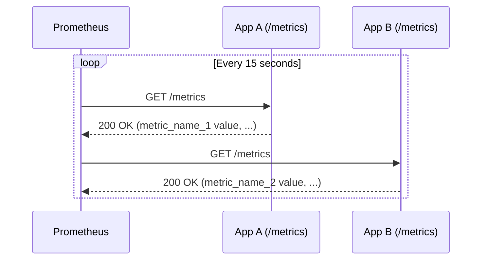
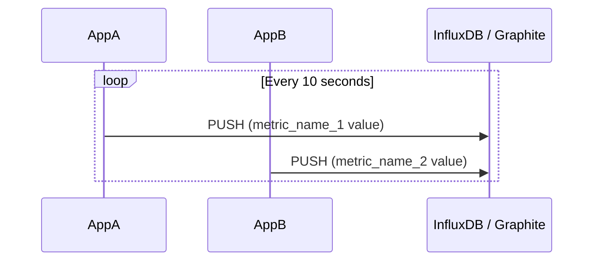

## System Design: Metrics Collection Patterns for Observability

In modern, complex systems, you can't fix what you can't see. **Observability** is the practice of instrumenting your applications to provide high-quality, actionable data that allows you to understand their internal state from the outside. This is built on three pillars: **metrics**, logs, and traces.

**Metrics** are numerical measurements of your system's health and performance over time. They are lightweight, easy to aggregate, and ideal for building dashboards and alerts. Examples include:
-   The number of HTTP requests per second.
-   The average latency of a database query.
-   The current CPU utilization of a server.
-   The number of items in a queue.

But how do we get these numbers from our application to a monitoring system? This is where metrics collection patterns come in. The two dominant models are the **Pull Model** and the **Push Model**.

### The Pull Model

In the pull model, the monitoring system is responsible for actively "scraping" or "pulling" metrics from the applications it monitors. The application exposes its current metrics on a specific HTTP endpoint (e.g., `/metrics`), and the monitoring system periodically sends a request to this endpoint to collect the data.

**Prometheus** is the most popular monitoring system that uses this model.



**Pros:**
-   **Centralized Control:** The monitoring system controls the scrape interval and which targets to scrape. You can easily adjust the frequency or add/remove targets from a central configuration.
-   **Service Discovery:** Pull-based systems excel at automatically discovering new instances of an application (e.g., new containers in a Kubernetes cluster) and adding them to the scrape list.
-   **Health Checking:** If the monitoring system can't scrape an application's `/metrics` endpoint, it's a strong signal that the application itself is unhealthy.

**Cons:**
-   **Firewall/Network Complexity:** The monitoring system must have network access to every application instance. This can be challenging in complex, multi-cloud, or VPC environments.
-   **Not for Short-Lived Jobs:** It's not suitable for ephemeral tasks (like a serverless function or a batch job that runs for a few seconds) because the job might finish before the monitoring system has a chance to pull the metrics.

### The Push Model

In the push model, the application is responsible for actively sending its metrics to the monitoring system. The application collects its own metrics and periodically "pushes" them to a known endpoint provided by the monitoring service.

Systems like **StatsD**, **Graphite**, and **InfluxDB** are commonly associated with this model.



**Pros:**
-   **Simpler Networking:** The application only needs to know the address of the monitoring system. This simplifies firewall rules, as you only need to allow outbound traffic from your apps to one destination.
-   **Works for Short-Lived Jobs:** Ephemeral jobs can push their metrics just before they terminate, ensuring no data is lost.
-   **Fine-grained Control:** The application can decide exactly when and how often to send metrics.

**Cons:**
-   **Configuration Overhead:** Every application needs to be configured with the address of the monitoring system. Changing this address requires re-configuring and re-deploying all applications.
-   **Risk of Overload:** A bug in an application could cause it to send a flood of metrics, potentially overwhelming the monitoring system (a "firehose" problem).
-   **No Inherent Health Check:** The monitoring system doesn't know if an application is down or has just stopped sending metrics.

### Push vs. Pull: Which to Choose?

| Feature               | Pull Model (e.g., Prometheus)                               | Push Model (e.g., StatsD, InfluxDB)                         |
| --------------------- | ----------------------------------------------------------- | ----------------------------------------------------------- |
| **Responsibility**    | Monitoring system pulls from applications.                  | Applications push to the monitoring system.                 |
| **Best For**          | Long-running services, containerized environments (K8s).    | Short-lived jobs, serverless functions, complex networks.   |
| **Service Discovery** | Excellent, often integrated.                                | More difficult; relies on apps knowing where to push.       |
| **Health Checking**   | Built-in (if scrape fails, target is down).                 | Not inherent; requires separate health checks.              |
| **Network Setup**     | Monitoring system needs access to all targets.              | Applications need access to the monitoring system.          |

Many modern observability platforms, like Prometheus, offer a hybrid approach. While its primary model is pull, it also provides a "Pushgateway" component that allows short-lived jobs to push metrics to it, which Prometheus can then scrape.

### Go Example: Instrumenting an App with Prometheus (Pull Model)

This example shows how to instrument a simple Go HTTP server with custom metrics using the official Prometheus client library.

First, get the necessary libraries:
```bash
go get github.com/prometheus/client_golang/prometheus
go get github.com/prometheus/client_golang/prometheus/promhttp
```

Now, let's write the code:
```go
package main

import (
	"log"
	"net/http"
	"time"

	"github.com/prometheus/client_golang/prometheus"
	"github.com/prometheus/client_golang/prometheus/promauto"
	"github.com/prometheus/client_golang/prometheus/promhttp"
)

// 1. Define the metrics we want to expose.
// promauto automatically registers the metrics with the default registry.
var (
	// http_requests_total is a Counter metric. It only goes up.
	httpRequestsTotal = promauto.NewCounterVec(
		prometheus.CounterOpts{
			Name: "http_requests_total",
			Help: "Total number of HTTP requests.",
		},
		[]string{"path"}, // This label will allow us to break down requests by path.
	)

	// http_request_duration_seconds is a Histogram metric.
	// It tracks the distribution of request durations.
	httpRequesDuration = promauto.NewHistogramVec(
		prometheus.HistogramOpts{
			Name:    "http_request_duration_seconds",
			Help:    "Histogram of HTTP request durations.",
			Buckets: prometheus.DefBuckets, // Default buckets: .005, .01, .025, .05, ...
		},
		[]string{"path"},
	)
)

// helloHandler is a simple HTTP handler that we want to instrument.
func helloHandler(w http.ResponseWriter, r *http.Request) {
	// Start a timer
	start := time.Now()

	// Increment the counter for this path.
	httpRequestsTotal.With(prometheus.Labels{"path": r.URL.Path}).Inc()

	// Simulate some work
	time.Sleep(50 * time.Millisecond)
	w.Write([]byte("Hello, World!"))

	// Observe the duration.
	duration := time.Since(start)
	httpRequesDuration.With(prometheus.Labels{"path": r.URL.Path}).Observe(duration.Seconds())
}

func main() {
	// Register our custom handler.
	http.HandleFunc("/hello", helloHandler)

	// 2. Expose the /metrics endpoint.
	// The promhttp.Handler() function serves the metrics in the Prometheus format.
	http.Handle("/metrics", promhttp.Handler())

	log.Println("Server starting on :8080")
	log.Println("Metrics available at http://localhost:8080/metrics")
	log.Println("Test endpoint at http://localhost:8080/hello")

	if err := http.ListenAndServe(":8080", nil); err != nil {
		log.Fatalf("Server failed to start: %v", err)
	}
}
```
**How to run it:**
1.  Save the code as `main.go` and run `go run main.go`.
2.  Visit `http://localhost:8080/hello` a few times in your browser.
3.  Now, visit `http://localhost:8080/metrics`. You will see output like this, which is what Prometheus would scrape:
    ```text
    # HELP http_request_duration_seconds Histogram of HTTP request durations.
    # TYPE http_request_duration_seconds histogram
    http_request_duration_seconds_bucket{path="/hello",le="0.005"} 0
    http_request_duration_seconds_bucket{path="/hello",le="0.01"} 0
    http_request_duration_seconds_bucket{path="/hello",le="0.025"} 0
    http_request_duration_seconds_bucket{path="/hello",le="0.05"} 0
    http_request_duration_seconds_bucket{path="/hello",le="0.1"} 5
    ...
    http_request_duration_seconds_sum{path="/hello"} 0.25123
    http_request_duration_seconds_count{path="/hello"} 5

    # HELP http_requests_total Total number of HTTP requests.
    # TYPE http_requests_total counter
    http_requests_total{path="/hello"} 5
    ```

### Conclusion

Choosing a metrics collection pattern is a foundational decision in designing an observable system. The **pull model**, popularized by Prometheus, is often the default choice for modern, containerized applications due to its robustness and powerful service discovery. The **push model** remains essential for specific use cases like serverless functions and environments with restrictive networking. Understanding the trade-offs of both allows you to build a comprehensive monitoring strategy that leaves no part of your system in the dark.
---
