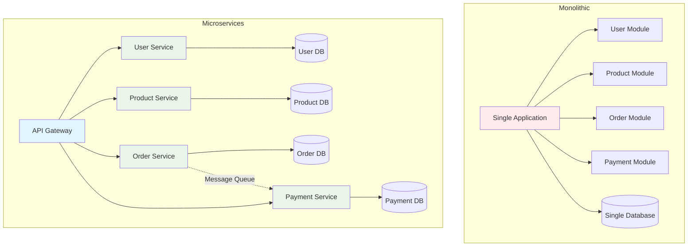
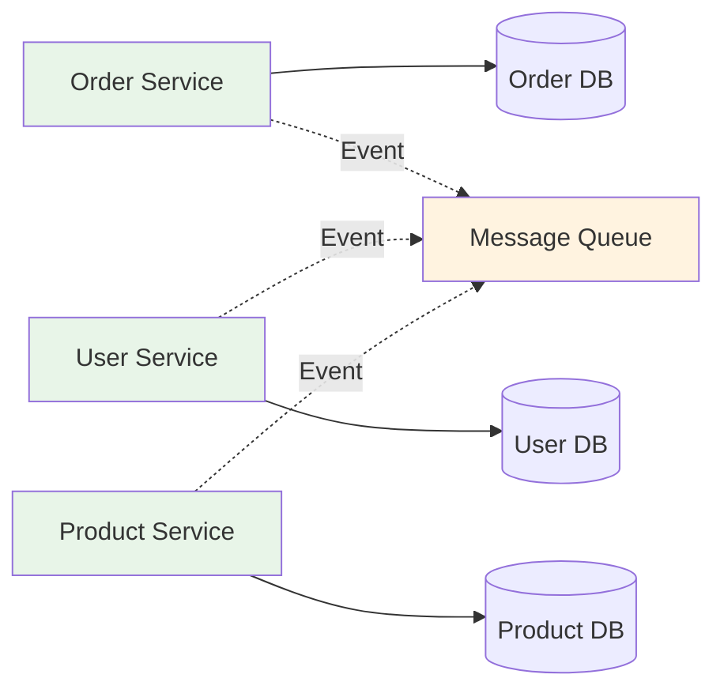
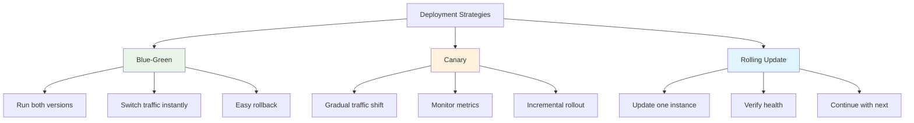

# System Design Fundamentals: Microservices Architecture

Microservices architecture is a design approach where an application is built as a collection of small, independent services that communicate over well-defined APIs. Each service is focused on a specific business capability and can be developed, deployed, and scaled independently.

## Microservices vs Monolithic Architecture



## Core Microservices Implementation

### 1. Service Discovery

```go
// Service Discovery Implementation
package main

import (
    "fmt"
    "sync"
    "time"
)

type ServiceInstance struct {
    ID       string
    Name     string
    Host     string
    Port     int
    Metadata map[string]string
    Health   HealthStatus
    LastSeen time.Time
}

type HealthStatus string

const (
    HealthyStatus   HealthStatus = "healthy"
    UnhealthyStatus HealthStatus = "unhealthy"
    UnknownStatus   HealthStatus = "unknown"
)

type ServiceRegistry struct {
    services map[string][]*ServiceInstance
    mutex    sync.RWMutex
}

func NewServiceRegistry() *ServiceRegistry {
    registry := &ServiceRegistry{
        services: make(map[string][]*ServiceInstance),
    }
    
    // Start health check routine
    go registry.healthCheckLoop()
    
    return registry
}

func (sr *ServiceRegistry) Register(instance *ServiceInstance) error {
    sr.mutex.Lock()
    defer sr.mutex.Unlock()
    
    instance.LastSeen = time.Now()
    instance.Health = HealthyStatus
    
    if _, exists := sr.services[instance.Name]; !exists {
        sr.services[instance.Name] = make([]*ServiceInstance, 0)
    }
    
    // Check if instance already registered
    for i, existing := range sr.services[instance.Name] {
        if existing.ID == instance.ID {
            sr.services[instance.Name][i] = instance
            fmt.Printf("✅ Updated service instance: %s (%s:%d)\n", 
                instance.ID, instance.Host, instance.Port)
            return nil
        }
    }
    
    sr.services[instance.Name] = append(sr.services[instance.Name], instance)
    
    fmt.Printf("✅ Registered service instance: %s (%s:%d)\n", 
        instance.ID, instance.Host, instance.Port)
    return nil
}

func (sr *ServiceRegistry) Deregister(serviceName, instanceID string) error {
    sr.mutex.Lock()
    defer sr.mutex.Unlock()
    
    instances, exists := sr.services[serviceName]
    if !exists {
        return fmt.Errorf("service %s not found", serviceName)
    }
    
    for i, instance := range instances {
        if instance.ID == instanceID {
            sr.services[serviceName] = append(instances[:i], instances[i+1:]...)
            fmt.Printf("🗑️  Deregistered service instance: %s\n", instanceID)
            return nil
        }
    }
    
    return fmt.Errorf("instance %s not found", instanceID)
}

func (sr *ServiceRegistry) Discover(serviceName string) ([]*ServiceInstance, error) {
    sr.mutex.RLock()
    defer sr.mutex.RUnlock()
    
    instances, exists := sr.services[serviceName]
    if !exists || len(instances) == 0 {
        return nil, fmt.Errorf("no instances found for service %s", serviceName)
    }
    
    // Return only healthy instances
    healthy := make([]*ServiceInstance, 0)
    for _, instance := range instances {
        if instance.Health == HealthyStatus {
            healthy = append(healthy, instance)
        }
    }
    
    if len(healthy) == 0 {
        return nil, fmt.Errorf("no healthy instances for service %s", serviceName)
    }
    
    return healthy, nil
}

func (sr *ServiceRegistry) Heartbeat(serviceName, instanceID string) error {
    sr.mutex.Lock()
    defer sr.mutex.Unlock()
    
    instances, exists := sr.services[serviceName]
    if !exists {
        return fmt.Errorf("service %s not found", serviceName)
    }
    
    for _, instance := range instances {
        if instance.ID == instanceID {
            instance.LastSeen = time.Now()
            instance.Health = HealthyStatus
            return nil
        }
    }
    
    return fmt.Errorf("instance %s not found", instanceID)
}

func (sr *ServiceRegistry) healthCheckLoop() {
    ticker := time.NewTicker(10 * time.Second)
    defer ticker.Stop()
    
    for range ticker.C {
        sr.mutex.Lock()
        
        for serviceName, instances := range sr.services {
            for _, instance := range instances {
                timeSinceLastSeen := time.Since(instance.LastSeen)
                
                if timeSinceLastSeen > 30*time.Second {
                    if instance.Health != UnhealthyStatus {
                        instance.Health = UnhealthyStatus
                        fmt.Printf("⚠️  Service %s instance %s marked unhealthy\n", 
                            serviceName, instance.ID)
                    }
                }
            }
        }
        
        sr.mutex.Unlock()
    }
}

func (sr *ServiceRegistry) GetAllServices() map[string][]*ServiceInstance {
    sr.mutex.RLock()
    defer sr.mutex.RUnlock()
    
    // Create a deep copy
    result := make(map[string][]*ServiceInstance)
    for name, instances := range sr.services {
        result[name] = append([]*ServiceInstance{}, instances...)
    }
    
    return result
}

// Client-side service discovery with load balancing
type ServiceClient struct {
    registry      *ServiceRegistry
    loadBalancer  LoadBalancer
}

type LoadBalancer interface {
    SelectInstance(instances []*ServiceInstance) *ServiceInstance
}

type RoundRobinBalancer struct {
    counter map[string]int
    mutex   sync.Mutex
}

func NewRoundRobinBalancer() *RoundRobinBalancer {
    return &RoundRobinBalancer{
        counter: make(map[string]int),
    }
}

func (rb *RoundRobinBalancer) SelectInstance(instances []*ServiceInstance) *ServiceInstance {
    if len(instances) == 0 {
        return nil
    }
    
    rb.mutex.Lock()
    defer rb.mutex.Unlock()
    
    serviceName := instances[0].Name
    index := rb.counter[serviceName] % len(instances)
    rb.counter[serviceName]++
    
    return instances[index]
}

func NewServiceClient(registry *ServiceRegistry) *ServiceClient {
    return &ServiceClient{
        registry:     registry,
        loadBalancer: NewRoundRobinBalancer(),
    }
}

func (sc *ServiceClient) Call(serviceName, method string, payload interface{}) (interface{}, error) {
    instances, err := sc.registry.Discover(serviceName)
    if err != nil {
        return nil, err
    }
    
    instance := sc.loadBalancer.SelectInstance(instances)
    if instance == nil {
        return nil, fmt.Errorf("no available instance")
    }
    
    fmt.Printf("📞 Calling %s on %s (%s:%d)\n", 
        method, instance.ID, instance.Host, instance.Port)
    
    // Simulate RPC call
    time.Sleep(50 * time.Millisecond)
    
    return map[string]interface{}{
        "status":   "success",
        "instance": instance.ID,
        "method":   method,
    }, nil
}
```

### 2. API Gateway

```go
// API Gateway Implementation
package main

import (
    "fmt"
    "sync"
    "time"
)

type Route struct {
    Path          string
    ServiceName   string
    Method        string
    RateLimit     int // requests per minute
}

type APIGateway struct {
    routes           map[string]*Route
    serviceClient    *ServiceClient
    rateLimiter      *RateLimiter
    circuitBreakers  map[string]*CircuitBreaker
    mutex            sync.RWMutex
}

func NewAPIGateway(serviceClient *ServiceClient) *APIGateway {
    return &APIGateway{
        routes:          make(map[string]*Route),
        serviceClient:   serviceClient,
        rateLimiter:     NewRateLimiter(),
        circuitBreakers: make(map[string]*CircuitBreaker),
    }
}

func (gw *APIGateway) RegisterRoute(route *Route) {
    gw.mutex.Lock()
    defer gw.mutex.Unlock()
    
    gw.routes[route.Path] = route
    
    // Create circuit breaker for this route
    if _, exists := gw.circuitBreakers[route.ServiceName]; !exists {
        gw.circuitBreakers[route.ServiceName] = NewCircuitBreaker(route.ServiceName, 5, 30*time.Second)
    }
    
    fmt.Printf("📍 Registered route: %s -> %s\n", route.Path, route.ServiceName)
}

func (gw *APIGateway) HandleRequest(clientID, path string, payload interface{}) (interface{}, error) {
    gw.mutex.RLock()
    route, exists := gw.routes[path]
    gw.mutex.RUnlock()
    
    if !exists {
        return nil, fmt.Errorf("route not found: %s", path)
    }
    
    fmt.Printf("\n🌐 API Gateway: Request from %s to %s\n", clientID, path)
    
    // Rate limiting
    if !gw.rateLimiter.Allow(clientID, route.RateLimit) {
        fmt.Printf("❌ Rate limit exceeded for %s\n", clientID)
        return nil, fmt.Errorf("rate limit exceeded")
    }
    
    // Circuit breaker
    cb := gw.circuitBreakers[route.ServiceName]
    if !cb.CanExecute() {
        fmt.Printf("⚡ Circuit breaker OPEN for %s\n", route.ServiceName)
        return nil, fmt.Errorf("service unavailable: circuit breaker open")
    }
    
    // Forward request to service
    result, err := gw.serviceClient.Call(route.ServiceName, route.Method, payload)
    
    // Record result in circuit breaker
    if err != nil {
        cb.RecordFailure()
        return nil, err
    }
    
    cb.RecordSuccess()
    return result, nil
}

// Rate Limiter (Token Bucket)
type RateLimiter struct {
    buckets map[string]*TokenBucket
    mutex   sync.RWMutex
}

type TokenBucket struct {
    tokens    int
    capacity  int
    refillRate int // tokens per minute
    lastRefill time.Time
    mutex     sync.Mutex
}

func NewRateLimiter() *RateLimiter {
    return &RateLimiter{
        buckets: make(map[string]*TokenBucket),
    }
}

func (rl *RateLimiter) Allow(clientID string, rateLimit int) bool {
    rl.mutex.Lock()
    bucket, exists := rl.buckets[clientID]
    if !exists {
        bucket = &TokenBucket{
            tokens:     rateLimit,
            capacity:   rateLimit,
            refillRate: rateLimit,
            lastRefill: time.Now(),
        }
        rl.buckets[clientID] = bucket
    }
    rl.mutex.Unlock()
    
    return bucket.TakeToken()
}

func (tb *TokenBucket) TakeToken() bool {
    tb.mutex.Lock()
    defer tb.mutex.Unlock()
    
    // Refill tokens based on time elapsed
    now := time.Now()
    elapsed := now.Sub(tb.lastRefill)
    tokensToAdd := int(elapsed.Minutes() * float64(tb.refillRate))
    
    if tokensToAdd > 0 {
        tb.tokens = min(tb.capacity, tb.tokens+tokensToAdd)
        tb.lastRefill = now
    }
    
    if tb.tokens > 0 {
        tb.tokens--
        return true
    }
    
    return false
}

func min(a, b int) int {
    if a < b {
        return a
    }
    return b
}

// Circuit Breaker Pattern
type CircuitState string

const (
    StateClosed   CircuitState = "CLOSED"
    StateOpen     CircuitState = "OPEN"
    StateHalfOpen CircuitState = "HALF_OPEN"
)

type CircuitBreaker struct {
    serviceName     string
    state           CircuitState
    failureCount    int
    successCount    int
    threshold       int
    timeout         time.Duration
    lastFailureTime time.Time
    mutex           sync.RWMutex
}

func NewCircuitBreaker(serviceName string, threshold int, timeout time.Duration) *CircuitBreaker {
    return &CircuitBreaker{
        serviceName: serviceName,
        state:       StateClosed,
        threshold:   threshold,
        timeout:     timeout,
    }
}

func (cb *CircuitBreaker) CanExecute() bool {
    cb.mutex.RLock()
    defer cb.mutex.RUnlock()
    
    if cb.state == StateClosed {
        return true
    }
    
    if cb.state == StateOpen {
        if time.Since(cb.lastFailureTime) > cb.timeout {
            cb.mutex.RUnlock()
            cb.mutex.Lock()
            cb.state = StateHalfOpen
            cb.successCount = 0
            cb.mutex.Unlock()
            cb.mutex.RLock()
            
            fmt.Printf("🔄 Circuit breaker for %s: OPEN -> HALF_OPEN\n", cb.serviceName)
            return true
        }
        return false
    }
    
    // StateHalfOpen
    return true
}

func (cb *CircuitBreaker) RecordSuccess() {
    cb.mutex.Lock()
    defer cb.mutex.Unlock()
    
    cb.failureCount = 0
    
    if cb.state == StateHalfOpen {
        cb.successCount++
        if cb.successCount >= 3 {
            cb.state = StateClosed
            fmt.Printf("✅ Circuit breaker for %s: HALF_OPEN -> CLOSED\n", cb.serviceName)
        }
    }
}

func (cb *CircuitBreaker) RecordFailure() {
    cb.mutex.Lock()
    defer cb.mutex.Unlock()
    
    cb.failureCount++
    cb.lastFailureTime = time.Now()
    
    if cb.state == StateHalfOpen {
        cb.state = StateOpen
        fmt.Printf("⚡ Circuit breaker for %s: HALF_OPEN -> OPEN\n", cb.serviceName)
        return
    }
    
    if cb.failureCount >= cb.threshold {
        cb.state = StateOpen
        fmt.Printf("⚡ Circuit breaker for %s: CLOSED -> OPEN (failures: %d)\n", 
            cb.serviceName, cb.failureCount)
    }
}

func (cb *CircuitBreaker) GetState() CircuitState {
    cb.mutex.RLock()
    defer cb.mutex.RUnlock()
    return cb.state
}
```

### 3. Service Mesh (Sidecar Pattern)

```go
// Service Mesh - Sidecar Proxy Implementation
package main

import (
    "fmt"
    "sync"
    "time"
)

type SidecarProxy struct {
    serviceName   string
    serviceHost   string
    servicePort   int
    metrics       *ServiceMetrics
    tracing       *DistributedTracing
    retry         *RetryPolicy
    mutex         sync.RWMutex
}

type ServiceMetrics struct {
    requestCount    int64
    errorCount      int64
    totalLatency    time.Duration
    mutex           sync.Mutex
}

type DistributedTracing struct {
    traces map[string]*TraceSpan
    mutex  sync.RWMutex
}

type TraceSpan struct {
    TraceID   string
    SpanID    string
    ParentID  string
    Service   string
    Operation string
    StartTime time.Time
    EndTime   time.Time
    Tags      map[string]string
}

type RetryPolicy struct {
    maxRetries int
    backoff    time.Duration
}

func NewSidecarProxy(serviceName, host string, port int) *SidecarProxy {
    return &SidecarProxy{
        serviceName: serviceName,
        serviceHost: host,
        servicePort: port,
        metrics:     &ServiceMetrics{},
        tracing: &DistributedTracing{
            traces: make(map[string]*TraceSpan),
        },
        retry: &RetryPolicy{
            maxRetries: 3,
            backoff:    100 * time.Millisecond,
        },
    }
}

func (sp *SidecarProxy) InterceptRequest(traceID, operation string, handler func() error) error {
    // Start trace
    span := sp.startSpan(traceID, operation)
    
    // Record metrics
    sp.metrics.mutex.Lock()
    sp.metrics.requestCount++
    sp.metrics.mutex.Unlock()
    
    startTime := time.Now()
    var err error
    
    // Retry logic
    for attempt := 0; attempt <= sp.retry.maxRetries; attempt++ {
        err = handler()
        
        if err == nil {
            break
        }
        
        if attempt < sp.retry.maxRetries {
            backoff := sp.retry.backoff * time.Duration(1<<attempt)
            fmt.Printf("🔄 Retry attempt %d/%d after %v\n", 
                attempt+1, sp.retry.maxRetries, backoff)
            time.Sleep(backoff)
        }
    }
    
    // Record latency
    latency := time.Since(startTime)
    sp.metrics.mutex.Lock()
    sp.metrics.totalLatency += latency
    if err != nil {
        sp.metrics.errorCount++
    }
    sp.metrics.mutex.Unlock()
    
    // End trace
    sp.endSpan(span)
    
    if err != nil {
        fmt.Printf("❌ Request failed after %d attempts: %v\n", sp.retry.maxRetries+1, err)
    } else {
        fmt.Printf("✅ Request succeeded (latency: %v)\n", latency)
    }
    
    return err
}

func (sp *SidecarProxy) startSpan(traceID, operation string) *TraceSpan {
    span := &TraceSpan{
        TraceID:   traceID,
        SpanID:    fmt.Sprintf("span-%d", time.Now().UnixNano()),
        Service:   sp.serviceName,
        Operation: operation,
        StartTime: time.Now(),
        Tags:      make(map[string]string),
    }
    
    sp.tracing.mutex.Lock()
    sp.tracing.traces[span.SpanID] = span
    sp.tracing.mutex.Unlock()
    
    fmt.Printf("📍 Trace %s: Started span %s in %s\n", 
        traceID, span.SpanID, sp.serviceName)
    
    return span
}

func (sp *SidecarProxy) endSpan(span *TraceSpan) {
    span.EndTime = time.Now()
    duration := span.EndTime.Sub(span.StartTime)
    
    fmt.Printf("📍 Trace %s: Completed span %s (duration: %v)\n", 
        span.TraceID, span.SpanID, duration)
}

func (sp *SidecarProxy) GetMetrics() map[string]interface{} {
    sp.metrics.mutex.Lock()
    defer sp.metrics.mutex.Unlock()
    
    var avgLatency time.Duration
    if sp.metrics.requestCount > 0 {
        avgLatency = sp.metrics.totalLatency / time.Duration(sp.metrics.requestCount)
    }
    
    errorRate := float64(0)
    if sp.metrics.requestCount > 0 {
        errorRate = float64(sp.metrics.errorCount) / float64(sp.metrics.requestCount) * 100
    }
    
    return map[string]interface{}{
        "service":         sp.serviceName,
        "total_requests":  sp.metrics.requestCount,
        "total_errors":    sp.metrics.errorCount,
        "error_rate":      fmt.Sprintf("%.2f%%", errorRate),
        "avg_latency":     avgLatency,
    }
}

func (sp *SidecarProxy) GetTraces() []*TraceSpan {
    sp.tracing.mutex.RLock()
    defer sp.tracing.mutex.RUnlock()
    
    traces := make([]*TraceSpan, 0, len(sp.tracing.traces))
    for _, trace := range sp.tracing.traces {
        traces = append(traces, trace)
    }
    
    return traces
}
```

### 4. Event-Driven Communication

```go
// Message Queue for Async Communication
package main

import (
    "fmt"
    "sync"
    "time"
)

type Message struct {
    ID        string
    Topic     string
    Payload   interface{}
    Timestamp time.Time
    Metadata  map[string]string
}

type MessageHandler func(*Message) error

type MessageBroker struct {
    topics       map[string][]*Subscriber
    messages     chan *Message
    deadLetter   []*Message
    mutex        sync.RWMutex
    dlqMutex     sync.Mutex
}

type Subscriber struct {
    ID        string
    Topic     string
    Handler   MessageHandler
    Active    bool
}

func NewMessageBroker() *MessageBroker {
    broker := &MessageBroker{
        topics:     make(map[string][]*Subscriber),
        messages:   make(chan *Message, 1000),
        deadLetter: make([]*Message, 0),
    }
    
    // Start message dispatcher
    go broker.dispatch()
    
    return broker
}

func (mb *MessageBroker) Subscribe(topic, subscriberID string, handler MessageHandler) error {
    mb.mutex.Lock()
    defer mb.mutex.Unlock()
    
    subscriber := &Subscriber{
        ID:      subscriberID,
        Topic:   topic,
        Handler: handler,
        Active:  true,
    }
    
    if _, exists := mb.topics[topic]; !exists {
        mb.topics[topic] = make([]*Subscriber, 0)
    }
    
    mb.topics[topic] = append(mb.topics[topic], subscriber)
    
    fmt.Printf("📫 Subscriber %s subscribed to topic: %s\n", subscriberID, topic)
    return nil
}

func (mb *MessageBroker) Publish(topic string, payload interface{}) error {
    message := &Message{
        ID:        fmt.Sprintf("msg-%d", time.Now().UnixNano()),
        Topic:     topic,
        Payload:   payload,
        Timestamp: time.Now(),
        Metadata:  make(map[string]string),
    }
    
    mb.messages <- message
    
    fmt.Printf("📤 Published message %s to topic: %s\n", message.ID, topic)
    return nil
}

func (mb *MessageBroker) dispatch() {
    for message := range mb.messages {
        mb.mutex.RLock()
        subscribers := mb.topics[message.Topic]
        mb.mutex.RUnlock()
        
        if len(subscribers) == 0 {
            fmt.Printf("⚠️  No subscribers for topic: %s\n", message.Topic)
            continue
        }
        
        // Deliver to all subscribers
        var wg sync.WaitGroup
        for _, sub := range subscribers {
            if !sub.Active {
                continue
            }
            
            wg.Add(1)
            go func(s *Subscriber) {
                defer wg.Done()
                
                if err := mb.deliverMessage(message, s); err != nil {
                    fmt.Printf("❌ Failed to deliver to %s: %v\n", s.ID, err)
                    
                    // Add to dead letter queue
                    mb.dlqMutex.Lock()
                    mb.deadLetter = append(mb.deadLetter, message)
                    mb.dlqMutex.Unlock()
                }
            }(sub)
        }
        
        wg.Wait()
    }
}

func (mb *MessageBroker) deliverMessage(message *Message, subscriber *Subscriber) error {
    maxRetries := 3
    backoff := 100 * time.Millisecond
    
    for attempt := 0; attempt < maxRetries; attempt++ {
        err := subscriber.Handler(message)
        if err == nil {
            fmt.Printf("✅ Delivered message %s to %s\n", message.ID, subscriber.ID)
            return nil
        }
        
        if attempt < maxRetries-1 {
            time.Sleep(backoff * time.Duration(1<<attempt))
        }
    }
    
    return fmt.Errorf("max retries exceeded")
}

func (mb *MessageBroker) GetDeadLetterQueue() []*Message {
    mb.dlqMutex.Lock()
    defer mb.dlqMutex.Unlock()
    
    return append([]*Message{}, mb.deadLetter...)
}

// Saga Pattern for Distributed Transactions
type SagaOrchestrator struct {
    steps       []SagaStep
    currentStep int
    completed   []string
    broker      *MessageBroker
}

type SagaStep struct {
    Name         string
    Action       func() error
    Compensation func() error
}

func NewSagaOrchestrator(broker *MessageBroker) *SagaOrchestrator {
    return &SagaOrchestrator{
        steps:     make([]SagaStep, 0),
        completed: make([]string, 0),
        broker:    broker,
    }
}

func (so *SagaOrchestrator) AddStep(name string, action, compensation func() error) {
    so.steps = append(so.steps, SagaStep{
        Name:         name,
        Action:       action,
        Compensation: compensation,
    })
}

func (so *SagaOrchestrator) Execute() error {
    fmt.Println("\n🎭 Starting Saga Transaction")
    
    for i, step := range so.steps {
        so.currentStep = i
        
        fmt.Printf("▶️  Executing step %d: %s\n", i+1, step.Name)
        
        err := step.Action()
        if err != nil {
            fmt.Printf("❌ Step %s failed: %v\n", step.Name, err)
            fmt.Println("🔄 Rolling back saga...")
            
            return so.rollback()
        }
        
        so.completed = append(so.completed, step.Name)
        fmt.Printf("✅ Step %s completed\n", step.Name)
    }
    
    fmt.Println("✅ Saga transaction completed successfully")
    return nil
}

func (so *SagaOrchestrator) rollback() error {
    fmt.Printf("Rolling back %d completed steps\n", len(so.completed))
    
    for i := len(so.completed) - 1; i >= 0; i-- {
        stepName := so.completed[i]
        
        // Find the step
        var step *SagaStep
        for j := range so.steps {
            if so.steps[j].Name == stepName {
                step = &so.steps[j]
                break
            }
        }
        
        if step != nil && step.Compensation != nil {
            fmt.Printf("🔙 Compensating step: %s\n", stepName)
            if err := step.Compensation(); err != nil {
                fmt.Printf("⚠️  Compensation failed for %s: %v\n", stepName, err)
            }
        }
    }
    
    return fmt.Errorf("saga transaction failed and rolled back")
}

// Example: E-commerce Order Saga
func main() {
    fmt.Println("=== Microservices Architecture Demo ===\n")
    
    // Service Registry
    registry := NewServiceRegistry()
    
    // Register services
    userService := &ServiceInstance{
        ID:   "user-service-1",
        Name: "user-service",
        Host: "localhost",
        Port: 8081,
    }
    registry.Register(userService)
    
    orderService := &ServiceInstance{
        ID:   "order-service-1",
        Name: "order-service",
        Host: "localhost",
        Port: 8082,
    }
    registry.Register(orderService)
    
    paymentService := &ServiceInstance{
        ID:   "payment-service-1",
        Name: "payment-service",
        Host: "localhost",
        Port: 8083,
    }
    registry.Register(paymentService)
    
    // Service Client
    client := NewServiceClient(registry)
    
    // API Gateway
    gateway := NewAPIGateway(client)
    
    gateway.RegisterRoute(&Route{
        Path:        "/api/users",
        ServiceName: "user-service",
        Method:      "GET",
        RateLimit:   100,
    })
    
    gateway.RegisterRoute(&Route{
        Path:        "/api/orders",
        ServiceName: "order-service",
        Method:      "POST",
        RateLimit:   50,
    })
    
    // Test API Gateway
    fmt.Println("\n--- Testing API Gateway ---")
    gateway.HandleRequest("client-123", "/api/users", nil)
    gateway.HandleRequest("client-123", "/api/orders", map[string]interface{}{
        "item": "laptop",
        "qty":  1,
    })
    
    // Message Broker
    fmt.Println("\n--- Testing Event-Driven Communication ---")
    broker := NewMessageBroker()
    
    broker.Subscribe("order.created", "inventory-service", func(msg *Message) error {
        fmt.Printf("📦 Inventory Service: Processing order %v\n", msg.Payload)
        return nil
    })
    
    broker.Subscribe("order.created", "notification-service", func(msg *Message) error {
        fmt.Printf("📧 Notification Service: Sending confirmation for order %v\n", msg.Payload)
        return nil
    })
    
    broker.Publish("order.created", map[string]interface{}{
        "order_id": "ORD-12345",
        "amount":   999.99,
    })
    
    time.Sleep(500 * time.Millisecond)
    
    // Saga Pattern
    fmt.Println("\n--- Testing Saga Pattern ---")
    saga := NewSagaOrchestrator(broker)
    
    // Define saga steps for order processing
    saga.AddStep("Reserve Inventory", 
        func() error {
            fmt.Println("  ✓ Inventory reserved")
            return nil
        },
        func() error {
            fmt.Println("  ↺ Inventory released")
            return nil
        },
    )
    
    saga.AddStep("Process Payment",
        func() error {
            fmt.Println("  ✓ Payment processed")
            return nil
        },
        func() error {
            fmt.Println("  ↺ Payment refunded")
            return nil
        },
    )
    
    saga.AddStep("Create Order",
        func() error {
            fmt.Println("  ✓ Order created")
            return nil
        },
        func() error {
            fmt.Println("  ↺ Order cancelled")
            return nil
        },
    )
    
    saga.Execute()
    
    // Service Mesh
    fmt.Println("\n--- Testing Service Mesh (Sidecar) ---")
    sidecar := NewSidecarProxy("order-service", "localhost", 8082)
    
    sidecar.InterceptRequest("trace-001", "createOrder", func() error {
        time.Sleep(100 * time.Millisecond)
        return nil
    })
    
    fmt.Println("\n📊 Service Metrics:")
    metrics := sidecar.GetMetrics()
    for key, value := range metrics {
        fmt.Printf("  %s: %v\n", key, value)
    }
}
```

## Microservices Patterns

### 1. Database per Service



### 2. API Composition

```go
// API Composition Pattern
package main

import (
    "fmt"
    "sync"
)

type OrderDetails struct {
    OrderID   string
    UserInfo  map[string]interface{}
    Products  []map[string]interface{}
    Payment   map[string]interface{}
}

type CompositeService struct {
    serviceClient *ServiceClient
}

func NewCompositeService(client *ServiceClient) *CompositeService {
    return &CompositeService{
        serviceClient: client,
    }
}

func (cs *CompositeService) GetOrderDetails(orderID string) (*OrderDetails, error) {
    fmt.Printf("\n🔄 Composing order details for: %s\n", orderID)
    
    // Fetch data from multiple services in parallel
    var wg sync.WaitGroup
    var mu sync.Mutex
    
    details := &OrderDetails{
        OrderID: orderID,
    }
    
    errors := make([]error, 0)
    
    // Fetch user info
    wg.Add(1)
    go func() {
        defer wg.Done()
        result, err := cs.serviceClient.Call("user-service", "getUserInfo", orderID)
        mu.Lock()
        defer mu.Unlock()
        
        if err != nil {
            errors = append(errors, err)
        } else {
            details.UserInfo = result.(map[string]interface{})
        }
    }()
    
    // Fetch product info
    wg.Add(1)
    go func() {
        defer wg.Done()
        result, err := cs.serviceClient.Call("product-service", "getProducts", orderID)
        mu.Lock()
        defer mu.Unlock()
        
        if err != nil {
            errors = append(errors, err)
        } else {
            details.Products = []map[string]interface{}{result.(map[string]interface{})}
        }
    }()
    
    // Fetch payment info
    wg.Add(1)
    go func() {
        defer wg.Done()
        result, err := cs.serviceClient.Call("payment-service", "getPaymentInfo", orderID)
        mu.Lock()
        defer mu.Unlock()
        
        if err != nil {
            errors = append(errors, err)
        } else {
            details.Payment = result.(map[string]interface{})
        }
    }()
    
    wg.Wait()
    
    if len(errors) > 0 {
        return nil, fmt.Errorf("failed to compose order details: %v", errors)
    }
    
    fmt.Println("✅ Order details composed successfully")
    return details, nil
}
```

## Best Practices and Challenges

### Monitoring and Observability

```go
// Centralized Logging and Metrics
package main

import (
    "fmt"
    "time"
)

type LogLevel string

const (
    DEBUG LogLevel = "DEBUG"
    INFO  LogLevel = "INFO"
    WARN  LogLevel = "WARN"
    ERROR LogLevel = "ERROR"
)

type LogEntry struct {
    Timestamp time.Time
    Level     LogLevel
    Service   string
    TraceID   string
    Message   string
    Metadata  map[string]interface{}
}

type ObservabilityPlatform struct {
    logs    []*LogEntry
    metrics map[string]*MetricData
}

type MetricData struct {
    Name      string
    Value     float64
    Timestamp time.Time
    Tags      map[string]string
}

func NewObservabilityPlatform() *ObservabilityPlatform {
    return &ObservabilityPlatform{
        logs:    make([]*LogEntry, 0),
        metrics: make(map[string]*MetricData),
    }
}

func (op *ObservabilityPlatform) Log(service, traceID, message string, level LogLevel) {
    entry := &LogEntry{
        Timestamp: time.Now(),
        Level:     level,
        Service:   service,
        TraceID:   traceID,
        Message:   message,
        Metadata:  make(map[string]interface{}),
    }
    
    op.logs = append(op.logs, entry)
    
    fmt.Printf("[%s] %s [%s] %s (trace: %s)\n", 
        entry.Timestamp.Format("15:04:05"), entry.Level, service, message, traceID)
}

func (op *ObservabilityPlatform) RecordMetric(name string, value float64, tags map[string]string) {
    metric := &MetricData{
        Name:      name,
        Value:     value,
        Timestamp: time.Now(),
        Tags:      tags,
    }
    
    op.metrics[name] = metric
    
    fmt.Printf("📊 Metric: %s = %.2f %v\n", name, value, tags)
}

func (op *ObservabilityPlatform) QueryLogs(service string, level LogLevel) []*LogEntry {
    results := make([]*LogEntry, 0)
    
    for _, log := range op.logs {
        if (service == "" || log.Service == service) && 
           (level == "" || log.Level == level) {
            results = append(results, log)
        }
    }
    
    return results
}
```

## Deployment Strategies



## Conclusion

Microservices architecture provides:

**Benefits:**
- Independent deployment and scaling
- Technology diversity
- Fault isolation
- Team autonomy

**Challenges:**
- Distributed system complexity
- Data consistency
- Network latency
- Testing complexity
- Operational overhead

**When to Use:**
- Large, complex applications
- Multiple teams
- Different scaling requirements
- Need for technology diversity

**When to Avoid:**
- Small applications
- Limited team size
- Simple business logic
- Tight coupling requirements

Start with a monolith and evolve to microservices only when complexity and scale demand it.