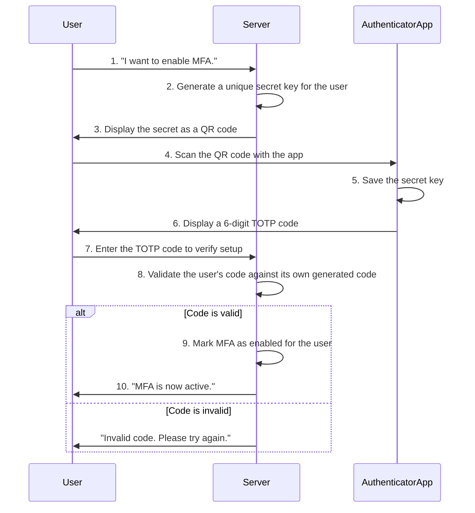

## System Design: Implementing Multi-Factor Authentication (MFA)

Passwords alone are no longer enough. They can be stolen, guessed, or leaked in data breaches. To truly secure user accounts, modern applications employ **Multi-Factor Authentication (MFA)**. MFA adds a critical layer of defense by requiring users to provide two or more verification factors to gain access.

This post explores what MFA is, the different types of factors, how the user enrollment and verification process works, and how to implement one of the most common MFA methods, Time-based One-Time Passwords (TOTP), in Go.

### What is Multi-Factor Authentication?

MFA requires a user to present evidence from at least two of the following three categories:

1.  **Knowledge Factor:** Something you *know*.
    -   Examples: Password, PIN, answer to a security question.
2.  **Possession Factor:** Something you *have*.
    -   Examples: A smartphone (with an authenticator app), a hardware token (like a YubiKey), an SMS-capable phone.
3.  **Inherence Factor:** Something you *are*.
    -   Examples: Fingerprint, facial recognition, voiceprint (biometrics).

Standard login uses one factor (knowledge). MFA, also known as Two-Factor Authentication (2FA) when exactly two factors are used, makes it exponentially harder for an attacker to gain access. Even if they steal your password, they still need your phone or your fingerprint.

### Common MFA Methods

-   **SMS/Email Codes:** The server sends a one-time code to the user's registered phone number or email. This is easy to implement but is the least secure method, as phone numbers can be ported (SIM swapping) and emails can be hacked.
-   **Time-based One-Time Password (TOTP):** The user's authenticator app (like Google Authenticator or Authy) and the server share a secret key. Both use this key and the current time to generate the same short-lived, 6-digit code. This is a very popular and secure method.
-   **Push Notifications:** The user receives a push notification on their registered device and simply has to tap "Approve" to log in. This offers a great user experience.
-   **Hardware Tokens (FIDO/U2F):** A physical device, often a USB key, that generates a cryptographic signature to authenticate the user. This is one of the most secure methods available.

### The TOTP Enrollment and Verification Flow

Let's focus on TOTP, as it strikes a great balance between security and usability. The process involves two main phases: enrollment and verification.

#### 1. Enrollment Phase

This is a one-time setup process to link the user's account with their authenticator app.



-   **Key Generation:** When the user decides to enable MFA, the server generates a unique, secret key for that user.
-   **QR Code:** This secret key is encoded into a special URL (`otpauth://`) and rendered as a QR code. The URL contains the issuer name, the user's account name, and the secret itself.
-   **Scanning:** The user scans the QR code with their authenticator app. The app stores the secret key securely on the device.
-   **Verification:** The app immediately starts generating 30-second TOTP codes. To complete the setup, the user must enter the current code into the server's UI. The server validates this code to confirm that the setup was successful. If it matches, MFA is enabled for that user.

#### 2. Verification (Login) Phase

Once enrolled, every subsequent login requires a TOTP code.

1.  **Primary Login:** The user enters their username and password.
2.  **MFA Challenge:** If the credentials are correct, the server prompts the user for their MFA code.
3.  **Code Generation:** The user opens their authenticator app to get the current 6-digit code.
4.  **Code Verification:** The user enters the code. The server uses the stored secret and the current time to generate its own version of the code and checks if it matches the user's input. To account for clock drift, servers often check a small window of codes (e.g., the current one, the previous one, and the next one).
5.  **Access Granted:** If the code is valid, the user is logged in.

### Go Implementation Example (TOTP)

We can use the `github.com/pquerna/otp` package, a robust library for TOTP and HOTP.

```go
package main

import (
	"bytes"
	"encoding/base64"
	"fmt"
	"image/png"
	"log"
	"net/http"
	"time"

	"github.com/pquerna/otp/totp"
)

// --- In-Memory Storage (for demonstration) ---
// In a real app, store the TOTP secret URL in your user database.
var userSecrets = make(map[string]string)

// --- Enrollment Handlers ---

// 1. Generate a new TOTP secret and display it as a QR code.
func generateMfaHandler(w http.ResponseWriter, r *http.Request) {
	userID := "user-123" // Get from session

	key, err := totp.Generate(totp.GenerateOpts{
		Issuer:      "MyApp",
		AccountName: userID,
	})
	if err != nil {
		http.Error(w, "Failed to generate key", http.StatusInternalServerError)
		return
	}

	// Store the secret URL for the user.
	userSecrets[userID] = key.URL()

	// Convert TOTP key into a QR code image.
	var buf bytes.Buffer
	img, err := key.Image(200, 200)
	if err != nil {
		http.Error(w, "Failed to create QR code", http.StatusInternalServerError)
		return
	}
	png.Encode(&buf, img)

	// Display the QR code to the user.
	w.Header().Set("Content-Type", "image/png")
	w.Write(buf.Bytes())
	
	fmt.Printf("\nUser '%s' secret: %s\n", userID, key.Secret())
}

// 2. Verify the initial TOTP code to enable MFA.
func verifyMfaHandler(w http.ResponseWriter, r *http.Request) {
	userID := "user-123"
	passcode := r.URL.Query().Get("passcode")

	secretURL, ok := userSecrets[userID]
	if !ok {
		http.Error(w, "No secret found for user", http.StatusBadRequest)
		return
	}
	
	// The library can parse the secret from the URL.
	key, _ := totp.Generate(totp.GenerateOpts{
		Issuer:      "MyApp",
		AccountName: userID,
		Secret:      []byte(extractSecretFromURL(secretURL)),
	})

	valid := totp.Validate(passcode, key.Secret())

	if valid {
		// In a real app, you would now mark MFA as "enabled" in the user's DB record.
		fmt.Fprint(w, "MFA enabled successfully!")
	} else {
		http.Error(w, "Invalid passcode", http.StatusBadRequest)
	}
}

// --- Login Verification Handler ---
func loginHandler(w http.ResponseWriter, r *http.Request) {
    // ... assume password is correct ...
    
    userID := "user-123"
	passcode := r.URL.Query().Get("passcode")

	secretURL, ok := userSecrets[userID]
	if !ok {
		http.Error(w, "MFA not enabled for this user", http.StatusBadRequest)
		return
	}
	
	key, _ := totp.Generate(totp.GenerateOpts{
		Issuer:      "MyApp",
		AccountName: userID,
		Secret:      []byte(extractSecretFromURL(secretURL)),
	})

	valid := totp.Validate(passcode, key.Secret())

	if valid {
		fmt.Fprint(w, "Login successful!")
	} else {
		http.Error(w, "Invalid MFA code", http.StatusUnauthorized)
	}
}

func main() {
	http.HandleFunc("/mfa/generate", generateMfaHandler)
	http.HandleFunc("/mfa/verify", verifyMfaHandler)
	http.HandleFunc("/login", loginHandler)

	fmt.Println("Server starting on port 8080...")
	log.Fatal(http.ListenAndServe(":8080", nil))
}

// Helper to extract secret from otpauth:// URL
func extractSecretFromURL(url string) string {
    // A real implementation should parse the URL properly.
    // otpauth://totp/MyApp:user-123?secret=JBSWY3DPEHPK3PXP&issuer=MyApp
    parts := strings.Split(url, "secret=")
    parts2 := strings.Split(parts[1], "&")
    return parts2[0]
}
```

### Conclusion

Multi-Factor Authentication is no longer a "nice-to-have"; it's an essential security control for any application that handles user accounts. By requiring more than just a password, you protect your users from a huge range of common attacks. The TOTP algorithm, in particular, offers a fantastic blend of strong security and good user experience, and with modern libraries, it's straightforward to implement.

This post concludes our batch on Authentication and Security. We've covered how to delegate authorization with OAuth 2.0, manage access with JWTs and API keys, and finally, how to harden user logins with MFA. Together, these patterns form the foundation of a secure and modern application.
---
