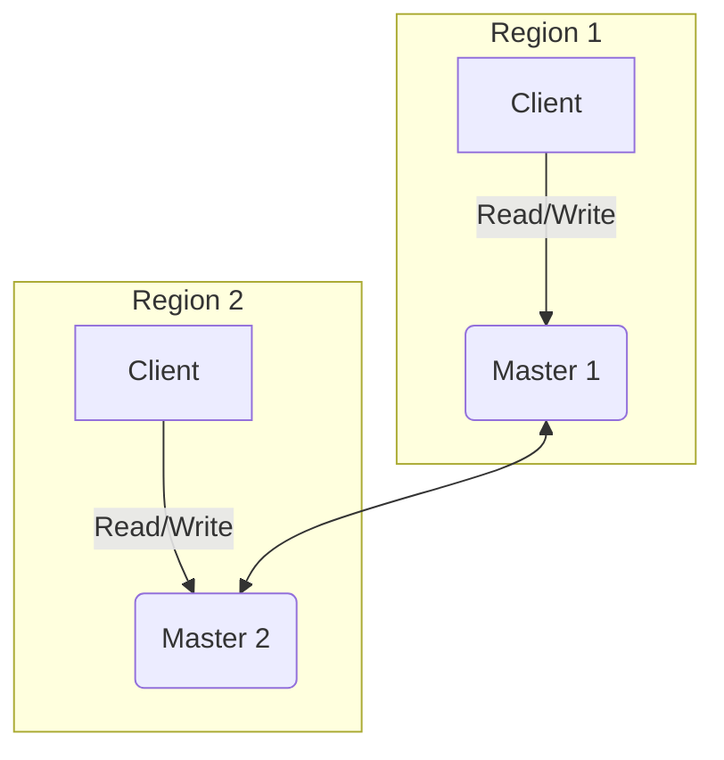
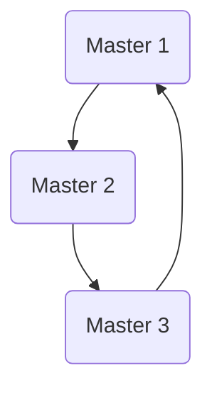
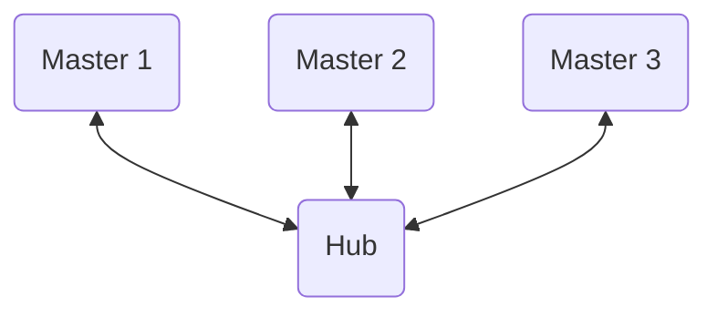
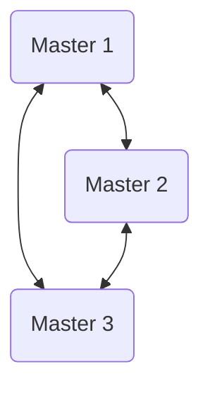

## Introduction to Multi-Master Replication

In the world of distributed systems, ensuring high availability and low latency across different geographical locations is a significant challenge. While master-slave replication is a great starting point, it has a single point of failure for write operations: the master. This is where **multi-master replication** comes in.

### What is Multi-Master Replication?

Multi-master replication is a database replication strategy where multiple servers act as masters. Each master can accept both read and write requests. The changes made on one master are then replicated to all other masters in the system.



### Why Use It?

The primary benefits of multi-master replication are:

*   **Write Availability:** If one master goes down, other masters can still accept write requests, eliminating the single point of failure for writes.
*   **Reduced Latency:** Clients can connect to the nearest master, reducing the time it takes to write data. This is especially useful for globally distributed applications.
*   **Load Distribution:** Write traffic can be distributed across multiple masters, improving the overall performance of the system.

## Core Concepts

In a multi-master setup, every master is a "source of truth." When a write occurs on one master, it's propagated to the others. This can happen in a few different ways, which we'll explore later.

The key challenge in multi-master replication is **conflict resolution**. What happens if the same piece of data is modified on two different masters at the same time? This is a complex problem with no one-size-fits-all solution.

## The Challenge of Conflict Resolution

Imagine two users in different parts of the world trying to book the last seat on a flight. Both of their requests go to different masters. Both masters see the seat as available and accept the booking. Now you have two users booked for the same seat. This is a **write conflict**.

There are several strategies for dealing with conflicts:

*   **Last Write Wins (LWW):** The change with the latest timestamp is the one that's kept. This is simple but can lead to data loss.
*   **Custom Logic:** You can define your own rules for resolving conflicts. For example, in the flight booking scenario, you might have a rule that the booking with the lower-numbered seat is the one that's kept.
*   **Conflict-Free Replicated Data Types (CRDTs):** These are special data structures that are designed to avoid conflicts altogether.

We'll cover conflict resolution in more detail in a future post.

## Multi-Master Topologies

There are several ways to set up a multi-master replication system.

### Ring Topology

In a ring topology, each master replicates its changes to the next master in the ring. This is simple to set up but can be slow, as a change has to propagate all the way around the ring to reach every master.



### Star Topology

In a star topology, there's a central master that all other masters replicate to and from. This is more efficient than a ring topology, but the central master can become a bottleneck.



### All-to-All Topology

In an all-to-all topology, every master replicates its changes to every other master. This is the most resilient and has the lowest latency, but it's also the most complex to manage.



## Implementation in Go

Let's simulate a simple two-master setup in Go. We'll use channels to simulate the replication process.

```go
package main

import (
    "fmt"
    "sync"
    "time"
)

type Change struct {
    Key   string
    Value string
}

type Master struct {
    ID       int
    Data     map[string]string
    mut      sync.RWMutex
    InChan   chan Change
    OutChans []chan Change
}

func (m *Master) Set(key, value string) {
    m.mut.Lock()
    m.Data[key] = value
    m.mut.Unlock()

    change := Change{Key: key, Value: value}
    for _, ch := range m.OutChans {
        ch <- change
    }
}

func (m *Master) Get(key string) (string, bool) {
    m.mut.RLock()
    defer m.mut.RUnlock()
    val, ok := m.Data[key]
    return val, ok
}

func (m *Master) Start() {
    for change := range m.InChan {
        m.mut.Lock()
        // Simple "last write wins" conflict resolution
        m.Data[change.Key] = change.Value
        m.mut.Unlock()
        fmt.Printf("Master %d received update: %s = %s\n", m.ID, change.Key, change.Value)
    }
}

func main() {
    chan1 := make(chan Change, 100)
    chan2 := make(chan Change, 100)

    master1 := &Master{
        ID:       1,
        Data:     make(map[string]string),
        InChan:   chan1,
        OutChans: []chan Change{chan2},
    }

    master2 := &Master{
        ID:       2,
        Data:     make(map[string]string),
        InChan:   chan2,
        OutChans: []chan Change{chan1},
    }

    go master1.Start()
    go master2.Start()

    master1.Set("hello", "world")
    time.Sleep(100 * time.Millisecond) // Allow time for replication

    val, _ := master2.Get("hello")
    fmt.Printf("Master 2 has value: %s\n", val)

    master2.Set("foo", "bar")
    time.Sleep(100 * time.Millisecond)

    val, _ = master1.Get("foo")
    fmt.Printf("Master 1 has value: %s\n", val)
}
```

This example demonstrates a very basic all-to-all topology with two masters. A real-world system would need to handle network partitions, more sophisticated conflict resolution, and many other failure scenarios.

## Conclusion

Multi-master replication is a powerful tool for building highly available, globally distributed applications. However, it introduces the significant challenge of conflict resolution. When choosing a replication strategy, it's crucial to weigh the benefits of write availability against the complexity of managing a multi-master system.
