# System Design: Multi-Region Architecture

Multi-region architecture involves deploying applications and infrastructure across multiple geographic regions to improve performance, availability, and disaster recovery capabilities. This architectural approach is essential for global applications that need to serve users with low latency, ensure high availability, and maintain business continuity in the face of regional failures. Building effective multi-region systems requires careful consideration of data distribution, consistency models, traffic routing, and operational complexity.

## Understanding Multi-Region Architecture

Multi-region architecture distributes application components, data, and services across multiple geographic locations to achieve specific business objectives such as reduced latency, improved availability, and regulatory compliance. The architecture must balance the benefits of geographic distribution with the challenges of data consistency and system complexity.

```mermaid
graph TD
    A[Multi-Region Architecture] --> B[Traffic Routing]
    A --> C[Data Replication]
    A --> D[Consistency Management]
    A --> E[Regional Services]
    A --> F[Failover Management]
    A --> G[Monitoring & Observability]
    
    B --> B1[DNS Routing]
    B --> B2[Load Balancers]
    B --> B3[CDNs]
    
    C --> C1[Active-Passive]
    C --> C2[Active-Active]
    C --> C3[Eventual Consistency]
    
    D --> D1[Strong Consistency]
    D --> D2[Causal Consistency]
    D --> D3[Eventual Consistency]
    
    E --> E1[Regional Databases]
    E --> E2[Regional Services]
    E --> E3[Regional Caches]
    
    F --> F1[Automated Failover]
    F --> F2[Manual Failover]
    F --> F3[Regional Health Checks]
    
    G --> G1[Cross-Regional Metrics]
    G --> G2[Latency Monitoring]
    G --> G3[Availability Tracking]
    
    style A fill:#e1f5fe
    style B fill:#e8f5e8
    style C fill:#fff3e0
    style D fill:#f3e5f5
    style E fill:#ffebee
    style F fill:#e0f2f1
    style G fill:#fce4ec
```



### Multi-Region Architecture Patterns

1. **Active-Passive**: One primary region handles all traffic; other regions are on standby for failover
2. **Active-Active**: All regions handle traffic simultaneously
3. **Active-Selective**: Specific regions handle traffic for specific user segments or use cases

## Traffic Routing and Load Balancing

Effective traffic routing is crucial in multi-region architectures to direct users to the optimal region based on factors like latency, load, and availability.

```go
// Traffic routing and load balancing implementation
package main

import (
    "context"
    "fmt"
    "math/rand"
    "net/http"
    "sync"
    "time"
)

// Region represents a geographic region
type Region struct {
    Name        string
    Code        string
    Latency     time.Duration // Average latency to this region
    Load        float64       // Current load percentage (0.0-1.0)
    Health      string        // "healthy", "degraded", "unhealthy"
    LatencyMap  map[string]time.Duration // Latency from different locations to this region
}

// TrafficRouter manages routing of requests to different regions
type TrafficRouter struct {
    regions        map[string]*Region
    regionWeights  map[string]int
    mutex          sync.RWMutex
    healthCheckUrl string
}

func NewTrafficRouter(healthCheckUrl string) *TrafficRouter {
    router := &TrafficRouter{
        regions:        make(map[string]*Region),
        regionWeights:  make(map[string]int),
        healthCheckUrl: healthCheckUrl,
    }
    
    // Initialize default regions
    router.AddRegion("us-east-1", "US East", 20*time.Millisecond, 0.3, "healthy")
    router.AddRegion("eu-west-1", "EU West", 80*time.Millisecond, 0.2, "healthy")
    router.AddRegion("ap-southeast-1", "Asia Pacific", 150*time.Millisecond, 0.1, "healthy")
    
    return router
}

// AddRegion adds a new region to the routing configuration
func (tr *TrafficRouter) AddRegion(code, name string, latency time.Duration, load float64, health string) {
    tr.mutex.Lock()
    defer tr.mutex.Unlock()
    
    tr.regions[code] = &Region{
        Name:        name,
        Code:        code,
        Latency:     latency,
        Load:        load,
        Health:      health,
        LatencyMap:  make(map[string]time.Duration),
    }
    tr.regionWeights[code] = 100 // Default weight
    
    fmt.Printf("Region %s added to routing configuration\n", code)
}

// GetOptimalRegion returns the best region for a user based on their location
func (tr *TrafficRouter) GetOptimalRegion(userLocation string) string {
    tr.mutex.RLock()
    defer tr.mutex.RUnlock()
    
    if len(tr.regions) == 0 {
        return ""
    }
    
    var bestRegion string
    var bestScore float64 = -1
    
    for code, region := range tr.regions {
        if region.Health != "healthy" {
            continue
        }
        
        score := tr.calculateRegionScore(region, userLocation)
        if score > bestScore {
            bestScore = score
            bestRegion = code
        }
    }
    
    return bestRegion
}

// calculateRegionScore calculates a score for a region based on latency, load, and health
func (tr *TrafficRouter) calculateRegionScore(region *Region, userLocation string) float64 {
    // Base score starts with weight
    score := float64(tr.regionWeights[region.Code])
    
    // Factor in latency (lower is better)
    latencyFactor := 1.0 / (float64(region.Latency.Milliseconds()) / 100.0)
    score *= latencyFactor
    
    // Factor in load (lower load is better)
    loadFactor := 1.0 - region.Load
    score *= loadFactor
    
    // Factor in custom latency from user location if available
    if customLatency, exists := region.LatencyMap[userLocation]; exists {
        customLatencyFactor := 1.0 / (float64(customLatency.Milliseconds()) / 100.0)
        score *= customLatencyFactor
    }
    
    return score
}

// GetWeightedRandomRegion returns a region based on weighted random selection
func (tr *TrafficRouter) GetWeightedRandomRegion() string {
    tr.mutex.RLock()
    defer tr.mutex.RUnlock()
    
    totalWeight := 0
    for _, weight := range tr.regionWeights {
        totalWeight += weight
    }
    
    if totalWeight == 0 {
        return ""
    }
    
    randValue := rand.Intn(totalWeight)
    currentWeight := 0
    
    for code, region := range tr.regions {
        if region.Health != "healthy" {
            continue
        }
        
        currentWeight += tr.regionWeights[code]
        if randValue < currentWeight {
            return code
        }
    }
    
    // Fallback to first healthy region
    for code, region := range tr.regions {
        if region.Health == "healthy" {
            return code
        }
    }
    
    return ""
}

// UpdateRegionMetrics updates region metrics
func (tr *TrafficRouter) UpdateRegionMetrics(code string, load float64, health string) {
    tr.mutex.Lock()
    defer tr.mutex.Unlock()
    
    if region, exists := tr.regions[code]; exists {
        region.Load = load
        region.Health = health
    }
}

// UpdateRegionLatency updates region latency metrics
func (tr *TrafficRouter) UpdateRegionLatency(code, userLocation string, latency time.Duration) {
    tr.mutex.Lock()
    defer tr.mutex.Unlock()
    
    if region, exists := tr.regions[code]; exists {
        region.LatencyMap[userLocation] = latency
    }
}

// IPBasedRouter routes based on user IP location
type IPBasedRouter struct {
    *TrafficRouter
    ipLocationService *IPLocationService
}

func NewIPBasedRouter(healthCheckUrl string) *IPBasedRouter {
    return &IPBasedRouter{
        TrafficRouter:   NewTrafficRouter(healthCheckUrl),
        ipLocationService: NewIPLocationService(),
    }
}

// RouteByIP determines the optimal region based on user IP
func (ibr *IPBasedRouter) RouteByIP(userIP string) string {
    location := ibr.ipLocationService.GetLocation(userIP)
    return ibr.GetOptimalRegion(location)
}

// IPLocationService provides IP-based geographic location lookup
type IPLocationService struct {
    // In a real system, this would connect to IP geolocation APIs
    fallbackLocation string
}

func NewIPLocationService() *IPLocationService {
    return &IPLocationService{
        fallbackLocation: "unknown",
    }
}

func (ils *IPLocationService) GetLocation(ip string) string {
    // In a real system, this would call a geolocation service
    // For this example, we'll return a simulated location
    if ip[:4] == "192." {
        return "US"
    } else if ip[:4] == "10.0" {
        return "EU"
    }
    return "US" // Default
}

// LoadBalancer implements regional load balancing
type LoadBalancer struct {
    regionRouters map[string]*RegionLoadBalancer
    globalRouter  *IPBasedRouter
}

type RegionLoadBalancer struct {
    instances []string // Instance endpoints in the region
    current   int
    mutex     sync.RWMutex
}

func NewLoadBalancer() *LoadBalancer {
    return &LoadBalancer{
        regionRouters: make(map[string]*RegionLoadBalancer),
        globalRouter:  NewIPBasedRouter("/health"),
    }
}

// AddRegionInstances adds instances to a specific region
func (lb *LoadBalancer) AddRegionInstances(regionCode string, instances []string) {
    lb.regionRouters[regionCode] = &RegionLoadBalancer{
        instances: instances,
        current:   0,
    }
}

// GetInstance routes a request to an instance in the optimal region
func (lb *LoadBalancer) GetInstance(userIP string) (string, error) {
    region := lb.globalRouter.RouteByIP(userIP)
    if region == "" {
        return "", fmt.Errorf("no healthy region available")
    }
    
    regionLB, exists := lb.regionRouters[region]
    if !exists {
        return "", fmt.Errorf("no instances available in region %s", region)
    }
    
    regionLB.mutex.Lock()
    if regionLB.current >= len(regionLB.instances) {
        regionLB.current = 0
    }
    
    instance := regionLB.instances[regionLB.current]
    regionLB.current++
    regionLB.mutex.Unlock()
    
    return instance, nil
}

// HealthChecker monitors regional health
type HealthChecker struct {
    regions    map[string]string // region -> health endpoint
    routers    *LoadBalancer
    ticker     *time.Ticker
}

func NewHealthChecker(routers *LoadBalancer) *HealthChecker {
    return &HealthChecker{
        regions: make(map[string]string),
        routers: routers,
        ticker:  time.NewTicker(30 * time.Second),
    }
}

// AddRegion adds a region to health monitoring
func (hc *HealthChecker) AddRegion(regionCode, healthEndpoint string) {
    hc.regions[regionCode] = healthEndpoint
}

// Start begins health monitoring
func (hc *HealthChecker) Start() {
    go func() {
        for range hc.ticker.C {
            hc.checkHealth()
        }
    }()
}

// checkHealth performs health checks on all regions
func (hc *HealthChecker) checkHealth() {
    client := &http.Client{Timeout: 10 * time.Second}
    
    for region, endpoint := range hc.regions {
        health, load := hc.checkRegionHealth(client, endpoint)
        hc.routers.globalRouter.UpdateRegionMetrics(region, load, health)
        
        fmt.Printf("Region %s health: %s, load: %.2f\n", region, health, load)
    }
}

// checkRegionHealth checks the health of a specific region
func (hc *HealthChecker) checkRegionHealth(client *http.Client, endpoint string) (string, float64) {
    start := time.Now()
    resp, err := client.Get(endpoint)
    duration := time.Since(start)
    
    if err != nil || resp.StatusCode != 200 {
        return "unhealthy", 0
    }
    
    // Simulate load calculation based on response time
    load := min(1.0, float64(duration.Milliseconds())/1000.0)
    return "healthy", load
}

// min function for float64
func min(a, b float64) float64 {
    if a < b {
        return a
    }
    return b
}

// Example usage
func main() {
    fmt.Println("Multi-Region Traffic Routing Example:")
    
    // Create load balancer
    lb := NewLoadBalancer()
    
    // Add instances to regions
    lb.AddRegionInstances("us-east-1", []string{
        "us-east-1.instance-1.com:8080",
        "us-east-1.instance-2.com:8080",
    })
    
    lb.AddRegionInstances("eu-west-1", []string{
        "eu-west-1.instance-1.com:8080",
        "eu-west-1.instance-2.com:8080",
    })
    
    lb.AddRegionInstances("ap-southeast-1", []string{
        "ap-southeast-1.instance-1.com:8080",
        "ap-southeast-1.instance-2.com:8080",
    })
    
    // Simulate routing requests
    userIPs := []string{
        "192.168.1.1",   // US
        "10.0.0.1",      // EU
        "172.16.0.1",    // Default to US
    }
    
    for _, ip := range userIPs {
        instance, err := lb.GetInstance(ip)
        if err != nil {
            fmt.Printf("Error routing request for IP %s: %v\n", ip, err)
            continue
        }
        
        fmt.Printf("Request from IP %s routed to: %s\n", ip, instance)
    }
    
    // Start health monitoring
    healthChecker := NewHealthChecker(lb)
    healthChecker.AddRegion("us-east-1", "http://us-east-1.instance-1.com:8080/health")
    healthChecker.AddRegion("eu-west-1", "http://eu-west-1.instance-1.com:8080/health")
    healthChecker.AddRegion("ap-southeast-1", "http://ap-southeast-1.instance-1.com:8080/health")
    
    healthChecker.Start()
    
    time.Sleep(2 * time.Second)
    fmt.Println("Traffic routing example completed")
}