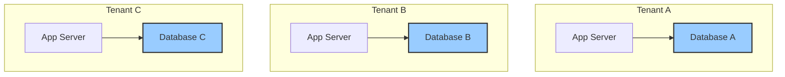
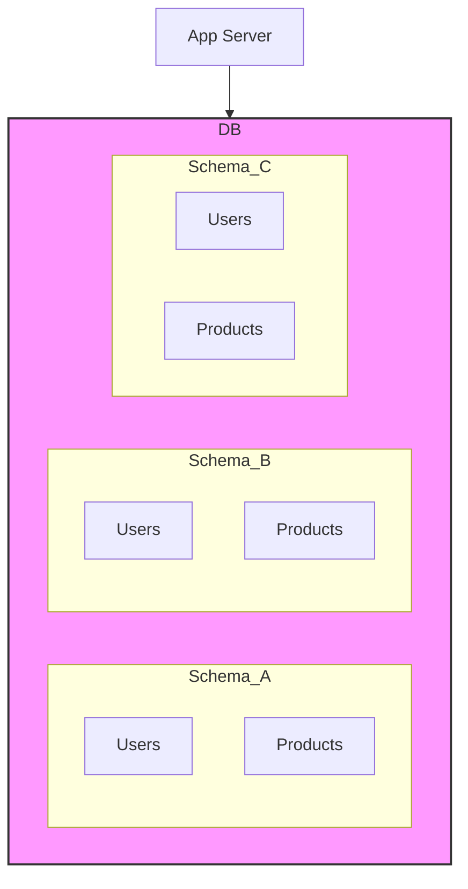
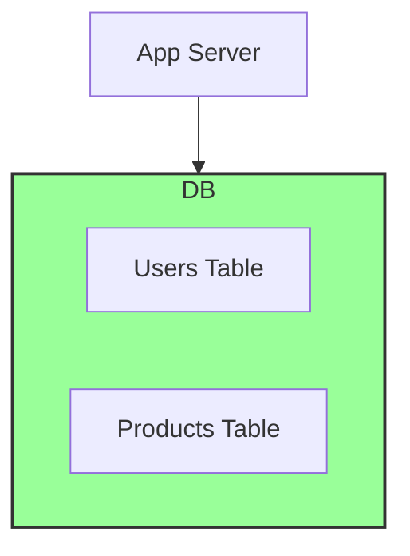

## Introduction: The Core of SaaS

Multi-tenancy is the architectural principle that allows a single instance of a software application to serve multiple customers. Each customer is called a **tenant**. Although all tenants use the same application and underlying infrastructure, they operate in isolation, with their data and configurations kept separate and secure from one another.

Think of an apartment building. All tenants live in the same building (the application infrastructure), but each has their own private, locked apartment (their data).

Choosing the right multi-tenancy model is one of the most critical architectural decisions you'll make when building a Software-as-a-Service (SaaS) product. It has profound implications for cost, scalability, security, and operational complexity. This guide explores the three fundamental data isolation strategies.

## Model 1: Silo Model (Separate Databases)

This is the simplest and most isolated model. Each tenant gets their own dedicated database. When a new customer signs up, you provision a completely new database for them.



**Pros:**
*   **Maximum Security & Isolation:** There is zero chance of tenants accessing each other's data at the database level. This is often a requirement for enterprise, finance, or healthcare clients.
*   **Simple to Implement:** The application logic is straightforward. You just need a way to connect to the correct tenant's database upon login.
*   **Tenant-Specific Customization:** It's easy to customize the schema or restore data for a single tenant.
*   **Easy Per-Tenant Scaling:** If one tenant has a massive workload, you can move their database to a more powerful server without affecting others.

**Cons:**
*   **High Cost:** Running hundreds or thousands of databases is expensive, both in infrastructure costs and management overhead.
*   **Difficult to Scale:** Provisioning a new database for every tenant can be slow and complex.
*   **Maintenance Nightmare:** Rolling out a schema migration requires updating every single database individually.

**Best for:** Enterprise SaaS with a small number of high-value clients who have strict security and isolation requirements.

## Model 2: Bridge Model (Shared Database, Separate Schemas)

This model offers a compromise between isolation and cost. All tenants share a single database server, but each tenant gets their own set of tables within a dedicated **schema**. A schema is a named collection of tables, like a folder within the database.



**Pros:**
*   **Good Isolation:** Data is still logically separated, preventing cross-tenant queries unless explicitly designed.
*   **Lower Cost than Silo:** More tenants can be hosted on a single database server, reducing infrastructure costs.
*   **Balanced Complexity:** Easier to manage than thousands of databases, but still provides strong logical separation.

**Cons:**
*   **Not All Databases Support It Well:** While PostgreSQL has excellent support for schemas, support in MySQL is less robust (it's more of a synonym for "database").
*   **Still Complex for Migrations:** Schema migrations still need to be applied to each tenant's schema.
*   **Noisy Neighbor Problem:** A very active tenant can still consume a disproportionate amount of the shared database server's resources, affecting others.

**Best for:** B2B SaaS applications with a moderate number of tenants where logical data isolation is sufficient.

## Model 3: Pool Model (Shared Database, Shared Schema)

This is the most common multi-tenancy model for modern SaaS applications, especially those with a large number of tenants. All tenants share the same database and the same set of tables. A special column, typically `tenant_id`, is added to every table to distinguish which rows belong to which tenant.


**Users Table:**
| id | tenant_id | name | email |
|----|-----------|------|-------|
| 1  | 1         | Alice| a@corp1.com |
| 2  | 2         | Bob  | b@corp2.com |
| 3  | 1         | Carol| c@corp1.com |

Every single query executed by the application **MUST** include a `WHERE tenant_id = ?` clause to ensure it only accesses data for the current tenant.

**Pros:**
*   **Lowest Cost & Highest Density:** This model is the most cost-effective, allowing thousands of tenants to share a single database.
*   **Massive Scalability:** Onboarding a new tenant is as simple as adding an entry to the `tenants` table. No infrastructure changes needed.
*   **Simple Maintenance:** A schema migration only needs to be run once on the shared set of tables.

**Cons:**
*   **Weakest Isolation:** The biggest risk is a programming error. A single bug in the application code (e.g., forgetting a `WHERE tenant_id = ?` clause) could lead to a catastrophic data leak between tenants.
*   **Complex Application Logic:** The application must be meticulously coded to enforce data isolation on every query.
*   **Noisy Neighbor Problem:** A single tenant can still impact others by running expensive queries or consuming resources.

**Best for:** B2C or B2B SaaS applications that need to scale to a large number of tenants and where development discipline can ensure data isolation.

## Go Example: Enforcing Isolation in the Pool Model

When using the shared schema model, you must prevent data leaks. A good practice is to embed the `tenant_id` in a context and have your data access layer automatically apply it.

```go
package main

import (
	"context"
	"database/sql"
	"errors"
	"fmt"
	"log"

	_ "github.com/lib/pq"
)

// A custom key type to avoid context key collisions.
type contextKey string
const tenantIDKey contextKey = "tenantID"

// WithTenantID adds a tenant ID to the context.
func WithTenantID(ctx context.Context, id int) context.Context {
	return context.WithValue(ctx, tenantIDKey, id)
}

// TenantIDFromContext retrieves a tenant ID from the context.
func TenantIDFromContext(ctx context.Context) (int, error) {
	id, ok := ctx.Value(tenantIDKey).(int)
	if !ok {
		return 0, errors.New("tenant ID not found in context")
	}
	return id, nil
}

// ProductRepository manages access to the products table.
type ProductRepository struct {
	db *sql.DB
}

// GetProductsForTenant fetches products, ensuring the tenant_id is always applied.
func (r *ProductRepository) GetProductsForTenant(ctx context.Context) ([]string, error) {
	tenantID, err := TenantIDFromContext(ctx)
	if err != nil {
		return nil, fmt.Errorf("SECURITY_VIOLATION: %w", err)
	}

	// Every query MUST be scoped to the tenant ID.
	query := "SELECT name FROM products WHERE tenant_id = $1"
	rows, err := r.db.QueryContext(ctx, query, tenantID)
	if err != nil {
		return nil, err
	}
	defer rows.Close()

	var products []string
	for rows.Next() {
		var name string
		if err := rows.Scan(&name); err != nil {
			return nil, err
		}
		products = append(products, name)
	}
	return products, nil
}

func main() {
	// In a real app, you'd get this from your DB config.
	db, err := sql.Open("postgres", "user=postgres password=secret dbname=shared_db sslmode=disable")
	if err != nil {
		log.Fatal(err)
	}
	repo := &ProductRepository{db: db}

	// --- Simulate a request from Tenant 1 ---
	log.Println("--- Request for Tenant 1 ---")
	ctxTenant1 := WithTenantID(context.Background(), 1)
	products1, err := repo.GetProductsForTenant(ctxTenant1)
	if err != nil {
		log.Fatal(err)
	}
	fmt.Printf("Tenant 1 Products: %v\n", products1)

	// --- Simulate a request from Tenant 2 ---
	log.Println("\n--- Request for Tenant 2 ---")
	ctxTenant2 := WithTenantID(context.Background(), 2)
	products2, err := repo.GetProductsForTenant(ctxTenant2)
	if err != nil {
		log.Fatal(err)
	}
	fmt.Printf("Tenant 2 Products: %v\n", products2)
	
	// --- Simulate a buggy request with no tenant ID ---
	log.Println("\n--- Buggy Request (No Tenant ID) ---")
	ctxBuggy := context.Background()
	_, err = repo.GetProductsForTenant(ctxBuggy)
	if err != nil {
		// Our check caught the error!
		log.Printf("SUCCESS: The repository correctly blocked the query: %v", err)
	}
}
```

## Conclusion

Choosing a multi-tenancy model is a fundamental trade-off between isolation and cost.

*   **Silo (Separate Databases):** Maximum isolation, maximum cost.
*   **Bridge (Separate Schemas):** Good isolation, medium cost.
*   **Pool (Shared Schema):** Minimum isolation, minimum cost.

The Pool model is often the default choice for modern, scalable SaaS applications, but it places a heavy burden on the development team to enforce data separation rigorously. The right choice depends on your business needs, customer requirements, and budget.
