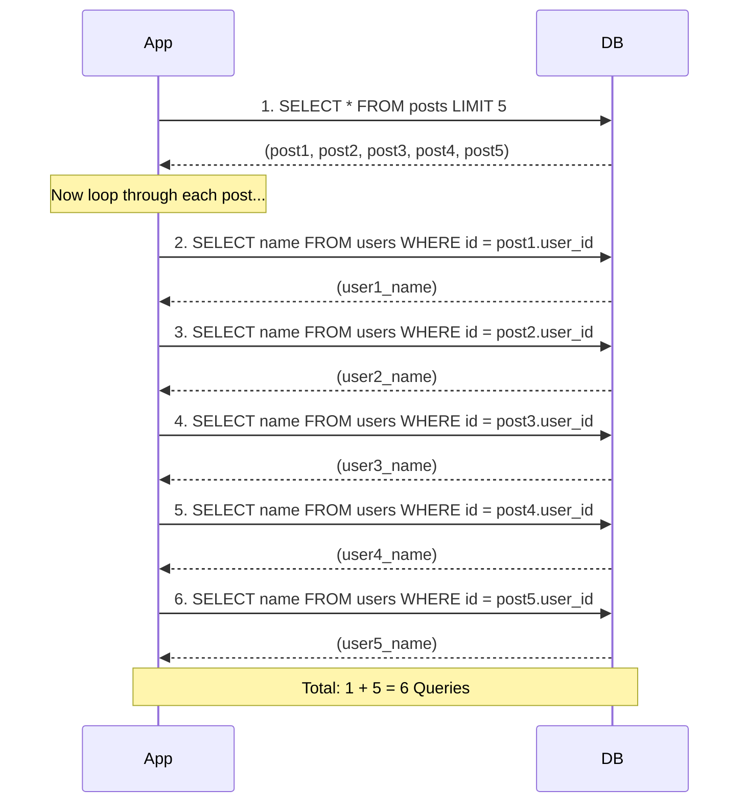

## System Design: Solving the N+1 Query Problem

The **N+1 query problem** is an insidious and incredibly common performance anti-pattern that can cripple applications, especially as they scale. It occurs when your code executes one initial query to retrieve a list of items, and then executes *N* additional queries to fetch related data for each of those *N* items. The result is a "chatty" database interaction that is inefficient and slow.

This problem often hides in plain sight, especially in code using Object-Relational Mappers (ORMs), where the underlying database queries are abstracted away. Understanding and eliminating N+1 problems is a critical step in building high-performance, scalable applications.

### What Does an N+1 Problem Look Like?

Imagine you have two database tables: `users` and `posts`. A user can have many posts.

-   **`users` table:** `id`, `name`
-   **`posts` table:** `id`, `user_id`, `content`

Now, you want to display a list of the 5 most recent posts along with the name of the user who wrote each post.

A naive implementation might look like this:

1.  **Query 1:** Fetch the 5 most recent posts.
    ```sql
    SELECT * FROM posts ORDER BY created_at DESC LIMIT 5;
    ```
2.  **Loop:** For each of the 5 posts retrieved, get the `user_id` and execute a new query to fetch that user's name.
    -   **Query 2:** `SELECT name FROM users WHERE id = ?;` (for post 1's user_id)
    -   **Query 3:** `SELECT name FROM users WHERE id = ?;` (for post 2's user_id)
    -   **Query 4:** `SELECT name FROM users WHERE id = ?;` (for post 3's user_id)
    -   **Query 5:** `SELECT name FROM users WHERE id = ?;` (for post 4's user_id)
    -   **Query 6:** `SELECT name FROM users WHERE id = ?;` (for post 5's user_id)

You executed **1** query to get the posts, and then **N** (where N=5) additional queries to get the users. This is the N+1 problem. For 5 posts, it's not a big deal. For 100 posts, it's 101 separate round trips to the database, which is incredibly inefficient.



### Solution 1: Eager Loading

The most direct solution is **eager loading**. Instead of fetching related data on-demand, you tell your database to fetch it all at once. There are two common ways to do this.

#### A) Using a `JOIN`

You can use a `JOIN` to combine the `posts` and `users` tables in a single query.

```sql
SELECT p.*, u.name
FROM posts p
JOIN users u ON p.user_id = u.id
ORDER BY p.created_at DESC
LIMIT 5;
```
This approach is highly efficient. It results in just **one** query that returns all the data you need.

#### B) Using a `WHERE IN` Clause

Another approach is to perform two queries, but in a much smarter way.

1.  **Query 1:** Fetch the 5 most recent posts.
    ```sql
    SELECT * FROM posts ORDER BY created_at DESC LIMIT 5;
    ```
2.  **Collect Keys:** From the 5 posts, collect all the unique `user_id`s. Let's say they are `[101, 102, 105]`.
3.  **Query 2:** Fetch all the required users in a single batch query.
    ```sql
    SELECT * FROM users WHERE id IN (101, 102, 105);
    ```
This results in only **2** queries, regardless of whether you're fetching 5 posts or 500. This is a massive improvement over N+1.

### Solution 2: The Dataloader Pattern

The `WHERE IN` approach is the core idea behind the **Dataloader pattern**. This pattern, popularized by Facebook's GraphQL implementation, formalizes and automates this batching and caching process.

A Dataloader is a short-lived object that:
1.  **Collects Keys:** It collects individual requests for data (e.g., "get user with ID 101", "get user with ID 102").
2.  **Dispatches a Batch:** At the last possible moment (often using a "tick" of the event loop), it takes all the collected, unique keys and sends them to a batch-loading function that you provide.
3.  **Returns Data:** The batch function (which would run a `WHERE id IN (...)` query) returns a list of users. The Dataloader then distributes the correct user back to the part of the code that originally asked for it.
4.  **Caches:** It also caches the results within its own lifetime, so if you ask for the same user multiple times in a single request, it only fetches it once.

This pattern is especially powerful in complex applications (like GraphQL APIs) where different parts of a request graph might independently ask for the same resource.

### Go Example: Solving N+1 with a Dataloader

This example uses the `github.com/graph-gophers/dataloader` library to solve the N+1 problem.

**Prerequisites:**
```bash
go get github.com/graph-gophers/dataloader
```

**`main.go`**
```go
package main

import (
	"context"
	"fmt"
	"log"
	"strings"
	"sync"
	"time"

	"github.com/graph-gophers/dataloader"
)

// --- Mock Database ---
type User struct {
	ID   string
	Name string
}

var users = map[string]User{
	"1": {ID: "1", Name: "Alice"},
	"2": {ID: "2", Name: "Bob"},
	"3": {ID: "3", Name: "Charlie"},
}

type Post struct {
	ID     string
	UserID string
	Text   string
}

var posts = []Post{
	{ID: "p1", UserID: "1", Text: "Hello World!"},
	{ID: "p2", UserID: "2", Text: "GraphQL is cool."},
	{ID: "p3", UserID: "1", Text: "Dataloaders are powerful."},
	{ID: "p4", UserID: "3", Text: "System Design is fun."},
	{ID: "p5", UserID: "2", Text: "N+1 problems are not."},
}

// --- Dataloader Batch Function ---

// The batch function receives a list of keys (user IDs) and must return
// a result for each key in the same order.
func getUserBatchFn(ctx context.Context, keys dataloader.Keys) []*dataloader.Result {
	userIDs := keys.Keys()
	log.Printf("Dataloader batch function called with %d keys: %v", len(userIDs), userIDs)

	// In a real app, you would run:
	// SELECT * FROM users WHERE id IN (...)
	// For this example, we'll just look them up in our map.

	var results []*dataloader.Result
	for _, id := range userIDs {
		user, ok := users[id]
		if ok {
			results = append(results, &dataloader.Result{Data: user})
		} else {
			// It's important to return an error for keys that are not found.
			results = append(results, &dataloader.Result{Error: fmt.Errorf("user with id %s not found", id)})
		}
	}
	return results
}

// --- Main Application Logic ---

func main() {
	// Create a new dataloader.
	userLoader := dataloader.NewBatchedLoader(getUserBatchFn, dataloader.WithWait(10*time.Millisecond))

	fmt.Println("--- Fetching posts and their authors (with Dataloader) ---")

	// We'll use a WaitGroup to simulate concurrent requests for users.
	var wg sync.WaitGroup
	wg.Add(len(posts))

	for _, post := range posts {
		// This loop runs 5 times.
		// Instead of making 5 DB calls, each call to userLoader.Load() will
		// schedule a fetch and wait for the batch to be dispatched.
		go func(p Post) {
			defer wg.Done()
			
			// Load() returns a "thunk" - a function that will return the result.
			thunk := userLoader.Load(context.Background(), dataloader.StringKey(p.UserID))
			result, err := thunk()
			
			if err != nil {
				log.Printf("Error fetching user for post %s: %v", p.ID, err)
				return
			}
			
			user := result.(User)
			fmt.Printf("Post: '%s' by %s\n", p.Text, user.Name)

		}(post)
	}

	wg.Wait()

	// Because of the batching, the `getUserBatchFn` will be called only ONCE
	// with all the unique user IDs: ["1", "2", "3"].
}
```
When you run this code, you will see the log message "Dataloader batch function called..." appear only once, proving that all the individual user requests were batched into a single, efficient operation.

### Conclusion

The N+1 query problem is a silent performance killer. The key to solving it is to shift from fetching related data one-by-one to fetching it all at once. For simple cases, a `JOIN` or `WHERE IN` query (eager loading) is sufficient. For more complex applications, especially those with nested data structures like GraphQL, the **Dataloader pattern** provides a robust, automated, and highly efficient solution that batches and caches data requests, keeping your application fast and your database happy.
---
