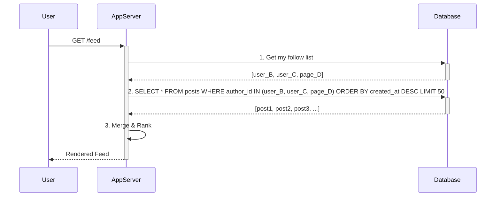

A news feed is the cornerstone of modern social media platforms like Facebook, X (formerly Twitter), and Instagram. It's a constantly updated, personalized list of content from friends, followed pages, and other entities a user cares about. Designing a system that can generate and deliver these feeds to millions of users in real-time is a monumental challenge in scalability and architecture.

This article explores the core architectural patterns for building a news feed, focusing on the two primary models: **fan-out-on-write** (push) and **fan-out-on-read** (pull). We'll also cover ranking, aggregation, and the hybrid approach used by most large-scale systems.

### Core Requirements

*   **Personalization**: The feed must be unique to each user, based on their social graph (friends, follows).
*   **Low Latency**: The feed must load quickly, typically in under a few hundred milliseconds.
*   **Real-Time Updates**: New posts from connections should appear in the feed with minimal delay.
*   **High Scalability**: The system must support millions of users posting and consuming content simultaneously.
*   **Reliability**: The feed must always be available.

### The Two Main Architectural Models

The fundamental problem in news feed design is how to efficiently map posts from creators to the feeds of all their followers.

#### 1. Fan-out-on-Read (The "Pull" Model)

This is the simplest, most intuitive approach. When a user requests their news feed, the system queries the database to find all the people they follow, retrieves their recent posts, merges them, and ranks them.

**Workflow:**
1.  User A requests their feed.
2.  The system looks up User A's friend/follow list: [User B, User C, Page D].
3.  The system queries a `posts` table for recent posts from User B, User C, and Page D.
4.  It merges these posts, sorts them by time (or another ranking signal), and returns the result.



*   **Pros**:
    *   **Simple to Implement**: The logic is straightforward.
    *   **Writing is Fast**: When a user creates a post, it's a single write to the `posts` table. No complex background jobs are needed.
    *   **No Wasted Resources**: Feeds are only generated for active users who request them.

*   **Cons**:
    *   **High Read Latency**: Generating a feed is computationally expensive. It involves multiple queries and a complex merge-sort operation, making it slow, especially for users who follow thousands of people (the "celebrity problem").
    *   **Doesn't Scale for Reads**: The database is hit with heavy read loads every time any user loads their feed. This becomes a major bottleneck.

The pull model is suitable for small-scale applications or for users with a small number of connections, but it quickly falls apart under the load of a major social network.

#### 2. Fan-out-on-Write (The "Push" Model)

This model pre-computes the news feeds to make reading them extremely fast. When a user creates a post, the system immediately "pushes" that post into the feeds of all their followers.

Each user has a dedicated "feed" data structure, often stored in a key-value store like Redis for fast access. This structure is essentially a list of post IDs.

**Workflow:**
1.  User B creates a new post.
2.  The system writes the post to a `posts` table to store the content.
3.  It then fetches User B's follower list: [User A, User F, User G].
4.  A background job or message queue task is initiated. This job iterates through the follower list and inserts the new post's ID into the feed list of User A, User F, and User G.
5.  When User A requests their feed, the system simply reads the pre-computed list of post IDs from their dedicated feed cache and fetches the content for those posts.

```mermaid
graph TD
    subgraph Write Path (Async)
        A[User B creates post] --> B{Save Post Content};
        B --> C{Get Follower List};
        C --> D[Publish to Message Queue];
        D --> E[Fan-out Worker];
        E --> F[Insert post_id into<br/>follower_A's feed cache];
        E --> G[Insert post_id into<br/>follower_F's feed cache];
        E --> H[...and so on];
    end

    subgraph Read Path (Fast)
        I[User A requests feed] --> J{Read feed cache for User A};
        J --> K{Batch-fetch post content};
        K --> L[Render Feed];
    end
```

*   **Pros**:
    *   **Extremely Low Read Latency**: The feed is already computed. Reading it is a single, fast query to a key-value store. This provides an excellent user experience.
    *   **Scales for Reads**: The read path is simple and doesn't put heavy load on the main database.

*   **Cons**:
    *   **High Write Amplification**: A single post from a celebrity with millions of followers (a "hot" write) can trigger millions of writes to the feed caches. This is a massive amount of work.
    *   **Wasted Resources for Inactive Users**: The system does work to push content to all followers, even those who rarely log in.
    *   **Delayed Delivery**: The fan-out process is asynchronous and can take time, so the post might not appear instantly for all followers.

### The Hybrid Model: The Best of Both Worlds

Neither model is perfect. The pull model fails for users who follow many people, and the push model fails for users who *have* many followers.

Large-scale systems like Facebook and X use a **hybrid approach**:
*   **For most users (non-celebrities)**: Use the **fan-out-on-write** (push) model. When they post, the system can quickly push the content to their few hundred or thousand followers.
*   **For celebrities and high-follower accounts**: Use the **fan-out-on-read** (pull) model. It's not feasible to push a post to 50 million followers' caches. Instead:
    1.  When a celebrity posts, the post is just written to the database. No fan-out occurs.
    2.  When a regular user requests their feed, the system first fetches their pre-computed feed (from the non-celebrities they follow).
    3.  Then, it separately checks if the user follows any celebrities. If so, it runs a "pull" query to fetch recent posts from just those few celebrities.
    4.  Finally, it merges the pre-computed feed with the celebrity posts in-memory before rendering.

This hybrid model optimizes for the common case (regular users) while gracefully handling the edge case (celebrities), providing a balance of performance and resource efficiency.

### Go Example: Simplified Fan-out-on-Write

This example demonstrates the core logic of a fan-out-on-write system using Go channels to simulate a message queue and workers.

```go
package main

import (
	"fmt"
	"log"
	"sync"
	"time"
)

// Data Stores (in-memory mocks)
var (
	// Stores post content: map[postID]content
	postStore = make(map[string]string)
	// Stores follower lists: map[userID][]followerID
	followerStore = make(map[string][]string)
	// The feed cache for each user: map[userID][]postID
	feedCache = make(map[string][]string)
	
	postStoreMu   sync.RWMutex
	followerStoreMu sync.RWMutex
	feedCacheMu     sync.RWMutex

	// Message queue for fan-out tasks
	fanoutQueue = make(chan FanoutTask, 100)
)

type FanoutTask struct {
	PostID   string
	AuthorID string
}

// createPost is the entry point when a user posts something.
func createPost(authorID, content string) {
	postStoreMu.Lock()
	postID := fmt.Sprintf("post-%d", time.Now().UnixNano())
	postStore[postID] = content
	postStoreMu.Unlock()

	log.Printf("User '%s' created a new post: '%s'", authorID, content)

	// Publish a task to the fan-out queue
	fanoutQueue <- FanoutTask{PostID: postID, AuthorID: authorID}
}

// fanoutWorker processes tasks from the queue.
func fanoutWorker(workerID int) {
	for task := range fanoutQueue {
		log.Printf("[Worker %d] Processing fan-out for post %s from %s", workerID, task.PostID, task.AuthorID)
		
		followerStoreMu.RLock()
		followers, ok := followerStore[task.AuthorID]
		followerStoreMu.RUnlock()

		if !ok {
			log.Printf("[Worker %d] User %s has no followers.", workerID, task.AuthorID)
			continue
		}

		feedCacheMu.Lock()
		for _, followerID := range followers {
			// Prepend the new post to the follower's feed cache
			feedCache[followerID] = append([]string{task.PostID}, feedCache[followerID]...)
			log.Printf("[Worker %d] Pushed post %s to feed of %s", workerID, task.PostID, followerID)
		}
		feedCacheMu.Unlock()
	}
}

// getFeed simulates a user requesting their feed.
func getFeed(userID string) []string {
	feedCacheMu.RLock()
	defer feedCacheMu.RUnlock()
	
	postIDs, ok := feedCache[userID]
	if !ok {
		return []string{}
	}
	
	// In a real system, you'd fetch the content for these IDs.
	// Here we just return the IDs.
	log.Printf("Fetched feed for %s: %v", userID, postIDs)
	return postIDs
}

func main() {
	// Setup: UserA follows UserB and UserC
	followerStore["UserB"] = []string{"UserA"}
	followerStore["UserC"] = []string{"UserA"}
	
	// Initialize UserA's feed cache
	feedCache["UserA"] = []string{}

	// Start fan-out workers
	for i := 1; i <= 3; i++ {
		go fanoutWorker(i)
	}

	log.Println("--- System is running ---")
	time.Sleep(100 * time.Millisecond)

	// UserB creates a post
	createPost("UserB", "Hello from UserB!")
	time.Sleep(200 * time.Millisecond) // Allow time for fan-out

	// UserA checks their feed
	getFeed("UserA")
	
	time.Sleep(100 * time.Millisecond)

	// UserC creates a post
	createPost("UserC", "My first post!")
	time.Sleep(200 * time.Millisecond) // Allow time for fan-out

	// UserA checks their feed again
	getFeed("UserA")

	close(fanoutQueue)
}
```

### Conclusion

News feed design is a classic example of a large-scale distributed systems problem where there is no one-size-fits-all solution. The choice between fan-out-on-read and fan-out-on-write involves a fundamental trade-off between read performance and write amplification. By understanding these trade-offs and combining the models into a hybrid approach, platforms can deliver a fast, real-time, and personalized experience to hundreds of millions of users, catering to both regular users and celebrities within the same system.