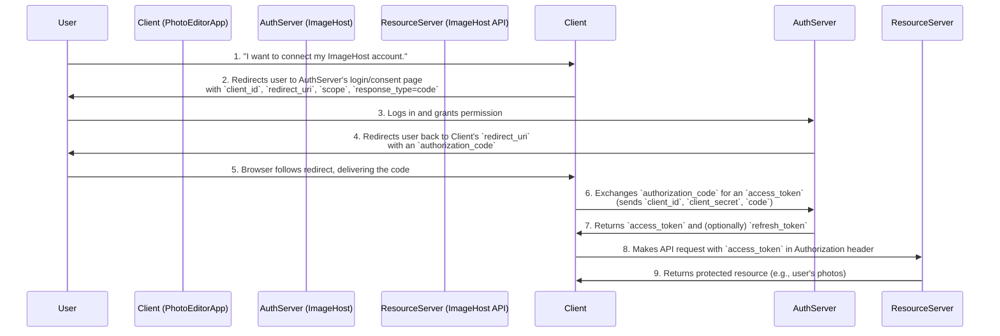

## System Design: A Deep Dive into the OAuth 2.0 Flow

In the modern web, applications rarely live in isolation. Users expect services to integrate seamlessly: a photo editing app that posts directly to their social media, a calendar app that syncs with their work email, or a data analytics tool that pulls data from a third-party API.

But how can a user grant one application access to their data in another application without sharing their password? This is the problem that **OAuth 2.0** solves. It's not an authentication protocol, but an **authorization framework**. It provides a standardized way for a user to grant a third-party application limited access to their resources on another service, without exposing their credentials.

This post provides a deep dive into the OAuth 2.0 flow, its key players, and the most common grant types, complete with diagrams and a Go implementation.

### The Key Players in OAuth 2.0

Before diving into the flow, it's essential to understand the four roles defined by the framework:

1.  **Resource Owner:** You, the user. You own the data (e.g., your photos, your contacts) and have the authority to grant access to it.
2.  **Client:** The third-party application that wants to access your data (e.g., the photo editing app).
3.  **Authorization Server:** The service that the user has their account with (e.g., Google, GitHub, Facebook). This server is responsible for verifying the user's identity and obtaining their consent.
4.  **Resource Server:** The server that hosts the user's data (the API server). This is the server the Client wants to access. Often, the Authorization Server and Resource Server are part of the same application.

### The Authorization Code Grant Type

This is the most common and secure OAuth 2.0 flow, typically used by web applications that have a server-side component. It involves exchanging an **authorization code** for an **access token**.

Let's walk through the flow step-by-step. Imagine a user wants to allow "PhotoEditorApp" (the Client) to access their photos on "ImageHost" (the Resource/Authorization Server).



**Let's break down the steps:**

1.  **The User Initiates:** The user clicks a "Connect with ImageHost" button in PhotoEditorApp.
2.  **The Client Redirects:** PhotoEditorApp constructs a URL to ImageHost's authorization endpoint and redirects the user's browser. The URL includes:
    *   `response_type=code`: Specifies that we want an authorization code.
    *   `client_id`: The public identifier for PhotoEditorApp.
    *   `redirect_uri`: The URL where ImageHost should send the user back after they grant consent. This must be pre-registered with the Authorization Server to prevent phishing attacks.
    *   `scope`: A space-delimited list of permissions the Client is requesting (e.g., `photos.read photos.write`).
3.  **The User Grants Consent:** The user is now on the ImageHost website. They log in (if they aren't already) and are presented with a consent screen: "PhotoEditorApp wants to access your photos. Allow?" The user clicks "Allow."
4.  **The Authorization Server Redirects Back:** ImageHost generates a short-lived, one-time-use **authorization code** and redirects the user's browser back to the `redirect_uri` provided by PhotoEditorApp, with the code attached as a query parameter: `https://photoeditorapp.com/callback?code=XYZ123`.
5.  **The Client Receives the Code:** The user's browser makes a request to the callback URL. The server-side component of PhotoEditorApp now has the authorization code.
6.  **The Client Exchanges the Code for a Token:** This is a crucial, secure, back-channel communication. The Client's server makes a `POST` request directly to the Authorization Server's token endpoint, sending:
    *   The `authorization_code` it just received.
    *   Its `client_id`.
    *   Its `client_secret` (a confidential password that proves the Client's identity).
7.  **The Authorization Server Returns an Access Token:** The Authorization Server validates the code, `client_id`, and `client_secret`. If everything is correct, it returns an **access token**. This token is the key the Client will use to access the user's data. It may also return a **refresh token**, which can be used to get a new access token when the current one expires.
8.  **The Client Accesses the Protected Resource:** PhotoEditorApp can now make requests to the ImageHost API (the Resource Server) by including the access token in the `Authorization` header: `Authorization: Bearer <access_token>`.
9.  **The Resource Server Responds:** The Resource Server validates the access token and, if it's valid and has the required scope, returns the requested data.

### Go Example: A Simple OAuth 2.0 Server and Client

Go's standard library and community packages make implementing OAuth 2.0 straightforward. Let's use the `golang.org/x/oauth2` package.

```go
// main.go
package main

import (
	"context"
	"encoding/json"
	"fmt"
	"log"
	"net/http"

	"golang.org/x/oauth2"
)

var (
	// This would be your application's configuration.
	oauth2Config = &oauth2.Config{
		ClientID:     "YOUR_CLIENT_ID",
		ClientSecret: "YOUR_CLIENT_SECRET",
		RedirectURL:  "http://localhost:8080/callback",
		Scopes:       []string{"photos.read"},
		Endpoint: oauth2.Endpoint{
			AuthURL:  "http://localhost:9090/authorize",
			TokenURL: "http://localhost:9090/token",
		},
	}
	// A random string for CSRF protection.
	oauthStateString = "random-string"
)

// --- Client Application (our app) ---

func main() {
	http.HandleFunc("/", handleHome)
	http.HandleFunc("/login", handleLogin)
	http.HandleFunc("/callback", handleCallback)

	fmt.Println("Client is running at 8080 port.")
	log.Fatal(http.ListenAndServe(":8080", nil))
}

func handleHome(w http.ResponseWriter, r *http.Request) {
	html := `
        <html><body>
            <a href="/login">Login with Auth Server</a>
        </body></html>
    `
	fmt.Fprint(w, html)
}

// Step 2: Redirect user to the authorization server.
func handleLogin(w http.ResponseWriter, r *http.Request) {
	url := oauth2Config.AuthCodeURL(oauthStateString)
	http.Redirect(w, r, url, http.StatusTemporaryRedirect)
}

// Step 5 & 6: Handle the callback, exchange code for a token.
func handleCallback(w http.ResponseWriter, r *http.Request) {
	// Check for CSRF attack.
	if r.FormValue("state") != oauthStateString {
		http.Error(w, "Invalid state", http.StatusBadRequest)
		return
	}

	code := r.FormValue("code")
	token, err := oauth2Config.Exchange(context.Background(), code)
	if err != nil {
		http.Error(w, "Failed to exchange token: "+err.Error(), http.StatusInternalServerError)
		return
	}

	// Step 8: Use the token to access the resource server.
	client := oauth2Config.Client(context.Background(), token)
	resp, err := client.Get("http://localhost:9090/photos")
	if err != nil {
		http.Error(w, "Failed to get resource: "+err.Error(), http.StatusInternalServerError)
		return
	}
	defer resp.Body.Close()

	var photos []string
	json.NewDecoder(resp.Body).Decode(&photos)

	fmt.Fprintf(w, "Photos: %v\n", photos)
}
```
*Note: A full, runnable example would also require a mock Authorization/Resource server. This code demonstrates the client-side flow.*

### Other Important Grant Types

While the Authorization Code flow is the most common, OAuth 2.0 defines others for different use cases:

-   **Client Credentials:** Used for machine-to-machine communication where there is no user. The client authenticates with its `client_id` and `client_secret` to get a token to access its own resources.
-   **Implicit (Legacy):** A simplified flow for single-page applications (SPAs) where the access token is returned directly to the browser. It's less secure because the token is exposed in the URL and is generally not recommended. Modern SPAs should use the Authorization Code flow with a technique called PKCE (Proof Key for Code Exchange).
-   **Resource Owner Password Credentials (Legacy):** The user provides their username and password directly to the client, which exchanges them for an access token. This should only be used when the client is highly trusted (e.g., a first-party mobile app) as it breaks the principle of not sharing credentials.

### Conclusion

OAuth 2.0 is the industry standard for delegated authorization. By separating the roles of the user, client, and servers, it provides a secure and flexible way to enable third-party integrations without compromising user credentials. The Authorization Code Grant is the workhorse of this framework, providing a robust flow for server-side applications. Understanding this flow is fundamental to building and integrating modern, interconnected web services.

In the next post, we'll look at **JWT Token Management**, exploring what access tokens are, how they are structured, and how to handle them securely.
---
