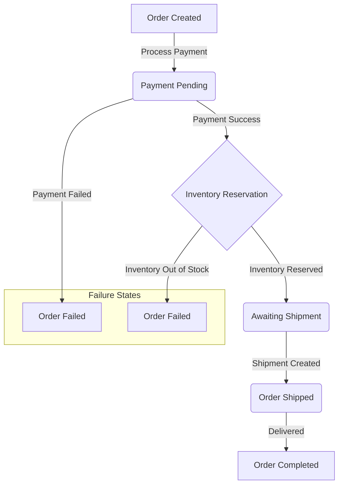
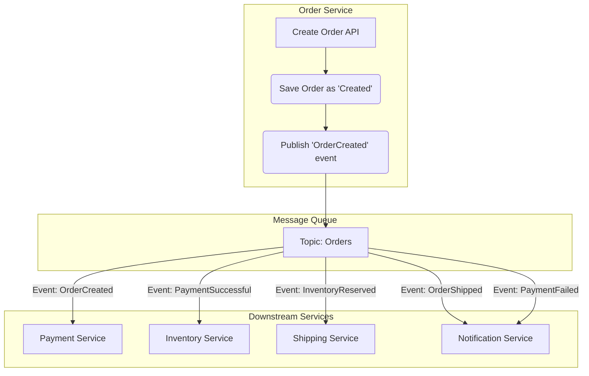

Once a customer clicks "Place Order," a complex series of events is set in motion. The system needs to process the payment, update inventory, notify the warehouse, and send confirmations to the customer. Designing this workflow to be reliable, resilient to failures, and scalable is a critical system design challenge in e-commerce.

A naive, synchronous approach where one service calls another in a long chain is brittle. If the shipping service is down, the entire order might fail, even if the payment was successful. A much better approach is to use an **asynchronous, event-driven workflow**.

This article explores how to design a robust order processing system using state machines and message queues.

### The Lifecycle of an Order

An order progresses through a series of states. Modeling this progression is a perfect use case for a **Finite State Machine (FSM)**. An FSM defines the possible states of an entity and the valid transitions between those states.

A typical order lifecycle might look like this:



**Order States:**
*   **Created**: The initial state when the customer submits the order.
*   **Payment Pending**: The system is waiting for confirmation from the payment gateway.
*   **Awaiting Shipment**: Payment was successful, and inventory has been reserved. The order is ready to be packed and shipped.
*   **Shipped**: The order has been dispatched from the warehouse.
*   **Completed**: The order has been delivered to the customer.
*   **Failed/Cancelled**: The order could not be completed due to payment failure, lack of inventory, or customer cancellation.

### Architecture: Decoupling with Message Queues

To build a resilient system, we should decouple the services responsible for each part of the workflow (Payment, Inventory, Shipping, Notifications). A **message queue** (like RabbitMQ, Apache Kafka, or AWS SQS) is the ideal tool for this.

When an order is created, the Order Service doesn't call the Payment Service directly. Instead, it publishes an `OrderCreated` event to a message queue. Other services subscribe to the events they care about and perform their tasks independently.

**High-Level Architecture:**



**Workflow Steps:**

1.  **Order Creation**: A customer places an order. The `Order Service` creates an order record in the database with the status `CREATED` and publishes an `OrderCreated` event.
2.  **Payment Processing**: The `Payment Service` consumes the `OrderCreated` event. It calls the payment gateway to process the payment.
    *   On success, it publishes a `PaymentSuccessful` event.
    *   On failure, it publishes a `PaymentFailed` event.
3.  **Inventory Reservation**: The `Inventory Service` consumes the `PaymentSuccessful` event. It attempts to reserve the items in the order.
    *   On success, it publishes an `InventoryReserved` event.
    *   On failure (out of stock), it publishes an `InventoryReservationFailed` event. This would trigger a compensating transaction, like refunding the payment.
4.  **Shipping**: The `Shipping Service` consumes the `InventoryReserved` event. It notifies the warehouse to prepare the shipment. Once shipped, it publishes an `OrderShipped` event.
5.  **Notifications**: The `Notification Service` listens to all relevant events (`PaymentFailed`, `OrderShipped`, etc.) to send emails or SMS messages to the customer.

### Handling Failures and Idempotency

In a distributed system, failures are inevitable. What happens if the Inventory Service processes a `PaymentSuccessful` event but crashes before it can publish the `InventoryReserved` event?

This is where the concept of an **idempotent** operation is crucial. An idempotent operation is one that can be performed multiple times with the same result as if it were performed only once.

**How to achieve idempotency:**
*   **Unique Transaction IDs**: Every event should contain a unique identifier (e.g., `order_id` or a dedicated `event_id`).
*   **Check-Before-Act**: When a service consumes an event, it should first check if it has already processed this event. For example, the Inventory Service could check the order's status. If the status is already `AWAITING_SHIPMENT`, it knows it has already reserved the inventory and can safely ignore the duplicate event.

**Example Failure Scenario & Recovery:**
1.  Inventory Service consumes `PaymentSuccessful` for Order 123.
2.  It reserves the inventory and updates the order status to `AWAITING_SHIPMENT`.
3.  It crashes before publishing the `InventoryReserved` event.
4.  The message queue, not having received an acknowledgment, redelivers the `PaymentSuccessful` event to another instance of the Inventory Service.
5.  The new instance receives the event for Order 123. It checks the order's status and sees it's already `AWAITING_SHIPMENT`.
6.  It concludes the work is already done, acknowledges the message, and perhaps publishes the `InventoryReserved` event to ensure the workflow continues.

### Go Example: A Simplified Order Workflow

This example uses Go channels to simulate a message queue and demonstrates how different services can react to events asynchronously.

```go
package main

import (
	"fmt"
	"log"
	"sync"
	"time"
)

// Using a simple string for state, but an enum (iota) is better in production.
type Order struct {
	ID     string
	State  string
	UserID string
}

// Message represents an event on the message queue.
type Message struct {
	EventName string
	Payload   Order
}

var (
	orderQueue = make(chan Message, 10)
	wg         sync.WaitGroup
)

// OrderService creates orders and publishes the initial event.
func OrderService(orderID, userID string) {
	defer wg.Done()
	log.Println("[OrderService] Creating order...")
	order := Order{ID: orderID, UserID: userID, State: "CREATED"}
	orderQueue <- Message{EventName: "OrderCreated", Payload: order}
	log.Printf("[OrderService] Published 'OrderCreated' for order %s\n", orderID)
}

// PaymentService listens for OrderCreated events.
func PaymentService() {
	for msg := range orderQueue {
		if msg.EventName == "OrderCreated" {
			log.Printf("[PaymentService] Received 'OrderCreated' for order %s. Processing payment...\n", msg.Payload.ID)
			time.Sleep(100 * time.Millisecond) // Simulate API call to payment gateway

			// Simulate payment success
			msg.Payload.State = "PAYMENT_SUCCESSFUL"
			orderQueue <- Message{EventName: "PaymentSuccessful", Payload: msg.Payload}
			log.Printf("[PaymentService] Published 'PaymentSuccessful' for order %s\n", msg.Payload.ID)
		}
	}
}

// InventoryService listens for PaymentSuccessful events.
func InventoryService() {
	for msg := range orderQueue {
		if msg.EventName == "PaymentSuccessful" {
			log.Printf("[InventoryService] Received 'PaymentSuccessful' for order %s. Reserving inventory...\n", msg.Payload.ID)
			time.Sleep(100 * time.Millisecond) // Simulate DB update

			// Simulate inventory reservation success
			msg.Payload.State = "INVENTORY_RESERVED"
			orderQueue <- Message{EventName: "InventoryReserved", Payload: msg.payload}
			log.Printf("[InventoryService] Published 'InventoryReserved' for order %s\n", msg.Payload.ID)
		}
	}
}

// ShippingService listens for InventoryReserved events.
func ShippingService() {
	for msg := range orderQueue {
		if msg.EventName == "InventoryReserved" {
			log.Printf("[ShippingService] Received 'InventoryReserved' for order %s. Preparing for shipment...\n", msg.Payload.ID)
			time.Sleep(100 * time.Millisecond) // Simulate warehouse notification

			msg.Payload.State = "SHIPPED"
			log.Printf("[ShippingService] Order %s is now SHIPPED.\n", msg.Payload.ID)
			
			// This could publish another event, e.g., for notifications.
			// For simplicity, we end the flow here.
			wg.Done() // Signal that this order's workflow is complete.
		}
	}
}

func main() {
	log.Println("Starting order processing system...")

	// Start the consumer services (run them as goroutines to listen concurrently)
	go PaymentService()
	go InventoryService()
	go ShippingService()

	// --- Simulate placing a few orders ---
	ordersToPlace := 3
	wg.Add(ordersToPlace)

	for i := 1; i <= ordersToPlace; i++ {
		orderID := fmt.Sprintf("ORD-%03d", i)
		userID := fmt.Sprintf("USER-%03d", i)
		wg.Add(1) // For the initial creation task
		go OrderService(orderID, userID)
	}

	// Wait for all orders to be fully processed
	wg.Wait()
	close(orderQueue)
	log.Println("All orders processed. Shutting down.")
}
```

### Conclusion

Designing an order processing system is a masterclass in building resilient, distributed systems. By modeling the order lifecycle as a state machine and using message queues to decouple services, you create a workflow that is scalable and fault-tolerant. Each service can be scaled, updated, and fail independently without bringing down the entire system. Key principles like idempotency and well-defined compensating transactions (e.g., for refunds) are essential for ensuring data consistency and reliability in the face of the inevitable failures of a distributed environment.