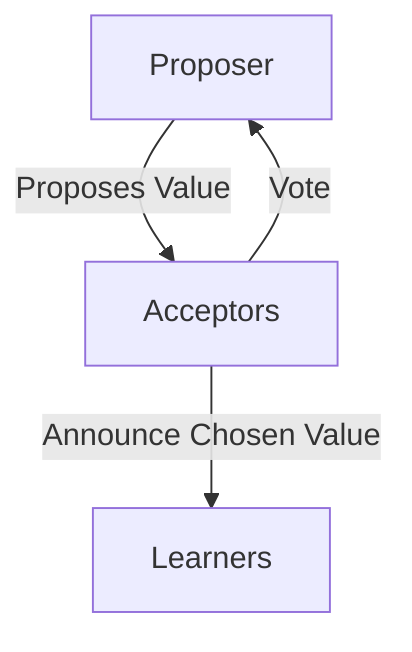

## Introduction: The Bedrock of Consensus

Long before Raft was designed for understandability, there was **Paxos**. Developed by Leslie Lamport in the 1980s, Paxos was the first provably correct consensus algorithm for asynchronous distributed systems. For decades, it has been the theoretical foundation upon which many of the world's most reliable distributed systems have been built.

However, Paxos has a reputation for being incredibly difficult to understand. Lamport's original paper described the algorithm using an analogy of a part-time parliament on a Greek island, which, while creative, added a layer of abstraction that many found confusing.

This post aims to strip away the analogy and explain Paxos in more direct terms, focusing on the core mechanics of how it achieves consensus.

### Why Bother with Paxos?

If Raft is easier to understand, why learn Paxos?

1.  **Foundational Knowledge:** Many older, established systems use Paxos (or a variant). Understanding Paxos gives you insight into how they work.
2.  **Deeper Understanding:** Grappling with Paxos can give you a deeper appreciation for the subtleties and challenges of consensus, which can make you a better system designer.
3.  **Variants:** Paxos has many variants (e.g., Multi-Paxos, Cheap Paxos) that solve different problems. Understanding the original is the first step to understanding them.

## The Roles in Paxos

Paxos involves three distinct roles. In a real system, a single server might play one or more of these roles at the same time.

*   **Proposer:** A Proposer suggests a value that it wants the system to agree upon. It's the active component that drives the consensus process.
*   **Acceptor:** An Acceptor acts as the memory of the system. Acceptors vote on whether to accept a value proposed by a Proposer. A majority of Acceptors must agree for a value to be chosen.
*   **Learner:** A Learner is a passive component that simply learns the outcome of the consensus process (i.e., which value was chosen). This is for replication; once a value is chosen, Learners can apply it to their state machines.



## The Two Phases of Paxos

The core of the Paxos algorithm is a two-phase protocol.

### Phase 1: Prepare

This phase is about a Proposer claiming leadership for a particular proposal number.

1.  **Prepare Request:** The Proposer chooses a **proposal number** `n`, which must be higher than any proposal number it has used before. It sends a `Prepare(n)` request to a majority of Acceptors.
2.  **Promise Response:** An Acceptor receives the `Prepare(n)` request.
    *   If `n` is higher than any proposal number it has seen before, the Acceptor promises not to accept any future proposals with a number less than `n`.
    *   It responds to the Proposer with a `Promise(n, previously_accepted_value)`, where `previously_accepted_value` is the value it last accepted (if any).
    *   If `n` is not higher than a proposal number it has already seen, it ignores the request.

### Phase 2: Accept

If the Proposer receives a `Promise` from a majority of Acceptors, it can proceed to the second phase.

1.  **Accept Request:** The Proposer sends an `Accept(n, v)` request to the same majority of Acceptors.
    *   `n` is the same proposal number from the `Prepare` phase.
    *   `v` is the value it wants to propose. **Crucially**, if any of the Acceptors returned a `previously_accepted_value`, the Proposer *must* propose that value. If they didn't, it's free to propose its own value.
2.  **Accepted Response:** An Acceptor receives the `Accept(n, v)` request.
    *   If the Acceptor has not already promised to consider a higher proposal number, it accepts the proposal `(n, v)` and sends an `Accepted(n, v)` message to the Proposer and all Learners.

A value is considered **chosen** when a majority of Acceptors have accepted it.

## A Simplified Go Implementation

Let's model the core logic of an Acceptor in Go.

```go
package main

import (
    "fmt"
    "sync"
)

type Proposal struct {
    Number int
    Value  string
}

type Acceptor struct {
    mu              sync.Mutex
    promisedNumber  int
    acceptedProposal *Proposal
}

func (a *Acceptor) Prepare(proposalNumber int) (bool, *Proposal) {
    a.mu.Lock()
    defer a.mu.Unlock()

    if proposalNumber > a.promisedNumber {
        a.promisedNumber = proposalNumber
        fmt.Printf("Acceptor: Promising proposal %d\n", proposalNumber)
        return true, a.acceptedProposal
    }

    fmt.Printf("Acceptor: Rejecting proposal %d (already promised %d)\n", proposalNumber, a.promisedNumber)
    return false, nil
}

func (a *Acceptor) Accept(proposal Proposal) bool {
    a.mu.Lock()
    defer a.mu.Unlock()

    if proposal.Number >= a.promisedNumber {
        a.promisedNumber = proposal.Number
        a.acceptedProposal = &proposal
        fmt.Printf("Acceptor: Accepting proposal %d with value '%s'\n", proposal.Number, proposal.Value)
        return true
    }

    fmt.Printf("Acceptor: Rejecting accept request for proposal %d (already promised %d)\n", proposal.Number, a.promisedNumber)
    return false
}

func main() {
    acceptor := &Acceptor{}

    // --- Round 1 ---
    fmt.Println("--- Proposer 1 (n=1) ---")
    // Proposer 1 sends Prepare(1)
    ok, prev := acceptor.Prepare(1)
    fmt.Printf("Proposer 1 received promise: %v, previously accepted: %v\n", ok, prev)

    // Proposer 1 sends Accept(1, "hello")
    accepted := acceptor.Accept(Proposal{Number: 1, Value: "hello"})
    fmt.Printf("Proposer 1's value was accepted: %v\n", accepted)
    fmt.Println()

    // --- Round 2 (competing proposer) ---
    fmt.Println("--- Proposer 2 (n=2) ---")
    // Proposer 2 sends Prepare(2)
    ok, prev = acceptor.Prepare(2)
    fmt.Printf("Proposer 2 received promise: %v, previously accepted: %v\n", ok, prev)
    // Proposer 2 MUST now propose "hello"
    if prev != nil {
        accepted = acceptor.Accept(Proposal{Number: 2, Value: prev.Value})
        fmt.Printf("Proposer 2's value was accepted: %v\n", accepted)
    }
}
```

This example shows how an Acceptor maintains its state (`promisedNumber` and `acceptedProposal`) and how a new Proposer with a higher number can take over, but is forced to continue with the already-accepted value.

## Conclusion: The Price of Correctness

Paxos is powerful and guarantees safety, but its correctness comes at the cost of intuition. The two-phase commit, the rules about proposal numbers, and the way values are "locked in" can be mind-bending. The algorithm allows for multiple proposers to be active at once, leading to potential duels where no progress is made.

This is why **Multi-Paxos**, an optimization where a single leader is elected to be the sole proposer, is almost always used in practice. And if you look at Multi-Paxos, it starts to look a lot like Raft.

Understanding Paxos is a rite of passage for students of distributed systems. It reveals the raw, fundamental challenges of reaching agreement in a world of unreliable networks and servers. While you may end up implementing Raft, learning Paxos will give you a firm grasp of the principles that make it all work.
