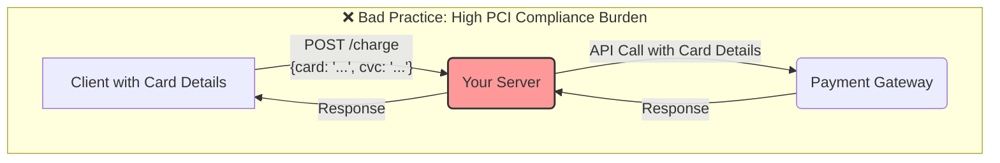
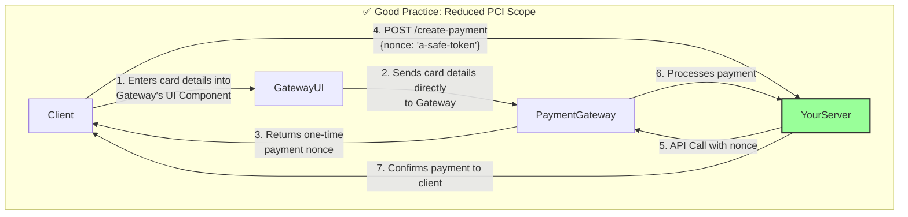

Integrating a payment gateway is one of the most critical and sensitive parts of any e-commerce application. It involves handling sensitive customer data (credit card numbers), ensuring security, and building a reliable system to process transactions. A poorly designed integration can lead to security breaches, lost revenue, and a loss of customer trust.

Modern payment gateways like Stripe, PayPal, and Adyen have simplified this process significantly, but the core architectural principles remain crucial. This article covers the best practices for integrating a payment gateway, focusing on security, reliability, and idempotency.

### The Wrong Way: Sending Card Details to Your Server

The most important rule of payment processing is: **Never let sensitive credit card data touch your server.**

If you were to build a payment form that submits the card number, CVC, and expiry date directly to your backend, you would be taking on the full burden of PCI DSS (Payment Card Industry Data Security Standard) compliance. This is an incredibly complex and expensive process, requiring rigorous security audits.


In this model, your server is in the "scope" of PCI compliance because it processes and transmits raw cardholder data.

### The Right Way: Client-Side Tokenization

Modern payment gateways solve this problem with **tokenization**. The process moves the handling of sensitive data entirely to the client-side, using the gateway's secure components.

**The Workflow:**

1.  **Fetch a Client Token**: Your server asks the payment gateway for a temporary, single-use client token.
2.  **Render the Payment Form**: Your frontend uses the gateway's JavaScript library to render a secure payment form (often in an iframe). This form is hosted by the gateway, not you.
3.  **Submit to Gateway, Not Your Server**: When the user enters their card details and clicks "Pay," the gateway's JavaScript library intercepts the submission. It sends the card details directly to the payment gateway's servers, bypassing your server completely.
4.  **Receive a Payment Nonce**: The payment gateway securely processes the card details and returns a one-time-use token, often called a "payment method nonce" or "payment token." This nonce is a non-sensitive reference to the card details.
5.  **Submit Nonce to Your Server**: The client-side code now has a safe token. It sends this nonce to your server.
6.  **Server-Side Charge**: Your server receives the nonce and uses it to make a "charge" or "create payment" API call to the payment gateway. Your server only ever handles the safe nonce, not the actual card number.

**Tokenization Architecture:**


This architecture dramatically reduces your PCI compliance scope because your server never sees, stores, or transmits raw cardholder data.

### Reliability: Handling Failures with Webhooks

What happens if your server successfully tells the gateway to create a charge, but your server crashes before it receives the "success" response? You might think the payment failed, but the customer was actually charged.

This is where **webhooks** become essential for reliability. A webhook is a server-to-server notification that the payment gateway sends to an endpoint you provide.

**Why Webhooks are Necessary:**
*   **Asynchronous Events**: Many payment events are asynchronous (e.g., bank transfers, chargebacks, subscription renewals). Webhooks are the only way to be notified of these events.
*   **Network Failures**: They provide a backup confirmation mechanism. If your server misses the direct API response, the webhook will eventually inform it of the payment's final status.

**Webhook Workflow:**
1.  You configure a webhook URL in your payment gateway's dashboard (e.g., `https://api.yourstore.com/webhooks/payment`).
2.  When a payment is completed, the gateway sends a signed POST request to your webhook URL with the event details.
3.  Your webhook handler receives the event. **Crucially, it must verify the request's signature** to ensure it genuinely came from the payment gateway and wasn't forged.
4.  Your handler then updates the order status in your database based on the event (e.g., moves order from `PENDING` to `PAID`).

### Idempotency: Preventing Double Charges

Network issues can cause the same request to be sent multiple times. Imagine a customer clicks "Pay," and the request times out. They click again. If you're not careful, you could charge them twice.

**Idempotency** ensures that making the same request multiple times has the same effect as making it once.

Payment gateways typically handle this via an **Idempotency-Key** header.

**How it works:**
1.  When your server is about to make a charge request to the gateway, it first generates a unique key for this operation (e.g., a UUID). A good choice is to use your internal `order_id`.
2.  You send this key in the `Idempotency-Key` (or similar) HTTP header of your API request.
3.  **First Request**: The gateway receives the request, processes it, and stores the result associated with that idempotency key.
4.  **Second (Duplicate) Request**: If the gateway receives another request with the *same* idempotency key, it doesn't re-process the payment. Instead, it simply returns the stored result from the first request.

This guarantees that a customer can't be accidentally charged twice for the same order.

### Go Example: Server-Side Charge with Idempotency

This conceptual Go code shows how a server would handle a payment nonce and make an idempotent charge request.

```go
package main

import (
	"bytes"
	"encoding/json"
	"fmt"
	"log"
	"net/http"
	"github.com/google/uuid"
)

// This is a mock of a payment gateway's client library or direct API call.
type PaymentGatewayClient struct {
	APIKey string
}

type ChargeRequest struct {
	Amount        int    `json:"amount"` // in cents
	Currency      string `json:"currency"`
	PaymentNonce  string `json:"payment_nonce"`
}

// Charge makes a request to the payment gateway.
func (pg *PaymentGatewayClient) Charge(req ChargeRequest, idempotencyKey string) (string, error) {
	// In a real scenario, you'd use the gateway's SDK.
	// This simulates a direct HTTP call.
	
	apiURL := "https://api.paymentgateway.com/v1/charges"
	
	body, _ := json.Marshal(req)
	httpReq, _ := http.NewRequest("POST", apiURL, bytes.NewBuffer(body))
	
	httpReq.Header.Set("Authorization", "Bearer "+pg.APIKey)
	httpReq.Header.Set("Content-Type", "application/json")
	httpReq.Header.Set("Idempotency-Key", idempotencyKey)

	log.Printf("Making charge request with Idempotency-Key: %s", idempotencyKey)
	
	// Mocking the response.
	// A real implementation would use http.DefaultClient.Do(httpReq)
	// and handle the response.
	
	// If the gateway has seen this idempotency key before, it returns the original result.
	// If not, it processes the payment.
	
	transactionID := "txn_" + uuid.New().String()
	log.Printf("Gateway processed payment. Transaction ID: %s", transactionID)
	
	return transactionID, nil
}

// handleCreatePayment is the HTTP handler on your server.
func handleCreatePayment(pgClient *PaymentGatewayClient) http.HandlerFunc {
	return func(w http.ResponseWriter, r *http.Request) {
		// 1. Decode the request from the client
		var clientReq struct {
			PaymentNonce string `json:"payment_nonce"`
			OrderID      string `json:"order_id"` // Your internal order ID
		}
		if err := json.NewDecoder(r.Body).Decode(&clientReq); err != nil {
			http.Error(w, "Invalid request body", http.StatusBadRequest)
			return
		}

		// 2. Use your internal OrderID as the idempotency key.
		// This links the charge attempt directly to the order.
		idempotencyKey := clientReq.OrderID

		// 3. Create the charge request for the gateway
		chargeReq := ChargeRequest{
			Amount:       10000, // $100.00
			Currency:     "usd",
			PaymentNonce: clientReq.PaymentNonce,
		}

		// 4. Call the gateway
		transactionID, err := pgClient.Charge(chargeReq, idempotencyKey)
		if err != nil {
			http.Error(w, "Payment processing failed", http.StatusInternalServerError)
			return
		}

		// 5. Save the transaction ID and update order status in your database
		log.Printf("Successfully charged order %s. Transaction ID: %s", clientReq.OrderID, transactionID)

		// 6. Respond to the client
		w.WriteHeader(http.StatusOK)
		json.NewEncoder(w).Encode(map[string]string{"status": "success", "transaction_id": transactionID})
	}
}

func main() {
	// Setup
	pgClient := &PaymentGatewayClient{APIKey: "sk_test_12345"}
	http.HandleFunc("/create-payment", handleCreatePayment(pgClient))
	
	fmt.Println("Server listening on :8080")
	// In a real app, you would run: log.Fatal(http.ListenAndServe(":8080", nil))
	
	// --- Simulate a client request ---
	// This would normally come from your frontend after getting a nonce.
	orderIDForRequest := "ORD-" + uuid.New().String()
	
	// First attempt
	fmt.Printf("\n--- First payment attempt for order %s ---\n", orderIDForRequest)
	simulateClientRequest(orderIDForRequest)
	
	// Second attempt (e.g., user retried after a timeout)
	fmt.Printf("\n--- Second payment attempt for order %s (should be idempotent) ---\n", orderIDForRequest)
	simulateClientRequest(orderIDForRequest)
}

// This function simulates the frontend calling our backend
func simulateClientRequest(orderID string) {
	// This is the handler we registered
	handler := handleCreatePayment(&PaymentGatewayClient{APIKey: "sk_test_12345"})
	
	// Create a mock request
	body := fmt.Sprintf(`{"payment_nonce": "nonce-from-frontend", "order_id": "%s"}`, orderID)
	req, _ := http.NewRequest("POST", "/create-payment", bytes.NewBufferString(body))
	
	// A mock response writer
	// In a real server, the http library provides this.
	res := &mockResponseWriter{}
	
	handler.ServeHTTP(res, req)
}

type mockResponseWriter struct{}
func (m *mockResponseWriter) Header() http.Header { return http.Header{} }
func (m *mockResponseWriter) Write([]byte) (int, error) { return 0, nil }
func (m *mockResponseWriter) WriteHeader(int) {}

```

### Conclusion

Securely integrating a payment gateway is a non-negotiable aspect of e-commerce system design. The modern approach relies on a clear separation of concerns: let the gateway handle the raw card data via **client-side tokenization**, and design your backend to be reliable and resilient. By using **webhooks** for asynchronous notifications and **idempotency keys** to prevent duplicate transactions, you can build a robust payment processing system that is secure, reliable, and worthy of your customers' trust.