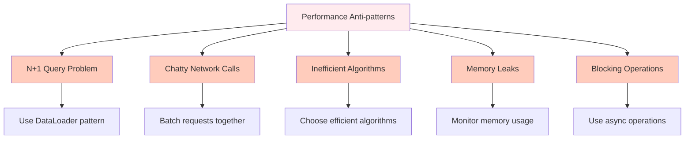

# System Design Fundamentals: Performance & Latency Optimization

Performance and latency are critical aspects of any distributed system. Performance refers to how efficiently a system processes work, while latency is the time it takes for a request to complete. Understanding and optimizing these metrics is essential for creating responsive and efficient applications that can handle high loads and provide excellent user experience.

## Understanding Performance Metrics

Performance in distributed systems is measured using several key metrics that help us understand system behavior and identify bottlenecks:

### Response Time vs Latency
- **Response Time**: The total time from when a request is sent until the response is received
- **Latency**: The time taken to process a request within the system (excluding network time)

### Throughput
Throughput measures how many requests a system can handle per unit of time, typically measured in requests per second (RPS) or transactions per second (TPS).

### Utilization
Utilization refers to how much of a system's resources (CPU, memory, disk I/O, network) are being used at any given time.

## Latency Numbers Every Programmer Should Know

Understanding the relative speeds of different operations is crucial for performance optimization:

```mermaid
graph TD
    A[CPU Cache Reference] -->|0.5ns| B[L1 Cache Access]
    B -->|1ns| C[L2 Cache Access] 
    C -->|3ns| D[Main Memory Access]
    D -->|100ns| E[SSD Random Read]
    E -->|150μs| F[Network Packet (Local DC)]
    F -->|1.5ms| G[SSD Sequential Read]
    G -->|15ms| H[Disk Seek]
    H -->|100ms| I[Network Packet (Cross Country)]
    
    style A fill:#e8f5e8
    style B fill:#e8f5e8
    style C fill:#e8f5e8
    style D fill:#e8f5e8
    style E fill:#fff3e0
    style F fill:#ffccbc
    style G fill:#ffccbc
    style H fill:#ffab91
    style I fill:#ff9a8a
```

## Latency Budgets and Goals

When designing systems, it's important to establish latency budgets that define acceptable response times for different operations:

- **UI Responsiveness**: 100ms for user interactions
- **API Requests**: 100-500ms for most operations
- **Database Queries**: 5-50ms for common queries
- **Cache Access**: 1-5ms for in-memory caches

## Performance Optimization Techniques

### 1. Caching Strategies

Caching is one of the most effective techniques for reducing latency and improving performance:

```go
// Cache Implementation with TTL
package main

import (
    "sync"
    "time"
)

type CacheItem struct {
    Value      interface{}
    Expiration time.Time
}

type TTLCache struct {
    items map[string]CacheItem
    mutex sync.RWMutex
}

func NewTTLCache() *TTLCache {
    cache := &TTLCache{
        items: make(map[string]CacheItem),
    }
    return cache
}

func (c *TTLCache) Get(key string) (interface{}, bool) {
    c.mutex.RLock()
    defer c.mutex.RUnlock()
    
    item, found := c.items[key]
    if !found {
        return nil, false
    }
    
    // Check if item has expired
    if time.Now().After(item.Expiration) {
        return nil, false
    }
    
    return item.Value, true
}

func (c *TTLCache) Set(key string, value interface{}, duration time.Duration) {
    c.mutex.Lock()
    defer c.mutex.Unlock()
    
    c.items[key] = CacheItem{
        Value:      value,
        Expiration: time.Now().Add(duration),
    }
}

func (c *TTLCache) Delete(key string) {
    c.mutex.Lock()
    defer c.mutex.Unlock()
    
    delete(c.items, key)
}

// Example usage
func main() {
    cache := NewTTLCache()
    
    // Set a value with 10-minute TTL
    cache.Set("user:123", "John Doe", 10*time.Minute)
    
    // Get the value
    if value, found := cache.Get("user:123"); found {
        // Use cached value
        println("Cached value:", value.(string))
    }
}
```

### 2. Database Optimization

Database queries are often the biggest bottlenecks in applications:

#### Indexing Strategies
- Create indices on frequently queried columns
- Use composite indices for multi-column queries
- Regularly analyze query execution plans

#### Query Optimization
- Limit result sets with pagination
- Use specific columns instead of SELECT *
- Implement read replicas for read-heavy workloads

### 3. Asynchronous Processing

Offloading expensive operations to background jobs can significantly improve response times:

```go
// Asynchronous task processor
package main

import (
    "context"
    "fmt"
    "sync"
    "time"
)

type Task struct {
    ID       string
    Payload  interface{}
    Handler  func(interface{}) error
}

type AsyncTaskProcessor struct {
    tasks   chan Task
    workers int
    wg      sync.WaitGroup
}

func NewAsyncTaskProcessor(workers int) *AsyncTaskProcessor {
    return &AsyncTaskProcessor{
        tasks:   make(chan Task, 100), // Buffered channel
        workers: workers,
    }
}

func (p *AsyncTaskProcessor) Start(ctx context.Context) {
    for i := 0; i < p.workers; i++ {
        p.wg.Add(1)
        go p.worker(ctx)
    }
}

func (p *AsyncTaskProcessor) worker(ctx context.Context) {
    defer p.wg.Done()
    
    for {
        select {
        case task := <-p.tasks:
            if err := task.Handler(task.Payload); err != nil {
                fmt.Printf("Task %s failed: %v\n", task.ID, err)
            } else {
                fmt.Printf("Task %s completed successfully\n", task.ID)
            }
        case <-ctx.Done():
            return
        }
    }
}

func (p *AsyncTaskProcessor) Submit(task Task) {
    select {
    case p.tasks <- task:
    default:
        fmt.Printf("Task queue is full, dropping task %s\n", task.ID)
    }
}

func (p *AsyncTaskProcessor) Stop() {
    close(p.tasks)
    p.wg.Wait()
}

// Example usage
func main() {
    ctx, cancel := context.WithCancel(context.Background())
    defer cancel()
    
    processor := NewAsyncTaskProcessor(5) // 5 workers
    processor.Start(ctx)
    
    // Submit some tasks
    for i := 0; i < 10; i++ {
        task := Task{
            ID:      fmt.Sprintf("task-%d", i),
            Payload: i,
            Handler: func(payload interface{}) error {
                // Simulate processing time
                time.Sleep(100 * time.Millisecond)
                fmt.Printf("Processing payload: %v\n", payload)
                return nil
            },
        }
        processor.Submit(task)
    }
    
    // Allow time for tasks to complete
    time.Sleep(2 * time.Second)
    processor.Stop()
}
```

### 4. Connection Pooling

Reusing database and service connections can dramatically reduce connection overhead:

```go
// Simplified connection pool implementation
package main

import (
    "context"
    "errors"
    "sync"
    "time"
)

type Connection struct {
    ID        int
    CreatedAt time.Time
    InUse     bool
}

type ConnectionPool struct {
    connections chan *Connection
    maxConns    int
    mutex       sync.Mutex
    nextID      int
}

func NewConnectionPool(maxConns int) *ConnectionPool {
    return &ConnectionPool{
        connections: make(chan *Connection, maxConns),
        maxConns:    maxConns,
    }
}

func (cp *ConnectionPool) GetConnection() (*Connection, error) {
    select {
    case conn := <-cp.connections:
        conn.InUse = true
        return conn, nil
    default:
        // Pool is empty, create a new connection if under limit
        cp.mutex.Lock()
        if cp.nextID < cp.maxConns {
            conn := &Connection{
                ID:        cp.nextID,
                CreatedAt: time.Now(),
                InUse:     true,
            }
            cp.nextID++
            cp.mutex.Unlock()
            return conn, nil
        }
        cp.mutex.Unlock()
        return nil, errors.New("connection pool exhausted")
    }
}

func (cp *ConnectionPool) ReleaseConnection(conn *Connection) {
    conn.InUse = false
    select {
    case cp.connections <- conn:
    default:
        // Pool is full, discard the connection
        // In a real implementation, you might want to close and clean up
    }
}

// Example usage
func main() {
    pool := NewConnectionPool(10)
    
    // Get a connection
    conn, err := pool.GetConnection()
    if err != nil {
        panic(err)
    }
    
    // Simulate work with the connection
    time.Sleep(100 * time.Millisecond)
    
    // Release the connection back to the pool
    pool.ReleaseConnection(conn)
    
    println("Connection returned to pool")
}
```

## Measuring Performance

### Key Performance Indicators (KPIs)

When monitoring system performance, focus on these key metrics:

- **P50 (Median)**: 50% of requests are faster than this time
- **P95**: 95% of requests are faster than this time
- **P99**: 99% of requests are faster than this time
- **Error Rate**: Percentage of failed requests
- **Saturation**: Resource utilization under load

### Performance Testing

```go
// Performance testing utility
package main

import (
    "fmt"
    "sync"
    "time"
)

type PerformanceTestResult struct {
    TotalRequests int
    FailedRequests int
    TotalTime     time.Duration
    AvgTime       time.Duration
    P50, P95, P99 time.Duration
}

func RunPerformanceTest(concurrent int, requests int, requestFunc func() time.Duration) PerformanceTestResult {
    var (
        mu        sync.Mutex
        times     []time.Duration
        failures  int
        wg        sync.WaitGroup
    )
    
    requestsPerGoroutine := requests / concurrent
    
    start := time.Now()
    
    // Run tests concurrently
    for i := 0; i < concurrent; i++ {
        wg.Add(1)
        go func() {
            defer wg.Done()
            
            for j := 0; j < requestsPerGoroutine; j++ {
                duration := requestFunc()
                
                mu.Lock()
                times = append(times, duration)
                mu.Unlock()
            }
        }()
    }
    
    wg.Wait()
    totalTime := time.Since(start)
    
    // Sort times for percentile calculations
    for i := 0; i < len(times)-1; i++ {
        for j := i + 1; j < len(times); j++ {
            if times[i] > times[j] {
                times[i], times[j] = times[j], times[i]
            }
        }
    }
    
    // Calculate percentiles
    p50 := times[len(times)/2]
    p95 := times[len(times)*95/100]
    p99 := times[len(times)*99/100]
    
    avgTime := totalTime / time.Duration(requests)
    
    return PerformanceTestResult{
        TotalRequests: requests,
        FailedRequests: failures,
        TotalTime:     totalTime,
        AvgTime:       avgTime,
        P50:           p50,
        P95:           p95,
        P99:           p99,
    }
}

// Example usage
func main() {
    // Simulate a service call that takes random time
    requestFunc := func() time.Duration {
        start := time.Now()
        
        // Simulate work (e.g. API call, database query)
        time.Sleep(10*time.Millisecond + time.Duration(time.Now().UnixNano()%10)*time.Millisecond)
        
        return time.Since(start)
    }
    
    result := RunPerformanceTest(10, 1000, requestFunc)
    
    fmt.Printf("Performance Test Results:\n")
    fmt.Printf("Total Requests: %d\n", result.TotalRequests)
    fmt.Printf("Failed Requests: %d\n", result.FailedRequests)
    fmt.Printf("Total Time: %v\n", result.TotalTime)
    fmt.Printf("Average Time: %v\n", result.AvgTime)
    fmt.Printf("P50 (Median): %v\n", result.P50)
    fmt.Printf("P95: %v\n", result.P95)
    fmt.Printf("P99: %v\n", result.P99)
}
```

## Latency Optimization Patterns

### 1. Lazy Loading
Load data only when it's actually needed rather than pre-loading everything.

### 2. Prefetching
Anticipate what data the user might need next and load it proactively.

### 3. Compression
Reduce the size of data being transmitted to decrease network latency.

### 4. CDN Usage
Distribute content geographically to serve users from the closest location.

## Common Performance Anti-patterns



## Conclusion

Performance and latency optimization is an ongoing process that requires continuous monitoring and iteration. The key is to focus on the metrics that matter most to your users and business, implement appropriate optimization techniques, and regularly measure the impact of your changes. Remember that premature optimization can be counterproductive - always measure first, identify bottlenecks, and optimize strategically.

A well-designed system considers performance from the beginning and builds in the necessary tools and processes to maintain performance as the system scales.