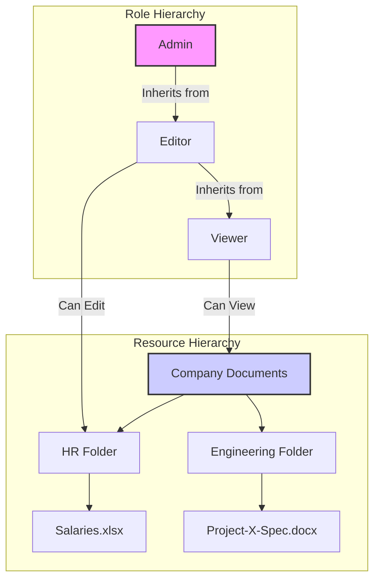

## System Design: Simplifying Permissions with Inheritance

In many systems, resources and user roles are not flat; they exist in a hierarchy. For example, a file system has folders and sub-folders. An organization has teams, departments, and divisions. When designing an authorization system for such structures, explicitly assigning permissions at every level can become incredibly tedious and error-prone.

**Permission Inheritance** is a powerful pattern that solves this problem. It allows permissions set on a parent entity (like a role or a resource) to be automatically passed down to its children. This simplifies management, reduces redundant rules, and makes the system's behavior more intuitive.

### The Problem: Explicit and Redundant Permissions

Imagine a document management system with the following structure:
-   Company Documents (Folder)
    -   HR (Sub-Folder)
        -   Onboarding.pdf
        -   Salaries.xlsx
    -   Engineering (Sub-Folder)
        -   Project-X-Spec.docx

Now, consider these roles:
-   **Employee:** Can view all `Company Documents`.
-   **HR Manager:** Can view and edit everything in the `HR` folder.
-   **Engineer:** Can view everything in the `Engineering` folder.

Without inheritance, you would need to define explicit permissions for every single file and folder for each role, which is not scalable.

### The Solution: Hierarchical Inheritance

With inheritance, you define permissions at the highest relevant level, and they automatically cascade down.

1.  **Resource Hierarchy:** If an `Employee` has `view` access to the `Company Documents` folder, they automatically inherit `view` access to the `HR` and `Engineering` sub-folders and all the files within them (unless explicitly denied).
2.  **Role Hierarchy:** You can also create a hierarchy of roles. For example:
    -   `Admin` (Super-role)
    -   `Editor` (Inherits from `Viewer`)
    -   `Viewer` (Base role)

    If a `Viewer` can `read` documents, an `Editor` automatically gets `read` permissions in addition to their `write` permissions. An `Admin` would inherit all permissions from `Editor` and `Viewer`.



In this diagram:
-   A `Viewer` can view `Company Documents` and, by inheritance, all sub-folders and files.
-   An `Editor` can edit the `HR Folder`. They also inherit `Viewer` permissions, so they can view everything else.

### Go Implementation of Role Inheritance

Let's model a simple role inheritance system in Go. We'll define roles that can inherit permissions from other roles.

**1. Data Structures**

We need structures for `Permission`, `Role`, and a `RoleManager` to handle the logic.

```go
package main

import "fmt"

// Permission is a simple string representing an action (e.g., "read:docs", "write:docs").
type Permission string

// Role defines a role with a name and a set of permissions.
// It can also inherit permissions from a parent role.
type Role struct {
	Name        string
	Permissions map[Permission]bool
	Parent      *Role
}

// RoleManager manages all the roles in the system.
type RoleManager struct {
	Roles map[string]*Role
}

func NewRoleManager() *RoleManager {
	return &RoleManager{
		Roles: make(map[string]*Role),
	}
}

// AddRole creates a new role.
func (rm *RoleManager) AddRole(name string, parentName string) (*Role, error) {
	if _, exists := rm.Roles[name]; exists {
		return nil, fmt.Errorf("role '%s' already exists", name)
	}

	var parent *Role
	if parentName != "" {
		p, ok := rm.Roles[parentName]
		if !ok {
			return nil, fmt.Errorf("parent role '%s' not found", parentName)
		}
		parent = p
	}

	role := &Role{
		Name:        name,
		Permissions: make(map[Permission]bool),
		Parent:      parent,
	}
	rm.Roles[name] = role
	return role, nil
}

// AddPermission grants a permission to a specific role.
func (rm *RoleManager) AddPermission(roleName string, perm Permission) error {
	role, ok := rm.Roles[roleName]
	if !ok {
		return fmt.Errorf("role '%s' not found", roleName)
	}
	role.Permissions[perm] = true
	return nil
}

// HasPermission checks if a role has a specific permission, checking parent roles recursively.
func (rm *RoleManager) HasPermission(roleName string, perm Permission) (bool, error) {
	role, ok := rm.Roles[roleName]
	if !ok {
		return false, fmt.Errorf("role '%s' not found", roleName)
	}

	// Check permissions on the current role and all its ancestors.
	current := role
	for current != nil {
		if current.Permissions[perm] {
			return true, nil // Permission found
		}
		current = current.Parent // Move up the hierarchy
	}

	return false, nil // Permission not found in the hierarchy
}
```

**2. Example Usage**

Let's create the `Viewer` -> `Editor` -> `Admin` hierarchy.

```go
func main() {
	rm := NewRoleManager()

	// Create roles
	fmt.Println("Creating roles...")
	rm.AddRole("viewer", "")
	rm.AddRole("editor", "viewer")
	rm.AddRole("admin", "editor")

	// Assign permissions
	fmt.Println("Assigning permissions...")
	rm.AddPermission("viewer", "read:docs")
	rm.AddPermission("editor", "write:docs")
	rm.AddPermission("admin", "delete:users")

	// --- Check Permissions ---
	fmt.Println("\n--- Checking 'viewer' permissions ---")
	canRead, _ := rm.HasPermission("viewer", "read:docs")
	fmt.Printf("Viewer can read:docs? %v\n", canRead) // true
	canWrite, _ := rm.HasPermission("viewer", "write:docs")
	fmt.Printf("Viewer can write:docs? %v\n", canWrite) // false

	fmt.Println("\n--- Checking 'editor' permissions ---")
	canRead, _ = rm.HasPermission("editor", "read:docs")
	fmt.Printf("Editor can read:docs? %v\n", canRead) // true (inherited from viewer)
	canWrite, _ = rm.HasPermission("editor", "write:docs")
	fmt.Printf("Editor can write:docs? %v\n", canWrite) // true
	canDelete, _ := rm.HasPermission("editor", "delete:users")
	fmt.Printf("Editor can delete:users? %v\n", canDelete) // false

	fmt.Println("\n--- Checking 'admin' permissions ---")
	canRead, _ = rm.HasPermission("admin", "read:docs")
	fmt.Printf("Admin can read:docs? %v\n", canRead) // true (inherited from viewer)
	canWrite, _ = rm.HasPermission("admin", "write:docs")
	fmt.Printf("Admin can write:docs? %v\n", canWrite) // true (inherited from editor)
	canDelete, _ = rm.HasPermission("admin", "delete:users")
	fmt.Printf("Admin can delete:users? %v\n", canDelete) // true
}
```

The `HasPermission` function is the key. It doesn't just check the role itself; it traverses up the `Parent` chain until it either finds the permission or reaches the top of the hierarchy.

### Considerations and Best Practices

-   **Cycles:** Be careful to prevent cycles in your hierarchy (e.g., Role A inherits from B, and B inherits from A). Your `AddRole` logic should include cycle detection.
-   **Deny Rules:** Some systems support explicit `Deny` rules, which override `Allow` rules from parents. This adds complexity but can be necessary for creating exceptions. The "closest" rule (at the lowest level of the hierarchy) usually wins.
-   **Performance:** For very deep or complex hierarchies, checking permissions can involve traversing many nodes. It's common to cache the "flattened" set of permissions for each role to speed up checks.
-   **Clarity:** While powerful, overly complex hierarchies can become difficult to understand. Keep the inheritance structure as simple and intuitive as possible.

### Conclusion

Permission inheritance is a fundamental pattern for managing authorization in any system with hierarchical roles or resources. By defining permissions at the highest appropriate level and letting them flow downwards, you create a system that is easier to manage, less prone to configuration errors, and more scalable. Whether you are building a simple RBAC system or a more complex ABAC or Policy-Based system, incorporating inheritance will significantly streamline your permission model.

This concludes our batch on Authorization Patterns. We've covered RBAC, ABAC, Policy-Based Authorization, and now Permission Inheritance, giving you a comprehensive toolkit for designing secure and flexible systems.
---
