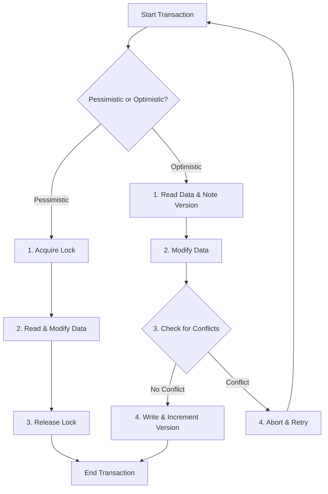

## Introduction: The Concurrency Challenge

In any system where multiple users or processes can access the same resource simultaneously, you face a fundamental problem: how do you prevent them from overwriting each other's changes and corrupting data? This is the core challenge of **concurrency control**.

Two major strategies have emerged to solve this problem: **pessimistic locking** and **optimistic locking**. The names give a clue to their underlying philosophy:

*   **Pessimistic Locking:** Assumes that conflicts are likely and takes a cautious approach by locking a resource before using it.
*   **Optimistic Locking:** Assumes that conflicts are rare and allows transactions to proceed without locks, checking for conflicts only at the very end.

Choosing between them involves a trade-off between safety, performance, and complexity.



## Pessimistic Locking: Better Safe Than Sorry

Pessimistic locking is the traditional approach. It's like saying, "I'm going to use this resource, so nobody else touch it until I'm done."

### How It Works

1.  **Acquire Lock:** Before reading or modifying a resource, the transaction acquires an exclusive lock on it.
2.  **Perform Operations:** The transaction can now safely read and write to the resource, knowing that no other transaction can interfere.
3.  **Release Lock:** Once the work is complete, the transaction releases the lock, allowing other transactions to access the resource.

This is commonly implemented using database locks (e.g., `SELECT ... FOR UPDATE`) or distributed locks (e.g., via ZooKeeper or Redis).

### Benefits

*   **High Consistency:** Guarantees that no conflicts will occur, providing strong data integrity.
*   **Simplicity:** The logic is straightforward—lock, modify, unlock.

### Drawbacks

*   **Reduced Concurrency:** While one transaction holds a lock, all other transactions that need the same resource are blocked. This can severely limit the system's throughput.
*   **Deadlocks:** If two transactions are waiting for locks held by each other, they will wait forever. Deadlock detection and resolution mechanisms are required.
*   **Performance Overhead:** Acquiring and releasing locks adds latency to every operation.

## Optimistic Locking: Ask for Forgiveness, Not Permission

Optimistic locking, also known as Optimistic Concurrency Control (OCC), takes the opposite approach. It's like saying, "I'll just assume everything is fine and check for problems at the end."

### How It Works

1.  **Read and Version:** When a transaction reads a resource, it also notes its current version number or timestamp.
2.  **Perform Operations:** The transaction performs its modifications on a local copy of the data, without taking any locks.
3.  **Verify and Write:** When the transaction is ready to commit, it checks if the resource's version number has changed since it was first read.
    *   If the version is the same, it means no other transaction has modified the resource. The transaction can safely write its changes and increment the version number in a single atomic operation.
    *   If the version has changed, it means a conflict has occurred. The transaction is aborted, and the application must typically retry the entire transaction.

### Benefits

*   **High Concurrency:** Transactions don't block each other. Multiple transactions can read and modify the same resource concurrently. This is great for read-heavy workloads.
*   **No Deadlocks:** Since no locks are held, deadlocks are not an issue.

### Drawbacks

*   **Conflict Resolution Overhead:** If conflicts are frequent, the cost of aborting and retrying transactions can be very high, potentially leading to worse performance than pessimistic locking.
*   **Complexity:** The application logic must handle transaction retries.

## Go Example: Simulating Both Strategies

Let's simulate a bank account transfer using both locking strategies.

```go
package main

import (
    "fmt"
    "sync"
    "time"
)

// --- Pessimistic Locking ---
type PessimisticAccount struct {
    ID      string
    Balance int
    mu      sync.Mutex
}

func PessimisticTransfer(from, to *PessimisticAccount, amount int) {
    fmt.Println("Pessimistic: Acquiring locks...")
    // Lock ordering to prevent deadlocks
    if from.ID < to.ID {
        from.mu.Lock()
        to.mu.Lock()
    } else {
        to.mu.Lock()
        from.mu.Lock()
    }
    defer from.mu.Unlock()
    defer to.mu.Unlock()

    fmt.Println("Pessimistic: Performing transfer...")
    from.Balance -= amount
    to.Balance += amount
    time.Sleep(100 * time.Millisecond) // Simulate work
    fmt.Println("Pessimistic: Transfer complete.")
}

// --- Optimistic Locking ---
type OptimisticAccount struct {
    Balance int
    Version int
}

var optimisticStore = make(map[string]*OptimisticAccount)
var optimisticMutex = sync.Mutex{}

func OptimisticTransfer(fromID, toID string, amount int) bool {
    optimisticMutex.Lock()
    from := *optimisticStore[fromID]
    to := *optimisticStore[toID]
    optimisticMutex.Unlock()

    // Perform modifications locally
    from.Balance -= amount
    to.Balance += amount

    // Verify and write
    optimisticMutex.Lock()
    defer optimisticMutex.Unlock()

    currentFrom := optimisticStore[fromID]
    currentTo := optimisticStore[toID]

    if currentFrom.Version != from.Version || currentTo.Version != to.Version {
        fmt.Println("Optimistic: Conflict detected! Aborting.")
        return false // Abort
    }

    currentFrom.Balance = from.Balance
    currentFrom.Version++
    currentTo.Balance = to.Balance
    currentTo.Version++
    fmt.Println("Optimistic: Transfer successful.")
    return true
}

func main() {
    // Pessimistic Demo
    fmt.Println("--- PESSIMISTIC DEMO ---")
    pAcc1 := &PessimisticAccount{ID: "A", Balance: 1000}
    pAcc2 := &PessimisticAccount{ID: "B", Balance: 1000}
    go PessimisticTransfer(pAcc1, pAcc2, 100)
    go PessimisticTransfer(pAcc2, pAcc1, 50)
    time.Sleep(500 * time.Millisecond)
    fmt.Printf("Pessimistic Final: Acc1=%d, Acc2=%d\n\n", pAcc1.Balance, pAcc2.Balance)

    // Optimistic Demo
    fmt.Println("--- OPTIMISTIC DEMO ---")
    optimisticStore["C"] = &OptimisticAccount{Balance: 1000, Version: 1}
    optimisticStore["D"] = &OptimisticAccount{Balance: 1000, Version: 1}

    // Successful transfer
    OptimisticTransfer("C", "D", 100)

    // Conflicting transfer (simulate by manually changing version)
    optimisticStore["C"].Version++
    for !OptimisticTransfer("C", "D", 50) {
        fmt.Println("Retrying optimistic transfer...")
        time.Sleep(100 * time.Millisecond)
    }
    fmt.Printf("Optimistic Final: AccC=%d, AccD=%d\n", optimisticStore["C"].Balance, optimisticStore["D"].Balance)
}
```

## When to Use Which?

The choice depends heavily on the nature of your application:

*   **Use Pessimistic Locking when:**
    *   **Conflict probability is high.** (e.g., booking the last seat on a flight).
    *   The cost of locking is less than the cost of aborting and retrying transactions.
    *   You need the simplest path to strong consistency.

*   **Use Optimistic Locking when:**
    *   **Conflict probability is low.** (e.g., multiple users editing different parts of a wiki page).
    *   Read operations are much more frequent than write operations.
    *   You can tolerate the complexity of retry logic and the occasional transaction failure.

## Conclusion

Pessimistic and optimistic locking represent two different philosophies for managing concurrency. There is no single "best" approach. Pessimistic locking prioritizes safety and simplicity at the cost of concurrency, while optimistic locking prioritizes concurrency and performance at the cost of complexity and potential retries.

A thorough understanding of your application's workload and conflict patterns is essential for choosing the right strategy. In many complex systems, you might even find a hybrid approach, using pessimistic locking for highly contended resources and optimistic locking for everything else.
