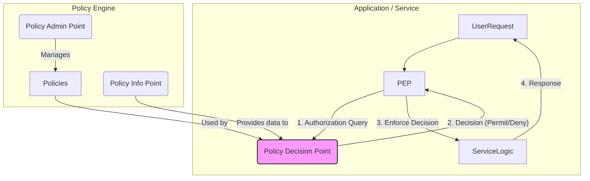

## System Design: Externalizing Logic with Policy-Based Authorization

In our previous posts on [RBAC](/blog/system-design/system-design-role-based-access-control-rbac) and [ABAC](/blog/system-design/system-design-attribute-based-access-control-abac), we explored different models for making authorization decisions. However, in both cases, the logic for checking permissions was still embedded within the application code. As authorization rules become more complex, this approach can lead to several problems:

-   **Code Duplication:** The same authorization logic might be scattered across multiple services.
-   **Difficult to Manage:** Changing a policy requires a code change, a new build, and a deployment.
-   **Lack of Visibility:** It's hard for security teams to audit and understand the authorization rules without reading the code.

**Policy-Based Authorization** solves this by externalizing the authorization logic into a separate, dedicated service called a **Policy Engine**. This engine becomes the central source of truth for all authorization decisions.

### The Policy Engine Pattern

In this pattern, your application offloads authorization decisions to a policy engine. The application is no longer responsible for *how* the decision is made, only for *enforcing* it.

The core components are:
1.  **Policy Enforcement Point (PEP):** This is a component within your application (e.g., a middleware in your API gateway or service) that intercepts incoming requests. It gathers the necessary attributes (user, resource, action, etc.) and queries the policy engine.
2.  **Policy Decision Point (PDP):** This is the policy engine itself. It evaluates the query and data against its set of policies and returns a decision (`Permit` or `Deny`).
3.  **Policy Administration Point (PAP):** The interface or system used to create, manage, and update the policies.
4.  **Policy Information Point (PIP):** A source of attribute data that the PDP might need to make a decision (e.g., a user database, an LDAP directory).



### Introducing Open Policy Agent (OPA)

**Open Policy Agent (OPA)** is a popular open-source, general-purpose policy engine. It provides a unified toolset and framework for expressing and enforcing policies across your entire stack.

Key features of OPA:
-   **Declarative Language (Rego):** Policies are written in a high-level declarative language called Rego. Rego is designed specifically for querying complex data structures and expressing policies.
-   **Decoupled:** OPA is completely application-agnostic. It can be used to enforce policies on microservices, Kubernetes, CI/CD pipelines, and more.
-   **Flexible Deployment:** OPA can be run as a standalone daemon, integrated as a library, or even compiled into WebAssembly to run in a browser.

### How OPA Works

1.  **Policies and Data:** OPA evaluates policies against JSON data. You provide the policies (written in Rego) and the data (the request context) to the engine.
2.  **Query:** Your application queries OPA with a simple question, like `allow`.
3.  **Decision:** OPA evaluates the query against its policies and data and returns a JSON response. The response is not just `true` or `false`; it can be any structured data.

**Example: A Simple Rego Policy**

Let's write a policy that allows users to access their own resources.

**Policy (`example.rego`):**
```rego
package httpapi.authz

# By default, deny everything.
default allow = false

# Allow if the request method is GET and the user is the owner of the resource.
allow = true {
    input.method == "GET"
    input.user == input.resource.owner
}
```

**Input (the query from our application):**
```json
{
    "method": "GET",
    "user": "alice",
    "resource": {
        "type": "document",
        "owner": "alice"
    }
}
```

When OPA evaluates this policy with this input, the `allow` rule will be `true`. If the user was "bob", the condition `input.user == input.resource.owner` would fail, and `allow` would default to `false`.

### Go Implementation with OPA

Let's create a simple Go application that uses OPA as a sidecar daemon to make authorization decisions.

**1. Run OPA as a Docker container:**
First, save the Rego policy above as `example.rego`. Then, run the OPA container, telling it to load the policy.

```bash
# Run this in your terminal
docker run -p 8181:8181 -v $(pwd):/policies openpolicyagent/opa:latest run --server /policies
```
This starts the OPA server on port 8181 and loads our `example.rego` file.

**2. Go Application Code:**
Our Go application will act as the PEP. It will receive a request, construct a JSON input for OPA, and query the OPA server.

```go
package main

import (
	"bytes"
	"encoding/json"
	"fmt"
	"log"
	"net/http"
)

// The input structure we will send to OPA.
type OPAInput struct {
	Method   string   `json:"method"`
	User     string   `json:"user"`
	Resource Resource `json:"resource"`
}

type Resource struct {
	Type  string `json:"type"`
	Owner string `json:"owner"`
}

// The expected response structure from OPA.
type OPAResponse struct {
	Result bool `json:"result"`
}

// authMiddleware queries the OPA engine for a decision.
func authMiddleware(next http.Handler) http.Handler {
	return http.HandlerFunc(func(w http.ResponseWriter, r *http.Request) {
		// In a real app, get the user from a token.
		user := r.Header.Get("X-User")
		if user == "" {
			http.Error(w, "Unauthorized: Missing user", http.StatusUnauthorized)
			return
		}

		// Construct the input for OPA.
		input := OPAInput{
			Method: r.Method,
			User:   user,
			Resource: Resource{
				Type:  "document",
				Owner: "alice", // For this example, the resource is always owned by Alice.
			},
		}

		inputBytes, _ := json.Marshal(input)
		
		// Query the OPA server. The path corresponds to the package name in the Rego file.
		opaURL := "http://localhost:8181/v1/data/httpapi/authz/allow"
		resp, err := http.Post(opaURL, "application/json", bytes.NewBuffer(inputBytes))
		if err != nil {
			http.Error(w, "Failed to contact policy engine", http.StatusInternalServerError)
			return
		}
		defer resp.Body.Close()

		var opaResp OPAResponse
		if err := json.NewDecoder(resp.Body).Decode(&opaResp); err != nil {
			http.Error(w, "Failed to parse policy engine response", http.StatusInternalServerError)
			return
		}

		// Enforce the decision.
		if !opaResp.Result {
			http.Error(w, "Forbidden by policy", http.StatusForbidden)
			return
		}

		next.ServeHTTP(w, r)
	})
}

func protectedHandler(w http.ResponseWriter, r *http.Request) {
	fmt.Fprintf(w, "Access granted to protected document.")
}

func main() {
	http.Handle("/document/123", authMiddleware(http.HandlerFunc(protectedHandler)))

	fmt.Println("Application server starting on port 8000...")
	log.Fatal(http.ListenAndServe(":8000", nil))
}
```

**How to test it:**
-   **Request as Alice (should succeed):**
    `curl http://localhost:8000/document/123 -H "X-User: alice"`
-   **Request as Bob (should fail):**
    `curl http://localhost:8000/document/123 -H "X-User: bob"`

### Benefits of Externalizing Authorization

-   **Centralized Management:** All authorization logic lives in one place, making it easy to manage, audit, and reason about.
-   **Agility:** Policies can be updated and deployed independently of the application. A security team can roll out a new policy without requiring developers to rebuild and redeploy their services.
-   **Polyglot Support:** Since the policy engine is a separate service, any application, regardless of the language it's written in, can use it.
-   **Consistency:** Ensures that the same authorization rules are applied consistently across all services.

### Conclusion

Policy-Based Authorization using an external engine like OPA represents a significant shift in how we handle security. By decoupling policy from code, we create systems that are more secure, manageable, and agile. The application's responsibility is simplified to gathering context and enforcing a decision, while the complex logic of "who can do what, when, and where" is handled by a specialized, purpose-built engine. This pattern is a cornerstone of modern, cloud-native security architecture.

In our final post of this batch, we'll look at **Permission Inheritance**, a pattern that can simplify role and policy definitions in hierarchical systems.
---
