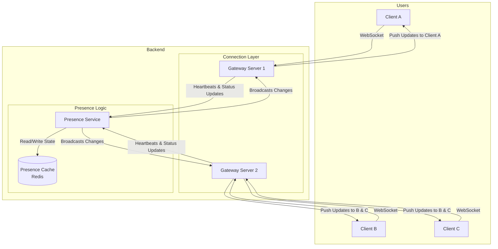
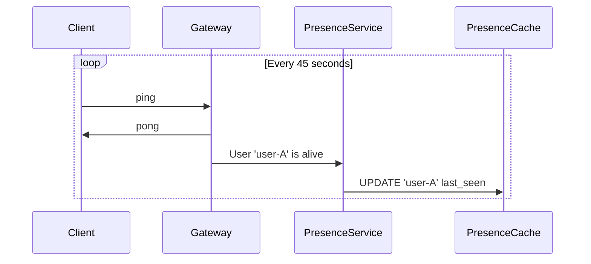

In any collaborative application, from chat apps like Slack and Discord to multiplayer games, knowing the real-time status of other users is a fundamental feature. Is a user **online**, **away**, or **offline**? This is the job of a **Presence Detection System**.

While it may seem simple on the surface, building a scalable and accurate presence system that can handle millions of concurrent users is a complex distributed systems challenge. It requires managing persistent connections, tracking user activity, and efficiently broadcasting status updates to interested parties.

This article explores the architecture of a modern presence system, covering the core components: a persistent connection layer (WebSockets), a heartbeating mechanism, and a distributed state management service.

### What is Presence?

Presence is more than just a binary "online/offline" status. A rich presence system might track several states:
*   **Online**: The user is actively using the application.
*   **Offline**: The user is not connected.
*   **Idle/Away**: The user has the application open but has not interacted with it for a certain period.
*   **In a Meeting / In a Game**: Application-specific statuses that provide more context.

The goal of the system is to maintain the current state for every user and broadcast any changes to that state to all other users who need to know about it (e.g., users in the same chat channel or on the same friends list).

### High-Level Architecture

A presence system consists of three main parts: the **Client**, the **Gateway Service**, and the **Presence Service**.



1.  **Gateway Service**: This is a fleet of servers that maintains persistent connections (usually WebSockets) with all online clients. It is the front door for all real-time communication.
2.  **Presence Service**: This is the brain of the system. It processes heartbeats, determines user status, and manages the broadcasting of presence updates.
3.  **Presence Cache**: A fast, distributed cache (like Redis) that stores the real-time presence state of every user. This acts as the single source of truth for user statuses.

### The Connection Lifecycle: Heartbeats and Status

How does the system know a user is online? It can't just rely on the initial connection, as a user could lose internet access or their app could crash without properly disconnecting. This is where **heartbeating** comes in.

**1. Establishing a Session:**
*   When a client (e.g., the Slack app) starts, it opens a WebSocket connection to a Gateway server.
*   Upon successful connection, the Gateway notifies the Presence Service that `user-A` is now connected.
*   The Presence Service updates the Presence Cache (e.g., `SET user-A:status online`) and broadcasts this "online" status to `user-A`'s friends.

**2. The Heartbeat Mechanism:**
*   To prove it's still alive, the client sends a small "heartbeat" message (e.g., a `ping`) to the Gateway server every 30-60 seconds.
*   The Gateway receives the `ping` and sends back a `pong`. More importantly, it notifies the Presence Service: "I just heard from `user-A`."
*   The Presence Service then updates a "last seen" timestamp in the cache: `SET user-A:last_seen <current_time>`.

**Sequence Diagram of a Heartbeat:**


**3. Detecting Disconnection (The "Away" and "Offline" Logic):**
The Presence Service runs a periodic job (a "reaper" or "janitor" process) every minute or so.
*   This job scans the Presence Cache for any users whose `last_seen` timestamp is older than a certain threshold.
*   If `last_seen` is > 1 minute ago, the user might be having connection issues. The system could optimistically keep them "online" for a short buffer period.
*   If `last_seen` is > 5 minutes ago, the reaper declares the user **offline**. It updates their status in the cache and broadcasts the "offline" status to their friends.

This "soft" offline detection is crucial because it handles unexpected disconnections gracefully.

**4. Detecting Idle Status:**
The "idle" or "away" status is typically determined by the client itself.
*   The client application tracks user activity (mouse movements, keyboard presses, window focus).
*   If there's no activity for, say, 5 minutes, the client proactively sends a message to the Gateway: `{"status": "idle"}`.
*   The Gateway forwards this to the Presence Service, which updates the cache and broadcasts the new "idle" status.

### Scaling the System

With millions of users, this architecture presents several scaling challenges.

**1. Scaling the Gateways:**
*   A single server can only handle a finite number of WebSocket connections (typically in the tens of thousands).
*   The Gateway layer must be a horizontally scalable fleet of servers behind a load balancer.
*   When a client connects, it's assigned to one of the many Gateway servers. This means a user's friends might be connected to completely different Gateway servers.

**2. Scaling the Presence Service and State Management:**
*   The Presence Service becomes a central hub. It needs to be stateless and horizontally scalable.
*   The Presence Cache (Redis) can become a bottleneck. It must be set up in a distributed, clustered configuration to handle the high volume of reads (from users fetching statuses) and writes (from heartbeat updates).
*   **The Fan-Out Problem**: When `user-A` comes online, how do you efficiently notify all 500 of their friends?
    *   A naive approach would be for the Presence Service to look up all 500 friends and send 500 individual "push" messages to the appropriate Gateways. This is slow and creates a "hot spot."
    *   A better approach is to use a **Pub/Sub** system (like Redis Pub/Sub or Apache Kafka).

**Fan-Out with Pub/Sub:**
```mermaid
graph TD
    PresenceService -- "1. User-A is online" --> PubSub[Pub/Sub System]
    
    subgraph Gateways Subscribed to Topics
        G1[Gateway 1<br/>(Handles User B)]
        G2[Gateway 2<br/>(Handles User C, D)]
    end

    PubSub -- "2. Publish to 'user-B-updates' topic" --> G1
    PubSub -- "2. Publish to 'user-C-updates' topic" --> G2
    PubSub -- "2. Publish to 'user-D-updates' topic" --> G2

    G1 -- "3. Push to User B" --> ClientB
    G2 -- "3. Push to User C" --> ClientC
    G2 -- "3. Push to User D" --> ClientD
```
In this model:
1.  When a client connects to a Gateway, that Gateway subscribes to a specific topic for that user (e.g., `user-B-updates`).
2.  When the Presence Service needs to broadcast a status change about `user-A`, it looks up `user-A`'s friends (`B`, `C`, `D`).
3.  Instead of pushing directly, it publishes the update message to the topics for each friend: `user-B-updates`, `user-C-updates`, etc.
4.  The corresponding Gateways receive these messages from the Pub/Sub system and forward them to the correct clients over their WebSocket connections. This distributes the fan-out load across the Gateway layer.

### Go Example: A Simplified Presence Server

This example demonstrates the core logic of a Presence Service handling heartbeats and status updates. It uses a simple in-memory map for the presence state, which in a real system would be replaced by Redis.

```go
package main

import (
    "log"
    "sync"
    "time"
)

// PresenceState represents the status of a user
type PresenceState struct {
    Status    string    `json:"status"`
    LastSeen  time.Time `json:"last_seen"`
}

// PresenceService manages the state of all users.
type PresenceService struct {
    // In a real system, this would be a Redis client.
    userStates map[string]PresenceState
    mu         sync.RWMutex
}

func NewPresenceService() *PresenceService {
    ps := &PresenceService{
        userStates: make(map[string]PresenceState),
    }
    go ps.reaper() // Start the background job to detect offline users
    return ps
}

// Heartbeat is called by a Gateway when it receives a ping from a user.
func (ps *PresenceService) Heartbeat(userID string) {
    ps.mu.Lock()
    defer ps.mu.Unlock()

    state, ok := ps.userStates[userID]
    if !ok {
        // This could be a new user coming online
        log.Printf("User %s is now ONLINE.", userID)
        state = PresenceState{Status: "online"}
    } else if state.Status != "online" {
        // User was idle or away, but is now active
        log.Printf("User %s is now ONLINE (was %s).", userID, state.Status)
        state.Status = "online"
    }
    
    state.LastSeen = time.Now()
    ps.userStates[userID] = state

    // In a real system, you would broadcast this status change here.
}

// UpdateStatus is called when a client proactively changes its status (e.g., to "idle").
func (ps *PresenceService) UpdateStatus(userID, newStatus string) {
    ps.mu.Lock()
    defer ps.mu.Unlock()

    if _, ok := ps.userStates[userID]; ok {
        log.Printf("User %s changed status to %s.", userID, newStatus)
        ps.userStates[userID] = PresenceState{
            Status:   newStatus,
            LastSeen: time.Now(),
        }
        // Broadcast this change
    }
}

// reaper is a background process to find and mark offline users.
func (ps *PresenceService) reaper() {
    ticker := time.NewTicker(1 * time.Minute)
    for range ticker.C {
        ps.mu.Lock()
        log.Println("Reaper running...")
        for userID, state := range ps.userStates {
            // If we haven't seen a heartbeat in over 2 minutes and they are online
            if state.Status == "online" && time.Since(state.LastSeen) > 2*time.Minute {
                log.Printf("User %s timed out. Marking as OFFLINE.", userID)
                state.Status = "offline"
                ps.userStates[userID] = state
                // Broadcast this "offline" status change
            }
        }
        ps.mu.Unlock()
    }
}

func main() {
    presenceSvc := NewPresenceService()

    // --- Simulate user activity ---
    log.Println("--- Simulating User A coming online ---")
    presenceSvc.Heartbeat("user-A")
    
    log.Println("\n--- Simulating User B coming online ---")
    presenceSvc.Heartbeat("user-B")

    time.Sleep(1 * time.Minute)
    log.Println("\n--- Simulating User A sending a heartbeat ---")
    presenceSvc.Heartbeat("user-A")

    log.Println("\n--- Simulating User B going idle (client-initiated) ---")
    presenceSvc.UpdateStatus("user-B", "idle")

    log.Println("\n--- Waiting for reaper to run (will take ~2 minutes for User B to time out if no more heartbeats) ---")
    time.Sleep(3 * time.Minute)
}
```

### Conclusion

A presence detection system is a quintessential real-time application that combines several important system design concepts. It relies on a **persistent connection layer** (WebSockets) to communicate with clients, a **heartbeating mechanism** to track liveness, a **distributed cache** to maintain state, and a **Pub/Sub system** to efficiently broadcast updates. By decoupling these components and ensuring each is horizontally scalable, you can build a presence system that provides accurate, real-time user status to millions of concurrent users.