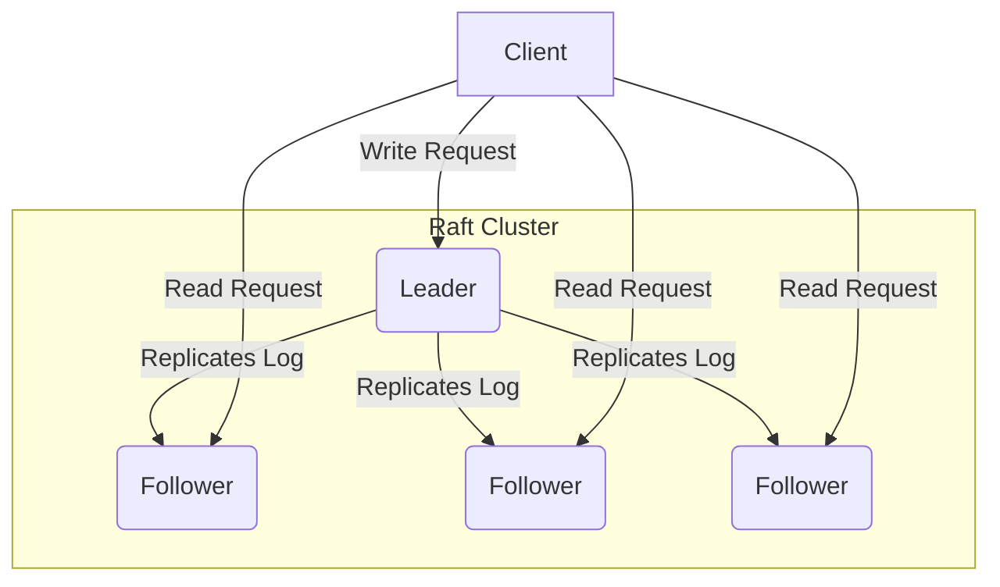
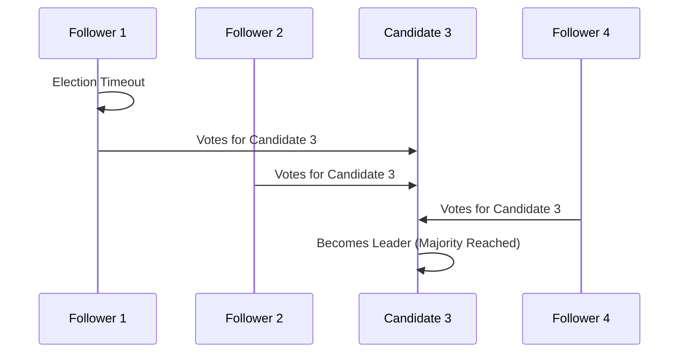

## Introduction: The Quest for Consensus

In a distributed system, getting multiple servers to agree on a single value or a series of values is a fundamental challenge. This process of reaching an agreement is called **consensus**. Without it, building reliable distributed databases, key-value stores, or any system that needs to be fault-tolerant would be impossible.

While Paxos has long been the standard for teaching and understanding consensus, it's notoriously difficult to grasp. Enter **Raft**, a consensus algorithm designed with one primary goal: **understandability**.

### What is Raft?

Raft is a consensus algorithm that is equivalent to Paxos in fault-tolerance and performance, but it's organized differently to be easier to understand and implement. It breaks down the complex problem of consensus into three relatively independent subproblems:

1.  **Leader Election:** Electing one node to be the leader, responsible for managing the replicated log.
2.  **Log Replication:** The leader accepts log entries from clients and replicates them across the other nodes (followers).
3.  **Safety:** Ensuring that if any server has applied a particular log entry to its state machine, no other server can apply a different command for the same log index.



## Core Concepts of Raft

Before diving into the subproblems, let's understand the basic states and terms in Raft.

### Node States

A server in a Raft cluster can be in one of three states:

*   **Leader:** Handles all client requests, manages log replication. There is at most one leader at any given time.
*   **Follower:** Completely passive. Responds to requests from leaders and candidates.
*   **Candidate:** Used during the leader election process.

### Terms

Raft divides time into **terms** of arbitrary length. Each term is identified by a monotonically increasing number. A term begins with an election, and if a candidate wins, it remains the leader for the rest of the term.


## 1. Leader Election

When a cluster starts, all nodes begin as followers. If a follower doesn't hear from a leader for a certain amount of time (the **election timeout**), it assumes the leader has crashed and starts a new election.

Here's how it works:

1.  The follower increments the current term.
2.  It transitions to the **candidate** state.
3.  It votes for itself.
4.  It sends `RequestVote` RPCs to all other servers in the cluster.

A candidate wins the election if it receives votes from a **majority** of the servers. Once it wins, it becomes the leader and starts sending `AppendEntries` RPCs (as heartbeats) to all other servers to establish its authority.

If a candidate doesn't win the election (e.g., a split vote), it times out and starts a new election with an incremented term.



## 2. Log Replication

Once a leader is elected, it's responsible for servicing client requests. Each request contains a command to be executed by the replicated state machines.

1.  The leader appends the command to its own log as a new entry.
2.  It then sends `AppendEntries` RPCs in parallel to each of the other servers to replicate the entry.
3.  When the entry has been safely replicated on a majority of servers, the leader applies the entry to its state machine and returns the result to the client.

An entry is considered **committed** once it's stored on a majority of servers.

## 3. Safety

Raft has several safety properties to ensure correctness:

*   **Election Safety:** At most one leader can be elected in a given term.
*   **Leader Append-Only:** A leader never overwrites or deletes entries in its log; it only appends new entries.
*   **Log Matching:** If two logs contain an entry with the same index and term, then the logs are identical in all entries up to that index.

These properties are crucial for ensuring that all state machines execute the same commands in the same order.

## Implementing a Simple Raft Node in Go

Let's build a simplified Raft node in Go. We'll focus on the state transitions and the election timer.

```go
package main

import (
    "fmt"
    "math/rand"
    "sync"
    "time"
)

type State int

const (
    Follower State = iota
    Candidate
    Leader
)

type Node struct {
    ID    int
    State State
    Term  int
    mut   sync.Mutex

    electionTimeout time.Duration
    heartbeat       chan bool
}

func NewNode(id int) *Node {
    return &Node{
        ID:        id,
        State:     Follower,
        Term:      0,
        heartbeat: make(chan bool),
    }
}

func (n *Node) start() {
    for {
        switch n.State {
        case Follower:
            n.resetElectionTimeout()
            select {
            case <-n.heartbeat:
                // Stay as follower
            case <-time.After(n.electionTimeout):
                fmt.Printf("Node %d: Election timeout, becoming candidate.\n", n.ID)
                n.mut.Lock()
                n.State = Candidate
                n.Term++
                n.mut.Unlock()
            }
        case Candidate:
            // In a real implementation, send RequestVote RPCs here
            // and handle votes. For simplicity, we'll just simulate
            // winning or losing the election.
            won := rand.Intn(2) == 1
            if won {
                fmt.Printf("Node %d: Won election for term %d.\n", n.ID, n.Term)
                n.mut.Lock()
                n.State = Leader
                n.mut.Unlock()
            } else {
                fmt.Printf("Node %d: Lost election for term %d.\n", n.ID, n.Term)
                n.mut.Lock()
                n.State = Follower
                n.mut.Unlock()
            }
        case Leader:
            // In a real implementation, send AppendEntries RPCs (heartbeats)
            // to all followers.
            fmt.Printf("Node %d: Acting as leader for term %d.\n", n.ID, n.Term)
            time.Sleep(100 * time.Millisecond) // Heartbeat interval
        }
    }
}

func (n *Node) resetElectionTimeout() {
    // Randomize timeout to prevent split votes
    n.electionTimeout = time.Duration(150+rand.Intn(150)) * time.Millisecond
}

func main() {
    rand.Seed(time.Now().UnixNano())
    node := NewNode(1)
    go node.start()

    // Simulate receiving a heartbeat
    time.Sleep(50 * time.Millisecond)
    node.heartbeat <- true

    // Let it run for a bit
    time.Sleep(5 * time.Second)
}
```

This code provides a skeleton for a Raft node, showing how it transitions between states based on timers and events. A full implementation would require handling RPCs for voting and log replication.

## Conclusion

Raft's focus on understandability makes it a great choice for building fault-tolerant systems. By breaking down consensus into leader election, log replication, and safety, it provides a clear path for implementation. While the details can be complex, the high-level concepts are intuitive, which is a huge win for developers working in the challenging world of distributed systems.
