## Introduction: The Read-Heavy Workload Problem

Many applications, from social media feeds to e-commerce sites and content platforms, exhibit a common traffic pattern: they are **read-heavy**. The number of read operations (e.g., viewing posts, browsing products) vastly outnumbers the number of write operations (e.g., creating a post, making a purchase).

As traffic grows, a single database server becomes a bottleneck. It struggles to handle the sheer volume of read queries, leading to slow response times and a poor user experience. While vertical scaling (upgrading the server's hardware) can help, it's expensive and has limits.

A more effective and common solution is to scale horizontally using a **Primary-Replica Architecture**, also known as Master-Slave or Read Replica architecture.

## The Primary-Replica Architecture

The core idea is simple: instead of one database server doing all the work, you split the responsibilities between multiple servers.

1.  **Primary (Master) Node:** This is the single source of truth. It is the *only* server that accepts write operations (`INSERT`, `UPDATE`, `DELETE`).
2.  **Replica (Slave) Nodes:** These are one or more servers that maintain a near-real-time copy of the data from the primary. They are dedicated to handling *only* read operations (`SELECT`).

Data is copied from the primary to the replicas through a process called **replication**.

```mermaid
graph TB
    subgraph "Application Layer"
        A["📥 Write Requests"]
        C["🔍 Read Requests"]
        A --> B["Router/Load Balancer"]
        C --> B
    end

    subgraph "Database Layer"
        B -->|writes to| D["💾 Primary DB\n(Master/Write Node)"]
        B -->|reads distributed to| E["📚 Replica DB 1\n(Read Node)"]
        B -->|reads distributed to| F["📚 Replica DB 2\n(Read Node)"]
        B -->|reads distributed to| G["📚 Replica DB N\n(Read Node)"]
        
        D -.->|async replication| E
        D -.->|async replication| F
        D -.->|reads distributed to| H["..."]
        D -.->|async replication| G
    end

    subgraph "Traffic Flow"
        A --> B
        C --> B
    end

    %% Styling
    style D fill:#ffcccc,stroke:#d63384,stroke-width:3px
    style E fill:#cce5ff,stroke:#0d6efd,stroke-width:2px
    style F fill:#cce5ff,stroke:#0d6efd,stroke-width:2px
    style G fill:#cce5ff,stroke:#0d6efd,stroke-width:2px
    style H fill:#e7f1ff,stroke:#0d6efd,stroke-width:1px
```



This architecture allows you to scale reads almost infinitely. If your read traffic increases, you simply add more replica nodes to the cluster.

## The Replication Process and Its Trade-Offs

Replication is the magic that keeps the replicas in sync with the primary. The most common method is **asynchronous replication**.

1.  The primary writes a change to its transaction log (e.g., the `binlog` in MySQL or `WAL` in PostgreSQL).
2.  The replicas connect to the primary, read this log, and apply the changes to their own copy of the data.

This process is not instantaneous. There is a small delay, known as **replication lag**, between the time a write occurs on the primary and when it becomes visible on the replicas.

This leads to the biggest trade-off of this architecture: **eventual consistency**. A user might perform a write (e.g., update their profile) and then immediately be redirected to a page that reads from a replica. If the replication lag is high, the replica may not have received the update yet, and the user will see stale data.

For many applications, this brief period of inconsistency is an acceptable trade-off for the massive gains in read scalability.

## Benefits of Read Replicas

1.  **Read Scalability:** This is the primary benefit. You can distribute read queries across multiple machines, dramatically increasing your application's read throughput.
2.  **Improved Performance:** By offloading reads, you free up the primary server to focus exclusively on handling writes, making both reads and writes faster.
3.  **High Availability:** If a replica node fails, the application can simply stop sending traffic to it. While not a full failover solution, it adds resilience. You can also promote a replica to become the new primary if the original primary fails, though this process can be complex.
4.  **Analytics & Reporting:** You can run expensive, long-running analytical queries on a dedicated replica without impacting the performance of your main application traffic.

## Drawbacks and Challenges

1.  **Replication Lag:** As discussed, this can lead to stale reads. Applications must be designed to handle this possibility.
2.  **Single Point of Failure for Writes:** The primary is still a single point of failure. If it goes down, all write operations will fail until it is recovered or a replica is promoted.
3.  **Increased Complexity:** You now have a distributed system to manage. You need to monitor replication health, manage connections to multiple databases, and handle potential failover scenarios.
4.  **Cost:** More servers mean higher infrastructure costs, though it's often more cost-effective than vertical scaling.

## Go Example: Routing Reads and Writes

Your application code needs to be smart enough to send queries to the correct database. Writes go to the primary; reads go to the replicas.

Here is a simplified example of a data repository in Go that manages connections to a primary and multiple replicas.

```go
package main

import (
	"database/sql"
	"fmt"
	"log"
	"math/rand"
	"time"

	_ "github.com/lib/pq" // PostgreSQL driver
)

// DBConfig holds connection strings for our database cluster.
type DBConfig struct {
	Primary  string
	Replicas []string
}

// Repository manages database connections and query routing.
type Repository struct {
	primaryDB  *sql.DB
	replicaDBs []*sql.DB
}

// NewRepository creates a new repository and connects to the databases.
func NewRepository(config DBConfig) (*Repository, error) {
	primaryDB, err := sql.Open("postgres", config.Primary)
	if err != nil {
		return nil, fmt.Errorf("failed to connect to primary: %w", err)
	}

	repo := &Repository{primaryDB: primaryDB}

	for _, replicaConnStr := range config.Replicas {
		replicaDB, err := sql.Open("postgres", replicaConnStr)
		if err != nil {
			log.Printf("Warning: failed to connect to replica: %v. Skipping.", err)
			continue
		}
		repo.replicaDBs = append(repo.replicaDBs, replicaDB)
	}

	if len(repo.replicaDBs) == 0 {
		log.Println("Warning: No replicas configured. All queries will go to the primary.")
	}

	return repo, nil
}

// getReadDB selects a replica for read queries using a simple random strategy.
// It falls back to the primary if no replicas are available.
func (r *Repository) getReadDB() *sql.DB {
	if len(r.replicaDBs) == 0 {
		return r.primaryDB
	}
	// Simple random load balancing
	return r.replicaDBs[rand.Intn(len(r.replicaDBs))]
}

// GetUser fetches a user. This is a read query, so it goes to a replica.
func (r *Repository) GetUser(userID int) (string, error) {
	db := r.getReadDB()
	var userName string
	err := db.QueryRow("SELECT name FROM users WHERE id = $1", userID).Scan(&userName)
	if err != nil {
		return "", err
	}
	return userName, nil
}

// CreateUser creates a new user. This is a write query, so it goes to the primary.
func (r *Repository) CreateUser(userName string) error {
	db := r.primaryDB
	_, err := db.Exec("INSERT INTO users (name) VALUES ($1)", userName)
	return err
}

func main() {
	rand.Seed(time.Now().UnixNano())

	config := DBConfig{
		Primary:  "user=postgres password=secret dbname=primarydb sslmode=disable",
		Replicas: []string{
			"user=postgres password=secret dbname=replicadb1 sslmode=disable",
			"user=postgres password=secret dbname=replicadb2 sslmode=disable",
		},
	}

	repo, err := NewRepository(config)
	if err != nil {
		log.Fatalf("Failed to initialize repository: %v", err)
	}

	// --- Simulate application logic ---

	// A write operation
	log.Println("Creating a new user...")
	err = repo.CreateUser("Alice")
	if err != nil {
		log.Printf("Error creating user: %v", err)
	} else {
		log.Println("User 'Alice' created successfully (on primary).")
	}

	// A read operation
	log.Println("Fetching a user...")
	userName, err := repo.GetUser(123)
	if err != nil {
		log.Printf("Error fetching user: %v", err)
	} else {
		log.Printf("Fetched user '%s' (from a replica).", userName)
	}
}
```
*Note: This is a simplified example. Production systems often use more sophisticated database proxies or drivers that can automate this read/write splitting.*

## Conclusion

The primary-replica architecture is a fundamental pattern for scaling databases. By separating read and write workloads, you can achieve massive improvements in performance and throughput for read-heavy applications. While it introduces the complexity of a distributed system and the challenge of replication lag, the benefits often far outweigh the drawbacks. If your application is struggling under a heavy read load, implementing read replicas should be one of the first solutions you consider.
